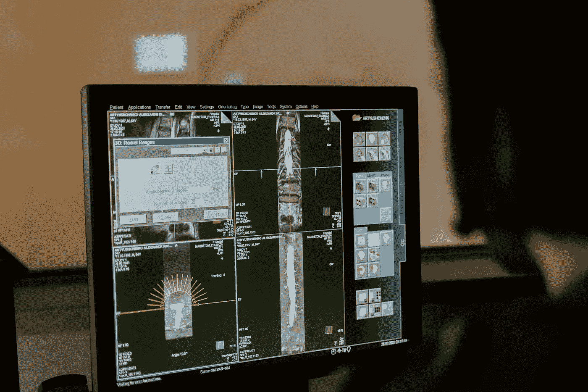
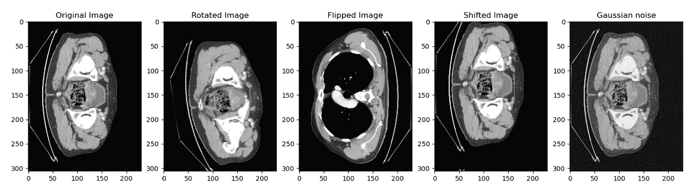
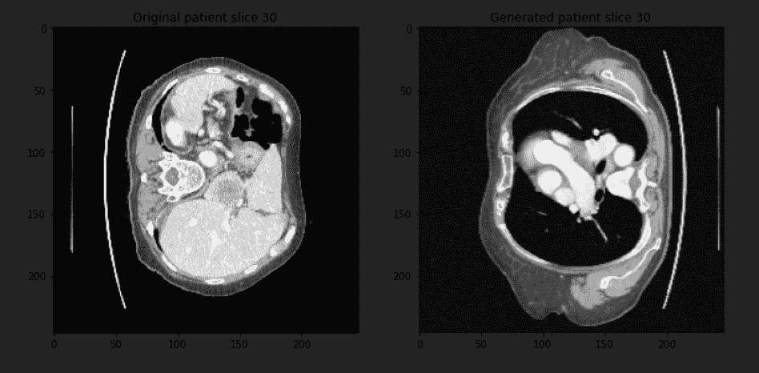

# 基于 Monai 的肿瘤分割三维体积增强

> 原文：<https://towardsdatascience.com/3d-volumes-augmentation-for-tumor-segmentation-using-monai-1b6d92b34813?source=collection_archive---------8----------------------->

## 使用 Python 和 Monai 来扩充用于肿瘤或器官分割的数据集。

> 原创文章在我的网站， [***这里***](https://pycad.co/3d-volumes-augmentation-for-tumor-segmentation/) 。还有这个故事的视频版 [**这里**](https://www.youtube.com/watch?v=bh9uyUbsj7U&t=156s) 。

# 介绍

我们在 [***上一篇文章***](/preprocessing-3d-volumes-for-tumor-segmentation-using-monai-and-pytorch-eaeb3d718570) 中讨论了如何为肿瘤分割预处理 3D 体积，因此在本文中，我们将讨论处理深度学习项目时的另一个重要步骤。这是数据扩充步骤。

图片来自 MART PRODUCTION 的[像素](https://www.pexels.com/photo/people-woman-men-women-7089006/)

# 什么是数据增强？

我们都知道，为了训练一个神经网络，需要大量的数据，以便获得一个准确的模型以及一个可以在特定任务中处理大多数情况的稳健模型。然而，在任何任务中，尤其是在医疗保健项目中，并不总是能够获得大量的自然数据。因为医学成像中的一个输入是具有多个切片的单个患者，我们都知道汇集这种类型的数据(大量患者)的数据集有多困难。

为此，我们必须通过创建合成数据来帮助自己，以便稍微改善我们的结果。

[https://www.youtube.com/watch?v=bh9uyUbsj7U&t = 156s](https://www.youtube.com/watch?v=bh9uyUbsj7U&t=156s)

这些合成数据的生成被称为数据扩充，这意味着我们从数据集开始，然后执行一些转换以生成新数据。

# 工具和操作

如果你以前在 2D 图像中为一个正常任务的项目做过数据增强，你会明白我想说什么；否则不用担心，我们会走一步看一步，直到有结果。

为了生成这些合成数据，我们必须首先对原始数据应用一些仿射变换。这些变换可以包括旋转、缩放、平移(移位)、噪声、翻转等等。

但是要小心，因为在处理普通图像时，我们可以使用这些变换中的任何一种；然而，当处理医学图像时，我们不能使用所有的变换，因为它可能创建与人体无关的形状，这不是重点。

由于我们将使用 3D 体积，如果我们不小心的话，转换会更糟。

我们将始终使用用于处理该操作的同一个 monai。对于那些不熟悉 monai 的人来说，它是一个基于 Pytorch 的开源框架，可用于对医学图像进行分割或分类。

# 可以使用的变换有哪些？

以我的经验来看，能随机混合在一起产生合成病人的转化只有几个。以下是我发现的最有效的转换:

*   *翻转*
*   *旋转*
*   *移(译)*
*   *高斯噪声*

因此，我将向您展示如何使用 monai 轻松应用这些转换。

关于如何应用这些变换，你应该知道一些事情。如前所述，monai 基于 Python，因此没有像 tensorflow 这样的特定函数可以根据您在参数中提供的数字生成特定数量的数据。相反，有三种方法可以用 monai 扩充数据。

***1-*** 首先是在训练时使用变换。这意味着在训练的每个时期，你应用不同于前一个时期的变换，所以如果你做 100 个时期，你将得到 100 个不同的数据表示。

> **PS:** 数据量将与之前相同，但是变换将随着每个时期而改变。

***2-*** 第二种方法是在训练前应用变换，并在使用增加的数据量(您的数据加上生成的患者)启动训练前保存新的合成数据。

***3-*** 第三个与第二个几乎相同，除了您将应用变换并将生成的数据保存在张量中，这意味着仅在 RAM 中，训练将自动开始(当您使用 tensorflow 时，情况相同，但在这种情况下，您需要自己创建保存在 RAM 中的函数)。

对我来说，我尝试了第一种和第二种方法；第二种方法对我最有效，我会解释为什么。正如我之前所说，当我们使用这种仿射变换时，我们可以获得一些现实中不存在的形状，这会影响训练，因此您应该单独创建合成数据，验证它，然后使用它进行训练。

然而，我将演示如何做到这两者，第一和第二。

# 编码部分

在我们复习了理论之后，让我们开始编码这些变换。我们需要做的第一件事是创建一个字典来帮助我们处理数据和标签；这里就不赘述了，因为你可以在之前的这篇文章中找到解释。 [***这里是编字典的代码***](https://pycad.co/preprocessing-3d-volumes-for-tumor-segmentation-using-monai-and-pytorch/) 。

*作者编写的代码*

如前所述，我将演示如何使用第一种和第二种方法进行数据扩充。

# 训练期间的数据扩充

如果您在训练期间使用增强，您将把变换与预处理部分结合起来，以便每个患者同时进行预处理和变换。

以下是我们将采用的转换:

*   ***翻页*** →使用字典时翻页
*   ***旋转*** →将旋转应用于字典
*   ***缩放*** →应用缩放
*   ***高斯噪声化*** →对字典应用高斯噪声
*   最后还有***rand affinited***→其实这个函数可以同时进行多次变换；我们将使用它来执行*平移*，但是如果您不想使用 ***旋转*** 功能，您也可以使用它来执行*旋转*。

以下是使用预处理和转换函数生成合成数据的代码:

作者编写的代码

# 训练前的数据扩充

这一节与上一节类似，但是在应用了变换之后，我们需要添加一个函数，将 torch 张量保存到 nifti 文件中。我们将使用本文中讨论的方法来实现这一点。

现在由您决定是只生成数据并保存它，还是进行预处理和扩充，然后保存所有数据，这样您就不需要在训练阶段进行任何转换。但是我会把两个都给你看，你可以挑一个你喜欢的。

## 使用预处理

如果您想同时进行预处理和数据扩充，您可以使用前面方法中的代码，但是我们将添加另一个代码来保存卷。

*预处理+增强的代码*:

作者编写的代码

## 无需预处理

*不经预处理进行代码增强*:

作者编写的代码

这是同一个切片，但有不同的变换，就像我们刚才说的那样:

作家创造的形象

然后我们用这个函数把 torch 张量转换成一个 numpy 数组，然后再转换成 nifti，你可以在 [***这篇文章***](https://pycad.co/how-to-convert-array-into-nifti-python/) 中找到解释。

作者编写的代码

现在，我们必须创建一个循环，它将应用我们指定的运行次数的各种转换；这个运行次数将乘以数据量。这是我使用的循环:

作者编写的代码

# 显示合成患者

我们来看一个转化前后的患者。这是将用于创建数据加载器的代码:

作者编写的代码

*这是显示图像的代码:*

作者编写的代码

结果如下:

作家创造的形象

你可以看到我们有同一个病人的同一片身体的两个不同部分，这只是一个简单的转换，所以你可以添加更多来得到更复杂的东西。

> 注意:如果您使用第二种方法并保存生成的数据，请返回并检查它，因为您会发现一些患者具有与正常身体不匹配的随机形状，必须将其从您的数据集中删除。

> 你可以在这里得到完整的代码。

<https://github.com/amine0110/data-augmentation-for-3D-volumes>  

# 你想学医学影像的深度学习！

即将推出全面的医学成像课程，涵盖使用 Monai 和 PyTorch 的 2D 和 3D 分割，并提供额外支持。加入等候名单以接收任何课程更新的通知。

<https://pycad.co/monai-and-pytoch-for-medical-imaging/>  

> 订阅[我的简讯](https://astounding-teacher-3608.ck.page/136bdb1fbe)获取我工作的所有更新:)。