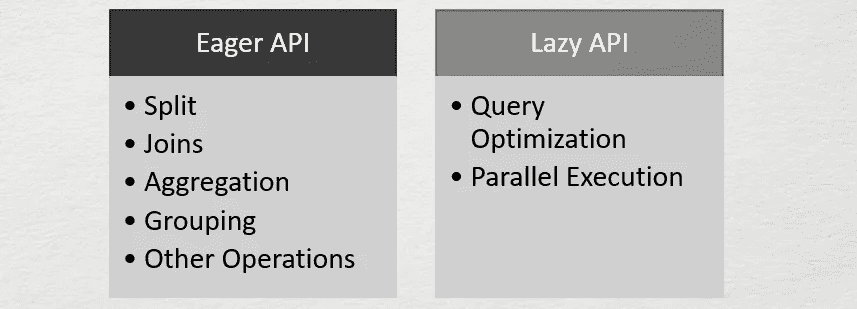

# 带 PyPolars 的熊猫速度快 3 倍

> 原文：<https://towardsdatascience.com/3x-times-faster-pandas-with-pypolars-7550e605805e?source=collection_archive---------3----------------------->

## 使用 PyPolars 库加速您的熊猫工作流程


由[蒂姆·高](https://unsplash.com/@punttim?utm_source=medium&utm_medium=referral)在 [Unsplash](https://unsplash.com/?utm_source=medium&utm_medium=referral) 上拍摄的照片

Pandas 是数据科学家用来处理数据的最重要的 Python 包之一。Pandas 库主要用于数据探索和可视化，因为它带有大量内置函数。Pandas 无法处理大规模数据集，因为它无法在 CPU 的所有核心之间扩展或分布其进程。

为了加快计算速度，可以利用 CPU 的所有内核来加快工作流程。有各种各样的开源库，包括 Dask、Vaex、Modin、Pandarallel、PyPolars 等，它们可以在 CPU 的多个内核上并行化计算。在本文中，我们将讨论 PyPolars 库的实现和使用，并将其性能与 Pandas 库进行比较。

# PyPolars 是什么？

PyPolars 是一个类似熊猫的开源 Python 数据框库。PyPolars 利用 CPU 的所有可用内核，因此执行计算的速度比 Pandas 更快。PyPolars 有一个类似熊猫的 API。它是用 rust 和 Python 包装器编写的。

> 理想情况下，当数据对熊猫来说太大而对 Spark 来说又太小时，就使用 PyPolars

## PyPolars 是如何工作的？

PyPolars 库有两个 API，一个是 Eager API，一个是 Lazy API。Eager API 和熊猫的很像，执行完成后马上产生结果类似熊猫。Lazy API 非常类似于 Spark，在 Spark 中，在执行查询时会形成一个映射或计划。然后，在 CPU 的所有核心上并行执行。



(图片由作者提供)，PyPolars API 的

PyPolars 基本上是作为 python 绑定到 Polars 库的。PyPolars 库最好的部分是它与 Pandas 的 API 相似性，这使得开发人员更容易使用它。

## 安装:

PyPolars 可以使用以下命令从 PyPl 安装:

```
**pip install py-polars**
```

并使用以下命令导入库

```
**import pypolars as pl**
```

## 基准时间限制:

> 为了进行演示，我使用了一个包含 2500 万个实例的大型数据集(~6.4Gb)。


(图片由作者提供)，熊猫和 Py-Polars 基本操作的基准时间数

对于使用 Pandas 和 PyPolars 库的一些基本操作的上述基准时间数，我们可以观察到 PyPolars 几乎比 Pandas 快 2 到 3 倍。

现在我们知道 PyPolars 有一个与熊猫非常相似的 API，但仍然没有涵盖熊猫的所有功能。例如，PyPolars 中没有`**.describe()**` 函数，我们可以使用`**df_pypolars.to_pandas().describe()**`

## 用法:

(作者代码)

# 结论:

在本文中，我们对 PyPolars 库做了一个简单的介绍，包括它的实现、用法，以及将它的基准时间数与 Pandas 的一些基本操作进行比较。请注意，PyPolars 的工作方式非常类似于 Pandas，PyPolars 是一个高效的内存库，因为它所支持的内存是不可变的。

人们可以通过浏览文档来详细了解这个库。有各种各样的其他开源库可以并行处理 Pandas 操作并加速这个过程。阅读下面提到的[文章](/4-libraries-that-can-parallelize-the-existing-pandas-ecosystem-f46e5a257809)了解 4 个这样的图书馆:

</4-libraries-that-can-parallelize-the-existing-pandas-ecosystem-f46e5a257809>  

# 参考资料:

[1] Polars 文档和 GitHub 库:【https://github.com/ritchie46/polars 

> 感谢您的阅读