# 你现在应该尝试的 4 个惊人的 Python 库

> 原文：<https://towardsdatascience.com/4-amazing-python-libraries-that-you-should-try-right-now-872df6f1c93?source=collection_archive---------4----------------------->

## 大蟒

## 这些是最酷的鲜为人知的 Python 库，你可能不知道，但应该知道


照片由来自[佩克斯](https://www.pexels.com/photo/woman-sitting-in-front-laptop-1181677/?utm_content=attributionCopyText&utm_medium=referral&utm_source=pexels)的[克里斯蒂娜·莫里洛](https://www.pexels.com/@divinetechygirl?utm_content=attributionCopyText&utm_medium=referral&utm_source=pexels)拍摄

我是 Python 库的忠实粉丝，我真的很喜欢它们。事实上，我的一些最受欢迎的博客都是关于 Python 库的。他们有能力将数小时的工作和无数行代码变成两三行，最棒的是:他们是免费的。然而，大多数人只关注那些最流行的库，而忽略了成千上万的 Python 库可以完成你需要花费数小时手工完成的结果。虽然我对那里所有喜欢手动做事的勇敢的人深表敬意，手动做事有它的好处，但有时我们需要让它更有效率。

问题是尝试新的库可能很耗时。你需要安装，测试，阅读文档等等。，并不总是得到你想要的。正如我在开始提到的，我喜欢写新的 Python 库，并分享我对它们的了解。今天，我将介绍一些我最近发现的最著名的图书馆。不再介绍，让我们跳进这些超级酷的库。

# Bamboolib

**它的作用:**数据分析与探索库
**使用起来有多容易:**非常容易 **谁应该使用:**这个星球上的每个人！

短篇故事。我正在写一个博客，展示我最近了解到的 15 个 Python 库，Bamboolib 将是我要写的第一个。那个博客的重点是快速介绍一些库，但是 Bamboolib 给我的印象太深了，没有给予应有的关注感觉是不对的。

他们的创造者说 Bamboolib 是一个数据分析工具，在这里你可以探索数据并获得洞察力，而不必编码，这将允许没有任何编码经验的人享受 Python 可以用数据分析做的奇迹。最重要的是，它可以节省数据分析师和数据科学家的时间，因为它不需要任何先前的编码经验。

看他们的网站，好像有免费版和付费版，其中付费版侧重于公司。好消息是，我测试了免费版本，没有发现任何限制。另一件事是 Bamboolib 是由制作 PyForest 的同一批人创建的，我在这里[提到过 py forest 库。现在，让我们检查一下 Bamboolib 可以完成的所有事情。](/5-python-libraries-that-you-dont-know-but-you-should-fd6f810773a7)

## 装置

我推荐使用一个环境来测试 Bamboolib。尽管如此，如果你不关心它，你只需在你的终端中输入 `pip install — upgrade bamboolib — user`就可以安装 Bamboolib。然后，您将需要通过键入`python -m bamboolib install_nbextensions`来安装 Jupyter 笔记本的扩展，您应该可以开始了。如果您喜欢创建一个环境，请将以下代码复制并粘贴到您的 Jupyter 笔记本中。片刻之后，您就可以开始探索 Bamboolib 了。

```
**# Create conda environment**
!conda create -n bamboolib python=3.7 -y**# Activate the environment**
!conda activate bamboolib**# Add the IPython kernel to Jupyter**
!conda install jupyter -y
!conda install ipykernel -y
!python -m ipykernel install — user — name bamboolib**# Run this if you use Jupyterlab**
!conda install jupyterlab -y**# Install bamboolib …**
!pip install — upgrade bamboolib — user**# Jupyter Notebook extensions**
!python -m bamboolib install_nbextensions**# Run this if you use Jupyterlab: JupyterLab extensions**
!python -m bamboolib install_labextensions
```

现在，让我们导入 Bamboolib、Pandas 和著名的 Titanic 数据集来探索 Bamboolib。

```
**# Import bamboolib, Pandas, and the Titanic dataset**
import bamboolib as bam
import pandas as pd
df = pd.read_csv(bam.titanic_csv)
```

好了，现在我们准备开始使用 Bamboolib 了。你需要做的就是输入 df，你会看到多个选项来开始探索数据集。

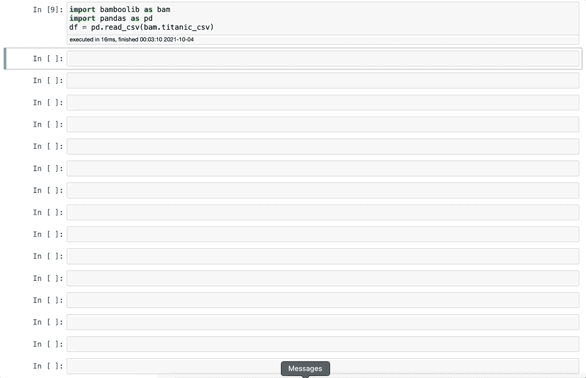

图片由作者提供[gif]

由此可见，Bamboolib 与其他低代码数据探索库有很多相似之处。然而，有两个特性改变了游戏规则。首先，您可以轻松地过滤、连接、连接、分组、更改数据类型、重命名列等等。

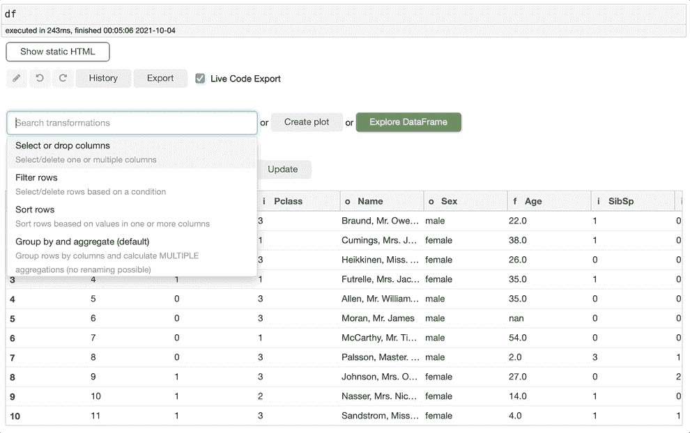

图片由作者提供[gif]

第二件事是你可以随时看到代码并重用它。因此，如果你正在学习 Python 或者只是在做一个需要使用代码但想节省时间的项目，这将是一个救命稻草。

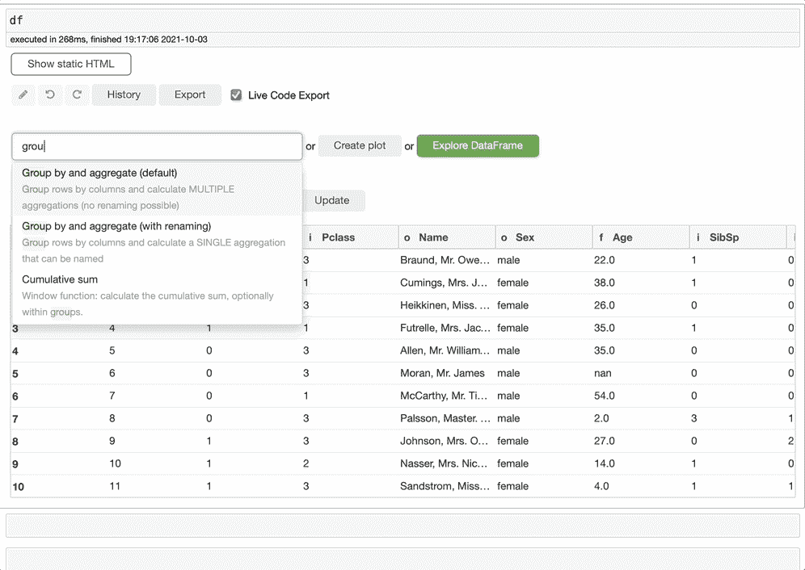

图片由作者提供[gif]

它是如何工作的？您所需要做的就是选择您想要做的转换，选择列、聚合，如果需要的话，Bamboolib 会完成所有剩下的工作。我正在使用`Pclass`、`Sex`和`Age`列进行分组，如下图所示。然后，我将检查`Sum`和`Count`的值。您还会在顶部的单元格中看到一个代码。即使没有安装 Bamboolib，也可以在任何地方使用该表。很棒，对吧？


图片由作者提供[gif]

花点时间看看下面的代码。这里有一些高级代码。即使是高级的 Pandas 用户也可以用这段代码学习一些东西并提高他们的技能。

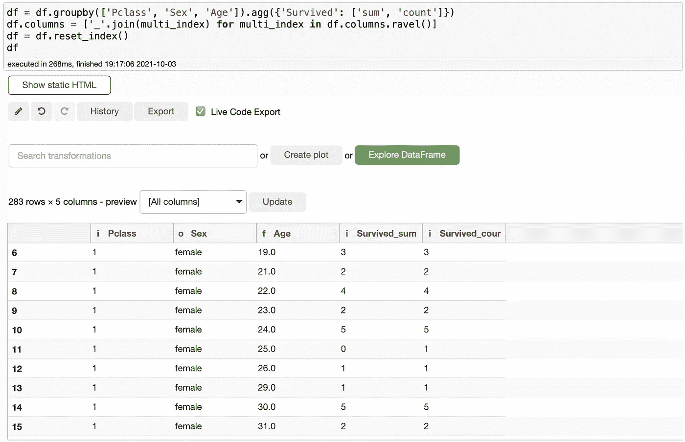

作者图片

您还可以使用 Bamboolib 创建可视化效果，同样，您可以看到代码。有多种方法可以编辑您的绘图，您可以用它创建非常复杂的数据可视化。另一件很酷的事情是，它使用 Plotly Express，其中有一些非常好看的图表。

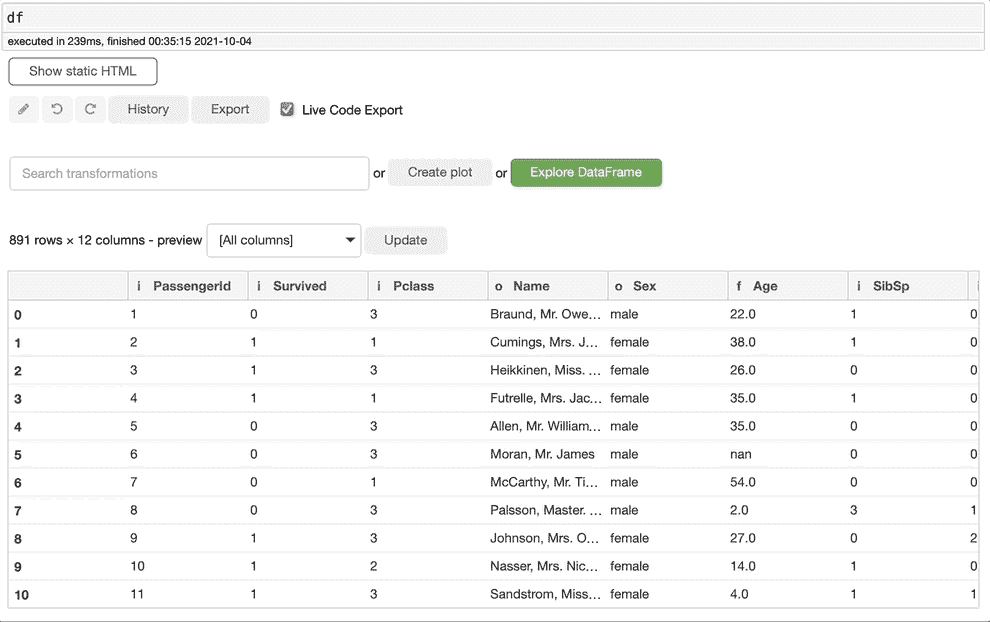

图片由作者提供[gif]

最后，浏览数据框功能允许您通过几次点击来浏览数据集。您甚至可以单独探索这些功能。如果我们点击几次就能得到我们需要的一切，为什么我们要输入无数行代码来得到简单的信息呢？

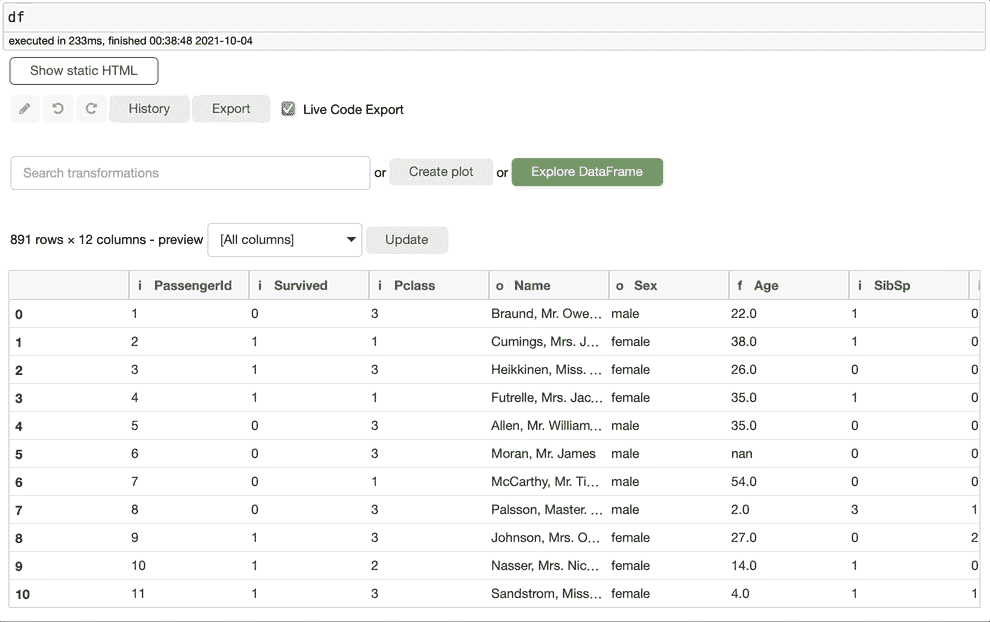

图片由作者提供[gif]

我可以花几个小时谈论 Bamboolib，但我们需要转移到下一个图书馆。我强烈建议你去探索这个图书馆。Bamboolib 应该有自己的博客，我很快会致力于此，但是现在，享受探索它吧。

# TensorFlow 数据验证

**它的作用:**让机器学习的数据探索更加直观 **它有多容易使用:**容易 **适合谁使用:**适合那些需要快速查看数据集统计数据的人。

TensorFlow 数据验证是一个数据集，它使创建机器学习模型时的数据探索变得更容易。虽然没有 Bamboolib 强大，但是值得了解一下。这是 TensorFlow 找到的解决方案，它让探索数据的压力更小，并使用户不必键入几行代码。您可以检查缺失数据、异常值、数据异常、冗余要素、具有很少或没有唯一预测信息的要素、被视为要素的标注等。这是 TensorFlow 在其[网站](https://www.tensorflow.org/tfx/guide/tfdv)上所说的:

> TensorFlow 数据验证可识别训练和服务数据中的异常，并可通过检查数据自动创建模式。该组件可被配置成检测数据中不同类别的异常。

## 装置

如果我已经说服你试一试，你可以在你的终端中输入`pip install tensorflow-data-validation`来安装它。一旦安装完成，我们就可以开始使用它了。我们需要熊猫来导入数据。我将再次使用(再次！)泰坦尼克号数据集。

```
**# Import Tensorflow Data Validation**
import tensorflow_data_validation as tfdv**# Import Pandas**
import pandas as pd**# Import Titanic dataset**
df = pd.read_csv('train.csv')
```

好了，现在我们可以走了。要查看 TFDV 的运行情况，请键入以下代码，一旦运行该单元，您将看到 TFDV 将返回一个漂亮的描述性统计表。

```
stats = tfdv.generate_statistics_from_dataframe(df)

tfdv.visualize_statistics(stats)
```

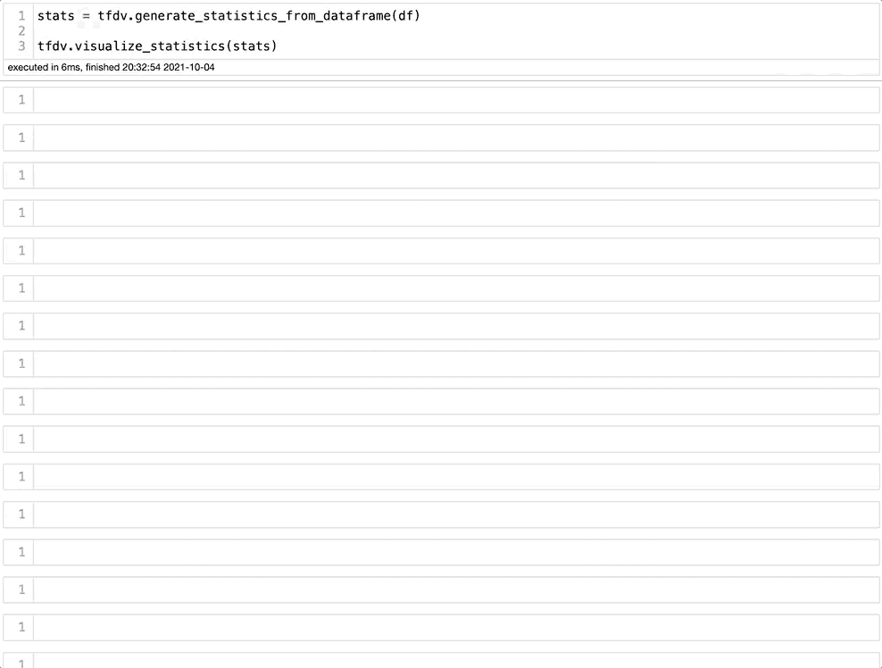

作者图片

我们可以在上面的图片中看到，只需点击一下，我们就可以得到一个包含大量信息的表格。现在让我们关注下图，看看我们得到了什么样的信息。

我们可以看到，我们获得了每个特征的描述性统计数据。TFDV 将数字特征与分类特征分开。我们还可以看到，它突出显示了一些重要的信息，例如大量缺失的数据。在这种情况下，年龄似乎有 19.87%的缺失值。我们还可以看到带有大量零的特征。例如，survival 具有较高的数字是有意义的，因为 0 表示乘客没有幸存。我们还可以看到平均值、标准差、最小值、中值和最大值。在右边，一些图表使我们很容易看到数据分布，我将对此进行更多的讨论。

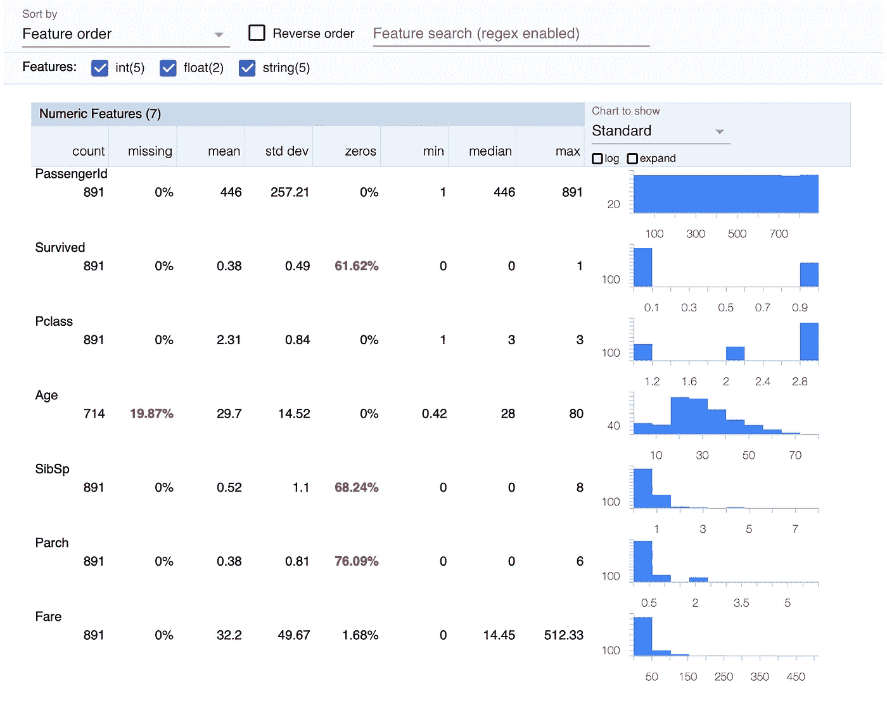

作者图片

查看分类特征，我们可以看到缺失的、唯一的和最常见的值。还有平均字符串长度。

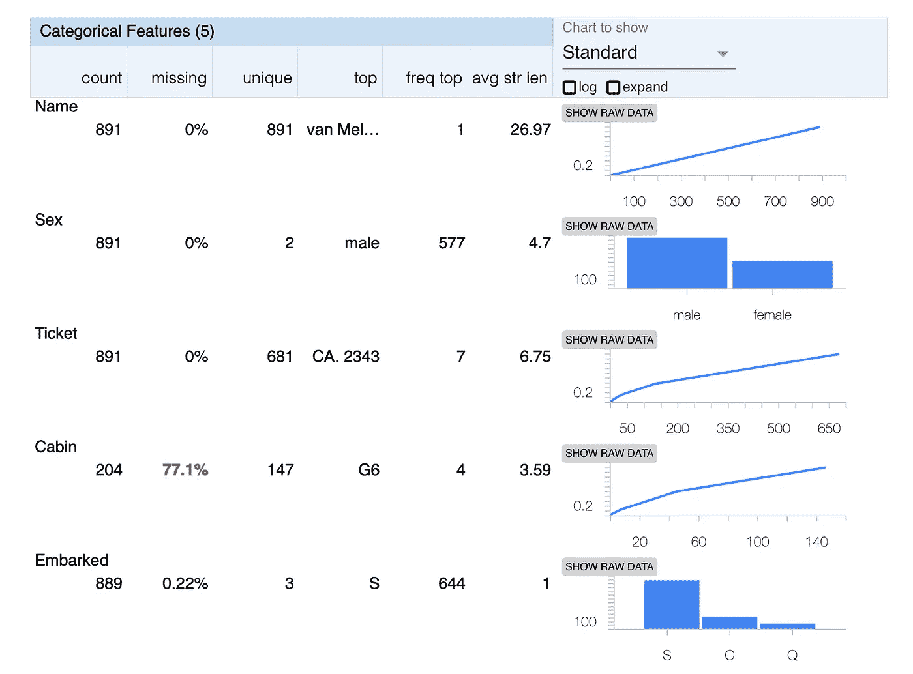

正如我所承诺的，让我们再多谈谈数据可视化。如果单击展开，您将扩展数据可视化并浏览数据集。值得注意的是，TFDV 的主要重点是分析数据集，为运行机器学习模型做准备，为此，TFDV 工作得很好。

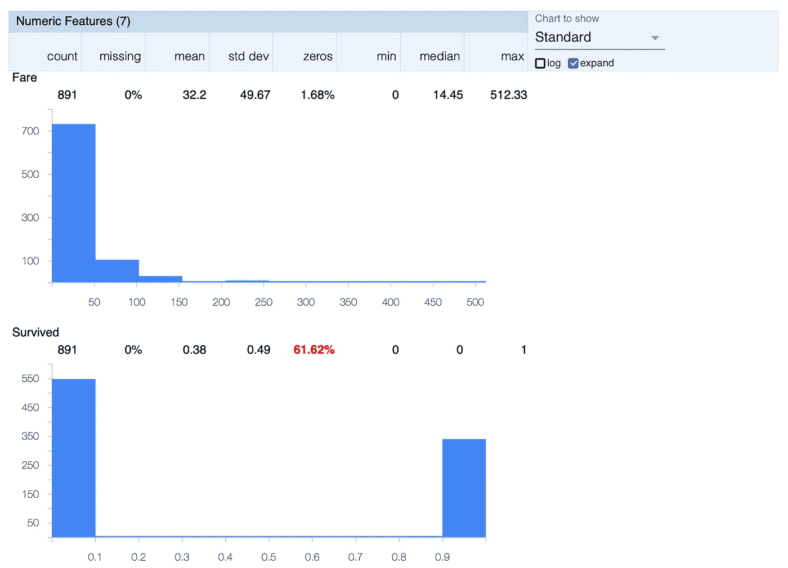

作者图片

您可以探索一些更酷的特性，TFDV 有很好的文档。正如我之前提到的，它没有 Bamboolib 强大，但使用起来更简单。

# 骗子

**它的作用:**创建假数据 **使用方便程度:**方便 **适用人群:**适用于需要创建假数据的人，比如项目的假名字和假地址

Faker 有一个非常直白的名字。它为项目创建虚假数据，如姓名、地址、电话号码、职务、IP 地址、社会保险号和文本。如果你正在做一个只有 id 的项目，你可以让它更加个人化和直观，创建假名字。由于我们更担心隐私，这是一个很好的方式来处理实际数据，而不会在我们的项目中暴露人们的隐私。即使对学校来说，如果我们有更多的信息，数据集看起来也会更真实。

要安装它，你可以在你的终端输入 pip install Faker。以下是一些很酷的功能的演示:

```
**# Import Faker**
from faker import Faker
from faker.providers import internet
fake = Faker()**# Create fake name**
fake.name()
**# Create fake address**
fake.address()
**# Create fake job title**
fake.job()
**# Create fake SSN**
fake.ssn()
**# Create fake phone number** fake.phone_number()
**# Create fake time** fake.date_time()
**# Create fake text** fake.text()
```

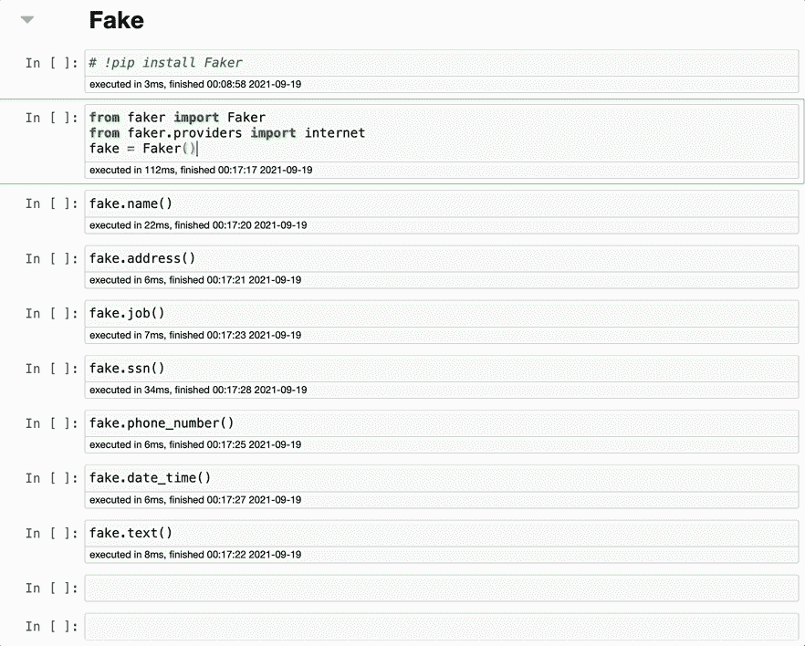

作者图片

还有一些其他很酷的功能，例如改变结果的语言，这允许你用其他语言做我刚才给你看的所有很酷的事情。我会说葡萄牙语，名字和地址看起来很真实。

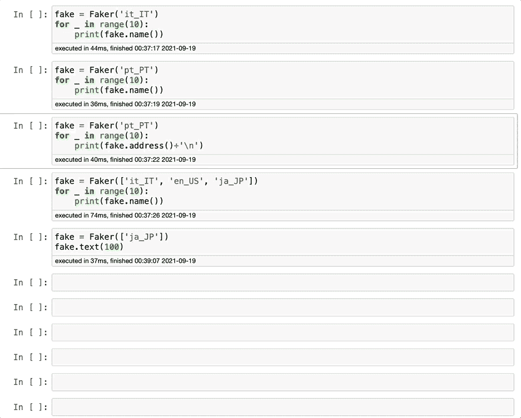

作者图片

Faker 有一个做得很好的文档，如果你感兴趣，你应该去看看。他们可以创造更多的虚假信息，所以在你的下一个项目中要记住这一点。

# 打开数据集

**功能:**将 Kaggle 数据集下载到与您的 Jupyter 笔记本相同的文件夹中 **使用方便程度:**方便 **这是为谁准备的？:**大家。

假设你正在开始一个项目，练习你的数据分析和机器学习技能。你从哪里开始？大多数人去 Kaggle，找到一个令人兴奋的数据集，下载文件，在 Downloads 文件夹中找到该文件，然后将该文件拖到您正在处理的笔记本所在的文件夹中。相当多的步骤，对不对？如果有更好的方法呢？这就是 OpenDataSets 要解决的问题。

OpenDataSets 允许我们从笔记本上下载数据集。它将创建一个与数据集在同一个文件夹中的文件夹，这样您的笔记本可以节省一些时间。很酷，对吧？

要使用它，你需要在你的终端输入 `pip install opendataset`。然后，您需要通过输入`import opendatasets as od`将其导入到笔记本中，您就可以开始工作了。Kaggle 会要求您提供凭证，您可以在 Kaggle 个人资料页面上快速获取凭证。在下面的例子中，我想下载著名的[心脏病数据集](https://www.kaggle.com/rashikrahmanpritom/heart-attack-analysis-prediction-dataset)。

首先，让我们安装 OpenDataSets。你可以输入`pip install opendatasets`，你应该可以开始了。然后，在您的笔记本中，您可以复制并粘贴以下代码:

```
import opendatasets as od
od.download('**kaggle_url**')
```

现在，我们可以在 Kaggle 上添加数据集 URL。

```
import opendatasets as odod.download("[https://www.kaggle.com/rashikrahmanpritom/heart-attack-analysis-prediction-dataset](https://www.kaggle.com/rashikrahmanpritom/heart-attack-analysis-prediction-dataset)")
```

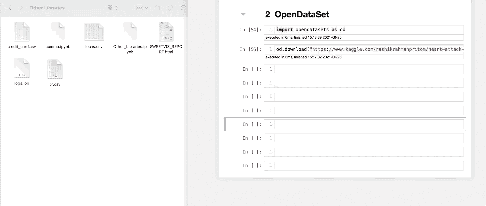

作者图片

图像左侧的文件夹没有包含心脏病数据集的文件夹。然而，只要我运行代码，它就会为我下载数据集。您可以看到数据集是解压缩的。这再容易不过了。

# 结论

正如我们在这篇博客中看到的，库可以有能力将一些耗时的库变成简单的任务。令人惊讶的是，我们只用一两行代码就能完成这么多工作。即使没有太多代码经验的人也可以执行复杂的数据分析。当然，它们不能代替学习 Python 的专业人员的工作，但是它们甚至可以用来提高长期专业人员的技能。

记住 Python 库应该被看作是改进我们工作的一种方式，这很好。我不建议你只依赖这些库，而是把它们作为一个附加组件。如果您决定测试这些库，或者您有任何我可以测试的建议，请告诉我。编码快乐！

**你可能也会喜欢…**

[*5 个你不知道但应该知道的 Python 库*](/5-python-libraries-that-you-dont-know-but-you-should-fd6f810773a7) [*4 个你应该知道的很酷的 Python 库*](/4-cool-python-libraries-that-you-should-know-about-bea9619e481c)[*3 个你应该知道的很牛逼的 Python 库*](/3-awesome-python-libraries-that-you-should-know-about-e2485e6e1cbe)