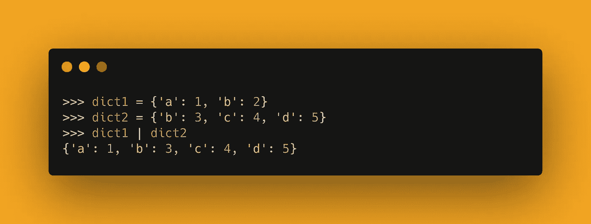
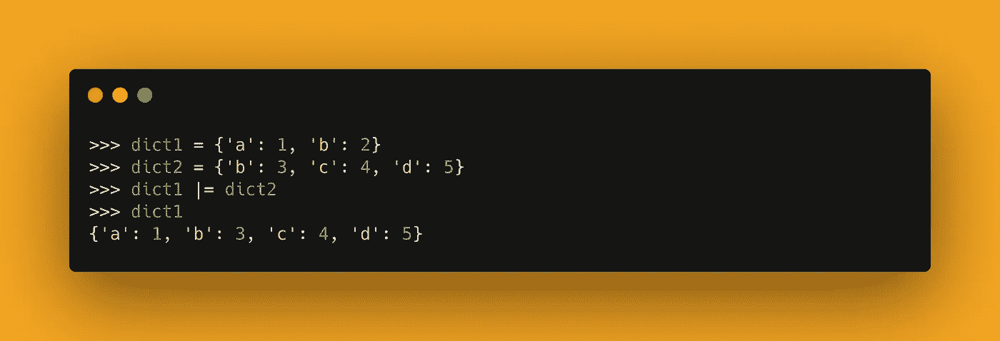
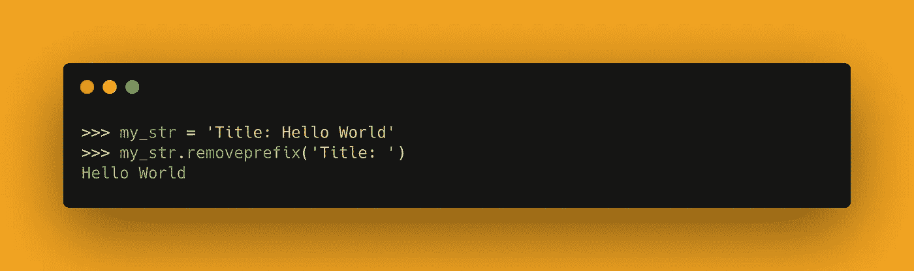
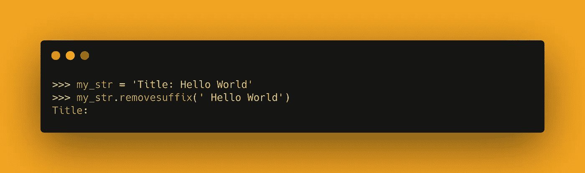

# Python 3.9 中 4 个非常有用的新增功能

> 原文：<https://towardsdatascience.com/4-amazingly-useful-additions-in-python-3-9-732115c59c9d?source=collection_archive---------19----------------------->

## 用 4 条新语句提升您的 Python 知识


照片由 [Allef Vinicius](https://unsplash.com/@seteph) 在 [Unsplash](https://unsplash.com/photos/_H0siQHdMM4) 上拍摄

Python 3.9 从 2020 年末开始出现，它带来了一系列新的语法特性和改进。在这篇文章中，我们将探索这个版本中的一些好的附加功能。我们还将讨论如何升级到 Python 3.9，以防万一。

## 1.合并词典

从 Python 3.9 开始，可以使用`|`操作符将两个或多个字典合并在一起。对于重复键，最右边的字典优先。这个语法糖是 [PEP-584](https://docs.python.org/3.9/whatsnew/3.9.html#summary-release-highlights) 的一部分。



使用|运算符合并两个词典

```
>>> dict1 = {'a': 1, 'b': 2}
>>> dict2 = {'b': 3, 'c': 4, 'd': 5}
>>> dict1 | dict2
{'a': 1, 'b': 3, 'c': 4, 'd': 5}
```

## 2.更新词典

更进一步，您还可以使用`|=`操作符来**就地更新字典。**本质上`a |= b`相当于`a = a | b`，但是`|=`不会返回新的字典，而是会修改`a`。这一增加也是 [PEP-584](https://docs.python.org/3.9/whatsnew/3.9.html#summary-release-highlights) 的一部分。



就地更新字典

```
>>> dict1 = {'a': 1, 'b': 2}
>>> dict2 = {'b': 3, 'c': 4, 'd': 5}
>>> dict1 |= dict2
>>> dict1
{'a': 1, 'b': 3, 'c': 4, 'd': 5}
```

## 3.从字符串中删除前缀

字符串方法`removeprefix()`现在可以用来从字符串中删除前缀。

这个新的附加物是 [PEP-616](https://www.python.org/dev/peps/pep-0616/) 的一部分。



从字符串中删除前缀

```
>>> my_str = 'Title: Hello World'
>>> my_str.removeprefix('Title: ')
Hello World
```

## 4.从字符串中删除后缀

打包到 PEP-616 中的第二个附加内容是`removesuffix()`字符串方法。和前面的例子一样，这个方法可以用来删除字符串中的后缀。



从字符串中删除后缀

```
>>> my_str = 'Title: Hello World'
>>> my_str.removesuffix(' Hello World')
Title:
```

## 如何安装 Python 3.9

为了安装 Python 3.9，我建议你使用[文档](https://www.python.org/downloads/release/python-390/)中提供的官方下载。3.9.0 甚至有一些小的更新——确保在这里看到可用的最新版本[。](https://www.python.org/downloads/)

如果您是 Windows 或 OSX 用户，只需从我提供的第一个链接下载相应的文件。

如果你是 Linux 用户，你可以通过 APT 安装它:

```
$ sudo apt update
$ sudo apt install software-properties-common
$ sudo add-apt-repository ppa:deadsnakes/ppa
$ sudo apt install python3.9
```

在每个平台上，您应该能够通过在终端或命令行中运行`python --version`来验证 Python 3.9 已经成功安装(取决于您的操作系统)。

## 结论

在本文中，我们讨论了 Python 3.9 中的一些新特性。我们展示了如何使用`|`和`|=`操作符来合并和更新字典。此外，我们引入了两个新的字符串方法，即`removeprefix()`和`removesuffix()`，它们可以应用于字符串来分别删除前缀或后缀。最后，我们快速探索了如何安装或更新 Python 3.9。

如果你想了解 3.9 版本的更多特性和改进，请参见[官方发布集锦](https://docs.python.org/3.9/whatsnew/3.9.html#summary-release-highlights)。

## 您可能还对以下内容感兴趣:

<https://betterprogramming.pub/11-python-one-liners-for-everyday-programming-f346a0a73f39>  </6-tips-to-help-you-stand-out-as-a-python-developer-2294d15672e9> 