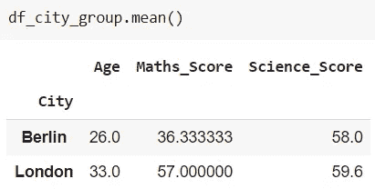
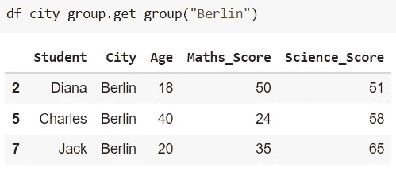
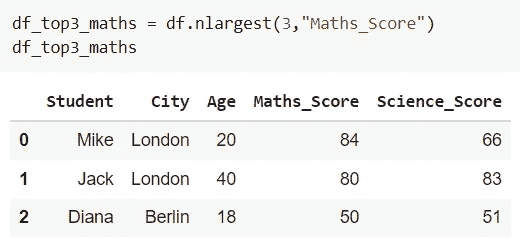
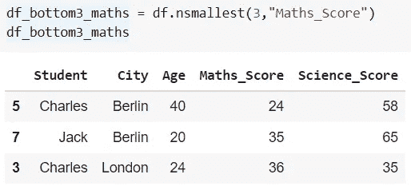
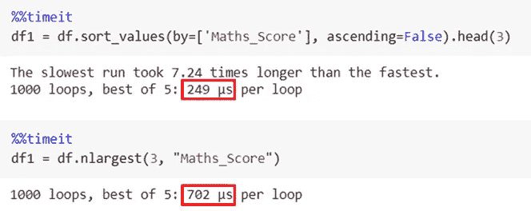

# Python 中快速数据分析的 4 种令人敬畏的熊猫方法

> 原文：<https://towardsdatascience.com/4-awesome-pandas-methods-to-quickly-analyze-any-dataset-65d2252af6e8?source=collection_archive---------2----------------------->

## 编程；编排

## 了解如何惊人地加速探索性数据分析(EDA)


照片由 [Artem Beliaikin](https://www.pexels.com/@belart84?utm_content=attributionCopyText&utm_medium=referral&utm_source=pexels) 从 [Pexels](https://www.pexels.com/photo/come-in-we-re-awesome-sign-1051747/?utm_content=attributionCopyText&utm_medium=referral&utm_source=pexels) 拍摄

**更快的**探索性数据分析！💡

使用 Python Pandas 内置的方法，分析数据集并总结其重要特征是超级简单和直接的。

常用的熊猫数据帧方法有`.head()`、`.tail()`、`.info()`、`.describe()`、`.plot()`、`.value_counts()`。

在这里，我将介绍另外四种方法，用来进一步加快 EDA 的速度。⚡

在接下来的五分钟里，你一定会掌握这四种方法。

考虑一个学生考试成绩的例子。您可以创建一个如下所示的数据框架，并遵循。

我们开始吧！！

# 熊猫的无聚集分组

在许多情况下，我们希望将数据集分成组，并对这些组做一些事情。Pandas 方法`groupby()`用于将数据帧中的数据分组。

不要同时使用 groupby()和聚合方法，而是创建一个 groupby()对象。理想情况下，这个对象可以在需要时直接使用。

让我们根据列“City”将给定的数据帧分组

```
df_city_group = df.groupby("City")
```

这将创建一个对象`**df_city_group**` ，它可以与不同的聚合(如 min()、max()、mean()、describe()和 count()相结合。下面是一个例子。



熊猫数据框。groupby()示例|作者图片

要获得数据帧 df 的子集，其中“城市”是柏林，只需使用方法`**.get_group()**`



熊猫数据帧对象。get_group()示例|作者图片

这不需要为每个组创建每个子数据帧的副本，因此会节省内存。这是因为它使用了对象中已经可用的数据结构。

> 切片用。groupby()比使用逻辑比较快**2 倍**！！


`.groupby()`和`.get_group()`在分割数据帧时是真正的游戏规则改变者。⏳

这里有一篇关于 Python 一行程序高效编码的有趣文章！

</5-most-powerful-one-liners-you-should-know-in-python-programming-c9d49a89b7f3>  

# 使用量最大。nlargest()

通常，我们有兴趣了解基于特定列的值的数据帧的前 3 或前 5 个条目。

例如，从考试中获得前 3 名的分数，或者从数据集中获得前 5 名最受欢迎的电影。

Pandas `.nlargest()`的语法是最简单的答案。
`df.nlargest(N, column_name, keep = ‘first’ )`

使用方法`.nlargest()`，可以检索包含指定列的前 N 个值的数据帧行。

在上面的例子中，让我们获得数据帧“df”中前 3 名为“Maths_Score”的行。



熊猫 nlargest()示例|作者图片

如果两个值相等，可以修改附加和可选参数。它采用值“first”、“last”和“all”从 tie 中检索第一个、最后一个和所有值。

1 这种方法的优点是，不需要专门对数据帧进行排序。方法`.nlargest()`代表你去做。

# 最小使用量。nsmallest()

类似于前 3 或前 5 条，有时我们也需要数据帧中的后 5 条记录。

例如，获得评分最低的 5 部电影或考试中得分最低的 5 名学生。

`.nsmallest()`可以用它的语法来作最简单的回答。


使用方法`.nsmallest()`，可以检索包含指定列的底部“N”值的数据帧行。

在同一个示例中，让我们获得数据帧“df”中“数学分数”最低的 3 行。



熊猫。nsmallest()示例|作者图片

然而，这都是关于最简单的方法。但是，从执行时间来看⏳看来，方法`.nlargest()`和`.nsmallest()`都是很差的选择。

> sort_values()比 nlargest()快 ***2.8X*** ！！

执行时间讲述了一个不同的故事。



熊猫数据帧 sort_values() Vs nlargest() |作者图片

🚩根据我的经验，我推荐使用方法`**.sort_values()**`进行快速 EDA。

# 逻辑比较

比较运算符`<, >, <=, >=, ==, !=`和它们的包装器`.lt()`、`.gt()`、`.le()`、`.ge()`、`.eq()`和`.ne()`分别在以下情况下非常方便:

*   将数据帧与基值
    进行比较，这种比较产生一系列布尔值，这些布尔值可用作以后目的的指示符。
*   基于比较对数据帧进行切片
    基于与一个值的比较，可以从数据帧中提取一个子集。
*   基于两列的比较在现有数据框架中创建新列。

下面的例子解释了所有这些情况，

在这里阅读关于比较运算符<https://pandas.pydata.org/docs/reference/api/pandas.DataFrame.gt.html>*的包装器的更多文档。*

*这些 Python 技巧甚至进一步节省了我在许多项目中的时间。*

*</3-time-saving-python-tricks-a017f4215aeb> * 

****总结，****

*我发现在使用 Python 进行数据分析时，这些方法非常方便。这真的让分析变得更快。你可以尝试这些，也让我知道你用哪些其他方法来加速你的 EDA！*

*现在可以通过 [***在这里报名成为中会员***](https://medium.com/@17.rsuraj/membership) 阅读我和其他作家发表的所有故事。当你这样做，我会得到你的费用的一小部分，没有任何额外的费用给你。欢迎加入我的[电子邮件列表](https://medium.com/subscribe/@17.rsuraj)来了解我写作的最新进展。*

*感谢您的阅读和投入时间！！*