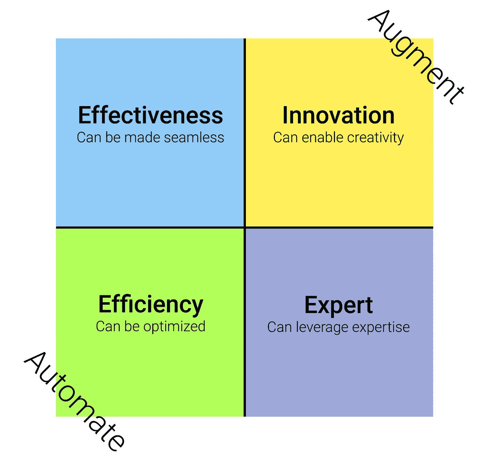
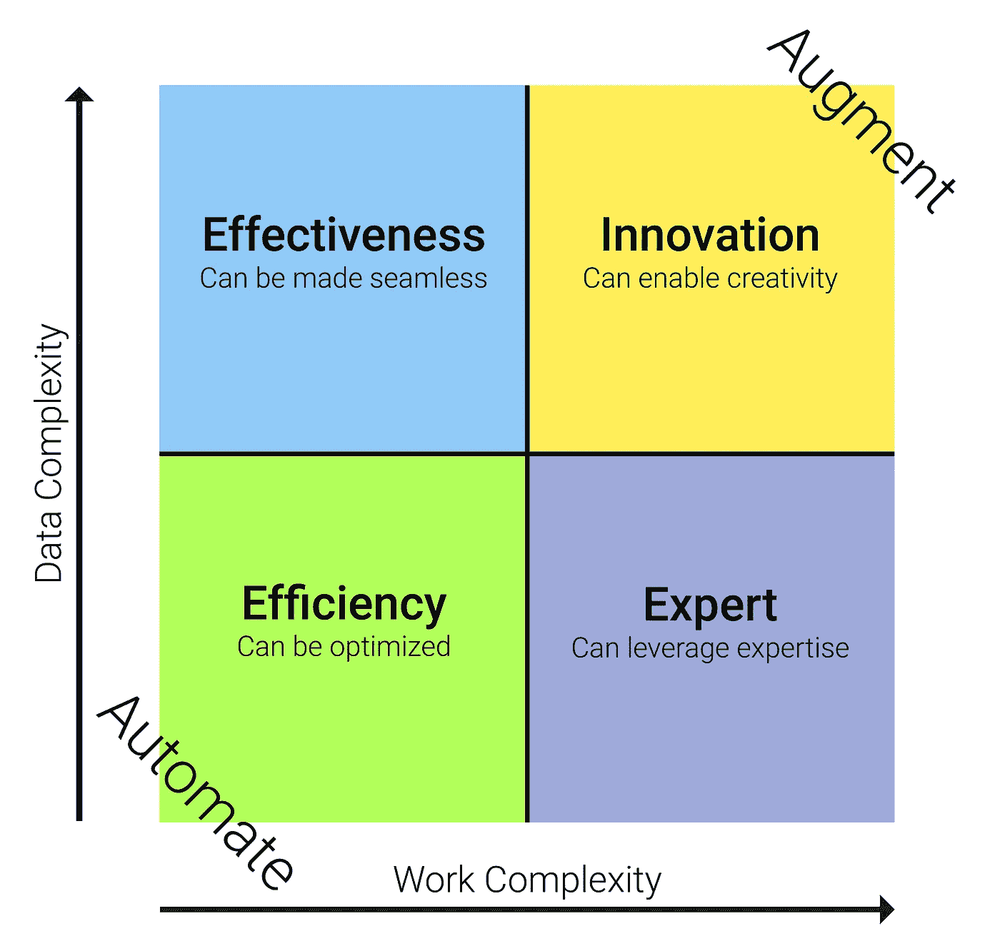

# 实施人工智能的 4 个商业策略

> 原文：<https://towardsdatascience.com/4-business-strategies-for-implementing-artificial-intelligence-24deff39158c?source=collection_archive---------30----------------------->

## 人工智能可以改善任何活动

如果你有一个策略，你进入人工智能的旅程会容易得多。安妮·斯普拉特的照片。

人工智能正在重塑一个又一个行业。在中国，的艾在 200 个城市的 1700 多所学校给孩子们做家教。在澳大利亚，一种人工智能发明了一种流感疫苗，其性能远远优于所有其他现有的流感疫苗。在美国，一个机器学习机器人正在自主烹饪汉堡。人工智能有许多令人难以置信的现实世界实现。现在，随着 OpenAI 最近突破性的语言生成算法称为 [GPT-3](https://beta.openai.com/) ，非常强大的人工智能解决方案像雨一样倾泻而下。狡猾的开发者已经部署了 GPT-3 来自主撰写[病毒式博客](https://www.technologyreview.com/2020/08/14/1006780/ai-gpt-3-fake-blog-reached-top-of-hacker-news/)，生成[网页设计](https://twitter.com/sharifshameem/status/1282676454690451457)，并创造[角色扮演冒险](https://play.aidungeon.io/)。

机器学习技术比以往任何时候都更容易获得，但寻找人工智能的商业案例并不总是简单明了的。在这篇文章中，我想让人工智能的商业策略更加具体，通过四种人工智能策略，你可以用它们来改善你能想象到的任何活动。在浏览完这四个策略之后，我将帮助您找出在任何给定的活动中使用哪一个策略。

# **前提**

但首先，人工智能有一个中心点，你必须理解:人工智能可以通过自动化或增强来授权任何活动。

*   自动化是将人类从一项活动中移除。
*   增强是在一项活动中赋予人类权力。

自动化和增强是相反的极端，很少有人工智能解决方案是完全自动化或完全增强的。自动化和增强是包含我们四个策略的一个尺度。

1.  效率策略，通过自动化优化活动。
2.  有效性策略，在这种策略中，活动是无缝的，使得沟通更加容易。
3.  专家战略，人工智能赋予决策能力。
4.  创新战略，人工智能使创造力成为可能。

四种人工智能策略。世界上的每一个人工智能解决方案都可以放在这四个策略中的一个或多个中。图片由作者提供。

# **效率战略**

对于许多人来说，当他们想到 AI 时，首先想到的是自动化。虽然人工智能不仅仅是自动化，正如我们将很快讨论的那样，但这个特定的策略确实就是关于自动化的。

效率策略可用于具有非常明确的规则和惯例的活动。公司采用这种策略来优化他们的流程，通常是为了降低成本。

例如，[出租车行业](https://www.huffpost.com/entry/autonomous-vehicles-will-_b_7556660?guccounter=1&guce_referrer=aHR0cHM6Ly9kdWNrZHVja2dvLmNvbS8&guce_referrer_sig=AQAAAIi4udyfa1O5Yrfxj9EPhV-iOnjvT4UxJEAOAwsmedWZx9oXv6huHnNNlG97ewGIFkmUU3QO2L5Ao4RzyjPoLOH3LbP39DJbn3hUtfMUST7l7-KHJz7VI7RDmXwKik121hS5_w1xqoF3WoqVBE7v6oC7wkIH9t8LFz_1jSnsr63P)在不久的将来面临着完全自动化的风险，因为自动驾驶汽车的表现超过了人类。对于如何驾驶车辆有非常明确的规定；因此，可以优化驾驶。[如今，欺诈检测](https://www.techrepublic.com/article/ai-stops-identity-fraud-before-it-occurs)也普遍实现了自动化，因为事实证明，检测欺诈非常简单。仓库也越来越多地被自动机器人占据，我们也开始看到[无人商店](https://jdcorporateblog.com/jds-unmanned-store-goes-international)。然而，请注意，没有员工的商店[也不是没有问题](https://asia.nikkei.com/Business/Business-trends/China-s-unmanned-store-boom-ends-as-quickly-as-it-began)。一些活动，如保持新鲜食品杂货，很难自动化。

随着越来越多的例程被发现用于复杂的活动，并且随着机器学习算法在理解之前被认为是复杂的数据方面变得越来越有能力，越来越多的活动可以被自动化。然而，即使某项活动可以非常明确地实现自动化，也不应该这样做，原因如下:

1.  在一些业务中，客户可能需要高水平的服务，超出了机器学习人工智能今天能够提供的服务。
2.  利用我们在 2021 年拥有的算法，许多医疗、军事和金融流程已经可以实现自动化。然而，在这些行业中做出的决定往往会产生严重的后果。出于这个原因，这些行业的决策者可能不愿意将某些活动自动化。有时候，开发增强的人工智能解决方案来授权人类决策，而不是完全取代人类决策，这是更可取的做法。
3.  自动化带来的伦理挑战通常比人们想象的要大得多。即使是以机器学习能力闻名的亚马逊，也开发了一种具有性别歧视的简历扫描人工智能。随着企业急于实现业务流程的自动化，道德被置于次要地位的风险很高。很容易无意中创建一个歧视性的算法，这就是为什么人们应该小心自动化某些活动。

# 有效性策略

第二个策略围绕着使用人工智能来增强工人的沟通和协调。在这里，AI 扮演了一个助手的角色。通常，有效性策略的目标是通过消除或简化计划、沟通或监控的行为，使人们更加有效。

由于聊天机器人的兴起，近年来公司用这种策略实施基本的人工智能解决方案已经成为潮流。人工智能通常用于部分自动化客户支持任务。如果一个支持任务对人工智能来说太难解决，一个人类代理可以加入这个任务。对于为这种人工智能策略构建的活动，部分自动化是常见的。

然而，有效性策略可以应用于更复杂的活动，而不仅仅是客户支持。例如，人工智能可以用来自主安排同事之间的会议。在大型咨询公司中，人工智能可以用来根据技能、经验和员工的愿望，建议将哪些顾问分配给某个项目。

为 Google Assistant、Siri 和 Alexa 等服务构建的应用程序往往属于这种策略。随着超过三分之一的美国成年人在家中拥有智能音箱，以有效性策略为基础的产品已经成为面向消费者的企业的关键。

人工智能可以用来部分地，有时是完全地自动化交流。由[迈克·梅耶斯](https://unsplash.com/@mike_meyers?utm_source=unsplash&utm_medium=referral&utm_content=creditCopyText)拍摄。

# 专家战略

与上面提到的两种人工智能策略不同，专家策略与增强密切相关。对于包含复杂工作流程的活动，特别是临时任务，可以使用专家策略来提升人类决策。在这个策略中，人类永远说了算。专家系统处理从大量金钱到人类生命的任何事情，这意味着人类必须始终为所做决定的后果负责。

专家人工智能系统可用于增强各行各业专业人士的能力。医生、律师、法官、政治家、军事人员、财务顾问和教师只是 AI 可以提供建议的职业的几个例子。人工智能解决方案可以帮助教师创建测试，评估学生，确定帮助个别学生的最佳方法，建议课程，等等。财务顾问可以获得强有力的洞察力来做出货币决策。医生可以在诊断病人时得到帮助。这样的例子不胜枚举，但常见的模式是人类总是做出最后的决定。

产品开发是一个非常吸引我的领域。通过人类与人工智能的合作，公司和科学家发明了[新品种的威士忌、疫苗、香水和香料](https://medium.com/@jacobbergdahl_47336/whiskey-vaccines-perfumes-and-spices-these-products-were-created-through-human-ai-collaboration-95b85e9b6f62)。未来我们可能会看到更多人工智能发明的产品。

上面的例子都是专家职业，但是注意这个策略的名字可能会有点误导。在这种情况下，术语*专家*并不一定意味着传统意义上的专家。例如， [Hopper](https://www.hopper.com) 已经基于预测预订机票最佳时间的专家策略开发了一款人工智能应用。当人工智能预测机票价格最低时，该应用程序允许消费者购买机票。在这种情况下，消费者是专家。

专家战略可以使复杂的工作变得更容易管理，并帮助员工从已经自动化的角色转变过来。一些目前需要三到五年大学学习的工作在未来可能不需要这么长的教育，因为增强人工智能使复杂的工作更容易管理。

# 创新战略

最后，创新战略是所有人工智能战略中最先进的。与效率策略截然相反，这种策略围绕着增强人的创造力。

想象一个音乐作曲家使用一些软件创作一首新歌。作曲家添加了一架钢琴、一把吉他和一些鼓。突然，通过观察他们学习了作曲家音乐风格的机器学习算法建议添加某种低音。作曲家听人工智能呈现的低音，并自己决定是否将它包含在歌曲中。然后，人工智能将从作曲家的决定中学习。与专家战略非常相似，创新战略给予人类完全的决策自由。

人工智能可以实时提出后续问题，从而增强招聘人员对求职者进行面试的能力。与此同时，作家可以通过人工智能得到增强，人工智能不仅可以建议他们的词汇和语法，甚至可以在某些主题需要更清楚地解释时通知他们。

当你用 Gmail 回复邮件时，该软件可能会根据邮件和你的写作风格为你建议一个快速回复。这是实施创新战略的一个基本例子。

# 你应该采取哪种策略？

为了理解对任何给定的活动采用什么策略，我们需要考虑两个变量:数据复杂性和工作复杂性。基于一个活动所包含的复杂性，我们可以找出使用什么样的 AI 策略。

要确定对任何给定的活动使用哪种 AI 策略，您可以检查活动的数据和工作复杂性。图片由作者提供。

低数据复杂性的活动通常是结构化的和简单的:这些活动通常由简单的文本或数字组成。这些数据对计算机来说很容易解释。另一方面，高数据复杂性通常是非结构化的，需要解释。图像、视频、音乐和声音都是复杂数据的例子。虽然机器学习算法可能能够分辨照片的主体是猫还是人，但这取决于主观解释，以确定人是否看起来疲惫、烦恼、不安，或者只是在休息。

工作复杂性是关于确定一项活动是否有明确定义的规则和惯例。如果一项活动有规则和惯例，它就变得可预测，工作复杂性也就低了。然而，如果活动通常是不可预测的和临时的，它需要决策技能，这将导致很高的工作复杂性。请注意，在这种情况下，完成一项活动所需的时间与其复杂性无关。

通过分析一项活动的复杂性，我们可以大致确定适当的人工智能策略:

*   低数据和工作复杂性:效率策略。
*   高数据但低工作复杂性:有效性策略。
*   低数据但高工作复杂性:专家策略。
*   高数据和工作复杂性:创新战略。

请注意，事情并不总是这样简单明了。如前所述，在决定是否自动化一项活动时，其他因素也会发挥作用。此外，被认为是复杂的东西是不断变化的。今天被认为复杂的数据将来可能会被认为简单。此外，如果一项活动缺乏明确的程序和规则，也许有可能创造它们？我们今天认为不可预测的活动可能是我们将来可以简化的活动。

# **总之**

人工智能可以用来自动化和增强任何活动。

*   自动化是从一项活动中去除人类的*。*
*   增强是在一项活动中赋予人类力量的*。*

世界上的每一个人工智能解决方案都可以放在以下四个人工智能战略中的一个或多个战略中:

1.  效率策略，通过自动化优化活动。
2.  有效性策略，在这种策略中，活动是无缝的，使得沟通更加容易。
3.  专家战略，人工智能赋予决策能力。
4.  创新战略，人工智能使创造力成为可能。

在全自动解决方案中，人工智能做出决定，但人类必须对人工智能的选择负责。在增强解决方案中，人工智能不会自主做出决定。要为你的活动找到最佳的人工智能策略，首先要查看活动的数据和工作复杂性。

为正确的活动实施正确的策略对于一个人的人工智能之旅的成功至关重要。

*感谢阅读！如果你想更深入一点，看看我对达美乐比萨做的案例研究和他们的三个人工智能策略:*

</the-pizza-chain-that-became-an-ai-front-runner-a0e297320cf6>  

*此外，在我的关于人工智能的非技术性书籍*<https://thisisrealaibook.com/>**:*中，你可以找到关于人工智能策略的更详细的介绍，以及 100 个人工智能的现实世界实现*

*<https://thisisrealaibook.com/> *