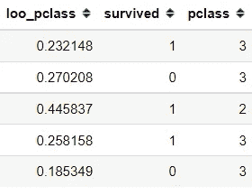

# 数据科学家需要了解的 4 个分类编码概念

> 原文：<https://towardsdatascience.com/4-categorical-encoding-concepts-to-know-for-data-scientists-e144851c6383?source=collection_archive---------6----------------------->

## 对你的工作有帮助的分类编码概念和应用


分类数据类型是按类别或组划分的数据，例如，性别、教育程度和出生地。分类数据中的每个元素用于对特定标签上的信息进行分组，这与数字数据不同，在数字数据中，数字数据信息是用数字表示的。未处理的分类数据的问题是机器学习问题，其中许多模型不能接受分类数据。这个问题就是为什么我们需要分类编码。

**分类编码**是我们将分类数据转化为数字数据的过程。有许多分类编码技术，但我想解释一下每个数据科学家都需要知道的基本过程。在本文中，我将概述数据科学家需要了解的四个分类编码概念。让我们开始吧。

# 1.一键编码(OHE)

一键编码或 OHE 是一种技术，**将分类列上的所有元素转换成由 0 或 1(二进制值)表示的新列，以表示类别值**的存在。让我们看看下图中的例子。


一键编码过程(图片由作者提供)

如上图所示，一个分类列(Origin)被转换为三个不同的数字列，每个列代表分类数据中的元素。在本例中，值“USA”在一次热编码后将变成“Origin_USA”列，其中 0(不存在)和 1(存在)。

对于没有任何顺序(序数)和基数较小的分类列，一键编码很有帮助。**为什么没有序数和少基数？**因为 One-Hot 编码将分类列中的所有值视为相等，所以删除了序号信息。此外，高基数分类列会产生许多列，导致维数灾难。

还有一点需要注意的是，独热编码可能不适合基于树的机器学习，因为 OHE 在分割期间会导致效率低下。你可能想在下面的文章中读到更多。

</one-hot-encoding-is-making-your-tree-based-ensembles-worse-heres-why-d64b282b5769>  

让我们使用一个 python 代码示例来更好地理解这个概念。

```
import pandas as pd
import seaborn as snsmpg = sns.load_dataset('mpg')
mpg.head()
```


作者图片

在这个例子中，我将使用 seaborn 包中的 mpg 数据集。数据包含我们可以试验的分类和数字列。

下一步，我将使用 Pandas 包，使用一个名为`get_dummies`的函数来进行 OHE。

```
pd.get_dummies(mpg, drop_first = True, columns = ['origin'] ).head()
```


作者图片

我将' drop_first '参数设为 True，以删除上面函数中已转换的第一列。我们这样做是因为信息是冗余的(**虚拟变量陷阱)、**并且其他两列已经包含了被删除列的信息。

# **2。标签编码**

在上一节中，我们讨论了 One-Hot 编码，其中我们将分类列转换为许多不同的数字列。标签编码有所不同—该过程将分类列元素转换为数值，而不需要任何额外的列。让我们看看下图中的过程。


标签编码(图片由作者提供)

从上图可以看出，分类列转换成了数值(小学= 1，高中= 2，依此类推)。

这个过程既简单又有启发性。然而，**标签编码大多只适用于有意义顺序的有序**或分类数据。在我上面的例子中，我假设“教育”数据是有序数据，因为值之间有一个重要的顺序。此外，标签编码会在数值之间产生相等的间距-如果您觉得分类数据顺序不相似，则标签编码可能无法捕获该信息。

为什么标签编码不适用于非序数数据？因为这会导致优先级问题。机器学习模型通常会泛化高值，其优先级高于低值——如果我们的分类值没有任何有意义的顺序，但将其视为有意义的顺序，则会扭曲信息。

我经常创建自己的函数，但是让我们尝试使用 Sklearn Python 包进行标签编码过程。

```
from sklearn import preprocessing
le = preprocessing.LabelEncoder()
mpg['origin_le'] = le.fit_transform(mpg['origin'])
mpg.sample(5)
```


作者图片

标签编码将“原点”列转换为数字列。字母表的顺序决定了价值观；这就是为什么“欧洲”的值被指定为 0，“美国”的值被指定为 2。

然而，正如您所看到的，Sklearn 的标签编码器仅通过使用字母信息来替换数据，这在序数数据的情况下可能是错误的。这就是为什么我经常创建我的转换器，而不是依赖包的功能。

虽然，如果要靠 Sklearn 它提供了`OrdinalEncoder`类，可以将类别转换成我们指定的标签。

# 3.哈希编码

独热编码的主要缺点是它产生的特征相当于分类基数，当基数太高时会导致维数问题。缓解这个问题的一种方法是将分类数据表示成较少数量的列，这就是哈希编码所做的。

**哈希编码通过** [**哈希函数**](https://computersciencewiki.org/index.php/Hashing) **将分类数据表示成数值。**哈希经常用于数据加密或数据比较，但主要部分仍然是相似的——使用哈希函数将一个特征转换为另一个特征。

我不会深入解释散列过程，但是你可以阅读下面的文章来理解最常用的散列函数之一，<https://ieeexplore.ieee.org/document/5474379>**。**

**使用哈希编码的主要优点是，您可以控制该过程产生的数字列的数量。您可以用五列 25 或 50 个值(或任何您想要的数字)来表示分类数据。让我们试着用一个编码例子来做哈希编码。**

**首先，让我们安装一个名为`[category_encoders](https://contrib.scikit-learn.org/category_encoders/index.html)`的特定分类编码包。**

```
pip install category_encoders
```

**该 Python 包包含许多用于分类编码过程的函数，并与 Featuretools 包(为配合 Featuretools 而开发的 category_encoders 包)配合使用。你可以看看我下面的文章，了解 Featuretools 做了什么。**

**</easy-automated-feature-engineering-for-machine-learning-model-ea00c5059dd6>  

使用 category_encoders，让我们尝试对示例 mpg 数据集中的类别数据进行哈希编码。我们的数据集包含 13 基数的“model_year”数据，我想将它转换成五个数字特征。为此，我们可以尝试下面的代码。

```
import category_encoders as ce
encoder=ce.HashingEncoder(cols='model_year',n_components=5)hash_res = encoder.fit_transform(mpg['model_year'])
hash_res.sample(5)
```


哈希编码结果(图片由作者提供)

哈希编码将返回代表分类数据的数字特征。让我们将散列编码结果与原始数据连接起来进行比较。

```
pd.concat([encoder.fit_transform(mpg['model_year']), mpg], axis =1).sample(5)
```


作者图片

从上图中我们可以看到,“model_year”数据已经转换为数值 0 或 1，机器学习模型可以使用这些数据进行训练。

然而，哈希编码有两个明显的弱点。首先，因为我们将数据转换成较少的特征，所以会有信息损失。第二，由于大量的分类值被表示为少量的特征，不同的分类值可能由相同的哈希值表示-这被称为**冲突**。

但是，许多 Kaggle 竞争对手使用哈希编码来赢得竞争，所以值得一试。** 

# **4.省去一个编码(LOOE)**

**留一个编码类似于[目标编码](https://contrib.scikit-learn.org/category_encoders/targetencoder.html)，但是它增加了一个步骤来处理过度拟合。为了理解 LOOE 过程，让我先试着解释一下目标编码的概念。目标编码技术是使用目标(y)信息将分类数据转换成数值的分类编码。让我们使用一个示例图像来更好地理解这个概念。**

****

**目标编码示例(图片由作者提供)**

**我们将“Pclass”作为我们的独立特征，并将“Survived”作为上图中的目标。当应用目标编码技术时，它将类别 2 的值转换为 0.5，类别 3 的值转换为 0，类别 1 的值转换为 1。这种转换基于“幸存”数据或目标的信息。**

**这个过程很简单—每个元素(类 1、类 2、类 3)的幸存类总数(1)除以每个类的总数。类别 2 具有 1 个幸存和 1 个未幸存，当使用目标编码技术时，这反映为 1/2 或 0.5。**

**除了 LOOE 在计算中排除当前行的目标以减轻异常值影响之外，留一个编码与目标编码有一个精确的方法。这意味着对于每个类，目标的真类和假类之间的计算结果可能是不同的。LOOE 函数也可以引入高斯噪声分布来减少过拟合。**

**让我们使用一个代码示例来更好地理解这个概念。我将使用 seaborn 的泰坦尼克号数据集作为这个样本。**

```
titanic = sns.load_dataset('titanic')#Passing value 0.1 at sigma parameter to introduce noise
loo_encoder=ce.LeaveOneOutEncoder(cols='pclass', sigma = 0.1)loo_res = loo_encoder.fit_transform(titanic['pclass'], titanic['survived']).rename(columns = {'pclass': 'loo_pclass'})pd.concat([loo_res,titanic], axis =1).sample(5)
```

****

**作者图片**

**上图显示“loo_pclass”特征是基于独立和目标的分类编码。但是，每个' loo_pclass '都有不同的值，即使在目标和独立中有相同的值。这是因为我们在分类编码过程中引入了噪声。**

**不要忘记，我们使用 LOOE 是基于目标数据的，特别是在将数据分成训练和测试数据之后。训练数据是我们拟合 LOOE 并转换训练和测试数据的地方。**

# ****结论****

**分类数据本质上不同于数值数据，在用于机器学习建模问题之前需要预处理步骤。**

**在本文中，我概述了数据科学家需要了解的 4 种分类编码技术；它们是:**

1.  **一键编码**
2.  **标签编码**
3.  **哈希编码**
4.  **省略一个编码**

**希望有帮助！**

> ***如果你喜欢我的内容，并想获得更多关于数据或数据科学家日常生活的深入知识，请考虑在此订阅我的* [*简讯。*](https://cornellius.substack.com/welcome)**

> ***如果您没有订阅为中等会员，请考虑通过* [*我的推荐*](https://cornelliusyudhawijaya.medium.com/membership) *订阅。***

**访问我的[**LinkedIn**](https://www.linkedin.com/in/cornellius-yudha-wijaya/)**或 [**Twitter**](https://twitter.com/CornelliusYW) 。****