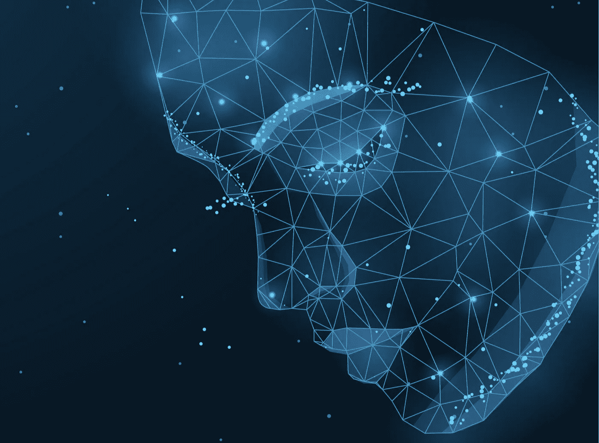
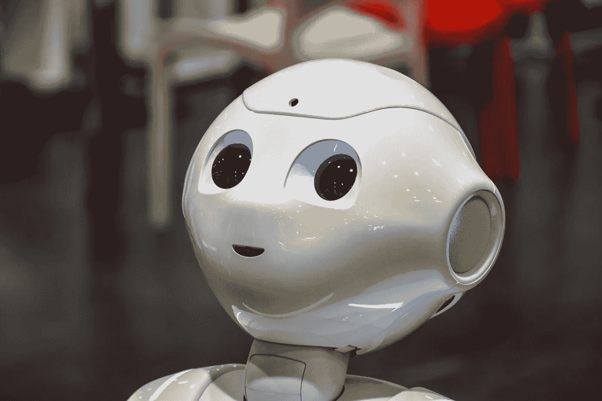
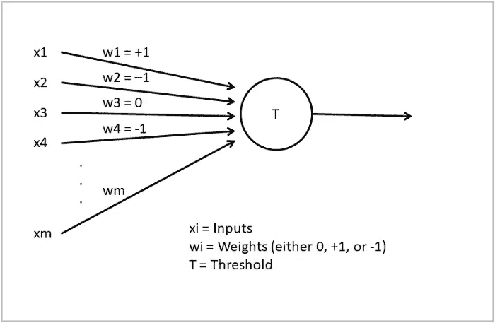

# 人工智能行业现在需要的 4 个变化

> 原文：<https://towardsdatascience.com/4-changes-the-ai-industry-needs-right-now-7faffce0d301?source=collection_archive---------9----------------------->

## 人工智能|观点

## 我很乐意看到这些发生。

[卡廷](https://www.shutterstock.com/es/g/Katynn)在[快门架](https://www.shutterstock.com/es/image-vector/vector-illustration-human-head-created-low-1176340219)上拍摄的照片(已编辑)

人工智能正在承受过于成功的后果。

几个月前，我写了一篇题为“[我离开人工智能行业的 5 个原因](/5-reasons-why-i-left-the-ai-industry-2c88ea183cdd)”的文章，在文章中，我坦率地批评了人工智能的缺陷——这可能是这篇文章火起来的原因。这与其说是一篇经过深思熟虑的文章，不如说是一篇慷慨激昂的文章，但我还是袖手旁观了我当时写的大部分内容。然而，那篇文章中缺少了一些东西。我抨击这个行业，但从未提出改进方案。

人工智能的成功削弱了它的现状。它转移了大量的资金，因为它赋予了无与伦比的力量——军事的、经济的、甚至社会的。这就是为什么任何有新闻价值的里程碑事件都会影响私人利益和公众舆论。正是这种影响世界的能力导致了人工智能行业出现问题。

在这篇文章中，我不会列举让我离开这个行业的原因，我会具体说明会让我回来的变化。我希望看到的变化。人工智能行业迫切需要的变革。

# 利益和资金的多样化

流行的[变压器架构](https://arxiv.org/abs/1706.03762)——由谷歌科学家在 2017 年发明——是一种证明卷积和递归没有必要的捷径。注意力是我们所需要的，作为简单的爱好者，AI 人利用这个想法在 NLP 中建立了一个新的分支；大型语言模型(LLM)。

LLM 是非常大的神经网络(数十亿个参数)，已经掌握了语言的形式和结构。以 OpenAI 的 GPT-3 为旗舰，它们构成了人工智能两个当代趋势的最大指数:即“[越大越好](https://bdtechtalks.com/2019/11/25/ai-research-neural-networks-compute-costs/)的想法和大型科技公司已经接管该领域的可悲事实。

将模型变大的趋势(原则上为神经网络提供了映射更复杂的输入-输出关系的能力)遵循[缩放假设](https://www.gwern.net/Scaling-hypothesis#scaling-hypothesis)。这是一种信念，即通过将大量数据和计算能力投入到相同的算法中，复杂的行为可以在人工智能系统中出现。这也是通往 AGI 的一条直路的承诺。

因为我们已经开始相信越大越好，所以不可避免的是，只有一小群大公司才能推动这个领域向前发展。那些有足够财力购买超级昂贵的硬件、训练和部署大规模模型，并将它们转化为可商业化的产品的人。全世界的谷歌、亚马逊和微软正在获得资金、专业知识——或者说[立即收购顶尖的创业公司](https://www.bloomberg.com/news/articles/2020-03-16/big-tech-swallows-most-of-the-hot-ai-startups)——以及利润。

巨大的壁垒保护这些公司免受任何竞争。他们是艾金矿的老板。或者铜矿，因为这些模型可能不像一些人认为的那样特殊——我敢打赌，这些模型获得的兴趣和它们的真正用途[之间只有适度的相关性。然而，正如 Emily M. Bender 几个月前在 Twitter 帖子](https://dl.acm.org/doi/10.1145/3442188.3445922)中解释的那样，它们一直掩盖着其他研究项目:

除非研究兴趣和项目资金都多元化(研究人员有其他兴趣，但他们会因为选择不跟随 LLM 趋势而危及发表论文的机会)，否则人工智能领域几乎不可能克服深度学习革命导致的瓶颈。

人工智能已经成为行业巨头创造赚钱应用的工具。再多一点。

人工智能不再是揭示人类智力和行为秘密的努力。少数几个牢记最初使命的研究小组——deep mind 和 OpenAI 等——已经被不道德的大鱼吸收了。只要对利润的渴望主导着这个领域——与允许大量的科学好奇心蓬勃发展形成对比——它就无法逃脱这种局面。

# 有节制的炒作——与结果一致，而不是幻想

马文·明斯基，可以说是人工智能创始人中最杰出的一位，[在 1967 年说](https://www.cambridge.org/core/journals/canadian-mathematical-bulletin/article/computation-finite-and-infinite-machines-by-marvin-minsky-englewood-cliffs-n-j-prentice-hall-xvii-317-pages-1200/1038BAF8955B9D32F1C29A1800724A81)“在一代人的时间内……创造‘人工智能’的问题将会得到实质性的解决。”他错误预测了人类水平的人工智能出现半个世纪——而且还在继续。55 年后，真正的人工智能仍然遥不可及，但所谓的专家不断预言，在[几年后](https://futurism.com/kurzweil-claims-that-the-singularity-will-happen-by-2045#:~:text=%E2%80%9CBy%202029%2C%20computers%20will%20have%20human%2Dlevel%20intelligence%2C%E2%80%9D%20Kurzweil%20said%C2%A0in%20an%20interview%20with%20SXSW.)，AGI(人工智能)将成为现实。

当然，不是每个人都同意。但是，仅仅几个响亮的声音宣称我们比实际上更接近 AGI，就足以将炒作推向高潮。大肆宣传之后很快就会有大量的资金，当预期没有实现时，这些资金就会枯竭。可悲的是，制造宣传比恢复信任要容易得多。通过未兑现的承诺对信任的持续攻击是导致过去两个人工智能冬天的原因。我们不希望这种事再次发生。

我们很幸运，深度学习革命——或者我应该说是[复活](https://en.wikipedia.org/wiki/Deep_learning#:~:text=The%20term%20Deep%20Learning%20was%20introduced%20to%20the%20machine%20learning%20community%20by%20Rina%20Dechter%20in%201986%2C)——正在维持一个永无止境的工业应用的温暖夏天。从人脸识别到语言翻译器，再到无人驾驶汽车(嗯，不。尽管有些人希望我们相信这些，但它们还没有准备好)。然而，人类水平的智能机器似乎和明斯基做出预测时一样遥远。我们在模式检测和识别方面取得了很大进步(这很好，不要误会我的意思)，但在[推理](https://www.technologyreview.com/2018/11/17/66372/one-of-the-fathers-of-ai-is-worried-about-its-future/#:~:text=If%20you%20have,these%20causal%20models.)、[常识](https://www.linkedin.com/pulse/ais-hardest-problem-developing-common-sense-gary-marcus/)或决策方面却进展甚微。

每当科学向前迈出一小步，炒作就会跃进——结果却是惨败。

流行的语言模型 GPT-3 是无节制炒作的典型例子。它擅长生成语言。好到人们认为它的特性远远超出了它的实际能力。“[自我意识](https://twitter.com/sonyasupposedly/status/1284188369631629312?s=20)、“[一般智力](https://twitter.com/rauchg/status/1282449154107600897?s=20)、或能够“[理解](https://www.lesswrong.com/posts/L5JSMZQvkBAx9MD5A/to-what-extent-is-gpt-3-capable-of-reasoning#:~:text=I%27m%20pretty%20convinced%20at%20this%20point%20that%20Marcus%20was%20wrong.%20GPT%2D3%20has%20some%20level%20of%20common%20sense%2C%20some%20level%20of%20understanding%2C%20some%20level%20of%20reasoning%20ability.%20It%27s%20just%20not%20as%20good%20as%20adult%20humans.)”是他们归因于该模型的一些特征。当其他人开始[指出它的缺陷](https://www.technologyreview.com/2020/08/22/1007539/gpt3-openai-language-generator-artificial-intelligence-ai-opinion/)和弱点时，科技杂志[回应了这种感觉，但为时已晚。Hype 的工作正在上升；事后是否被打倒并不重要。伤害已经造成，大多数人现在觉得我们正处于人工智能爆炸的边缘。](https://www.theverge.com/21346343/gpt-3-explainer-openai-examples-errors-agi-potential)

我们为什么要这样做？当人们一次又一次地未能预见未来的发展时，为什么人们会不断地相信炒作的新闻呢？两个因素:希望(恐惧)和偏见。

我们要么满怀希望，要么害怕(或者漠不关心，尽管这些在这里并不重要)在我们的有生之年看到 AGI 的发展。一些人*希望*它发生，而另一些人[非常害怕](https://www.technologyreview.com/2016/11/02/156285/yes-we-are-worried-about-the-existential-risk-of-artificial-intelligence/)他们已经在采取措施。欲望和恐惧都让我们相信它会比证据显示的更快发生。

例如，雷·库兹韦尔，一位超级有希望的研究人员，预测我们将在 2029 年实现 AGI(是的，8 年后)。但是他的论点是基于数学上的不精确性。他说人工智能——以及总体技术——呈指数级进化。但事实是“[自然界中没有什么遵循真正的指数](https://web.archive.org/web/20121030072409/http://www.growth-dynamics.com/articles/Kurzweil.htm#:~:text=Nothing%20in%20nature%20follows%20a%20pure%20exponential.)”——更不用说所有肯定会影响人工智能发展的外围维度，如社会动荡、伦理限制或来自恐惧人群的阻力。

库兹韦尔渴望体验 AGI，这影响了他的判断，并扭曲了事实。

但这并不是故事的结尾。有些人充满希望，有些人则充满恐惧。然而，如果我们都有共同点，那就是我们都有偏见。我们倾向于拟人化任何勉强流露出人性的东西。[一块长着一双眼睛的石头](https://ksr-ugc.imgix.net/assets/012/052/013/d7a4f119aeab2854417249c98065e412_original.jpg?ixlib=rb-4.0.2&crop=faces&w=1552&h=873&fit=crop&v=1463727551&auto=format&frame=1&q=92&s=cacc3d5d1591699d9a30d7139afe0d67)会让我们想去抚摸它。看着辣椒告诉我你不想带回家。我们甚至给我们的房间取名为 T7！

胡椒试图融化你的心——照片由 [Shutterstock](https://www.shutterstock.com/es/image-photo/head-lightning-eyes-humanoid-robot-1232039353) 上的 [Balipadma](https://www.shutterstock.com/es/g/balipadma) 拍摄

尽管机器人有让我们感受爱或联系的意想不到的技能，但在所有这些电线和芯片背后，它们没有头脑。我们表现得像他们一样，因为我们进化到假设他人的心理状态(这在认知科学中被称为心理理论)。比起理解人类意识，我们可能离向机器人灌输心理理论更远。

除非我们学会控制让我们创造和相信炒作新闻的因素，否则人工智能的努力很有可能永远达不到我们的预期——不管人工智能专家真实地描绘了艺术的状态，这并不总是如此。我们无法控制自己固有的机制，但意识到这些机制让我们有能力怀疑自己的信仰。

我们越是用结果而不是幻觉来调整我们的预期，人工智能领域就越健康。

# 促进开放源码反对垄断

OpenAI 一开始是个好人。他们肩负着实现 AGI[造福全人类](https://openai.com/blog/introducing-openai/#:~:text=Our%20goal%20is%20to%20advance%20digital%20intelligence%20in%20the%20way%20that%20is%20most%20likely%20to%20benefit%20humanity%20as%20a%20whole%2C%20unconstrained%20by%20a%20need%20to%20generate%20financial%20return.)的光荣使命。那是一个非盈利的研究机构，可以自由地追求崇高的目标。当他们决定以开源方式向公众发布 GPT-2 时，他们已经通过[与微软](https://news.microsoft.com/2019/07/22/openai-forms-exclusive-computing-partnership-with-microsoft-to-build-new-azure-ai-supercomputing-technologies/)的合作改变了他们最初的目的。

这家老牌科技公司——由于其垄断行为，在 20 世纪 90 年代末和 21 世纪初每隔一天就会成为头条新闻——以 10 亿美元的投资购买了 OpenAI 技术的独家许可。随着微软的钱从口袋里掉出来，OpenAI 能够建造 GPT-3。但是，他们没有开源，而是决定为极少数愿意尝试的幸运开发者建立一个私有 API。早期测试人员的噪音足以营销 GPT-3，并将其转化为人工智能超级明星。

人们很愤怒。OpenAI 背叛了他们的使命。人们不得不加入等候名单，再也没有他们的消息。少数几个有兴趣的非营利项目的人不得不放弃，因为 OpenAI 在其定价计划中设定了难以承受的成本。只有那些赚钱的人活了下来。在看不到其他竞争者的情况下(那些[可以竞争](https://arxiv.org/abs/2101.03961)的人没有使用他们的系统赚钱)，他们无休止地利用 GPT-3——以至于允许项目[与他们的用例指导方针发生潜在冲突](https://www.theregister.com/2021/09/08/project_december_openai_gpt_3/)。

open ai-微软团队实际上已经成为一个伪垄断者。OpenAI 为 GPT 3 号设定的价格并不重要。如果你想使用一个复杂的 LLM 的能力，你必须付费。人们试图用 GPT-2 号来竞争，但很明显 GPT-3 号在每项任务中都胜过它。

如果你没钱支付 GPT-3，那么你就出局了。

一个试图跟上 OpenAI 快速发展 LLMs 的项目是 [EleutherAI](https://www.eleuther.ai/) 。这组开发人员负责创建 [GPT-J](/cant-access-gpt-3-here-s-gpt-j-its-open-source-cousin-8af86a638b11) ，这是 GPT-3 最接近的开源竞争对手。他们一直从 CoreWeave 那里获得计算资源，core weave 一直“非常热衷于”帮助他们“打破微软对 LLMs 的垄断”。

正是这类旨在提供不求回报的集体项目，才是我们应该用现有手段大力支持的。

OpenAI 和微软正在阻止全世界的研究人员研究和分析 GPT-3 的行为(OpenAI 现在已经[开放了 API](/openai-opens-gpt-3-for-everyone-fb7fed309f6) ，但是定价是一样的)。当拥有模型的公司只让那些利用它获利的人进来时，科学家如何推进我们对人工智能的理解？

开源替代方案可以有效地从大型技术手中夺走权力，并使尖端人工智能模型民主化。

# 关注认知科学

在之前我已经说过这个[，我会继续说下去。AI 需要大脑。](/5-reasons-why-i-left-the-ai-industry-2c88ea183cdd#:~:text=The%20future%20of%20AI%20will%20include%20the%20brain)

人工智能的存在是因为我们聪明。我们的认知能力赋予我们被研究的价值和研究自己的能力。大脑是这种独特组合的中心。人工智能试图复制人类智能，而认知科学研究大脑和思维。他们关系密切，但似乎已经忘记了对方。

人工智能领域最初是寻求创造能够在不同活动中复制[人类专长](https://en.wikipedia.org/wiki/Expert_system)的电子系统——并最终复制我们智能的一般性质。神经网络最初被忽视，但科学家们意识到实现真正人工智能的最合理途径是遵循进化的步骤，这是一个时间问题。正是在这种思维框架下，沃伦·麦卡洛克和沃尔特·皮茨定义了有史以来第一个人工神经元模型。

麦卡洛克-皮茨神经元。作者图片

自该模型诞生以来的 80 年里，人工智能几乎没有更新过对神经元的理解。深度学习书籍仍然教授类似的模型，尽管[大量](https://royalsocietypublishing.org/doi/abs/10.1098/rstb.1982.0084) [神经科学](https://www.sciencedirect.com/science/article/abs/pii/0014488659900469) [文献](https://www.sciencedirect.com/science/article/pii/S0896627300800914)指出了许多错误的假设和未精炼的限制。正如我在[的上一篇文章](/heres-why-we-may-need-to-rethink-artificial-neural-networks-c7492f51b7bc#:~:text=In%20the%20process%2C%20they%20set%20the%20groundwork%20of%20a%20whole%20field%20that%20never%20deigned%20to%20look%20again%20at%20his%20own%20premises%20and%20contrast%20them%20with%20relevant%20discoveries%20in%20neuroscience.)中所写的那样:“[AI]从未屈尊再看一眼自己的前提，并将它们与神经科学的相关发现进行对比。”

当人工智能科学家们与研究他们想要模拟的事物的领域分道扬镳时，他们如何解决他们最渴望的目标？一些人认为，人工智能可以找到另一种独特的智能方式。进化定义了一条路径，但不一定是唯一的。确实如此。但是，为什么不选择我们知道会给出更可靠结果的方向，而不是去寻找与我们的普遍熟练程度相差甚远的狭窄应用程序呢？

神经形态计算可能有答案。这是计算机科学的一个分支，融合了人工智能软件和硬件:他们押注于设计更接近大脑结构和功能元素的芯片。前提是我们不会在计算机硬件上实现 AGI 模拟虚拟神经网络。电脑和人脑太不一样了。

几十年后，我们会意识到我们离创造 AGI 还有多远。我们会把手放在头上问，尽管我们把难以置信的大量数据和计算塞进算法，我们怎么可能没有实现我们的目标。深度学习对于一些问题来说很棒，但它不是万能的。GPT-3 取得了非凡的语言技能，但它仍然犯错误，揭示了它对世界不存在的理解。AlphaZero 比任何人都擅长下棋，但如果你教它围棋，它会忘记怎么玩。他们两人都没有实用主义的世界知识。

神经科学没有所有的答案。但是，对于这两个问题，我们已经问了几十年的问题，以及我们在未来将要面对的问题，它肯定有一些答案。人工智能可以从那些更了解大脑的人那里学到很多东西，但深度学习正朝着相反的方向发展。

最后，我想在这里以见证人的身份做一个大胆的预测:无论神经网络规模(我说的是许多万亿个参数或更多)、数据集规模(互联网上的所有文本或所有图像和视频数据)和计算能力如何，只要我们继续将努力限制在深度学习上，我们都不会实现人类级别的 AI。

我们需要新的范例。我们会发现他们在观察我们的大脑。

如果你喜欢这篇文章，可以考虑订阅我的免费周报 [***【明天的想法】***](https://mindsoftomorrow.ck.page/) *！每周都有关于人工智能和技术的新闻、研究和见解！*

*您也可以直接支持我的工作，使用我的推荐链接* [***这里***](https://albertoromgar.medium.com/membership) *成为中级会员，获得无限权限！:)*