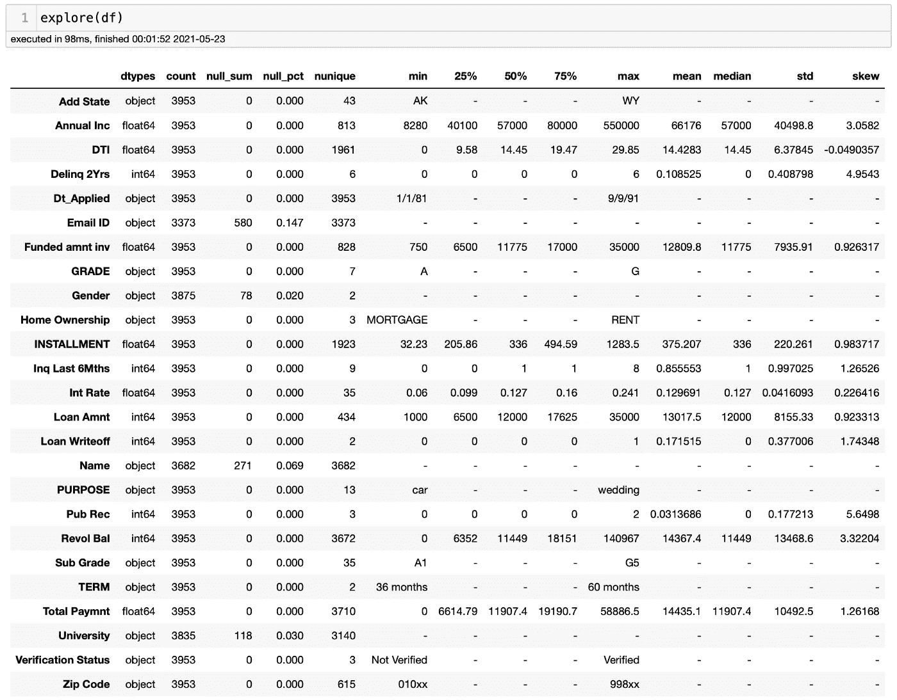
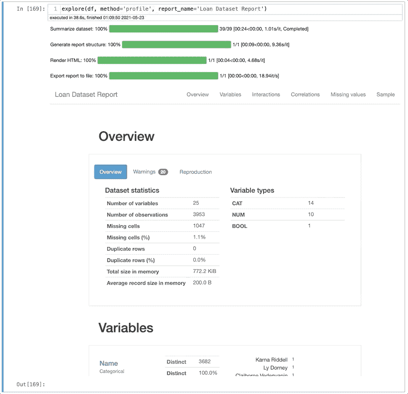
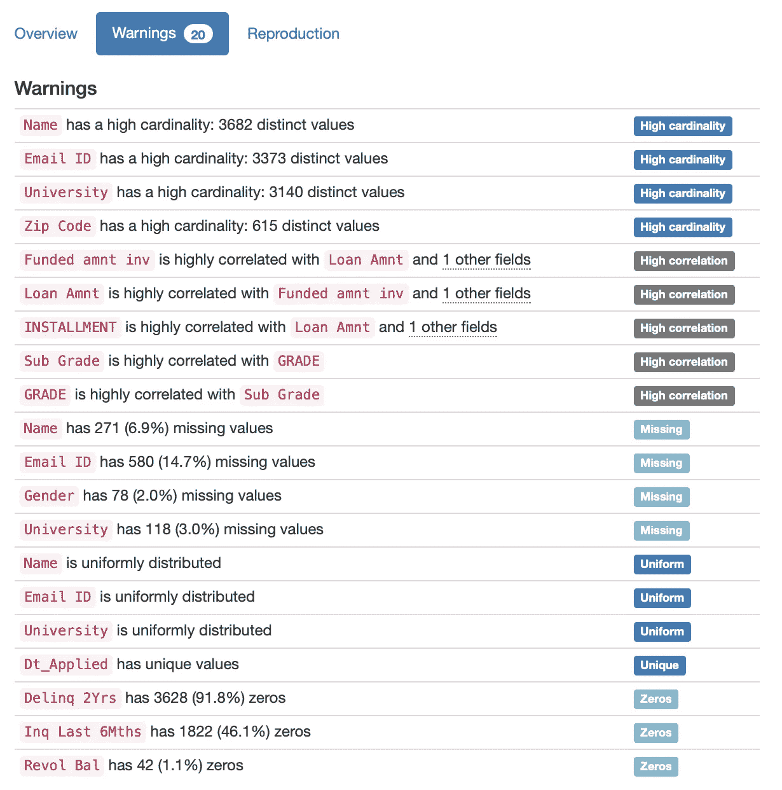
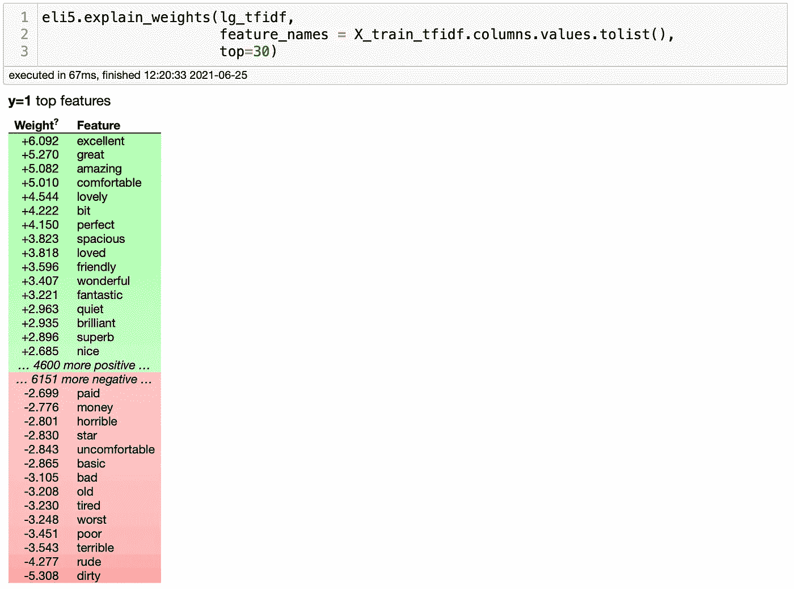
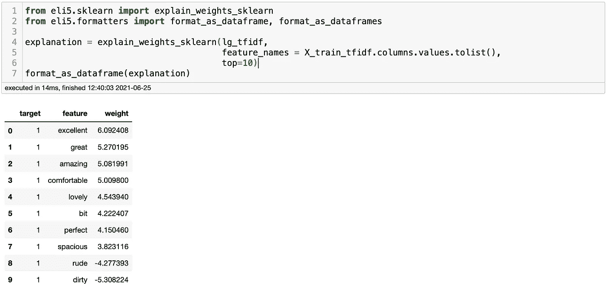
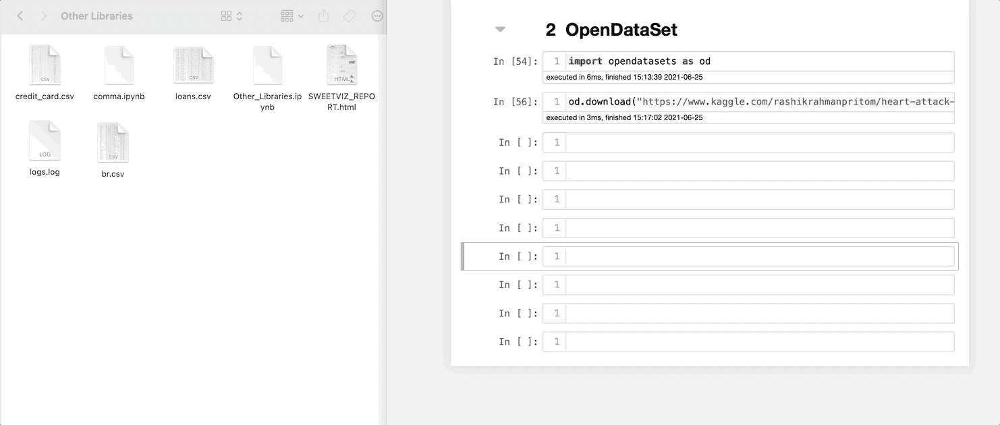
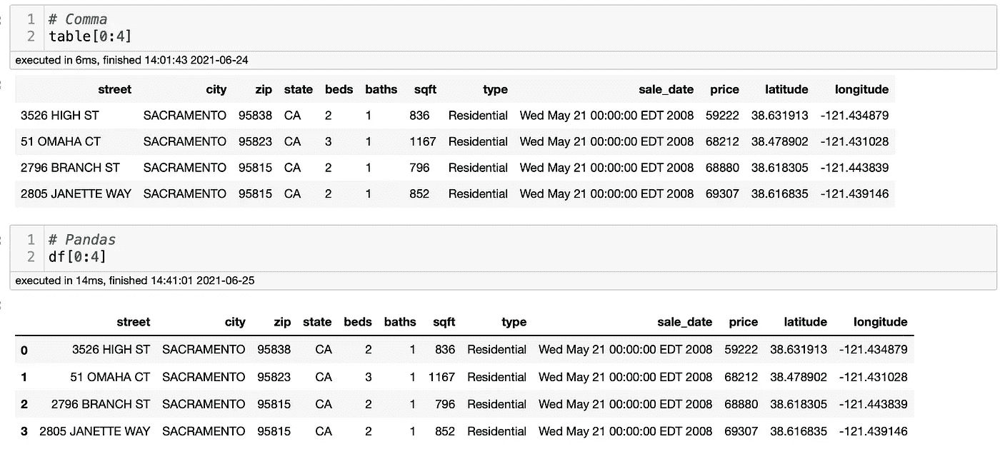
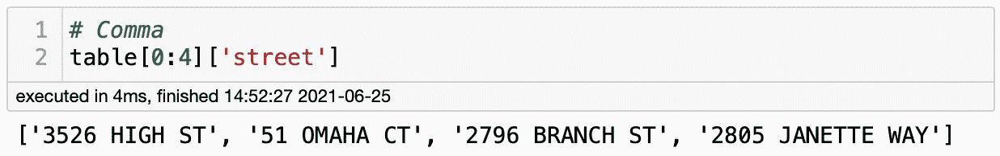
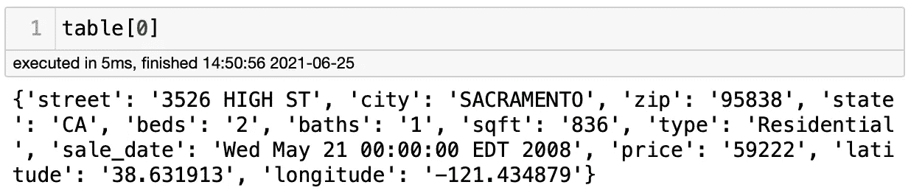

# 你应该知道的 4 个很酷的 Python 库

> 原文：<https://towardsdatascience.com/4-cool-python-libraries-that-you-should-know-about-bea9619e481c?source=collection_archive---------6----------------------->

## 大蟒

## 发现您应该在下一个项目中尝试的有用的 Python 库


图片由安德里亚·皮亚卡迪奥提供。来源: [Pexels](https://www.pexels.com/photo/man-sitting-on-a-green-grass-field-3761504/)

我的一些最受欢迎的博客是关于 Python 库的。我相信它们如此受欢迎是因为 Python 库有能力为我们节省大量时间和麻烦。问题是大多数人关注那些最流行的库，但是忘记了多个不太知名的 Python 库和它们最著名的同类库一样好。

寻找新的 Python 库也会有问题。有时我们读到这些很棒的库，当我们尝试它们时，它们并不像我们预期的那样工作。如果这曾经发生在你身上，不要再害怕了。我支持你！

在这篇博客中，我将向您展示四个 Python 库，以及为什么您应该尝试它们。让我们开始吧。

# QuickDA

我不久前写了 QuickDA，我仍然对它的效果感到惊讶。顾名思义，QuickDA 是一个易于使用的低代码库，它用很少的代码行执行数据清理、数据探索和数据可视化。QuickDA 可以节省您的工作时间，它有如此多的酷功能，以至于我不得不写了两篇博客来介绍最显著的功能。你可以在这里找到它们[这里](/save-hours-of-work-doing-a-complete-eda-with-a-few-lines-of-code-45de2e60f257)和[这里](/how-to-create-data-visualizations-in-python-with-one-line-of-code-8cda1044fe69)。

QuickDA 最好的部分是它使用了 Pandas、Matplotlib、Seaborn 和 Plotly 等库。因此，一旦你开始使用它，你就会感到熟悉。比如你还记得熊猫的`.describe()`功能吗？QuickDA 可以做到这一点，但方式有所改进。

正如我们在下面看到的，它返回关于特征的统计信息，但是它还包括对象类型、空值和唯一值的数量以及数据的偏斜度。



作者图片

使用 QuickDA 可以轻松快速地获得见解。您可以获得一个概述，包括关于数据集的警告(稍后将详细介绍警告),并使用一行代码可视化数据。你不需要输入无数行代码来得到一个图表。



作者图片

当我说您可以得到关于数据集的警告时，我指的是什么？QuickDA 可以显示高基数、要素之间的高相关性、高百分比的缺失值和高百分比的零。



作者图片

QuickDA 有很多更酷的特性，我强烈推荐你去看看。我已经用这个库 和**写了** [**用一行代码用 Python 创建数据可视化**](/how-to-create-data-visualizations-in-python-with-one-line-of-code-8cda1044fe69) 来找到关于它的更多信息。

# ELI5

机器学习模型不仅关乎模型预测的准确性，还关乎它如何预测。有时，我们需要了解哪些特征在驱动预测，以优化模型或解释模型。例如，在一个自然语言处理分类问题中，如何轻松地看出哪些单词影响了预测？这正是 Eli5 的用武之地。

Eli5 帮助你调试机器学习分类器，解释它们的预测。它支持最流行的机器学习框架和软件包，如 scikit-learn、Keras、XGBoost、LightGBM 和 CatBoost。前一阵子，我做了一个 NLP 项目，对酒店评论进行分类，我必须知道哪些词对好评论和坏评论的影响最大。Eli5 非常方便。让我告诉你怎么做。

```
**# Install Eli5**
!pip install eli5**# Importing Eli5** 
from eli5.sklearn import explain_weights_sklearneli5.explain_weights(**model**, feature_names = **X_train**.columns.values.tolist(), top = **#_of_features**)
```



作者图片

这就对了。我们可以看到，Eli5 返回了一个颜色编码的表，显示了模型中权重最高的特性。我们可以看到，该模型能够识别正面评论为优秀和伟大的单词，以及负面评论为肮脏和粗鲁的单词，这是有意义的。

如果您喜欢熊猫数据帧，也可以使用下面的代码:

```
from eli5.formatters import format_as_dataframeexplanation = explain_weights_sklearn(**model_name**, feature_names = **X_train**.columns.values.tolist(), top = **#_of_features**)
format_as_dataframe(explanation)
```



作者图片

Eli5 是一个很好的库，可以为您节省一些时间。它还有其他功能，你可以在这里找到。

# 打开数据集

假设你正在启动一个项目，练习你的数据分析和机器学习技能；你从哪里开始？大多数人去 Kaggle，找到一个感兴趣的数据集，下载文件，在 Downloads 文件夹中找到文件，然后把文件拖到你正在处理的笔记本所在的文件夹中。相当多的步骤，对不对？如果有更好的方法呢？这就是 OpenDataSets 要解决的问题。

OpenDataSets 允许我们从笔记本上下载数据集。它将创建一个与数据集在同一个文件夹中的文件夹，这样您的笔记本可以节省一些时间。很酷，对吧？

要使用它，你只需要在你的终端输入`pip install opendataset`。然后，您需要通过输入`import opendatasets as od`将其导入到笔记本中，您就可以开始工作了。Kaggle 会要求您提供凭据，但您可以在 Kaggle 个人资料页面轻松获得。在下面的例子中，我想下载著名的[心脏病数据集](https://www.kaggle.com/rashikrahmanpritom/heart-attack-analysis-prediction-dataset)。以下是您需要的代码:

```
import opendatasets as odod.download("[https://www.kaggle.com/rashikrahmanpritom/heart-attack-analysis-prediction-dataset](https://www.kaggle.com/rashikrahmanpritom/heart-attack-analysis-prediction-dataset)")
```



作者图片

正如你在上面看到的，图片左边的文件夹没有心脏病数据集的文件夹。然而，只要我运行代码，它就会为我下载数据集。您可以看到数据集是解压缩的。这再容易不过了。

# **逗号**

Comma 是那些直到需要时才知道自己需要的库之一。逗号使得处理 CSV 文件更容易。例如，您可以轻松地从列表或字典中的 CSV 文件提取信息。这是它如何工作的演示。

首先，你可以在你的终端中输入`pip install comma`来安装逗号，然后你就可以开始了。现在让我们导入逗号和我们将使用的数据集。

```
import commatable = comma.load( '[https://raw.githubusercontent.com/DinoChiesa/Apigee-Csv-Shredder/master/csv/Sacramento-RealEstate-Transactions.csv'](https://raw.githubusercontent.com/DinoChiesa/Apigee-Csv-Shredder/master/csv/Sacramento-RealEstate-Transactions.csv'))
```



作者图片

顶部的表格是用逗号创建的。我还创建了一个表格，用熊猫来做比较。他们看起来几乎一模一样。现在，假设您想以列表的形式获取一列的值。您可以使用以下代码轻松做到这一点:

```
table[0:4]['**column_name**']
```



作者图片

如果您想以字典的形式获取某一行的信息，也可以通过键入`table[0]`来轻松实现。



作者图片

我知道你也可以在熊猫身上这样做，但是这需要更多的代码。如果您需要经常这样做，逗号可能会节省您一些时间。这绝对是一个著名的图书馆。

# 结论

今天我们去了一些你应该知道的图书馆。有些并不适合所有人，只有在你需要的时候才有意义。然而，当这一时刻到来时，你会发现你可以节省几个小时的宝贵时间。

如果你想了解更多的库，请查看你不知道的 [**5 个 Python 库，但应该**](/5-python-libraries-that-you-dont-know-but-you-should-fd6f810773a7) 、 [**3 个你应该知道的**](/3-awesome-python-libraries-that-you-should-know-about-e2485e6e1cbe?source=your_stories_page-------------------------------------) 牛逼的 Python 库，以及 [**3 个你应该知道的**](/3-awesome-python-libraries-that-you-should-know-about-e2485e6e1cbe?source=your_stories_page-------------------------------------) 牛逼的 Python 库。感谢您的阅读和快乐编码。