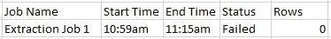

# 你(可能)不知道的 4 种数据管道实践

> 原文：<https://towardsdatascience.com/4-data-pipeline-practices-you-probably-didnt-know-about-f6ed145fbe69?source=collection_archive---------9----------------------->

## 构建高质量数据管道的数据工程技巧


在 [Unsplash](https://unsplash.com?utm_source=medium&utm_medium=referral) 上拍摄的 [ThisisEngineering RAEng](https://unsplash.com/@thisisengineering?utm_source=medium&utm_medium=referral)

嘿，各位，
在每个科技产品的背后，都有**自动化**要做，以保持数据整洁和最新。现在是 2021 年，仅仅知道如何构建酷的数据模型还不足以在数据科学家领域生存。你必须潜得更深。

如今，数据管道越来越优先化。
这主要得益于行业的成熟。数据科学家意识到，要为他们的模型获得干净的数据，他们必须为他们的数据仓库建立一个坚实的基础。

</should-you-become-a-data-engineer-in-2021-4db57b6cce35>  

因此，除了专门的数据工程师，数据科学家自己也必须了解数据管道。在本文中，我们将讨论一些您应该在设计中实现的数据管道实践，以确保稳定的数据生态系统。

# 先决条件

本文中的实践涵盖了一般的**数据流水线概念**。
无论你使用什么样的工作流管理系统，你都可以在任何地方应用这些概念。

就我个人而言，我使用 Apache Airflow 进行批处理作业，使用 Apache Beam 进行流作业已经超过 3 年了。我发现他们很有效率。

</data-engineering-basics-of-apache-airflow-build-your-first-pipeline-eefecb7f1bb9>  

如果你了解 basic **Python** 也会有所帮助，因为它是数据行业的主流编程语言。

改变我的想法。

Gif by [Giphy](https://giphy.com/gifs/IepriDYu8gcidIVZPB/media)

# 计划与算法触发器


作者图片

在传统流水线中，有基本的 **ETL/ELT 作业**。
无论您正在处理哪种工作，都需要触发器来启动工作本身。

然后我们进入**时间表触发器 vs 算法触发器**的辩论。

## 计划触发器

你的基本触发器。调度程序在任何种类的工作流管理系统中都是可用的。它允许你以固定的时间间隔开始工作，比如每分钟、每小时、每天、每周等等。

时间表触发器对不可避免的任务很有用。这意味着它们必须不管任何依赖关系而运行，并且通常在任何情况下都不会失败。

## 算法触发器

一种定制的触发器。算法触发器有多种形式。最常见的是其他工作的传感器和触发器。它允许您在特定条件下开始作业**。例子有—**

*   **文件被导入到文件夹中**
*   **向表中添加一行**
*   **多个相关作业已完成**

**算法触发器对于有**依赖**的任务很有用。
通常，这些作业会失败，除非满足**某些条件**。**

## **判决**

**你应该使用哪种触发器取决于你的工作性质。
拥有适当的依赖和触发结构对于构建可靠的流水线架构至关重要。**

****问类似于—** 的问题**

*   **该作业应该每天运行吗？**
*   **这项工作占用的资源是否比需要的多？**
*   **作业应该多久执行一次？**
*   **工作的成功有多重条件吗？**

**在一个完美的世界里，我们所有的工作都运行良好。**

**但是我们知道这是不可能的。
**工作失败时学习**。有了经验你会变得更好。**

# **适当的警报**

**我们的**管道破裂**。这不是世界末日。重要的是我们事后做了什么。**

**一旦发生这种情况，我们必须通知**。
通常情况下，基本的警报不足以实现这一点。****

****大多数工作流管理系统提供基本的警报解决方案。
但是，组织通常会添加他们自定义的警报级别。****

## ****电子邮件****

****最简单的解决方案。
这是最起码应该包含的。****

****团队的所有成员都会收到一封电子邮件，提醒他们作业失败了。这不是最有效的解决方案，因为我们并不是一直盯着我们的电子邮件。我们可能会时不时地错过这一点。****

****这里有一个非常基本的电子邮件气流警报形式。****

```
**from airflow.utils.email import send_emailemail_to = 'receivers@email.com'
email_subject = '(FAILED) ' + jobname + date
email_content = 'Your job has failed.'
send_email(email_to, email_subject, email_content)**
```

## ****松弛的****

****下一级警报。如果你是搞技术的，很可能你的公司已经采用了松弛作为一种沟通渠道。当消息被发送过来时，Slack 会向你发出一种卡嗒声(我很确定我们都很熟悉这种声音)。****

******创建一个警报专用频道**。让您的管道在出现故障时向通道发送警报。这将确保团队在出现问题时得到提醒。****

****下面是使用其**[**API**](https://slack.dev/python-slack-sdk/web/index.html)的时差警报的基本形式。******

```
**from slack import WebClientclient = WebClient(token = 'your token here')
response = client.chat_postMessage(
                channel = slack_cannel,
                text = message
                )**
```

# ****正确记录****

********

****[Artur uczka](https://unsplash.com/@artur_luczka?utm_source=medium&utm_medium=referral)在 [Unsplash](https://unsplash.com?utm_source=medium&utm_medium=referral) 上拍摄的照片****

*****不，不是那种日志*。****

****在编程中，日志记录只是一个用来定义写下你所做的一切的过程的花哨词汇。流水线过程中有两种类型的日志。任务日志和作业日志。****

## ****任务日志****

****这些日志记录了任务执行过程中的重要信息。我们不想打印我们运行的每一行代码，但是应该有足够的日志来帮助我们浏览任务。****

****这里有一个例子—****

```
**Import PostgresHook#Extraction Job
def ExtractFromSource(query):
    query_to_run = query
    logging.info("Query : %" query_to_run)

    cursor = PostgresHook(connection).get_conn().cursor()
    logging.info("Connecting to Postgres Connection %" connection) cursor.execute(query_to_run)
    result = cursor.fetchall()**
```

****在**调试**期间，日志就像一个断点。它们有助于我们在任务失败时确定错误的来源。****

****在这个提取作业中，我们记录了**查询**和**连接**。
这实现了两件事——****

1.  ****通知我们任务运行良好**，直到每个点******
2.  ****向我们展示了传递的查询和连接变量****

****如果出现问题，我们可以清楚地确定哪个步骤有问题，以及检查查询或连接变量是否有问题。****

## ****作业日志****

****作业日志是作业运行的记录。
至少，它们显示了**作业开始到结束的时间和状态。**
如果您的工作流管理系统默认情况下还没有这个，您应该将它存储在某个地方，甚至可能在您的数据仓库中。****

****这是一个工作日志的例子—****

********

****作者图片****

******在您的数据仓库中创建一个审计表**。使用这些数据为每个运行的作业插入一行。数据科学家和分析师可以轻松地浏览该表，以检查某些表的最新作业运行，以及作业是否成功运行。****

# ****检查重复****

********

****菲尔·肖在 [Unsplash](https://unsplash.com?utm_source=medium&utm_medium=referral) 上拍摄的照片****

****如果您正在提取或转换数据，您可能以前遇到过这个错误。你提取/转换中的重复。****

****这可能是由于几个原因，比如—****

*   ****错误连接****
*   ****作业触发两次****
*   ****脏数据****

****这可以通过在管道中增加一个步骤**检查重复**来纠正。实现这一点的方法之一是通过主键检查计数。****

```
**Select max(count) from (
Select primary_key, count(*) from table group by primary_key)**
```

****如果结果返回大于 1，则表明数据中存在重复。
如果你的数据没有主键，你也可以给它们分配主键。****

```
**alter table TABLENAME add primary key (ID,NAME,PMID)**
```

# ****结论****

********

****格伦·卡斯滕斯-彼得斯在 [Unsplash](https://unsplash.com?utm_source=medium&utm_medium=referral) 上拍摄的照片****

******恭喜**！
你已经成功改善了你的数据管道。
这些年来我一直在学习这些概念，希望分享这些概念能为你节省一些时间。****

******在这篇文章中，我们了解到—******

*   ****时间表与算法触发器****
*   ****适当的警报****
*   ****充分记录****
*   ****重复检查****

****最后，让我引用一段话。****

> ****作为数据科学家，我们的工作是从噪音中提取信号。—丹尼尔·唐克朗****

# ****订阅我的时事通讯，保持联系。****

****也可以通过 [**我的链接**](https://nickefy.medium.com/membership) 注册一个中等会员来支持我。你将能够从我和其他不可思议的作家那里读到无限量的故事！****

****我正在撰写更多关于数据行业的故事、文章和指南。你绝对可以期待更多这样的帖子。与此同时，可以随时查看我的其他 [**文章**](https://medium.com/@nickmydata) 来暂时填补你对数据的饥渴。****

*******感谢*** *阅读！如果你想与我取得联系，请随时联系我在 nickmydata@gmail.com 或我的* [*LinkedIn 个人资料*](https://www.linkedin.com/in/nickefy/) *。也可以在我的*[*Github*](https://github.com/nickefy)*中查看之前写的代码。*****