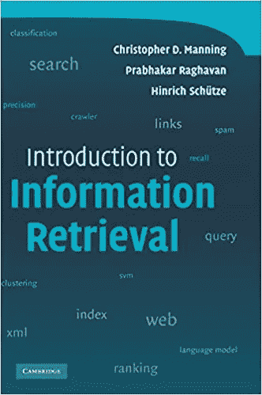

# 我将在四月份阅读的 4 本与数据相关的书

> 原文：<https://towardsdatascience.com/4-data-related-books-ill-be-reading-in-april-efd06b367e35?source=collection_archive---------38----------------------->

## 一定要看看这些书

苏珊·Q·尹在 [Unsplash](https://unsplash.com?utm_source=medium&utm_medium=referral) 上的照片

书籍确实是我的命根子；我认为自己是一个狂热的书虫，但每当谈到技术书籍时，我必须收回这句话。由于一些奇怪的原因，技术书籍总是让我感到更困倦而不是感兴趣。

然而，在过去，我设法变戏法似的鼓起勇气睁开眼睛，看完这些书。我已经意识到，每当我这样做了，我就在我所研究的学科或领域取得了巨大的进步，因此这个月我将再次这样做。

 [## 5 本免费书籍，让您的数据科学技能更上一层楼

### 帮助您提高数据科学技能的书籍

towardsdatascience.com](/5-free-books-to-take-your-data-science-skills-to-the-next-level-a2026c8cad71) 

对于那些有兴趣了解我全年都在读什么书的人，可以看看我的 [Instagram 页面](https://www.instagram.com/mentalrep.bc/)，它专门给出我对我正在读的不同书籍的看法。

## #1 实用自然语言处理:构建真实世界自然语言处理系统的综合指南

来源: [**亚马逊图书页面**](https://www.amazon.co.uk/Practical-Natural-Language-Processing-Pragmatic/dp/1492054054)

这本书是很久以前 Phillip Vollet 给我的，他是 LinkedIn 上非常受欢迎的 NLP 传播者(关注他，你不会后悔)，但我不愿意打开它，因为我害怕技术书籍。

他提到，这本书是学习在商业环境中构建、迭代和扩展 NLP 系统，并为特定的行业垂直领域定制它们的最佳指南之一。

## #2 信息检索简介

来源: [**亚马逊图书页面**](https://www.amazon.co.uk/Introduction-Information-Retrieval-Christopher-Manning/dp/0521865719/ref=sr_1_1?crid=2846P4096KX3F&dchild=1&keywords=introduction+to+information+retrieval&qid=1617282000&sprefix=introduction+to+information+retr%2Cstripbooks%2C153&sr=8-1)

我真的不记得是谁向我推荐了这本书，但肯定有人推荐过——我知道这一点的原因是因为这本书已经在我的亚马逊购物篮里放了几个月了，当我在谈话中听到有人提到我觉得有趣的书时，我通常会这样做。我不太确定这本书能提供什么，但我在网上看到了非常好的评论，所以我期待着深入这本书。

这是亚马逊上的图书描述:

> 课堂测试和连贯，这本教科书教经典和网络信息检索，包括网络搜索和相关领域的文本分类和文本聚类的基本概念。它给出了收集、索引和搜索文档的系统的设计和实现的所有方面的最新处理；评估系统的方法；以及在文本集合上使用机器学习方法的介绍。所有重要的想法都用例子和数字解释，使它成为计算机科学的高年级本科生和研究生的信息检索入门课程的完美教材。基于大量课堂经验的反馈，这本书被精心组织以使教学更加自然和有效。幻灯片和额外的练习(包括给讲师的解答)也可以通过该书的支持网站获得，以帮助课程讲师准备他们的讲座。

## #3 用于自然语言处理的转换器

来源: [**亚马逊图书页面**](https://www.amazon.co.uk/Transformers-Natural-Language-Processing-architectures/dp/1800565798)

对于任何加入 [Harpreet Sahota](https://www.linkedin.com/in/harpreetsahota204/) 办公时间的人来说——每周五太平洋标准时间 4.30——那么你会熟悉某个不停地漫谈这本书的人。Thom 在他的数据职业生涯中取得了如此出色的成就，但他毫无疑问赢得了我的尊重，因为他分享了他在数据科学职业生涯中犯下的每一个错误，他都长出了一缕白发——现在这可能没有意义，但看看他的 LinkedIn，你就会明白为什么这让我感动。

变压器目前是许多自然语言处理任务(如机器翻译)的最先进的架构。我已经用 HuggingFace 框架对它们进行了一些涉猎，但是我确信深入研究它们没有坏处。

## #4 机器学习工程

来源: [**亚马逊图书页面**](https://www.amazon.co.uk/Machine-Learning-Engineering-Andriy-Burkov/dp/1999579577/ref=sr_1_1?dchild=1&keywords=Machine+Learning+Engineering&qid=1617283253&s=books&sr=1-1)

你们中的一些人可能还记得安德烈·布尔科夫，这本长达一百页的关于机器学习的书《T4》的作者。他带着另一个回来了。据说这本书充满了从最佳实践到构建可扩展的可靠机器学习解决方案的设计模式的金块。任何有助于我改进构建这种规模的 ML 解决方案的东西都会引起我的注意，而这一次，它恰好是安德烈·布尔科夫的一个可靠来源。

以下是谷歌首席决策科学家凯西·科兹尔科夫对这本书的评价:

> “你现在看到的是为数不多的真正应用机器学习的书籍之一。没错，你找到了一个！一个真正的应用针在面向研究的东西的干草堆里。干得好，亲爱的读者……除非你实际上寻找的是一本帮助你学习设计通用算法的技能的书，在这种情况下，我希望作者不会因为我告诉你现在逃离并去拿起几乎任何其他机器学习书籍而感到太沮丧。这个不一样”

## 最后的想法

在 Q1，我大部分时间都在阅读一些我觉得鼓舞人心的人物传记。对 Q2 来说，我的目标是将更多的注意力放在与我的领域更相关的书籍上，这些书籍将帮助我发展和提高作为一名数据科学家的能力。再说一次，如果你有兴趣跟随我的阅读之旅，关注我的 [Instagram](https://www.instagram.com/mentalrep.bc/) 。

感谢您的阅读！在 [LinkedIn](https://www.linkedin.com/in/kurtispykes/) 和 [Twitter](https://twitter.com/KurtisPykes) 上与我联系，了解我关于数据科学、人工智能和自由职业的最新帖子。

## 相关文章

 [## 面向 NLP 爱好者的 7 个免费在线资源

### 一定要将它们加入书签

pub.towardsai.net](https://pub.towardsai.net/7-free-online-resources-for-nlp-lovers-26b1e0bba343)  [## 作为远程数据科学家蒸蒸日上

### 我远程工作的经历

towardsdatascience.com](/thriving-as-a-remote-data-scientist-98f9aa79f5ab)  [## 失业的数据科学家如何安排他们的一天

### 维持秩序很重要

towardsdatascience.com](/how-an-unemployed-data-scientist-structures-their-day-1712824e58fd)