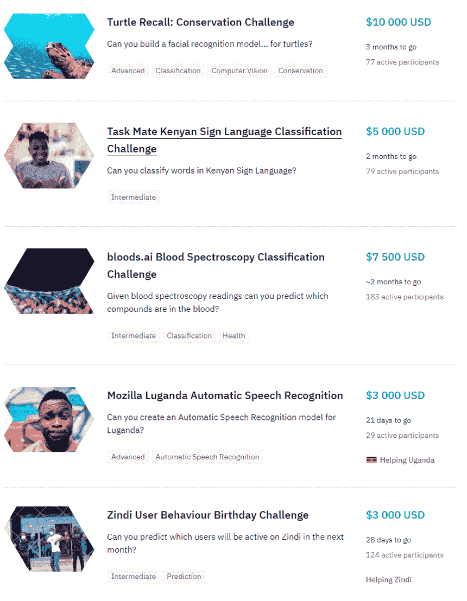
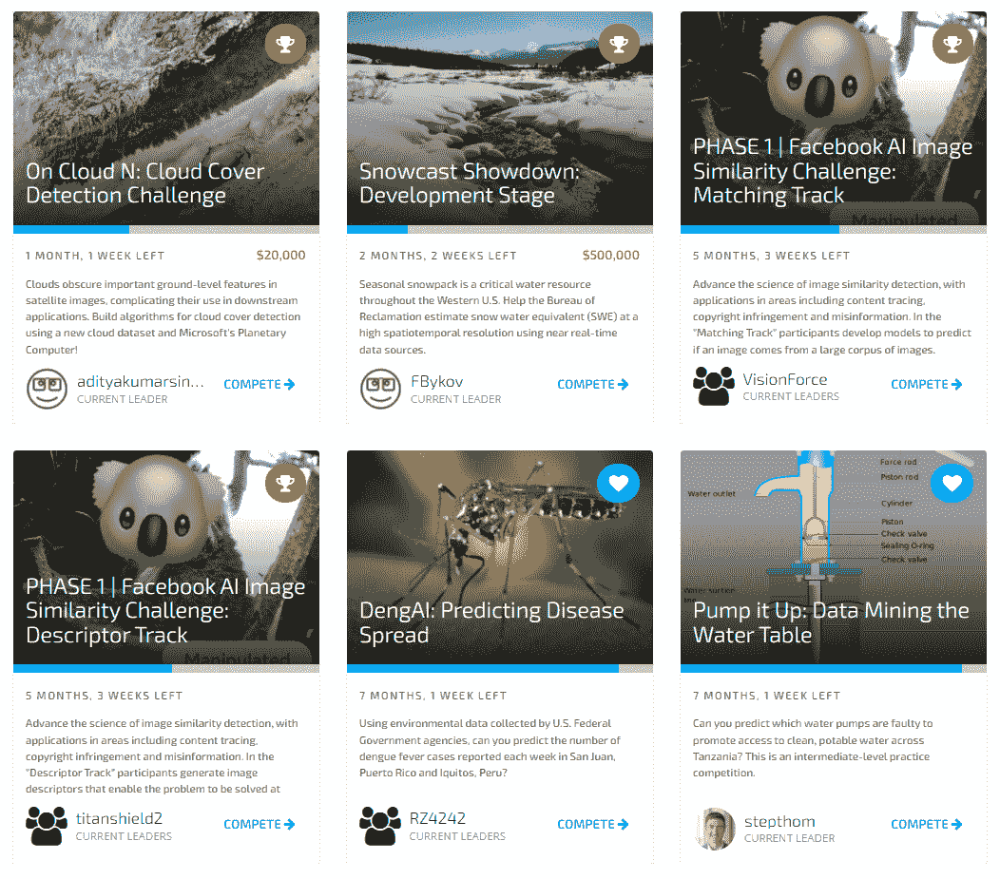
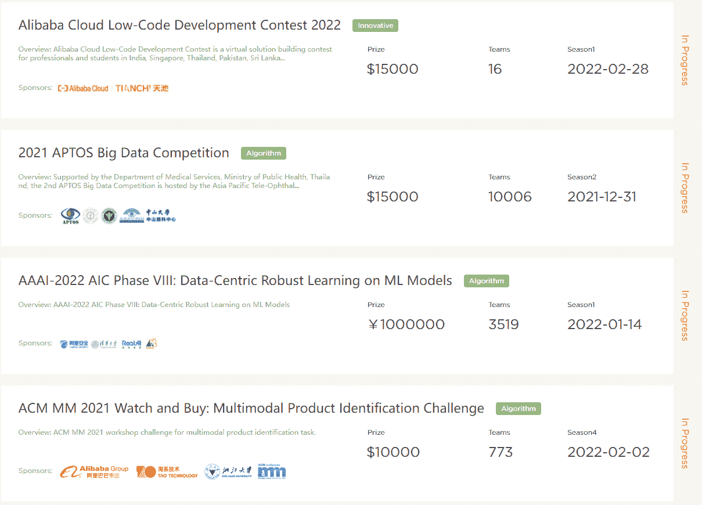
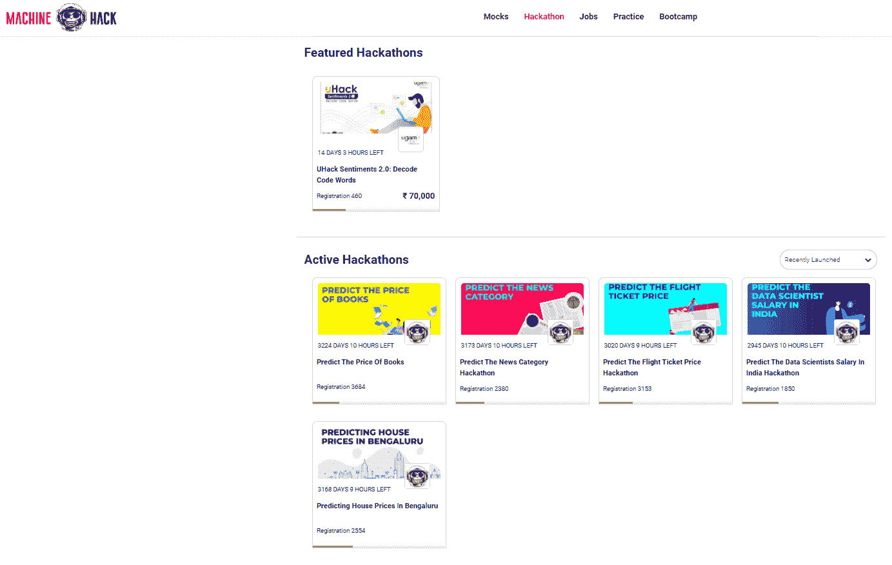

# Kaggle 之外的 4 个数据科学竞赛平台

> 原文：<https://towardsdatascience.com/4-data-science-competition-platforms-other-than-kaggle-6d1795ff46a?source=collection_archive---------15----------------------->

## 以下是一些鲜为人知的 Kaggle 替代品

赛义德·哈桑·迈赫迪摄于[佩克斯](https://www.pexels.com/photo/two-white-and-black-chess-knights-facing-each-other-on-chess-board-839428/?utm_content=attributionCopyText&utm_medium=referral&utm_source=pexels)

Kaggle 是最受欢迎的数据科学社区之一，因举办顶级机器学习竞赛和诱人的奖金池而闻名。这里有 4 个其他快速增长的社区，它们具有挑战性的机器学习问题，您可能会感兴趣。

# 津迪

截图自 Zindi

[Zindi](https://zindi.africa/competitions) 是一家社会企业，其使命是在非洲建立数据科学生态系统。因此，Zindi 的许多比赛都专注于解决非洲的问题，并涉及非洲数据集。在撰写本文时，有 5 场比赛正在进行，奖金从 3000 美元到 10，000 美元不等。与 Kaggle 类似，对上下文、问题描述、评估指标和数据都解释得很清楚。Zindi 还为每场比赛提供了一个专门的论坛，为参与者提供了一个讨论和与比赛赞助商或主办方互动的渠道。

与 Kaggle 不同，Zindi 不提供云托管的笔记本电脑，并要求参与者使用自己的计算资源来训练和评估机器学习模型。查看这篇文章，获取免费的云 GPU 计算资源。

# 数据驱动

来自数据驱动的屏幕截图

[数据驱动](https://www.drivendata.org/competitions/)旨在通过使用数据科学应对紧迫挑战来创造社会影响，因此许多比赛都与健康、气候变化、教育和保护有关。在撰写本文时，有两个奖金竞赛，奖金池分别为 20，000 美元和 500，000 美元。与 Kaggle 类似，对上下文、问题描述、评估指标和数据都解释得很清楚。还有一个论坛和排行榜。鼓励参与者在 github 或博客上分享他们的解决方案。DataDriven 没有像 Kaggle 这样的云托管笔记本电脑，因此参与者需要使用自己的计算资源来培训模型。

# 田驰

截图自田驰

[天池](https://tianchi.aliyun.com/)是阿里巴巴集团云计算子公司阿里云打造的大数据竞赛平台。在撰写本文时，有 4 个奖金池从 10，000 美元到 1，000，000 日元(约 157，000 美元)不等的竞赛正在进行。多年来，天池主办了一些与学术会议相关的重大比赛，如 CVPR 2020 和 AAAI 2022。与 Kaggle 类似，对上下文、问题描述、评估指标和数据都解释得很清楚。还有一个论坛和排行榜。虽然论坛经常充满了热烈的讨论，但许多讨论都是中文的，因此谷歌翻译可能会派上用场。

与 Kaggle 类似，天池提供的云托管笔记本，CPU 运行时间不限，GPU 运行时间有限。参与者可以选择创建私人笔记本或在公共论坛上分享他们的解决方案。

# 机器黑客

机器黑客截图

[Machine Hack](https://machinehack.com/hackathon) 是一个为数据科学和人工智能爱好者提供训练营、模拟评估、实践和黑客马拉松的社区。黑客马拉松部分举办了各种机器学习挑战，参与者可以在其中竞争。在撰写本文时，有 1 个奖金为 70，000 印度卢比(约 1000 美元)的黑客马拉松和许多其他针对初学者的实践黑客马拉松。与 Kaggle 类似，向参与者清楚地解释了上下文、数据和评估指标。排行榜用于对参与者的解决方案进行排名，还有一个供社区互动的论坛。虽然 Machine Hack 并不像 Kaggle 那样托管云笔记本，但他们允许参与者上传 Jupyter 笔记本，以便与社区共享。

# 结论

大多数提到的数据科学竞赛平台都具有与 Kaggle 类似的功能，只有云托管笔记本除外。在 Kaggle 的 4 个替代品中，只有天池提供云托管笔记本电脑。我写过一篇关于如何获得免费 GPU 计算资源的文章。

 [## 用于训练深度学习模型的免费 GPU

### 是的，你没听错。它是免费的。

towardsdatascience.com](/free-gpus-for-training-your-deep-learning-models-c1ce47863350) 

据我所知，这些平台都有活跃的比赛和奖金池。欢迎在下面的评论中推荐其他平台。