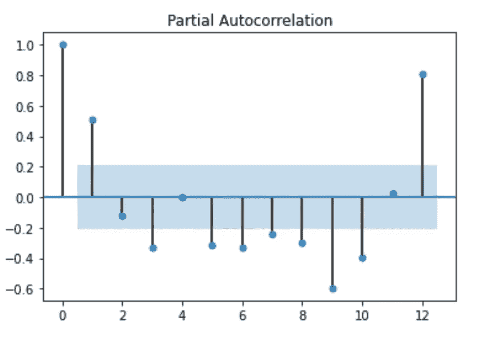
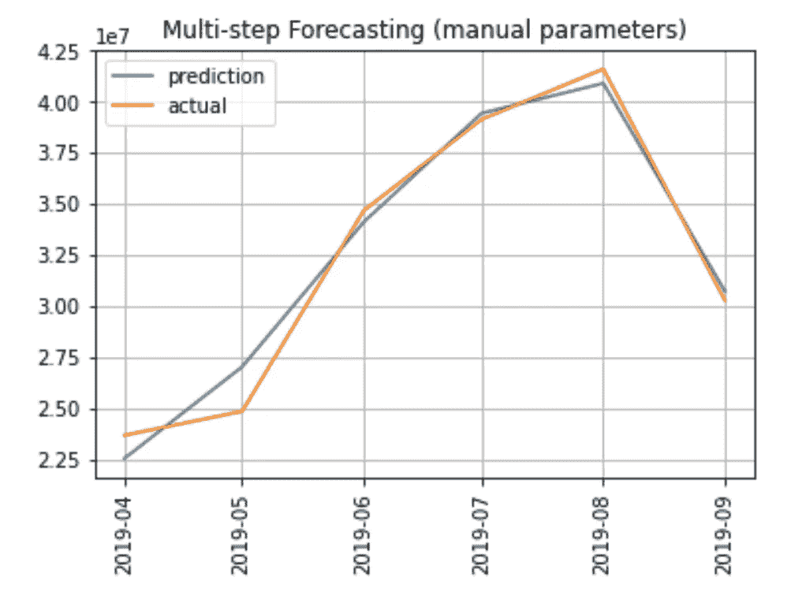

# 4 种不同的时间序列分析方法

> 原文：<https://towardsdatascience.com/4-different-approaches-for-time-series-analysis-7e2364fadcb9?source=collection_archive---------6----------------------->

## 数据分析

## 一个现成的 Python 代码，包括用于时间序列分析的不同策略和库


图片由 [Gerd Altmann](https://pixabay.com/users/geralt-9301/?utm_source=link-attribution&utm_medium=referral&utm_campaign=image&utm_content=3303560) 从 [Pixabay](https://pixabay.com/?utm_source=link-attribution&utm_medium=referral&utm_campaign=image&utm_content=3303560) 拍摄

在本教程中，我将使用以下 4 种不同的方法来说明如何分析时间序列:

*   手动设置模型参数和多步预测
*   手动设置模型参数和单步预测
*   模型参数的自动设置和多步预测
*   分解。

前三种方法利用差分使时间序列平稳。

你可以从我的 [Github 库](https://github.com/alod83/data-science/blob/master/DataAnalysis/Time%20Series%20Analysis.ipynb)下载本教程的代码。

# 数据集导入

首先，我导入了 1990 年至 2019 年意大利入境游客的相关数据集，并将其转换为时间序列。数据摘自[欧洲统计:旅游业年度数据](https://ec.europa.eu/eurostat/web/tourism/data/database)。我将数据集作为一个`pandas`数据帧加载。

```
import pandas as pddf = pd.read_csv('source/tourist_arrivals.csv')
df.head()
```


作者图片

# 构建时间序列

现在，我通过以下两个步骤将数据集转换为时间序列:

*   包含日期的列必须转换为 datetime。这可以通过函数`to_datetime()`来完成，该函数将字符串转换成日期时间。
*   将 dataframe 的索引设置为包含日期的列。这可以通过应用于数据框的功能`set_index()`来完成。

```
df['date'] = pd.to_datetime(df['date'])
df.set_index('date', inplace=True)
ts = df['value']
```

在开始分析之前，我先画出时间序列。我用的是`matplotlib`库。

```
import matplotlib.pyplot as pltplt.plot(ts)
plt.title('Number of tourists arrivals to Italy')
plt.ylabel('Number of tourists arrivals')
plt.grid()
plt.show()
```


作者图片

# 时间序列分裂

通常，在执行时间序列分析时，不会将时间序列拆分为训练集和测试集，因为要获得良好的预测，需要所有的时间序列。

但是，在本教程中，我将时间序列分为两部分——训练和测试——以便测试测试模型的性能。我把时间序列的第一部分作为训练集，第二部分作为测试集。

每个模型将在训练集上训练，并在测试集上测试。

```
ts_train = ts[:'2019-03-01']
ts_test = ts['2019-04-01':]
```

# 检查平稳性

平稳时间序列是指具有稳定/恒定统计特性的时间序列，例如一段时间内的均值和方差。

对平稳的时间序列进行长期预测是可能的。因此，我必须测试训练时间序列是否是平稳的。这可以通过增强的 Dickey-Fuller 测试来完成，由`statsmodels`包的`adfuller()`函数实现。`adfuller()`测试返回测试统计数据`adf`、`pvalue`和`critical_values`。pvalue 指定测试结果是否有意义。如果`pvalue < alpha`，则测试有意义，其中`alpha`是一个小值，例如`0.05`。

在扩展的 Dickey-Fuller 检验中，零假设是时间序列不是平稳的。如果测试统计数据`adf`大于临界值，则零假设为真。因此，我定义了一个函数，叫做`check_stationarity()`，它检查一个时间序列是否是平稳的。

```
from statsmodels.tsa.stattools import adfuller
import numpy as npdef check_stationarity(ts):
    dftest = adfuller(ts)
    adf = dftest[0]
    pvalue = dftest[1]
    critical_value = dftest[4]['5%']
    if (pvalue < 0.05) and (adf < critical_value):
        print('The series is stationary')
    else:
        print('The series is NOT stationary')
```

我用我的时间序列作为参数调用函数:

```
check_stationarity(ts_train)
```

它给出了以下输出:

```
The series is NOT stationary
```

由于时间序列不是平稳的，我转换它，通过差分一次，我再次检查平稳性。

```
ts_diff = ts_train.diff()
ts_diff.dropna(inplace=True)
check_stationarity(ts_diff)
```

它给出了以下输出:

```
The series is stationary
```

现在，时间序列是稳定的，因此我可以将训练模型的差序设置为 1。

```
d = 1
```

我画出了不同的时间序列:

```
plt.plot(ts_diff)
plt.title('Differenced Time Series')
plt.grid()
plt.show()
```


作者图片

# 1 —手动设置模型参数和多步预测

第一种方法是使用季节自回归综合移动平均(SARIMA)模型来预测到达意大利的游客数量。

SARIMA 模型需要三个参数:p、d 和 q。d 的值已经设定，因为它指定了使时间序列平稳所需的积分顺序。

在这种方法中，我尝试通过手动查看部分自相关和相关图来设置模型 p 和 q 参数。

部分自相关(PACF)用于计算 p 参数。我通过`statsmodels`函数`plot_pacf()`绘制 PACF 图。

```
from statsmodels.graphics.tsaplots import plot_acf, plot_pacf
plot_pacf(ts_diff, lags =12)
plt.show()
```



作者图片

我注意到 PACF 在置信区间外的最大值(浅蓝色)是 10。因此，我尝试`p = 10`。

```
p = 10
```

现在我绘制自相关(ACF)图来计算 q 值。

```
plot_acf(ts_diff, lags =12)
plt.show()
```


作者图片

ACF 超出置信区间的最大值是 11。然而，我试着更保守一些，我试着 q = 7。

```
q = 7
```

一旦设置了 p、q 和 d 参数，我就可以运行模型了。我利用了`statsmodels`的`SARIMAX`模型。我创建了模型，并适应了训练时间序列。

```
from statsmodels.tsa.statespace.sarimax import SARIMAXmodel = SARIMAX(ts_train, order=(p,d,q))
model_fit = model.fit()
```

我可以使用训练好的模型进行预测。我将利用模型来预测相当于测试时间序列长度的步骤数量。

```
n_test = ts_test.shape[0]
ts_pred = model_fit.forecast(steps=n_test)
```

现在我可以画出测试时间序列和预测值之间的比较。

```
plt.plot(ts_pred, label='prediction')
plt.plot(ts_test, label='actual')
plt.title('Multi-step Forecasting (manual parameters)')
plt.legend()
plt.grid()
plt.xticks(rotation=90)
plt.show()
```



作者图片

为了评估该模型，我计算了归一化均方根误差(NRMSE)指标。

```
from statsmodels.tools.eval_measures import rmse
nrmse = rmse(ts_pred, ts_test)/(np.max(ts_test)-np.min(ts_test))
nrmse
```

它给出了以下输出:

```
0.06079334505980257
```

# 2 —手动设置模型参数和单步预测

在这种情况下，我利用前面的模型进行单一预测(单一步骤)。然后，我将使用预测结果重新训练该模型，并执行另一次预测。依此类推，直到达到所需的预测数量。

```
ts_train_step = ts_train
ts_pred_step = pd.Series()
for i in range(0, n_test):
    model_step = SARIMAX(ts_train_step, order=(p,d,q))
    model_step_fit = model_step.fit()
    current_pred = model_step_fit.forecast(steps=1)
    ts_train_step = ts_train_step.append(current_pred)
    ts_pred_step = ts_pred_step.append(current_pred)
```

我计算了 NRMSE 误差。

```
nrmse = rmse(ts_pred_step, ts_test)/(np.max(ts_test)-np.min(ts_test))
nrmse
```

它给出了以下输出:

```
0.06226085324175411
```

我注意到单步模型比多步模型表现稍差。或许，单步模型更适合长期预测。

```
plt.plot(ts_test, label='actual')
plt.plot(ts_pred_step, label='prediction step')
plt.title('Single-step Forecasting (manual parameters)')
plt.legend()
plt.grid()
plt.xticks(rotation=90)
plt.show()
```


作者图片

# 3 —模型参数的自动设置和多步预测

在这种情况下，我利用`pmdarima` Python 库来自动调整 SARIMA p 和 q 参数。具体来说，我利用了`auto_arima()`函数，它接收 p 和 q 参数的测试范围以及其他有用的信息作为输入。我设置`stepwise=False`是为了测试 p 和 q 的所有可能组合。此外，我将设置`seasonal=True`使用一个萨里玛模型。

```
import pmdarima as pm
stepwise_model = pm.auto_arima(ts_train,start_p=1, d=1, start_q=1,
                            max_p=12, max_q=12,
                            m=12,
                            seasonal=True, stationary=False,
                            information_criterion='aic',
                            stepwise=False,
                            suppress_warnings=True)
stepwise_model.fit(ts_train)
```

所获得的模型具有以下参数:

```
ARIMA(order=(1, 1, 3), seasonal_order=(0, 1, 0, 12), suppress_warnings=True)
```

现在我用最好的模型进行预测。

```
ts_pred_auto = stepwise_model.predict(n_periods=n_test)
```

我绘制结果。

```
plt.plot(ts_test.index,ts_pred_auto, label='auto sarima')
plt.plot(ts_test, label='actual')
plt.title('Single-step Forecasting (automatic parameters)')
plt.grid()
plt.xticks(rotation=90)
plt.legend()
plt.show()
```


作者图片

我计算了 NRMSE 误差。

```
nrmse = rmse(ts_pred_auto, ts_test)/(np.max(ts_test)-np.min(ts_test))
nrmse
```

它给出了以下输出:

```
0.07650715589047709
```

# 4 —分解

相对于以前的方法，这种方法将时间序列分解成其主要成分，然后分别分析每个成分。

首先，我通过`statsmodels`库的`seasonal_decompose()`函数分解训练时间序列。我利用乘法分解。我获得了原始时间序列的趋势、季节性和残差。我还绘制了分解的时间序列。

```
from statsmodels.tsa.seasonal import seasonal_decomposets_decomposed = seasonal_decompose(ts_train,model='multiplicative',extrapolate_trend=True)ts_trend = ts_decomposed.trend
ts_seasonal = ts_decomposed.seasonal
ts_residual = ts_decomposed.resid
ts_decomposed.plot()
plt.show()
```


作者图片

现在我分别分析每一个组成部分。

# 趋势预测

我将建立一个基于多步预测的模型。我检查趋势时间序列是否是平稳的。

```
check_stationarity(ts_trend)
```

它给出了以下输出:

```
The series is NOT stationary
```

由于趋势时间序列不是平稳的，我尝试对其进行差分。

```
ts_trend_diff = ts_trend.diff()
ts_trend_diff.dropna(inplace=True)
check_stationarity(ts_trend_diff)
```

它给出了以下输出:

```
The series is stationary
```

现在趋势时间序列是稳定的，因此我可以设置 d = 1。

```
d = 1
```

类似地，对于自动设置参数的多步预测，我利用了`auto_arima()`函数，指定季节性为假。在这种情况下，我将使用 ARIMA 模型。

```
stepwise_model = pm.auto_arima(ts_trend,start_p=1, d=1, start_q=1,
                            max_p=12, max_q=12,
                            m=12,
                            seasonal=False, stationary=False,
                            information_criterion='aic',
                            stepwise=False,
                            suppress_warnings=True)
stepwise_model.fit(ts_trend)
```

它返回以下模型:

```
ARIMA(order=(4, 1, 1), suppress_warnings=True)
```

我使用最佳模型进行预测。

```
trend_pred_auto = stepwise_model.predict(n_periods=n_test)
```

# 季节性预测

我对季节性重复同样的程序。我检查平稳性。

```
check_stationarity(ts_seasonal)
```

它给出了以下输出:

```
The series is stationary
```

这个数列是稳定的，所以我设 d = 0。

```
d = 0
```

我将`auto_arima()`模型与`seasonal=True`一起用于 SARIMA 模型。

```
stepwise_model = pm.auto_arima(ts_seasonal,start_p=1, d=0, start_q=1,
                            max_p=12, max_q=12,
                            m=12,
                            seasonal=True, stationary=True,
                            information_criterion='aic',
                            stepwise=False,
                            suppress_warnings=True)
stepwise_model.fit(ts_seasonal)
seasonal_pred_auto = stepwise_model.predict(n_periods=n_test)
```

现在，我可以通过计算季节和趋势分量之间的乘积来合成原始时间序列。

```
ts_pred_decompose = trend_pred_auto * seasonal_pred_auto
```

我绘制结果。

```
plt.plot(ts_test.index, ts_pred_decompose, label='decompose')
plt.plot(ts_test, label='actual')
plt.title('Decomposition')
plt.grid()
plt.xticks(rotation=90)
plt.legend()
plt.show()
```


作者图片

最后，我计算了 RMSE 误差。

```
nrmse = rmse(ts_pred_decompose, ts_test)/(np.max(ts_test)-np.min(ts_test))
nrmse
```

它给出了以下输出:

```
0.08746142483666638
```

# 摘要

在本教程中，我举例说明了 4 种不同的时间序列预测方法:手动和自动设置参数的多步预测，手动设置参数的单步预测，以及分解。

就 NRMSE 而言，所有方法都有非常相似的行为。但是，在这种特定情况下，最好的模型是*手动设置模型参数和多步预测*。

如果你想了解我的研究和其他活动的最新情况，你可以在 [Twitter](https://twitter.com/alod83) 、 [Youtube](https://www.youtube.com/channel/UC4O8-FtQqGIsgDW_ytXIWOg?view_as=subscriber) 和 [Github](https://github.com/alod83) 上关注我。

# 参考

[时间序列预测:使用 Python 的基本介绍](https://medium.com/@stallonejacob/time-series-forecast-a-basic-introduction-using-python-414fcb963000)

[ARIMA 模型 Python 示例—时间序列预测](/machine-learning-part-19-time-series-and-autoregressive-integrated-moving-average-model-arima-c1005347b0d7)

[如何用 Python 检查时间序列数据是否平稳](https://machinelearningmastery.com/time-series-data-stationary-python/)

# 相关文章

</how-to-model-a-time-series-through-a-sarima-model-e7587f85929c>  </make-your-machine-learning-model-work-better-with-datetime-features-eb21de397fe8>  </how-to-spend-your-time-when-you-are-waiting-for-a-data-analysis-output-e71b383f43cb> 