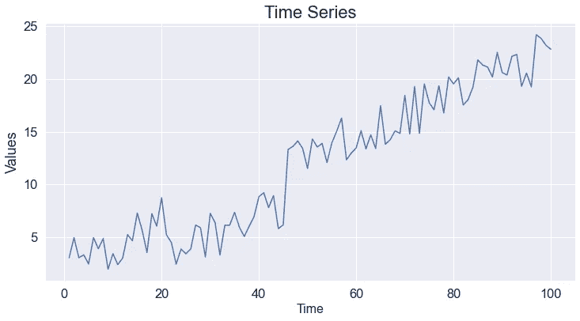

# 在 Python Seaborn 中改变字体大小的 4 种不同方法

> 原文：<https://towardsdatascience.com/4-different-methods-for-changing-the-font-size-in-python-seaborn-fd5600592242?source=collection_archive---------12----------------------->

## 数据可视化 101

照片由[尼克·费因斯](https://unsplash.com/@jannerboy62?utm_source=unsplash&utm_medium=referral&utm_content=creditCopyText)在 [Unsplash](https://unsplash.com/s/photos/four?utm_source=unsplash&utm_medium=referral&utm_content=creditCopyText) 上拍摄

数据可视化是数据科学不可或缺的一部分。我们在探索性数据分析、模型评估和交付结果中使用它们。一个准备充分的数据可视化有可能比简单的数字提供更多的信息。

Python 作为数据科学系统中的顶级编程语言，有几个数据可视化库。其中最受欢迎的是 Seaborn，它构建在 Matplotlib 之上。

与 Matplotlib 相比，Seaborn 提供了一个高级接口，这意味着语法更简单，但我们对可视化的控制更少。

在本文中，我们将关注一个特定的任务:在 Seaborn 图中改变轴标签和标题的字体大小。

我有一个熊猫数据框，有两列，分别叫做“值”和“时间”。我们将使用此数据框创建线图。

让我们从使用当前设置创建一个线图开始。

(图片由作者提供)

(图片由作者提供)

字体太小，我们几乎看不清轴标题。

## 1.设置主题功能

改变字体大小的第一种方法是使用`set_theme`功能。它会更改全局默认值，因此调整将是永久性的，直到您再次更改它们。

如果你计划在所有的图中使用相同的字体大小，那么这是一个非常实用的方法。

(图片由作者提供)

(图片由作者提供)

需要注意的是`set_theme`功能不仅仅用于改变字体大小。它允许调整图的几个属性。

## 2.轴级别函数

更改全局设置并不总是最佳选择。谢天谢地，这不是改变字体大小的唯一方法。

我们也可以使用轴级函数。除了确定特定于绘图的字体大小，我们还可以为 x 轴、y 轴和标题使用单独的字体大小。

(图片由作者提供)

(图片由作者提供)

## 3.集合 _ 轴 _ 标签函数

Seaborn 为绘制各种数据可视化提供了图形级别的接口。这些界面对相似类型的图进行分组，并允许使用相同的功能创建它们。

Seaborn 中有 3 个图形级函数，用于在 FacetGrid 上创建以下图:

图来源: [Seaborn 文档](https://seaborn.pydata.org/tutorial/function_overview.html)

如果您想了解关于这些图形级函数的更多信息，我还写了一篇文章，用几个例子详细解释了它们:

 [## 3 个 Seaborn 函数覆盖了(几乎)所有的可视化任务

### 综合实践指南

towardsdatascience.com](/3-seaborn-functions-that-cover-almost-all-your-visualization-tasks-793f76510ac3) 

在表达了对这些伟大功能的赞赏之后，让我们回到最初的话题。

在由这 3 个函数创建的图上，我们可以使用`set_axis_labels`函数改变轴标签的字体大小。

(图片由作者提供)

(图片由作者提供)

## 4.Matplotlib 函数

由于 Seaborn 是基于 Matplotlib 构建的，所以在某些情况下，我们可以利用 Matplotlib 的功能。

下面是我们如何使用 Matplotlib 函数操作轴标签和标题。

(图片由作者提供)

(图片由作者提供)

## 结论

伟大的数据可视化有两个方面。第一个是传递的信息。图表应该以一种更容易理解和推断有意义结果的方式向我们展示数据。

第二个是视觉属性。你如何演示和你演示什么一样重要。情节应该吸引人，易于阅读，不受干扰。正确设置字体大小是使你的可视化效果更吸引人的重要部分。

最后但同样重要的是，如果你还不是[中级会员](https://sonery.medium.com/membership)并打算成为其中一员，我恳请你使用以下链接。我将从你的会员费中收取一部分，不增加你的额外费用。

 [## 通过我的推荐链接加入 Medium-Soner yl DRM

### 作为一个媒体会员，你的会员费的一部分会给你阅读的作家，你可以完全接触到每一个故事…

sonery.medium.com](https://sonery.medium.com/membership) 

感谢您的阅读。如果您有任何反馈，请告诉我。