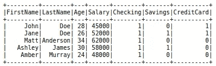
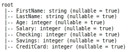
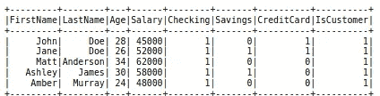
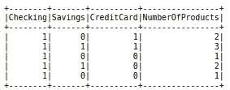
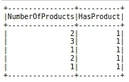
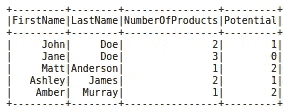

# 使用 PySpark 创建新列的 4 种不同方式

> 原文：<https://towardsdatascience.com/4-different-ways-of-creating-a-new-column-with-pyspark-1a6782fe764e?source=collection_archive---------17----------------------->

## 了解如何在 Spark 数据框中创建新列


照片由[塞巴斯蒂安·斯文森](https://unsplash.com/@sebastiansvenson?utm_source=unsplash&utm_medium=referral&utm_content=creditCopyText)在 [Unsplash](https://unsplash.com/s/photos/simple?utm_source=unsplash&utm_medium=referral&utm_content=creditCopyText) 上拍摄

我们生活在大数据时代。收集、存储和传输数据变得非常容易。随着数据量的增加，传统工具开始变得不足。

当数据太大而无法用传统的工具和技术处理时，我们应该使用 Spark 等支持分布式计算的工具和技术。

Spark 是一个用于大规模数据处理的分析引擎。它让我们能够将数据和计算分散到集群上，从而大幅提升性能。

PySpark 是 Spark 的 Python API。它结合了 Python 的简单性和 Spark 的高效性，这种合作得到了数据科学家和工程师的高度赞赏。

在本文中，我们将介绍使用 PySpark SQL 模块创建新列的 4 种方法。

第一步是导入库并创建 Spark 会话。

```
from pyspark.sql import SparkSession
from pyspark.sql import functions as Fspark = SparkSession.builder.getOrCreate()
```

我们还在模块中导入了函数，因为我们将在创建列时使用其中的一些函数。

下一步是获取一些数据。我们总是可以通过从外部文件读取数据来创建数据框。在本文中，我们将使用`createDataFrame`函数创建自己的数据框。

```
data = [
    ("John","Doe",28,45000,1,0,1),
    ("Jane","Doe",26,52000,1,1,1),
    ("Matt","Anderson",34,62000,1,0,0),
    ("Ashley","James",30,58000,1,1,0),
    ("Amber","Murray",24,48000,1,0,0)
]schema = StructType([
    StructField("FirstName",StringType(),True),
    StructField("LastName",StringType(),True),
    StructField("Age",IntegerType(),True),
    StructField("Salary", IntegerType(), True),
    StructField("Checking", IntegerType(), True),
    StructField("Savings", IntegerType(), True),
    StructField("CreditCard", IntegerType(), True)
  ])df = spark.createDataFrame(data=data, schema=schema)df.show()
```



Spark 数据框(图片由作者提供)

“支票”、“储蓄”和“信用卡”列表明客户是否拥有该产品。

schema 参数是可选的，但是最好指定方案以确保数据类型是正确的。

```
df.printSchema()
```



数据框的方案(图片由作者提供)

## 1.用常数值创建新列

`withColumn`函数可以用来创建一个新列。为了创建一个常量值，我们需要用`lit`函数指定值，而不管数据类型。

```
df = df.withColumn("IsCustomer", F.lit(1))df.show()
```



(图片由作者提供)

`withColumn`函数的第一个参数是新列的名称，第二个参数指定值。

## 2.基于其他列创建新列

我们可以通过使用另一列中的值来计算新列的值。`withColumn`功能也允许进行计算。

```
df = df.withColumn(
    "NumberOfProducts", 
     F.col("Checking") + F.col("Savings") + F.col("CreditCard")
)df.select("Checking","Savings","CreditCard","NumberOfProducts").show()
```



(图片由作者提供)

“产品数量”列是支票、储蓄和信用卡列的总和。我们需要使用`col`函数写入列名。

## 3.创建条件列

我们可以使用`when`函数根据一个或多个条件指定新列的值。

让我们创建一个指示客户是否至少有一种产品的列。如果产品数量为一个或多个，新列的值为 1。否则为 0。

```
df = df.withColumn(
    "HasProduct",
    F.when(F.col("NumberOfProducts") >= 1, 1).otherwise(0)
)df.select("NumberOfProducts", "HasProduct").show()
```



(图片由作者提供)

该条件作为`when`函数的第一个参数写入。然后，我们为符合给定条件的行指定值。为了给不同的条件指定不同的值，我们可以将`when`功能组合成一个链式操作。不符合任何给定条件的行的值被写入`otherwise`部分。

## 4.在 select 函数中创建列

`select`函数可用于从数据框中选择列。它非常类似于 SQL 的 select 语句。

我们通常在`select`函数中写入列名。我们还可以在`select`函数中进行计算来创建新的列。

```
df_new = df.select(
    "FirstName",
    "LastName",
    "NumberOfProducts",
    F.lit(3 - df.NumberOfProducts).alias("Potential")
)df_new.show()
```



(图片由作者提供)

“潜在”列显示可以向客户销售多少新产品。因此，它的计算方法是从我们产品组合中的产品总数(3)中减去客户拥有的产品数。

`alias`方法用于为派生列或计算列指定一个名称。

## 结论

我们已经介绍了使用 PySpark SQL 模块创建新列的 4 种不同方法。

需要注意的是，Spark 针对大规模数据进行了优化。因此，在处理小规模数据时，您可能看不到任何性能提升。事实上，在处理小数据集时，Pandas 可能会比 PySpark 表现得更好。

如果你想在我发表新文章时收到电子邮件，别忘了订阅。

*你可以成为* [*媒介会员*](https://sonery.medium.com/membership) *解锁我的全部写作权限，外加其余媒介。如果您使用以下链接，我将收取您的一部分会员费，无需您支付额外费用。*

[](https://sonery.medium.com/membership) [## 通过我的推荐链接加入 Medium-Soner yl DRM

### 作为一个媒体会员，你的会员费的一部分会给你阅读的作家，你可以完全接触到每一个故事…

sonery.medium.com](https://sonery.medium.com/membership) 

感谢您的阅读。如果您有任何反馈，请告诉我。