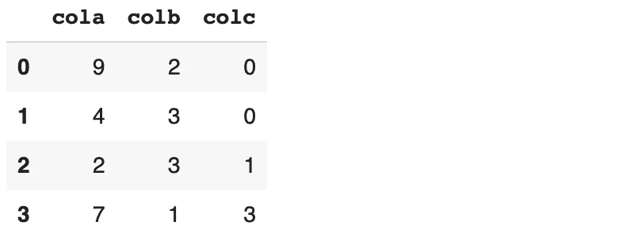
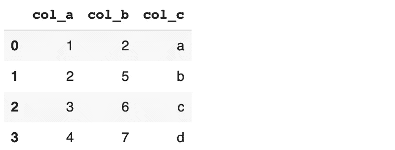
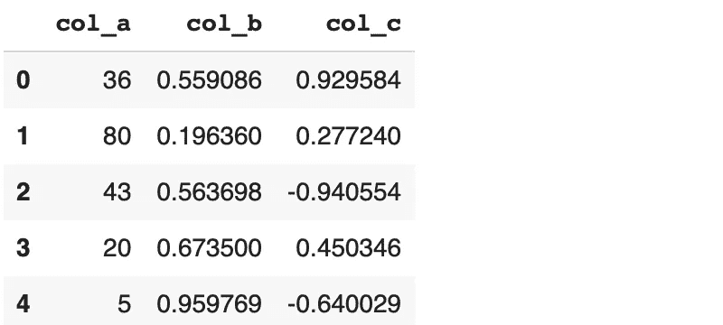

# 创建熊猫数据框架的 4 种不同方法

> 原文：<https://towardsdatascience.com/4-different-ways-to-create-a-pandas-dataframe-91bca1ff31bb?source=collection_archive---------6----------------------->

熊猫难以置信的灵活性


纳塔莉亚·塞加托在 [Unsplash](https://unsplash.com/s/photos/methods?utm_source=unsplash&utm_medium=referral&utm_content=creditCopyText) 上的照片

Pandas 是 Python 的一个数据分析和操作库。它为有效的数据分析提供了许多功能和方法。用于存储数据的核心 Pandas 对象称为 dataframe，它由带标签的行和列组成。

就创建数据框架的方式而言，Pandas 非常灵活。在本文中，我们将介绍 4 种创建数据帧的不同方法。

## 1.Csv 或 excel 文件

Csv 是最常用的文件格式之一。因此，创建数据帧的首要方法是读取 csv 文件，这在 Pandas 中是一种简单的操作。我们只需要给出 read_csv 函数的文件路径。

read_csv 函数非常通用。它有几个参数，允许在读取时修改 csv 文件。我们也可以根据列和行部分地读取文件。

read_csv 函数非常类似。我们不使用 csv，而是使用它从 excel 文件创建数据帧。

## 2.Numpy 数组

由于一个数据帧可以被认为是一个二维数据结构，我们可以使用一个二维数组来创建一个数据帧。

```
import pandas as pd
import numpy as npA = np.random.randint(10, size=(4,3))A
array([[9, 2, 0],        
       [4, 3, 0],        
       [2, 3, 1],        
       [7, 1, 3]])
```

a 是一个 4 行 3 列的二维数组。我们可以将它传递给 DataFrame 函数。

```
df = pd.DataFrame(A)df
```


(图片由作者提供)

Pandas 默认为列分配整数索引。但是，可以使用 columns 参数对其进行自定义。

```
df = pd.DataFrame(A, columns=['cola', 'colb', 'colc'])df
```



(图片由作者提供)

Numpy 可以方便地创建样本数据。我们可以用整数和浮点数创建数组，也可以用特定分布的随机变量创建数组。Numpy 还提供函数来创建用常数值填充的数组。

## 3.词典

Python 字典也常用于创建数据框。键代表列名，行用值填充。

我们来做一个简单的例子。

```
dict_a = {
   'col_a':[1,2,3,4], 
   'col_b': [2,5,6,7], 
   'col_c':['a','b','c','d']
}df = pd.DataFrame(dict_a)df
```



(图片由作者提供)

我们还可以将 numpy 数组指定为字典值，这样就可以用这种方法创建更多的函数数据帧。

```
dict_a = {
   'col_a': np.random.randint(100, size=500),
   'col_b': np.random.random(500),
   'col_c': np.random.randn(500)
}df = pd.DataFrame(dict_a)print(df.shape)
(500, 3)df.head()
```



(图片由作者提供)

## 4.目录

List 是 Python 中内置的数据结构。它表示为方括号中的数据点集合。列表可用于存储任何数据类型或不同数据类型的混合。

从列表中创建数据帧是没有意义的。然而，我们可以使用嵌套列表(例如列表列表)来创建数据帧。

让我们首先创建一个列表列表。

```
lst_a = [['John', 23, 182, 'A'], ['Jane', 25, 179, 'A'], ['Mary', 21, 177, 'B']]
```

变量 lst_a 包含 3 个项目，每个项目是 4 个项目的列表。我们可以将 lst_a 传递给 dataframe 函数。

```
df = pd.DataFrame(lst_a)df
```


(图片由作者提供)

嵌套列表的第一项构成第一列，第二项构成第二列，依此类推。与使用字典不同，从嵌套列表创建的 dataframe 具有整数列标签。我们可以使用 columns 参数来自定义列标签。

```
df = pd.DataFrame(lst_a, columns=['Name', 'Age', 'Height', 'Grade'])df
```


(图片由作者提供)

就像列表一样，我们可以从元组创建数据帧。元组是由逗号分隔并包含在括号中的值的集合。与列表不同，元组是不可变的。不变性可以被认为是元组的识别特征。

## 结论

您可能并不总是需要创建自己的数据框架，但是知道如何创建数据框架是有好处的。你可以用它来练习或实现一个解决方案。通过使用 Python 内置的数据结构和 Numpy 数组，您可以创建高度定制的数据帧。

感谢您的阅读。如果您有任何反馈，请告诉我。