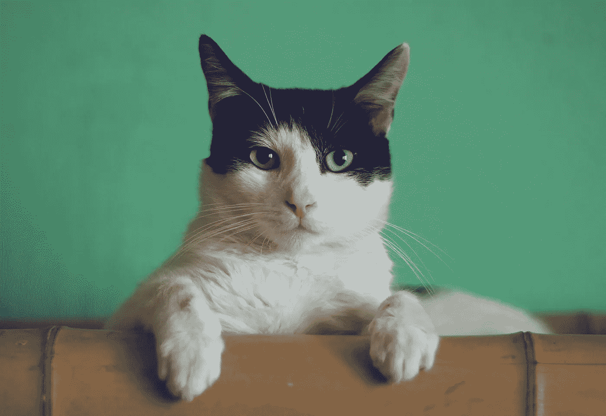

# 实施 CatBoost 的 4 个简单步骤

> 原文：<https://towardsdatascience.com/4-easy-steps-for-implementing-catboost-c196fd82274b?source=collection_archive---------14----------------------->

## 关于如何应用新兴数据科学算法的端到端教程



在[Unsplash](https://unsplash.com/s/photos/cat?utm_source=unsplash&utm_medium=referral&utm_content=creditCopyText)【1】上由 [Manja Vitolic](https://unsplash.com/@madhatterzone?utm_source=unsplash&utm_medium=referral&utm_content=creditCopyText) 拍摄的照片。

# 目录

1.  介绍
2.  安装和导入
3.  定义数据集
4.  应用模型
5.  预测
6.  摘要
7.  参考

# 介绍

[CatBoost](https://catboost.ai/)【2】在以 logloss 为误差度量的基准数据集上击败了许多其他流行的机器学习算法。它主要击败了 LightGBM 和 XGBoost，这两个工具最近不仅成为了数据科学竞赛的标准，也成为了专业设置的标准。现在是学习这个强大的库的时候了，下面是你如何通过四个简单的步骤来实现它。

# 安装和进口

本教程将使用流行的数据科学工具，如 Python 和 Jupyter Notebook。首先，我们将从三个简单的安装命令开始，然后转移到您的第一个基本 CatBoost 回归模型所需的所有必要导入，正如您将看到的，这可能是您的第一个也是最后一个，因为这就是 CatBoost 在没有太多调整或额外代码的情况下是多么令人印象深刻。

> 以下是主要的安装命令:

```
!pip install catboost!pip install ipywidgets!jupyter nbextension enable  — py widgetsnbextension
```

> 以下是主要的导入命令:

```
from catboost import CatBoostRegressorfrom sklearn.model_selection import train_test_splitimport numpy as npimport pandas as pd
```

如您所见，安装和导入只需要几行代码。我们还将导入其他常用的库，如 numpy、pandas 和 sklearn。接下来，我们将讨论数据集过程。

# 定义数据集


Christopher Gower 在[Unsplash](https://unsplash.com/s/photos/computer?utm_source=unsplash&utm_medium=referral&utm_content=creditCopyText)【3】上拍摄的照片。

有几种方法可以导入数据集，但我最常用的方法是用 pandas 导入 CSV 文件。你将建立你的 x 属性和你的 y 变量，你试图预测的变量。对于训练和测试分割，您可以按照 75:25 的常见方式隔离数据集。这种随机状态是为了让你在未来或与他人合作时能够复制同样的分裂。

> 以下是定义命令的主要数据集:

```
dataframe = pd.read_csv('file_path_to_your_dataset.csv')X = dataframe[['X_feature_1', 'X_feature_2', etc.,]]y = dataframe['target_variable']X_train, X_test, y_train, y_test = train_test_split(X, y, train_size=0.75, random_state=42)
```

# 应用模型

当应用 CatBoost 模型时，它的工作方式类似于其他 sklearn 方法。然而，最重要的部分是指定您的分类变量，这样您就可以从 CatBoost 模型中获得最大收益。此外，CatBoost 有一些很棒的图形，可以可视化迭代过程中的错误度量改进，所以如果您想直观地看到训练集和测试集随着时间的推移是如何比较的，将图形设置为`True`是一个很好的方法。我还为回归模型添加了一个常见的`loss function`和`RMSE`的`evaluation metric`。默认的`n_estimators`是 100，这是一个很好的起点，如果你看到模型在最后一轮仍在改进，那么你可以增加迭代的次数。

> 以下是主要的模型命令:

```
CAT_FEATURES = [] #list of your categorical features# set up the model
catboost_model = CatBoostRegressor(n_estimators=100,
                                   loss_function = 'RMSE',
                                   eval_metric = 'RMSE',
                                   cat_features = CAT_FEATURES)# fit model
catboost_model.fit(X_train, y_trian, 
                   eval_set = (X_test, y_test),
                   use_best_model = True,
                   plot = True)
```

# 预测

也许最简单也是最有收获的一步是看你的预测。您可以使用 predict 方法的一些其他有用的方式是，通过将两个索引都设置为`true`的内部连接将原始数据帧与您的预测合并，以便您可以看到导致这些预测的特征。这个命令也遵循大多数数据科学家习惯的典型 sklearn 方法。

> 下面是主要的预测命令:

```
# get your predictions
preds = catboost_model.predict(X_test)
```

# 摘要


照片由 [krakenimages](https://unsplash.com/@krakenimages?utm_source=unsplash&utm_medium=referral&utm_content=creditCopyText) 在[Unsplash](https://unsplash.com/s/photos/success?utm_source=unsplash&utm_medium=referral&utm_content=creditCopyText)【4】上拍摄。

我希望你喜欢这个关于 CatBoost 的简短教程。这真的是一个强大的机器学习算法和库，任何人都可以实现。它的设计使得参数调整通常是不必要的，默认参数是最好的。此外，还有其他重要的可视化工具可供您使用，它们是由流行的 SHAP 库制作的。本文的目的是向您介绍 CatBoost，接下来您所需要的就是这段代码和您的数据集，以开始进行您的第一次模型预测。

> 以下是所有步骤的总结:

```
* Installation and Imports* Define Dataset* Apply Model* Predict
```

我希望你觉得我的文章既有趣又有用！如果您以前使用过 CatBoost，请在下面随意评论。这对你现在的数据科学事业有帮助吗？你同意还是不同意，为什么？

请随时查看我的个人资料和其他文章，也可以通过 LinkedIn 联系我。我与这些提到的公司没有关系。

感谢您的阅读！

# 参考

[1]照片由 [Manja Vitolic](https://unsplash.com/@madhatterzone?utm_source=unsplash&utm_medium=referral&utm_content=creditCopyText) 在[Unsplash](https://unsplash.com/s/photos/cat?utm_source=unsplash&utm_medium=referral&utm_content=creditCopyText)(2018)上拍摄

[2] Yandex， [CatBoost](https://catboost.ai/) ，(2021)

[3]Christopher Gower 在 [Unsplash](https://unsplash.com/s/photos/computer?utm_source=unsplash&utm_medium=referral&utm_content=creditCopyText) 上拍摄的照片，(2017)

[4]照片由 [krakenimages](https://unsplash.com/@krakenimages?utm_source=unsplash&utm_medium=referral&utm_content=creditCopyText) 在[Unsplash](https://unsplash.com/s/photos/success?utm_source=unsplash&utm_medium=referral&utm_content=creditCopyText)(2020)上拍摄