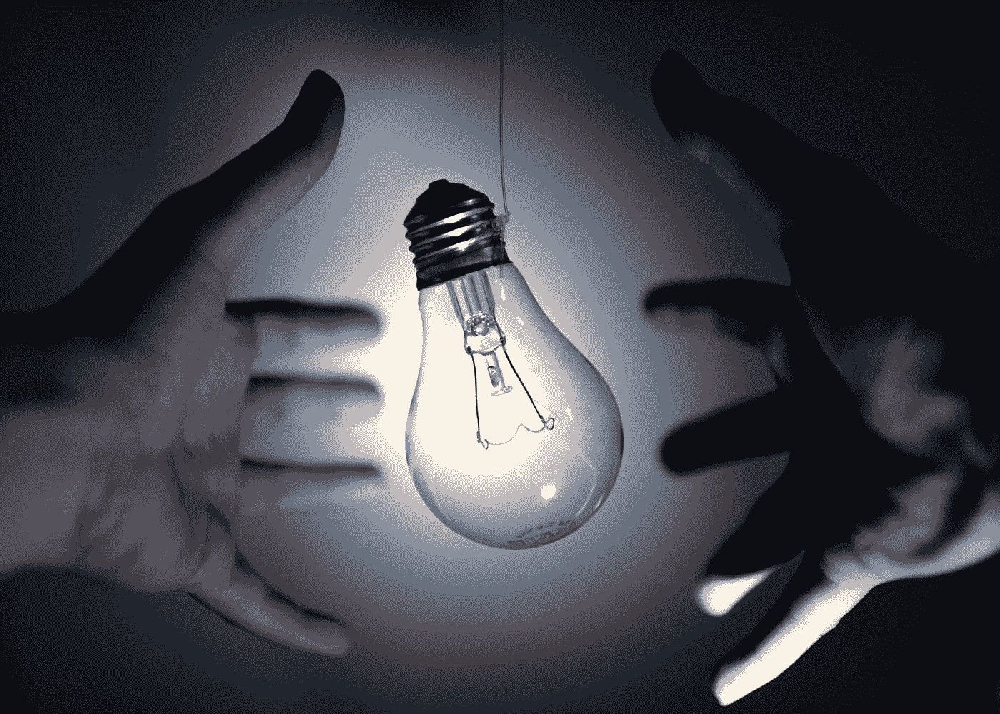

# 我参加了 4 门免费课程来学习数据科学的 Python

> 原文：<https://towardsdatascience.com/4-free-courses-i-took-to-learn-python-for-data-science-bcbcc7825476?source=collection_archive---------3----------------------->

## 我选了 10 多门课程后，选择了初级和高级免费课程。

Jana Leu 在 [Unsplash](https://unsplash.com?utm_source=medium&utm_medium=referral) 上的照片

在为一门课程付费之前，最好先查看一下网上发布了什么——有大量高质量的免费内容。这是我刚开始学数据科学 Python 的时候做的。我查看了付费数据科学课程的课程表，然后搜索了所有与 Python 相关的内容。

在选修了 10 多门课程后，我选择了我所学的最好的 4 门免费课程来学习数据科学的 Python。这 4 门课程涵盖了我在“[学习数据科学 Python 的 4 个阶段](/the-4-stages-of-learning-python-for-data-science-3333d0c5e204)”(尤其是第 1、2 和 4 阶段)中提到的大部分内容

虽然在完成这些课程后，你不会得到一个很好的证书，但你将获得的知识是无价的。

# 学习 Python——初学者的完整课程

这个 [4 小时的 Python 初学者课程](https://www.youtube.com/watch?v=rfscVS0vtbw)涵盖了你在学习数据科学中使用的库之前需要学习的所有 Python 基础知识。这是一门 Python 速成课程——当我学习这门课程时，我对编程一无所知。课程将向你展示如何设置 Python，教你如何打印你的第一个“Hello World”，并解释 Python 中的所有核心概念。

**请不要跳过 Python 的基础知识，直接跳到数据科学的基础知识**。请记住，Python 是一种编程语言，不仅在数据科学中有应用，而且在许多领域中都有应用。一些 Python for Data Science 课程可能会跳过将来可能会派上用场的核心 Python 概念。

本课程涵盖的一些数据科学中经常使用的主题包括:

*   变量和数据类型
*   列表、字典、元组、嵌套列表
*   函数、返回语句、If 语句
*   For 循环，While 循环，嵌套循环
*   尝试/除了，读写文件
*   Python 解释器、模块、Pip 类
*   对象，对象函数，继承

除此之外，还有实践练习，你可以将学到的所有概念付诸实践。您将构建一个基本的计算器、猜测姓名、翻译器和一个多项选择测验。最重要的是，讲师拥有丰富的 Python 知识、清晰的解释和引人入胜的交付。

# Python 用于数据分析课程

[这个更像是一个播放列表](https://www.youtube.com/playlist?list=PLFCB5Dp81iNVmuoGIqcT5oF4K-7kTI5vp)而不是一道菜；然而，你会在这个列表中找到比其他付费课程更有用的讲座。

[这个播放列表中的前 8 个视频](https://www.youtube.com/playlist?list=PLFCB5Dp81iNVmuoGIqcT5oF4K-7kTI5vp)使得**成为一个 10 小时的完整长度的数据分析课程**。它从数据科学家用来建立数据集的最流行的数据收集技术开始——网络搜集([在这里你可以找到其他很棒的网络搜集课程](https://medium.com/geekculture/4-free-and-paid-web-scraping-courses-every-data-scientist-should-take-956562ac68dc))。然后会学习 Pandas、Numpy、Matplotlib、Scikit-learn 等数据分析库。最重要的是，播放列表包括一些很酷的项目，可以帮助你获得实践经验。所有这些都是在 Jupyter 笔记本上进行的，这是数据科学家的首选计算笔记本。

本课程中用来教授前面提到的库的一些数据集是:

*   [口袋妖怪数据集](https://www.kaggle.com/abcsds/pokemon)
*   [国际足联 20 数据集](https://www.kaggle.com/stefanoleone992/fifa-20-complete-player-dataset)
*   [亚马逊产品评论数据集](http://jmcauley.ucsd.edu/data/amazon/)
*   销售数据

所以如果你想享受分析口袋妖怪和国际足联数据集的乐趣，或者使用产品评论建立机器学习模型，可以考虑观看这个播放列表。

我看了播放列表的前 8 个视频，这帮助我为 Python 数据分析打下了坚实的基础。

# Python 的自然语言处理(NLP)课程

这是一个简短而有用的 [2 小时 NLP 课程](https://www.youtube.com/watch?v=xvqsFTUsOmc)任何对自然语言处理领域感兴趣的人都应该观看。NLP 是人工智能的一个分支，允许机器理解人类语言。数据科学家使用 NLP 技术来解释文本数据进行分析。

本 NLP 简介涵盖以下主题:

*   预处理技术(标记化、文本规范化和数据清理)
*   机器学习技术(主题建模、单词嵌入和文本生成)
*   用于 NLP 的 Python 库(NLTK、TextBlob、spaCy 和 gensim)

我特别喜欢这个短期课程，因为它非常有吸引力，包括垃圾邮件分类和推文情感分析等很酷的练习。当然，要做到这一切，您至少需要对 Pandas 和 Scikit-learn 等数据分析库有一个基本的了解。

# 机器学习和人工智能与 Tensorflow 2.0 课程

[这是一门 7 小时的 Tensorflow 课程](https://www.youtube.com/watch?v=tPYj3fFJGjk)，专为希望用 TensorFlow 学习机器学习(ML)和人工智能(AI)的 Python 程序员设计。TensorFlow 是在 Python 上使用机器学习的最佳库之一。它使机器学习模型的建立对初学者和专业人士来说都很容易。

在本课程中，您会发现 8 个模块涵盖了 ML & AI 中的基础主题。仅举几个例子:

*   核心学习算法
*   张量流神经网络
*   深度计算机视觉—卷积神经网络
*   基于 RNNs 的自然语言处理
*   Q 学习的强化学习

我喜欢这门课，因为授课老师有很好的机器学习和人工智能知识，讲解也很清晰。此外，该课程非常吸引人，包含有价值的信息和编码示例。所有这些都使得学习 TensowFlow 变得更加容易。

我目前正在学习这门免费课程，到目前为止我已经学到了很多新东西，我希望在未来的项目中应用它们。

就是这样！希望这 4 门课程能帮助你提高数据科学的 Python 知识，就像它们帮助我一样！

[**与 3k 以上的人一起加入我的电子邮件列表，获取我在所有教程中使用的 Python for Data Science 备忘单(免费 PDF)**](https://frankandrade.ck.page/bd063ff2d3)

如果你喜欢阅读这样的故事，并想支持我成为一名作家，可以考虑报名成为一名媒体成员。每月 5 美元，你可以无限制地阅读媒体上的故事。如果你使用[我的链接](https://frank-andrade.medium.com/membership)注册，我会赚一小笔佣金。

<https://frank-andrade.medium.com/membership> 