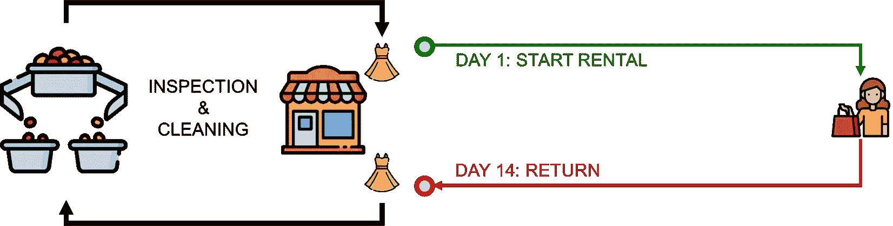
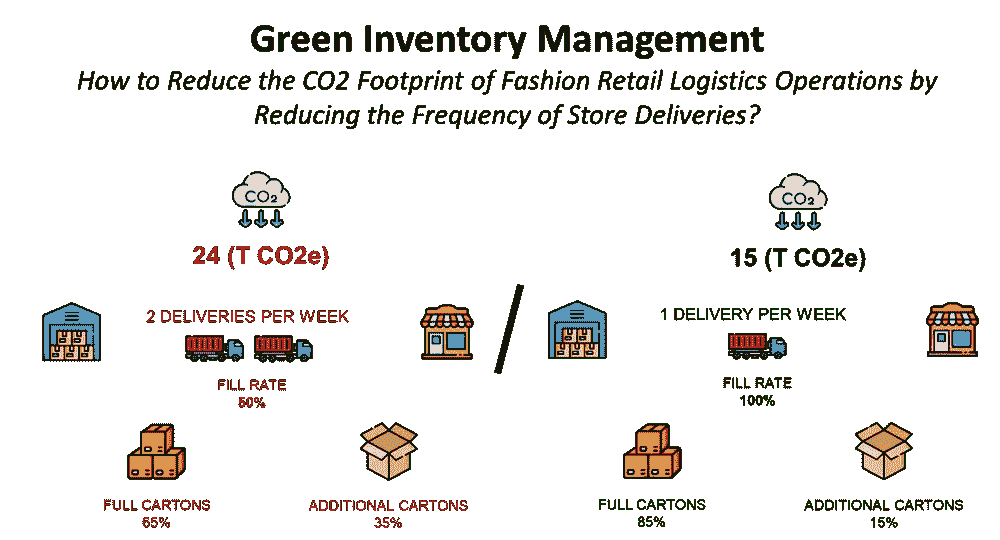

# 4 个具有影响力的项目，开启您的供应链数据科学之旅

> 原文：<https://towardsdatascience.com/4-impacting-projects-to-start-your-data-science-for-supply-chain-journey-fe068e503c29?source=collection_archive---------4----------------------->

## 来自实际运营案例研究的项目列表，可用于培养您在数据科学方面的技能，并快速影响您的组织

凯尔·瑞恩在 [Unsplash](https://unsplash.com/collections/4302506/supply-chain?utm_source=unsplash&utm_medium=referral&utm_content=creditCopyText) 上的照片

作为一名数据科学家，如果你想让数据在你的组织中发挥作用，那就为大规模运营做出贡献，并看到你的模型被用来实施具体的解决方案:**供应链是开始你的数据科学之旅的最佳人选。**

我已经在[供应链部门工作了 7 年多](https://www.samirsaci.com/about/)，重点关注仓储和运输业务。

作为一名供应链解决方案设计师，我的工作是将客户的需求转化为实际运营**(零售、电子商务、奢侈品、快速消费品、汽车)**，进行**再造**研究以改善[仓库运营](https://www.youtube.com/watch?v=OdLeRR4rvt0&list=PLvINVddGUMQWRel1u0RIBbKIYRUQBdrt9)和[优化运输网络](https://www.youtube.com/watch?v=ddthuvFQdGY&list=PLvINVddGUMQXkAtacSSmUavDoRFQbmvAW)。

所有这些项目的共同点是我通过使用数据科学工具获得的杠杆作用，让我能够[了解货物流动](https://www.youtube.com/watch?v=ssdni_n6HDc&t=8s)，有能力[模拟成千上万的场景](https://www.youtube.com/watch?v=YNvOX3CT3hQ)，并建立模型来预测未来。

我在这篇文章里分享，你可以通过下面的详细教程找到 **14** 重大案例分析 ***(编辑:我加了额外的例子)*** 可以应用到你的操作中。

对于每个例子，我都将源代码与虚拟数据共享，这样您就可以将模型应用到自己的项目中。

> 给学生的建议你可以使用这些例子中的任何一个作为建立你的文件夹的基础。
> M5·卡格尔竞赛可以作为您构建解决方案的交易数据来源，以满足实际运营需求。

💌新文章直接免费放入您的收件箱:[时事通讯](https://www.samirsaci.com/#/portal/signup)

# 一.什么是供应链分析？

**目标:**使用 python 进行数据分析，在战略和运营层面实现数据驱动的诊断和决策，从而提高运营效率。

供应链可以被定义为以满足客户需求为最终目标的多方物流、信息流或资金流的交换。

信息和货物的流动—(图片由作者提供)

由于信息扮演着重要的角色，供应链分析已经成为组织用来从与价值链中包括的所有流程相关的数据中获得洞察力的方法和工具。

在这个视频中，你将发现 Python 不同类型的**供应链分析**，并了解它们对端到端运营的**效率**的影响，这样你就可以开始你的项目了。

# 二。你的循环经济有多可持续？

**适用范围:** [供应链可持续性](https://www.samirsaci.com/tag/sustainability/)

**关键技能**:库存管理、生命周期分析、[二氧化碳排放量](https://www.youtube.com/watch?v=ddthuvFQdGY)计算、供应链描述性分析(数据处理、可视化和 KPI 创建)

**问题陈述**:

**循环经济**是一种旨在最大限度减少浪费和最大限度提高资源效率的经济模式。

它包括设计注重寿命、重复使用和回收的产品和工艺。

(图片由作者提供)

一些公司已经实施了一种**订阅模式**，在这种模式下，客户支付一定的费用就可以在特定的时间段内获得产品或服务。

**目标:**使用数据分析模拟循环订阅模式的几种情况对一家快速时尚零售商的减排和用水的影响。

<https://www.samirsaci.com/how-sustainable-is-your-circular-economy/>  

# 三。绿色库存管理

绿色库存管理—(图片由作者提供)

**范围:** [供应链可持续性](https://www.samirsaci.com/tag/sustainability/)

**关键技能**:库存管理、[二氧化碳排放量](https://www.youtube.com/watch?v=ddthuvFQdGY)计算、供应链描述性分析(数据处理、可视化和 KPI 创建)

**问题陈述**:

绿色库存管理可以定义为以环境可持续的方式管理库存。

对于分销网络而言，这可能涉及一系列旨在减少订单传输、准备和交付的环境影响的流程和规则。

(图片由作者提供)

> 如果我们降低商场补货的频率，会对二氧化碳排放量产生什么影响？

**目的:**利用数据分析模拟商店补货频率的变化，衡量对整体环境影响的影响。

<https://www.samirsaci.com/green-inventory-management-case-study/>  

# 四。生产固定范围计划

生产计划—(图片由作者提供)

**适用范围:** [制造业](https://www.samirsaci.com/tag/supply-chain-optimization/)

**问题陈述**:**主生产计划**是商业团队和生产之间的主要沟通工具。

您的客户发送**采购订单**和具体**数量**在**特定时间**交货。

订单示例—(图片由作者提供)

生产计划用于**通过在**最小化库存**和**最大化**根据**设置**生产的**数量**之间找到平衡来最小化生产的总成本**。

**目标:**在本文中，我们将通过 python 使用 **Wagner-Whitin 方法**实现最优生产计划。

<https://www.samirsaci.com/production-fixed-horizon-planning-with-python/>  

# 动词 （verb 的缩写）供应链可持续性报告

演示短片—(视频由作者提供)

**范围:** [供应链可持续性](https://www.samirsaci.com/tag/sustainability/)

**问题陈述:**多年来，投资者和客户对可持续发展透明度的需求不断增长。

投资者在评估组织的价值和弹性时，越来越重视企业的可持续性。

因此，越来越多的组织**投入资源建设可持续发展报告能力**并确定可持续供应链的**最佳战略**。

**目标:**在本文中，我们将介绍一种简单的方法，使用 **Python 和 PowerBI 来**报告您的分销网络**的二氧化碳排放量。**

<https://www.samirsaci.com/supply-chain-sustainability-reporting-with-python/>  

# 不及物动词供应链网络优化

供应链网络问题—(图片由作者提供)

**适用范围:** [供应链优化](https://www.samirsaci.com/tag/supply-chain-optimization/)

**问题陈述:**供应链优化充分利用数据分析，找到**工厂**和**配送中心**的最佳组合，以满足您客户**的**需求**。**

在市场上的很多软件和解决方案中，背后的核心结构都是线性规划模型。

这些模型中的一些找到了正确的工厂分配，以满足需求并最小化成本，假设需求不变。

> 如果需求波动，会发生什么？

你的网络可能会失去健壮性，尤其是当你的需求季节性很强的时候(电子商务、化妆品、快时尚)。

**目标:**在本文中，我们将使用 Python 的蒙特卡罗模拟，构建一个简单的方法来设计一个健壮的供应链网络。

<https://www.samirsaci.com/robust-supply-chain-networks-with-monte-carlo-simulation/>  

# 七。零售预测的机器学习

用于零售销售预测的机器学习的特征工程—(图片由作者提供)

**范围:** [需求预测](https://www.samirsaci.com/tag/inventory-management/)

**问题陈述:**基于上一届 Makridakis 预测比赛的反馈，与基准统计模型相比，机器学习模型可以将预测误差降低 **20%至 60%。** ( [M5 竞赛](https://www.researchgate.net/publication/344487258_The_M5_Accuracy_competition_Results_findings_and_conclusions))

它们的主要优势是能够包含外部特征，这些特征会严重影响销售的可变性。

例如，电子商务化妆品销售是由**特殊事件** *【促销】*和你**如何在网站上做广告引用** *(第一页、第二页……)*来驱动的。

这个被称为**特性工程**的过程是基于**分析概念**和**商业洞察力**来理解什么可以推动你的销售。

**目标:**在本文中，我们将使用 **M5 预测竞赛数据集**来尝试**了解几个特征对模型准确性的影响**。

<https://www.samirsaci.com/machine-learning-for-retail-sales-forecasting-features-engineering/>  

# 八。仓库拣货生产率

三种不同提货路线的示例—(图片由作者提供)

**范围:** [仓库操作](https://www.samirsaci.com/tag/warehousing/)

**问题陈述:**在**配送中心(DC)，**在拣货路线中从一个地点到另一个地点的步行时间可占操作员工作时间的 *60%到 70%* 。

**目标:**您如何利用数据科学通过减少步行距离来提高[仓库操作员的生产力](https://www.youtube.com/watch?v=KR_ziEiPcDk)？

我写过一系列文章，解释如何使用订单分批、空间聚类和寻路算法来提高拣选效率。

**概念&使用的库:**

*   使用 Python 的 **Pandas，Numpy** 创建订单批
*   使用 **Python 的 Scipy** 对提货地点进行空间聚类
*   使用 **Google 或**为拣选路线设计寻路

**结果**:你的[操作员采摘生产率](https://www.youtube.com/watch?v=KR_ziEiPcDk)的提高将导致成本降低

**链接到文章**

<https://www.samirsaci.com/improve-warehouse-productivity-using-order-batching-with-python/>  <https://www.samirsaci.com/improve-warehouse-productivity-using-spatial-clustering-with-python/>  <https://www.samirsaci.com/improve-warehouse-productivity-using-pathfinding-algorithm-with-python/>  

# 九。资源计划和调度

短视频演示—(作者提供的视频)

**范围:** [仓库操作](https://www.samirsaci.com/tag/warehousing/)

**问题陈述:**在保证留住员工的同时，你需要雇佣多少临时工来消化你每周的工作量？

**目标:**按照你的经理确定的[生产率目标](https://www.youtube.com/watch?v=KR_ziEiPcDk)，你必须最大限度地减少为处理工作量而雇佣的工人数量。

我写过一篇中型文章，讲的是如何使用**线性规划**找到合适的雇佣工人数量。

**概念&使用的库:**

*   用 Python 的纸浆进行线性编程

**结果**:计算满足所有约束条件的最小工人数。

<https://www.samirsaci.com/optimize-workforce-planning-using-linear-programming-with-python/>  

# X.运输路线优化

短视频讲解—(视频由作者提供)

**范围:** [运输作业](https://www.samirsaci.com/tag/transportation/)

**问题陈述:**如何组织送货路线和卡车装载来降低你的成本？

**目标:**对您的[运输计划](https://www.youtube.com/watch?v=lhDBTlsGDVc)进行可视化和成本核算，以优化装载率并降低每吨运输成本。

不同路线的可视化(1 种颜色= 1 条路线)——(图片由作者提供)

我写了一篇关于如何处理数据和准备可视化的中型文章，以影响每吨交付的平均成本。

**概念&使用的库:**

*   使用 Numpy、Pandas 进行数据处理，使用 Matplotlib 进行可视化([链接](/road-transportation-optimization-with-python-part-1-visualisation-costing-698eadcdce0b))

**结果**:使用更大卡车和更高装载率的优化运输计划。

<https://www.samirsaci.com/road-transportation-network-visualization/>  

# XI。精益六适马与 Python-Kruskal Wallis 测试

短视频讲解—(视频由作者提供)

**范围:** [仓库操作](https://www.samirsaci.com/tag/warehousing/)

**精益六适马(LSS)** 是一种基于循序渐进方法的方法，遵循 5 个步骤(**定义、衡量、分析、改进和控制)。**

作为一家标志性奢侈品牌的**配送中心(DC)** 的**持续改进经理**，你希望使用这种方法来提高特定流程的生产率。

**问题**
培训对操作人员的生产力有正面影响吗？

**假设**
培训对 [VAS 操作员的生产力有积极影响](https://youtube.com/shorts/BUVT18F5cJo)。

**实验** 随机选择操作者，测量每批时间*(以秒为单位完成一批 30 个标签的时间)*构建 **56 条记录的样本**。

**目标:**在本文中，我们将探讨 **Python** 如何在**分析**步骤中取代 **Minitab** 来测试**假设**和**了解**什么可以改进特定流程的**性能指标**。

<https://www.samirsaci.com/lean-six-sigma-with-python-kruskal-wallis-test/>  

# 十二。使用 Flask + D3.js 的交互式仪表板

一个简单而有趣的可视化比一个非常复杂的模型更有影响力，特别是对于非技术型的观众。

因此，培养可视化技能是供应链数据科学家工作的重要组成部分。

显示奢侈品牌在线销售的仪表盘的最终效果图—(图片由作者提供)

**范围** : [可视化&报告](https://www.samirsaci.com/tag/visualization/)

我写过一篇中型文章，讲述在没有 javascript 先验知识的情况下，如何使用 D3.js 设计花哨的可视化(或者很轻)。

**概念&使用的库:**

*   使用 Numpy、Pandas、Flask 和 D3.js ( [链接](https://medium.com/nerd-for-tech/interactive-dashboard-of-luxury-brands-online-sales-using-flask-and-d3-js-90cabb4d7ab9?source=friends_link&sk=c9d87813f95d8defc6b8f6088a377a58))进行数据处理

**结果**:一个动态的仪表板，可以与用户交互以展示商业洞察力。

<https://www.samirsaci.com/build-interactive-charts-using-flask-and-d3-js/>  

# 十三。零售业的库存管理——随机需求

需求随机的库存管理—(图片由作者提供)

**适用范围:** [库存管理](https://www.samirsaci.com/tag/inventory-management/)

**问题陈述:**对于大多数零售商来说，库存管理系统采用固定的、基于规则的方法来进行预测和补货订单管理。

考虑到需求的分布，目标是建立一个补货策略，使您的订购、持有和短缺成本最小化。

在之前的文章([链接](/inventory-management-for-retail-deterministic-demand-311682c02518))中，我们构建了一个模拟模型**，假设了一个确定性的恒定需求** *(单位/天)*。

**目标:**在本文中，我们将介绍**一种简单的方法，使用用 Python 构建的离散模拟** **模型**来测试**几种库存管理规则**，假设客户需求呈正态分布。

<https://www.samirsaci.com/inventory-management-for-retail-stochastic-demand-2/>  

# 十四。基于图论的交通网络分析

基于网络图的交通网络优化

**适用范围:** [道路运输](https://www.samirsaci.com/tag/transportation/)

**目标**:构建支持 [FTL 路由优化](https://www.youtube.com/watch?v=PYkN24PMKd8)的视觉效果

**问题陈述:**对于零售商来说，运送到商店的道路运输是**物流成本**的主要部分。

公司经常进行**路线规划优化研究**以降低这些成本并提高他们网络的效率。

它需要**持续改进工程师**和管理日常运营的**运输团队**之间的协作。

**目的:**在本文中，我们将使用**图论**来设计运输网络的**可视化表示**以**支持这种协作**并促进**解决方案设计**。

<https://www.samirsaci.com/transportation-network-analysis-with-graph-theory/>  

# 结论

这些示例可以使用您自己的数据集直接应用到您的运营中，以快速提供将影响您的组织的见解。欢迎在评论区提问。

你可以在 Medium 上关注我，获取更多与供应链优化数据科学相关的文章。

# 关于我

让我们在 [Linkedin](https://www.linkedin.com/in/samir-saci/) 和 [Twitter](https://twitter.com/Samir_Saci_) 上连线，我是一名[供应链工程师](https://www.samirsaci.com/about/)，正在使用数据分析来改善物流运营并降低成本。

如果你对数据分析和供应链感兴趣，可以看看我的网站

<https://samirsaci.com>  

# 参考

[0] [萨米尔萨奇](https://medium.com/u/bb0f26d52754?source=post_page-----fe068e503c29--------------------------------)，我的 Github 作品集，[链接](https://www.samirsaci.com/)