# 4 学习机器学习的互动工具

> 原文：<https://towardsdatascience.com/4-interactive-tools-to-learn-machine-learning-eedfdfb4005e?source=collection_archive---------37----------------------->

## 这些互动工具会帮助你理解机器学习

约翰·施诺布里奇在 [Unsplash](https://unsplash.com?utm_source=medium&utm_medium=referral) 上的照片

作为数据科学家，我们需要机器学习来理解和应用我们的日常工作。要知道的知识不仅限于从库中导入代码，而是扩展到模型概念、算法选择、度量标准等等。

为了帮助学习机器学习概念，我将在本文中概述我的四个交互式工具，您可以使用它们来学习。让我们开始吧！

# 1.假设工具

[假设工具](https://pair-code.github.io/what-if-tool/)是一个基于网络和笔记本的可视化工具，用来理解机器学习行为是如何工作的。假设工具的开发是为了理解我们的训练模型背后的复杂性，并对假设情况进行实验。

假设工具是一个交互式工具，意味着我们可以通过图形用户界面来实时观察变化。让我给你看下面 GIF 中的例子。

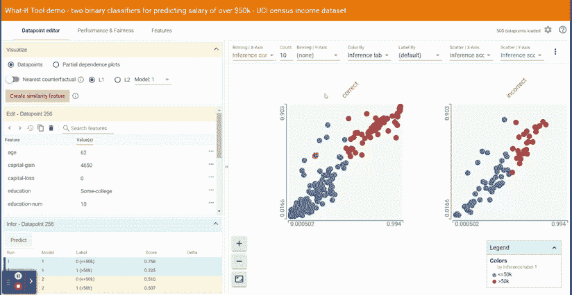

作者 GIF

这似乎是一个令人兴奋的工具，对不对？上面的 GIF 显示了我们可以用来理解我们训练过的机器学习模型的所有选项卡。在这个例子中，我们将机器学习模型用于在[输入 UCI 数据](https://pair-code.github.io/what-if-tool/demos/uci.html)上训练的二元分类模型。我们可以在两个训练好的模型上对这些数据进行比较和实验，所以让我们分解每个选项卡，以便更好地了解函数对模型做了什么。

作者图片

开始时，我们有三个选项卡；数据点编辑器、性能和公平性以及功能，其中每个选项卡从不同方面可视化机器学习模型:

*   数据点编辑器:每个数据点的可视化探索
*   性能和公平性:使用各种度量标准进行模型性能探索
*   特征:用于模型训练的特征摘要

让我们仔细看看每个选项卡中的可用性。

**数据点编辑器**

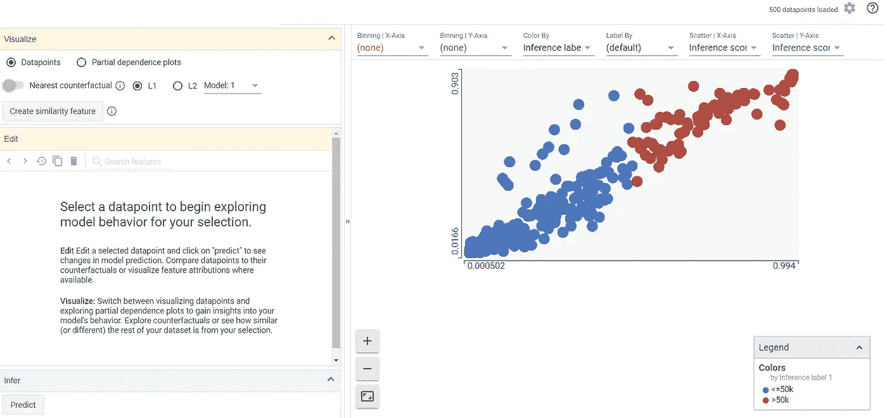

作者图片

数据点编辑器是一个选项卡，我们可以在其中根据模型探索每个数据点预测。该选项卡可以选择每个数据点来研究模型行为。让我们试着选择其中一个数据点。

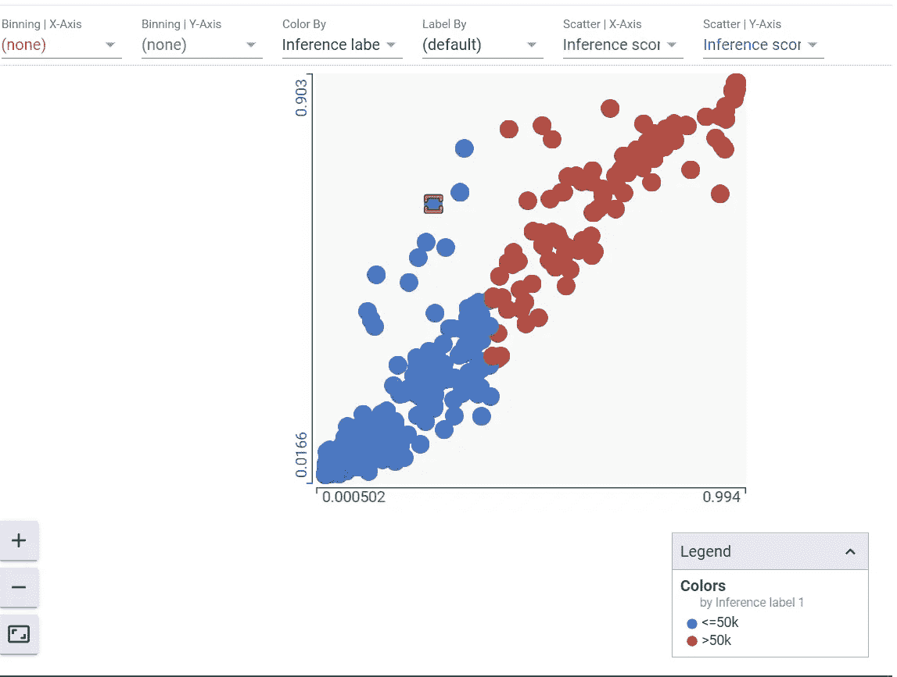

作者图片

在数据点选择中，顶部允许您选择轴、标签和宁滨——如果您想了解特定信息，这很有用。默认情况下，X 轴和 Y 轴除以模型得分输出(在模型 1 和 2 之间)。

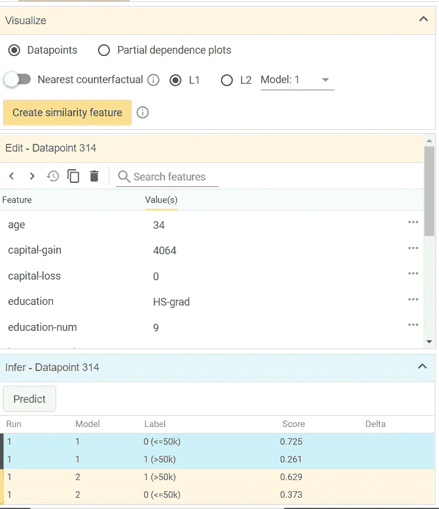

作者图片

当您选择了数据点后，您将获得类似于上图的信息。在这一节中，我们带来了关于数据点的特征和每个标签的模型比较分数的所有信息。

**性能和公平性**

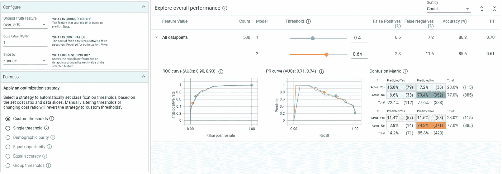

作者图片

在“性能和公平性”选项卡中，您可以尝试各种阈值、基本事实、成本比率和更多，以了解当我们更改某些方面时，您的机器学习模型的结果。

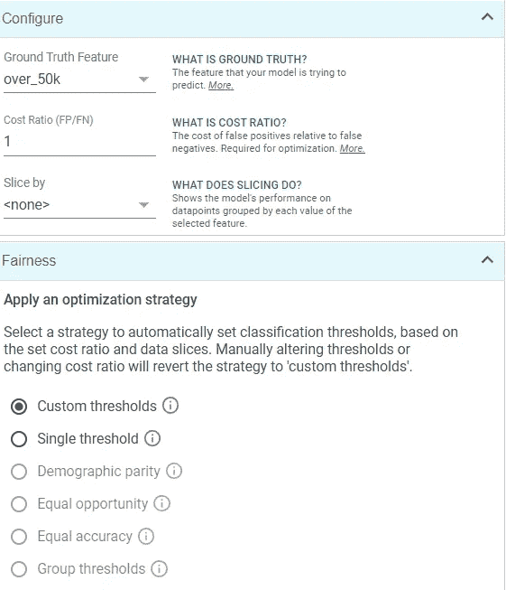

作者图片

您可以在左边部分更改您的假设，例如预测特性和优化策略。

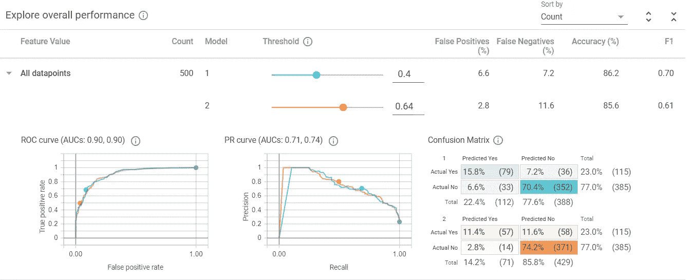

作者图片

在右边部分，您可以试验每个模型的阈值，看看对性能的影响。这些变化是实时发生的，所以您需要的决定使用哪个模型以及您的模型是否满足您的要求的信息可以被快速评估。

**特色**

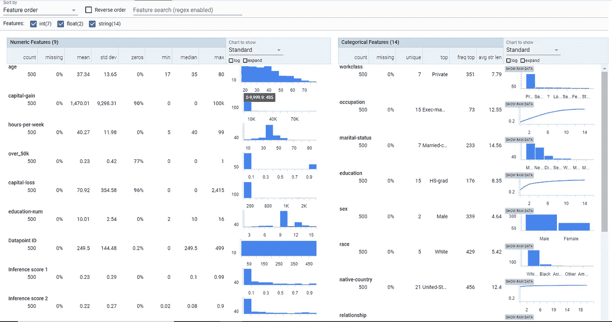

作者图片

“功能”选项卡是获取模型训练中使用的每个功能的汇总统计信息的部分。您需要的所有基本统计数据都是可用的——均值、中值、标准差等等。此外，特征被分成数字和分类标签，以便更容易学习。

如果你想了解更多笔记本环境下的假设工具，你可以点击访问教程[。](https://pair-code.github.io/what-if-tool/explore/#notebook)

# 2.深操场

[Deep Playground](http://playground.tensorflow.org/) 项目是一个交互式的基于网络的神经网络，供人们学习。web 对于任何初学者来说都足够简单，可以理解神经网络是如何工作的。

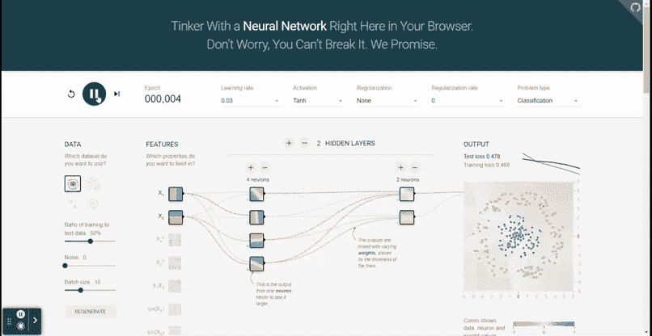

作者 GIF

上面的 GIF 总结了整个交互过程；你可以修改顶部的超参数——学习率、激活、正则化、速率和问题类型。

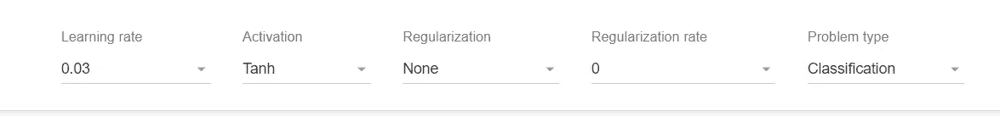

作者图片

Deep Playground 只有四种数据集可以使用，但它代表了机器学习项目中的常见问题。在这一部分，您还可以试验测试数据比率、噪声和批量大小。

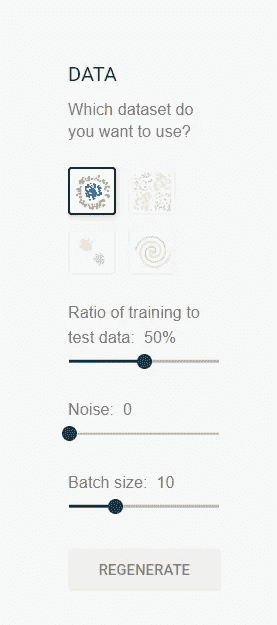

作者图片

接下来，您可以选择如何处理您的功能以及您希望的转换类型。此外，您可以添加或减少隐藏层和每个隐藏层的神经元。完成实验设置后，您只需按下 play 并查看输出，即可了解神经网络如何与您的设置配合工作。

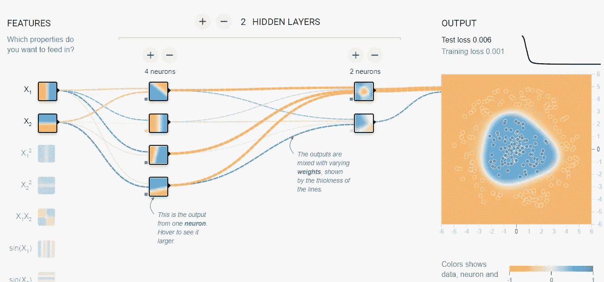

作者图片

Deep Playground 是一个开源项目；如果你想投稿或者对源代码感兴趣，你可以访问 GitHub 页面。

# 3.西蒙·沃德·琼斯的概率分布

机器学习完全是关于我们模型的概率输出，学习概率分布将有助于我们理解我们的模型是如何工作的。有时候，如果没有清晰的可视化，很难理解概率分布是如何工作的——这就是为什么我推荐 Simon-Ward Jones 的[概率分布帖子来帮助你学习。](https://www.simonwardjones.co.uk/posts/probability_distributions/)

作者 GIF

本帖给你一个对以下概率分布的可视化实验:

*   二项分布
*   二项分布
*   正态分布
*   贝塔分布
*   对数正态分布

帖子详细描述了每个分布中的概率密度函数，以及如果我们改变参数值会发生什么。我建议您尝试一下发行版中的变化，因为这有助于您更快地理解这个概念。

# 4.嵌入式投影仪

当使用机器学习模型训练时，非结构化数据比结构化数据更难理解。理解它的一种方法是使用无监督算法(如 PCA 或 t-SNE)将数据嵌入或表示为数学向量。[来自 TensorFlow 的嵌入投影仪](https://projector.tensorflow.org/)为我们提供了一个交互式可视化工具，帮助我们理解嵌入层。

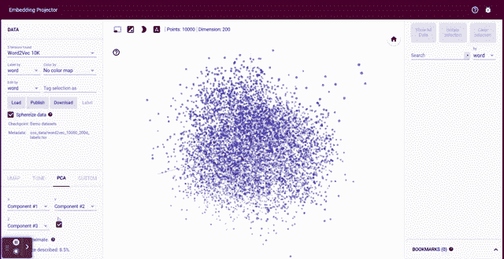

作者 GIF

正如你在上面的 GIF 中看到的，我们使用 Word2Vec 提供的数据集来了解每个单词是如何表示的，以及它们在低维特征中彼此有多接近。

在左侧部分有来自 NLP 数据、图像数据或表格数据的五个数据集。您可以使用一些算法来嵌入数据集，如 UMAP、T-SENE、PCA 或 Custom。最后，您可以在底部选择想要可视化的组件。

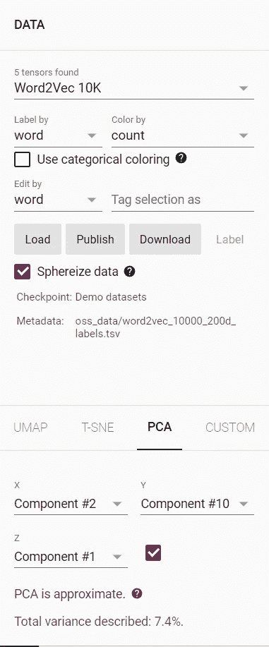

作者图片

在右侧，我们可以选择如何通过显示所有数据点或隔离数据点来可视化我们的数据。隔离与您想要选择的邻居号码相关，并且决定将基于您选择的距离度量。如果你要选择一个特定的单词，你可以使用搜索栏。

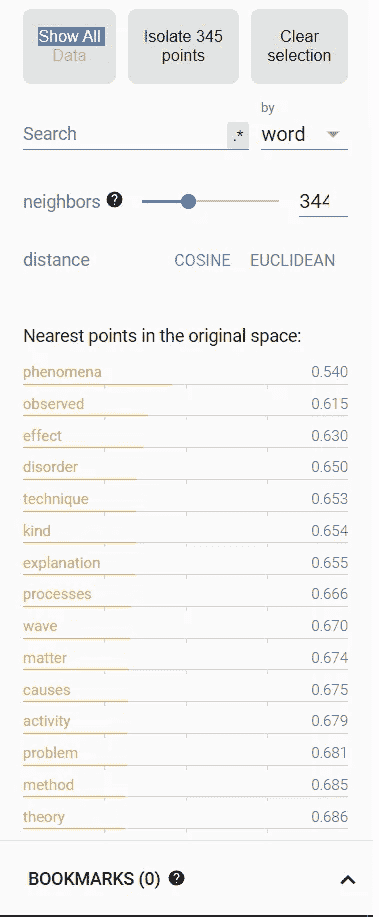

作者图片

如果你想了解更多关于嵌入式投影仪的信息，你可以在这里访问文档[。](https://www.tensorflow.org/get_started/embedding_viz)

# **结论**

理解机器学习概念很难，尤其是没有清晰的可视化。为了帮助你学习，我想概述四个交互工具，帮助你理解机器学习；它们是:

1.  假设工具
2.  深操场
3.  概率分布
4.  嵌入式投影仪

希望有帮助！

在我的 [**LinkedIn**](https://www.linkedin.com/in/cornellius-yudha-wijaya/) 或 [**Twitter**](https://twitter.com/CornelliusYW) 上访问我。

> *如果您喜欢我的内容，并希望获得更多关于数据或数据科学家日常生活的深入知识，请考虑在此订阅我的* ***简讯。***

> *如果您没有订阅为中等会员，请考虑通过* [*我的推荐*](https://cornelliusyudhawijaya.medium.com/membership) *订阅。*