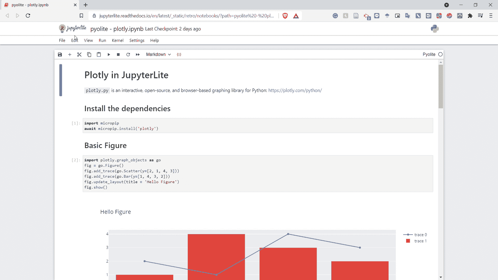

# 数据科学家的 4 款 Jupyter 笔记本替代产品

> 原文：<https://towardsdatascience.com/4-jupyter-notebook-alternative-for-data-scientist-da3d47ff40b0?source=collection_archive---------3----------------------->

## 出于多种原因，您可能希望使用替代方案。


作者图片

> 如果您喜欢我的内容，并希望获得更多关于数据或数据科学家日常生活的深入知识，请考虑在此订阅我的[简讯。](https://cornellius.substack.com/welcome)

作为现代数据科学家，编程是我们必须掌握的主要工具。虽然，不像软件开发人员或工程师，我们利用编程语言进行数据分析，而不是软件开发。这就是为什么我们数据科学家被教导在工作中使用数据分析 IDE。

[**Jupyter**](https://jupyter.org/)**Notebook**是许多数据科学家开始的主要环境，因为它最容易理解并与 [**Anaconda**](https://www.anaconda.com/) 环境(许多人用它来建立数据科学平台)集成。然而，一旦你理解了 Jupyter 笔记本的工作原理，我想介绍几个 Jupyter 笔记本的替代品。

以下是我为数据科学家准备的四款 Jupyter 笔记本替代品。让我们开始吧。

# 1.Visual Studio 代码

[**Visual Studio Code**](https://code.visualstudio.com/)或 VS Code 是一个免费的开源 IDE，专为程序员无缝运行和执行他们的代码而设计。VS 代码是通用的，因为它们包括许多可定制的扩展、代码调试和用于版本控制的 GIT 集成。

过去，VS Code 更适合开发人员或工程师，因为它没有任何数据分析能力，但自 2020 年以来，VS Code 团队与 Jupyter 团队合作，在 VS Code 中引入了一个[集成笔记本](https://github.com/microsoft/vscode-jupyter/wiki/Native-Notebook-Support-in-VS-Code)。结果是一个惊人的 IDE 工作簿，您可以使用它进行数据分析。让我在下图中展示一下 VS 代码笔记本集成是如何工作的。


作者图片

正如您在上面的图像中所看到的，您正在左侧运行您的代码(它看起来像 Jupyter 笔记本中的一个单元格)，结果显示在右侧。让我们试着更详细地剖析这个过程是如何工作的。


作者图片

首先，为了初始化笔记本单元格，你需要在你想要运行的代码上方的**上键入`**# %%**`，作为一个类似于 Jupyter 笔记本的单元格。当您这样做时，VS 代码会自动理解您打算启动笔记本并显示单元格选项。当您想要运行单元格时，您可以使用快捷键 shift + enter 来运行它。**

当您运行单元代码时，它会自动在交互式笔记本中运行—例如；我运行下面的代码。


作者图片

在上图中，我加载了一个 mpg 数据集，并显示了数据集的头部(前 5 行)。在笔记本中，它的处理类似于下图。


作者图片

能力是有的，但是为什么我们要用 VS Code notebook 而不是 Jupyter Notebook 呢？我可以给你几个理由:

1.  如果你有开发背景，VS 代码会让你感觉很熟悉，
2.  VS 代码与 GIT 版本控制集成在一起，当您想查看旧代码时，
3.  代码调试存在于 VS 代码中，不像在 Jupyter Notebook 中。

我能想到的原因还有很多，但最终还是会回到你的偏好上。

# 2.互动

什么是[**互动**](https://nteract.io/) ？它是一个开源的交互式环境，设计用于端到端的数据分析工作流，包括一个用于数据探索、构建应用程序、版本控制等的笔记本。在我看来，nteract 的主要卖点是**交互**部分，UI 允许你控制笔记本结果，并将其作为应用程序呈现。

nteract 环境包含一个桌面应用程序，您可以在这里下载，内核会自动集成到您的 Anaconda 环境中。因此，当您已经安装了 nteract 时，您可以打开您的笔记本，而无需启动 Jupyter 笔记本或前往 Jupyter 实验室。例如，我会给你看我的旧笔记本和文件夹。


作者图片

从上面的图片中，您可以看到 ipynb 文件现在默认情况下可以使用 nteract 打开。让我们看看你打开后是什么样的。


作者图片

nteract IDE 如上图所示。nteract 环境类似于 Jupyter 笔记本，但在单元格放置方面有更多的控制，并集成为一个应用程序。下面我们来看看下面 GIF 中 nteract 的用法。


作者 GIF

您还可以使用各种 nteract 库来提高工作效率，例如:

*   [Papermill](https://github.com/nteract/papermill) 用于笔记本参数化，可以自动将您的笔记本结果保存到云环境中。
*   [剪贴簿](https://github.com/nteract/scrapbook)用来保存你笔记本上的所有数据和图像，基本上就是“报废”它，
*   [书店](https://github.com/nteract/bookstore)用于版本控制。

# 3.橄榄石

Jupyterlite **是一款基于浏览器的 Jupyter 笔记本**由 Jupyter 开发者非正式开发。它利用了 Jupyter Lab 和 Jupyter Notebook 的许多功能，可以在浏览器中直接使用。开发仍在进行中，所以预计许多变化和附加功能将被添加，但我们可以检查 Jupyterlite 环境。

您可以使用 [Jupyter Lab style](https://jupyterlite.readthedocs.io/en/latest/try/lab) 或 [Retro Lab Style](https://jupyterlite.readthedocs.io/en/latest/try/retro) (经典 Jupyter 笔记本)中的演示来尝试 Jupyterlite 浏览器。无论哪种方式，基本环境已经包含了一些功能，例如:

*   预装可视化软件包，如 altair、plotly 和 matplotlib
*   基于浏览器的笔记本交互，用于托管、保存和导出笔记本
*   Jupyterlite [CLI](https://jupyterlab.readthedocs.io/en/stable/user/code_console.html)

让我们试着用 Jupyterlite 提供的 [plotly 笔记本演示](https://jupyterlite.readthedocs.io/en/latest/_static/retro/notebooks/?path=pyolite%20-%20plotly.ipynb)来检验一下 Jupyterlite 的基本用法。



作者 GIF

从上面的 GIF 中，我们可以看到环境仍然类似于 Jupyter 笔记本，但它似乎更基础。不过，UI 的交互性稍强一些——可以像 nteract 一样移动单元格。

如果您想在自己的环境中构建 Jupyterlite，可以通过安装 Jupyterlite 来实现。

```
python -m pip install --pre jupyterlite
```

当您完成软件包的安装后，您需要运行以下代码。

```
jupyter lite init
jupyter lite build
jupyter lite serve
```

完成了。现在您已经在本地构建了 Jupyterlite，并且可以从您的浏览器访问它。然而，就像我之前提到的那样，Jupyterlite 仍在开发中，所以我预计未来会有很多事情发生变化。

# 4.谷歌联合实验室

[**谷歌合作实验室**](https://colab.research.google.com/) **或 Colab** 是由谷歌团队开发的基于浏览器的笔记本电脑。笔记本环境是基于 Jupyter 笔记本环境的，所以对于已经在使用 Jupyter 的人来说会感觉很熟悉。笔记本如下图所示。


作者图片

从上图可以看出，环境类似于 Jupyter 笔记本。那么，我们为什么要用 Google Colab 呢？我可以给你几个理由:

*   它非常适合任何无法接触到高性能硬件/GPU 的人。因为 Colab 托管在云中，并为您提供免费的 GPU，所以您可以分析内部不可能的更大的数据集——特别是如果您仍处于学习阶段，
*   易于与 Google 数据库集成，如 Google Sheet、Google Drive 或 Google BigQuery，
*   可以用于特定目的的即时代码片段。例如，从网络摄像头拍摄或创建堆叠图表。


作者图片

Google Colab 非常适合那些仍在学习或密切使用 Google 环境的人，因为它是通过 Google 服务集成开发的。

如果你想了解更多关于 Google Colab 的知识，建议你去看看他们的[笔记本教程](https://colab.research.google.com/notebooks/intro.ipynb#scrollTo=-Rh3-Vt9Nev9)。本教程提供了所有基本的 Google Colab 用例，以及如何使用 TensorFlow 开发自己的神经网络。

# **结论**

数据人员广泛使用 Jupyter 笔记本，因为它易于使用，而且是专门为数据分析开发的。但是，随着您对 Jupyter 笔记本越来越熟悉，您可能需要检查另一种替代方案。

在本文中，我向您介绍了四种可供选择的 Jupyter 笔记本电脑。它们是:

1.  **Visual Studio 代码**
2.  **互动**
3.  **橄榄石**
4.  **谷歌 Colab**

希望有帮助！

在我的[**LinkedIn**](https://www.linkedin.com/in/cornellius-yudha-wijaya/)**或 [**Twitter**](https://twitter.com/CornelliusYW) **上访问我。****

> **如果您没有订阅为中等会员，请考虑通过[我的推荐](https://cornelliusyudhawijaya.medium.com/membership)订阅。**