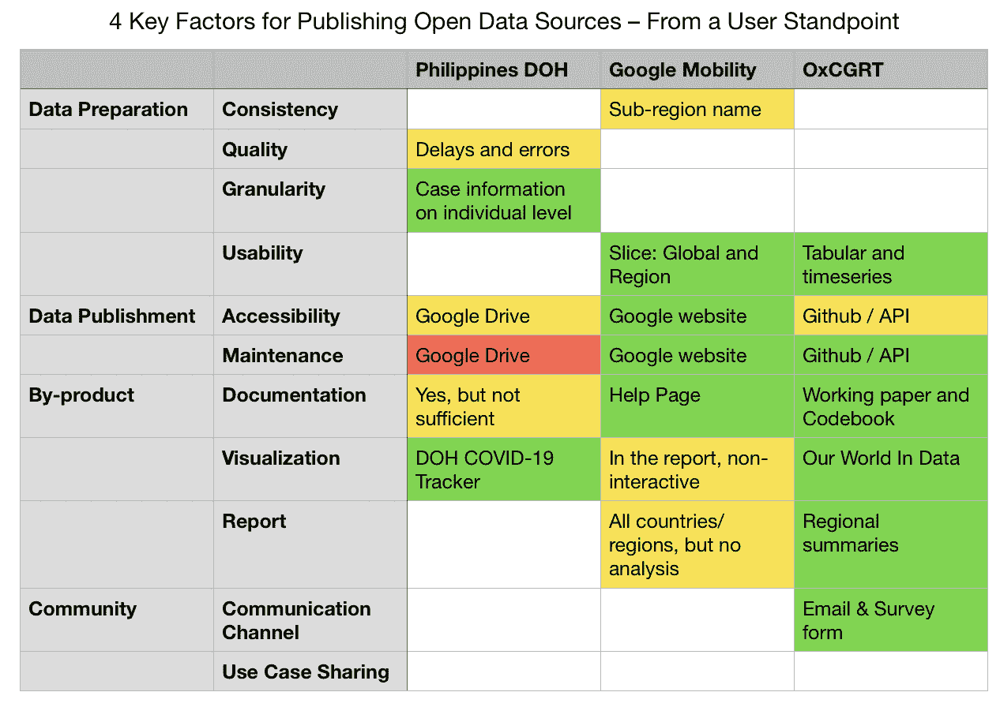
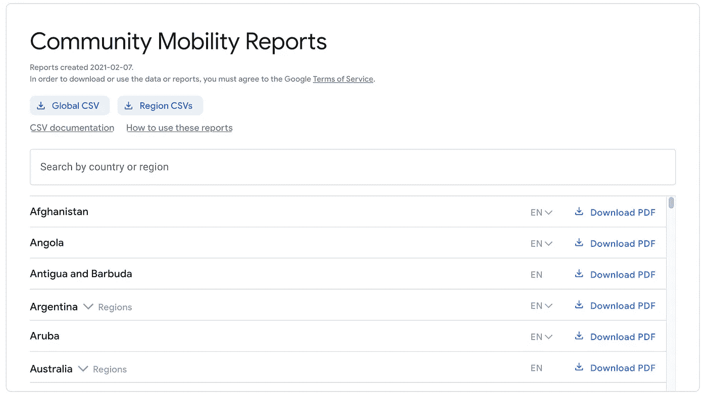
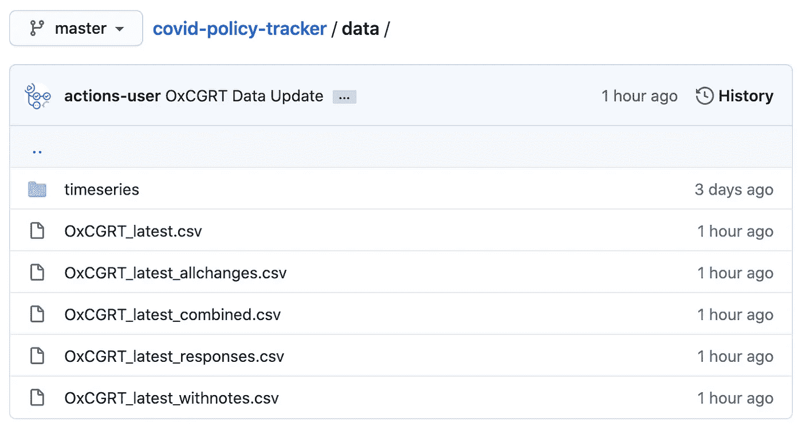
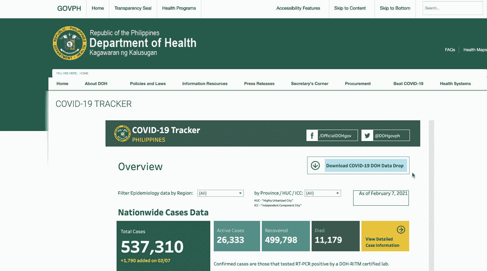
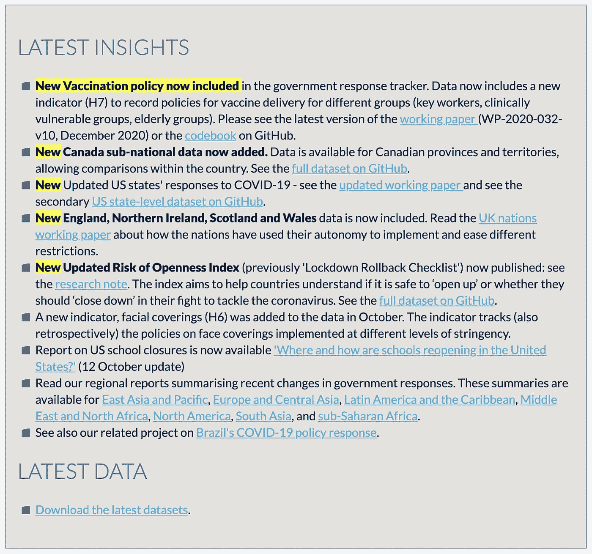
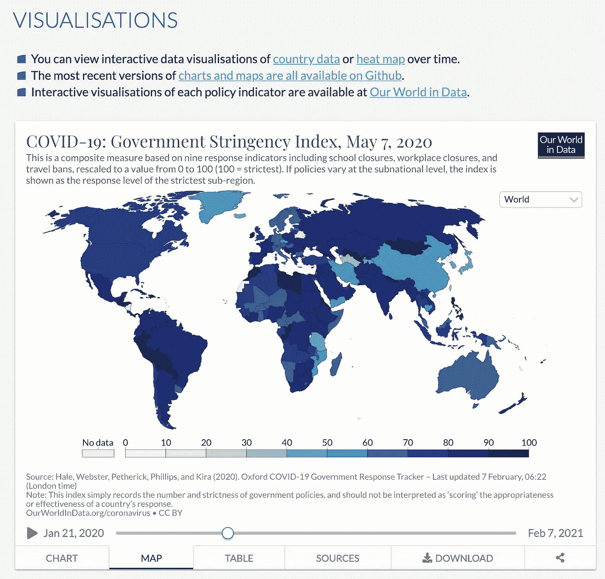

# 开放数据发布的 4 个关键因素——从用户的角度

> 原文：<https://towardsdatascience.com/4-key-factors-for-open-data-publication-from-a-user-standpoint-3d451bf321d0?source=collection_archive---------54----------------------->

## #社会影响数据:好的开放数据源应该是什么样的

开发署亚太区域创新中心 UNV 在线志愿服务在线志愿者邓华。

图片来自 [CILIP Photos](https://www.flickr.com/photos/cilipmarketing/) 来自 [Flickr](https://www.flickr.com/photos/cilipmarketing/15420989977)

今年夏天，我参与了一个完全基于开放数据的项目——[东南亚新冠肺炎应对措施的数据可视化和分析](/what-open-data-can-tell-you-about-covid-19-in-southeast-asia-besides-number-of-cases-6bea0d3d51d)。在搜索开放数据源并对其进行处理的过程中，我发现在发布开放数据方面没有黄金标准，数据发布者也在探索过程中。老实说，有许多细微的地方看似微不足道，但可能会给用户带来不便。我相信从一个数据用户的角度来看对社区来说是有价值的，这促使我写了这篇博客。

从用户的角度来看，我总结了发布开放数据的四个关键因素:(1)数据准备，(2)数据发布，(3)副产品，和(4)社区，每个都有一些子标准。作为一个例子，我将比较我在[我的项目](/what-open-data-can-tell-you-about-covid-19-in-southeast-asia-besides-number-of-cases-6bea0d3d51d)中使用的三个数据源:[菲律宾卫生部](https://doh.gov.ph/covid19tracker)，[谷歌新冠肺炎社区流动性报告](https://www.google.com/covid19/mobility/)，以及[牛津新冠肺炎政府反应跟踪系统(OxCGRT)](https://www.bsg.ox.ac.uk/research/research-projects/coronavirus-government-response-tracker) 。在下面的表格中，我用绿色、黄色和红色将简单的描述放入不同的单元格中，分别表示好、不够好和不好的做法。每一个都将在下面的章节中详细讨论。至于我没有评论的地方，我只是让它空白。

作者图片

# **#1 —数据准备**

## **#1.1 —一致性**

数据发布者应该首先确定一些要遵循的标准，并在进行更新时遵守这些标准。如果必须进行调整，应向用户明确说明。否则可能会造成混乱和不便。例如，关于谷歌移动指数，有一段时间它从使用“曼尼拉大都会”改为“国家首都地区”，这基本上是菲律宾同一地区的不同名称。在我的项目中，由于我将不同的数据源组合在一起，并且它们分别使用不同的命名约定，所以我必须自己创建一个映射字典。当 Google 在没有声明的情况下(或者不明确地声明)做出更改时，我必须弄清楚发生了什么，并相应地修改我的映射。

此外，一致性也意味着坚持主要的惯例。正如我上面提到的，如果不同的数据源都遵循相同的约定，用户自己进行映射会少受些苦。一些典型的例子包括地理名称、日期格式等。当然，在某些情况下，可能有多个流行的约定，因此很难在不同的数据所有者之间协调约定的采用。一些可能的解决方案包括:(1)数据发布者应该清楚地声明它使用什么约定，以便用户被很好地指导自己做映射；(2)第三方平台或服务提供商可以维护一些常用的映射，或者自动帮助用户实现标准化。

## **#1.2 —质量**

数据用户总是期望数据质量好，而现实有时恰恰相反。很高兴看到菲律宾卫生部每天都在公布新冠肺炎病例信息、检测和检疫设施等数据。但我们也应该意识到数据的质量问题，包括明显的延迟和错误，正如[菲律宾大学新冠肺炎疫情响应团队](https://www.up.edu.ph/prevailing-data-issues-in-the-time-of-covid-19-and-the-need-for-open-data/)所分析的。一个值得注意的问题是价值缺失。如果这些缺失的数据不是随机的，而是有偏见的，那么基于这些数据的所有分析的可靠性将会出现巨大的问题。因此，政策制定也会恶化。为了解决这个问题，数据所有者可以通过制定更明确的要求和指示，更加关注数据收集过程。此外，采用某些数据质量保证程序将非常有帮助。

## **#1.3 —粒度**

在数据隐私和可行性的范围内，开放数据应该尽可能细粒度地支持广泛的应用。例如，菲律宾卫生部的病例信息数据详细到个人级别，与国家级别的汇总数据相比，可以支持更多类型的分析和应用。用户可以根据自己的需要，自己深入到城市级别、地区级别、国家级别。

## **#1.4 —可用性**

这可能不太重要，但很容易改进，以获得更好的用户友好性。对于缺乏数据争论经验的用户，他们可能希望数据的格式完全符合他们的期望。例如，Google Mobility data 现在提供了下载全球 CSV 或地区 CSV 的选项，这样用户就可以只查看他们感兴趣的地区。另一个例子是 OxCGRT，它提供表格格式数据和时间序列格式数据。此外，遵循命名约定为变量提供直观的名称也可以使数据集更加用户友好。

截图来自[谷歌新冠肺炎社区移动报告](https://www.google.com/covid19/mobility/)2021–02–07

截图来自[ox cgrt covid-policy-tracker Github 仓库](https://github.com/OxCGRT/covid-policy-tracker/tree/master/data)2021–02–07

# **#2 —数据发布(可访问性&维护)**

关于如何发布开放数据没有明确的标准，所以你可以找到许多不同的做法。从用户的角度来看，我认为有两个关键的判断标准:(1)是否易于访问，以及(2)是否易于维护。

至于[菲律宾 DOH 数据](https://doh.gov.ph/covid19tracker)，公布在 Google Drive 上。它的好处是每个人都知道如何使用 Google Drive，所以它非常容易使用。流程如下:你要先点进一个“先读我”的 pdf 文件，然后向下滚动寻找中间最新的链接，最后带着你需要的数据到达目的地。这个过程增加了项目维护自动化的难度，因为用户每次都必须手动遵循这个过程来下载最新的文件。

2021-02-07 菲律宾卫生部新冠肺炎跟踪者的屏幕记录

至于谷歌的移动数据，它既易于访问和维护。他们的网站上有触发下载的按钮，它的路径可以很容易地嵌入到你的脚本中。至于 OxCGRT，用户既可以从 Github 下载 csv 文件，也可以使用 API 进行访问。Github + API 可以支持多种类型的使用，并且易于用户更新，尽管这两种方式对于非技术用户来说可能不太容易使用。

还有其他共享开放数据源的实践。例如，[微软在 Azure](https://azure.microsoft.com/en-us/services/open-datasets/catalog/covid-19-data-lake/) 上维护了一个新冠肺炎开放数据集的数据湖，它们对于 Azure 中集成的一些服务是现成可用的。在这种情况下，通常不是发行商决定在 Azure 上发布数据，而是 Azure 在原发行商的许可下，在其网站上收集和整合开放数据源。

# **# 3——副产品(文档&可视化&报告)**

与文档、可视化和报告等数据一起发布的“副产品”可以帮助用户理解数据。文档是必备的，而可视化和报告是最好的。没有文档，用户就无法获得对数据的详细和无偏见的理解，而这是任何深入分析和应用的基础。通过可视化和报告，用户可以摆弄数据，轻松地进行一些基本分析，甚至直接从报告中获得见解。提供基本的可视化和报告可以防止社区的重复工作，并减少开放数据使用的障碍。

至于菲律宾卫生部的数据，它提供了文件来描述每张表的元数据和每个字段的内容。它的技术说明每天都在“READ ME FIRST”pdf 中更新，到目前为止，它是一个非常长的文件，读者很难抓住它的要点。此外，没有关于数据收集程序的描述。当我探索数据时，我有时会感到困惑，我必须做出假设才能继续，这可能会被证明是错误的。

至于谷歌移动数据，它提供了国家和地区的报告。在该报告中，有基本描述和详细说明的链接，这些详细说明涉及如何收集数据、如何构建指标以及解释数据时应该注意的事项。还有针对该国家或地区的基本折线图和指标。这些报告是高度标准化的，这就是为什么谷歌可以向不同国家和地区提供单独的报告。这些报告的缺点是过于简单，无法获得深入的见解。

至于 OxCGRT，在我看来，它确实做得很好，因为它提供了我能想到的几乎所有支持。详细明确的指令书和工作底稿，检查；我们的世界在数据、检查方面提供的交互式仪表盘；区域总结，检查！

截图自[ox cgrt](https://www.bsg.ox.ac.uk/research/research-projects/coronavirus-government-response-tracker)2021–02–07

截图来自[ox cgrt](https://www.bsg.ox.ac.uk/research/research-projects/coronavirus-government-response-tracker)2021–02–07

# **#4 —社区(沟通渠道&用例分享)**

数据公布后，应该需要更多的交流和分享机会，以最大限度地扩大影响和覆盖面。数据发布者和用户之间应该有畅通的沟通渠道，以便用户可以及时报告数据问题并得到答复，数据发布者可以获得反馈并对数据的任何相关方面进行改进；用户还应该有机会与其他用户分享他们的发现和经验，从而为整个社区的知识库做出贡献。

还没有一个单一的平台作为社会公益社区的开放数据中心。数据发布和用例共享大多是在互联网上逐个案例地进行的。在这里，我想介绍一些良好的实践，它们来自在社区中承担不同角色的不同类型的实体，我相信未来会出现更多创新和引人入胜的实践。

*   [**OxCGRT**](https://www.bsg.ox.ac.uk/research/research-projects/coronavirus-government-response-tracker) 。它对数据、分析或项目的任何方面的反馈都是开放的。用户可以通过调查表或电子邮件与团队联系。
*   [**脸书数据为好程序**](https://dataforgood.fb.com/) 。脸书有一个专门的团队来管理这个项目。至于更成熟的数据集，他们已经把数据集完全公开了；对于一些可能仍然需要进一步测试或反馈的数据集，他们根据请求向研究人员和非营利组织提供访问权限。在他们的网站上，用户可以很容易地找到“案例研究”和“新闻”部分，以学习好的用例。此外，他们还建立了松散的渠道，以促进数据发布者和数据使用者之间的沟通。
*   [**Data4COVID19**](https://data4covid19.org/) 。这是由 GovLab 承担的一系列项目，其中一个是数据协作存储库。在存储库中，您可以找到三种类型的信息:(1)正在进行的数据协作项目，(2)数据竞争、挑战和提案征集，以及(3)对数据和专业知识的请求。所有这些都是通过 google sheet open for edit 完成的，这在技术上并不难，但却产生了巨大的影响。
*   **Data.govt.nz.** 这是一个由新西兰政府支持的一站式开放数据网站。在这里你几乎可以找到你想要的任何东西，数据集，发布数据的框架和指南，社区和团体，等等。

*感谢您的阅读！这是#Data for Social Impact 系列博客的最后一篇文章。在* [*第一篇博客*](/what-open-data-can-tell-you-about-covid-19-in-southeast-asia-besides-number-of-cases-6bea0d3d51d) *中，我详细介绍了我们针对东南亚新冠肺炎疫情的数据可视化和分析项目。在第二篇博客***中，我分享了我作为新冠肺炎数据项目在线联合国志愿者的故事，以及我对如何在公共部门更好地利用开放数据和众包的思考。在第三篇博客中，我从用户的角度讨论了好的开放数据应该是什么样的。我真诚地希望这一系列博客能有所帮助！**