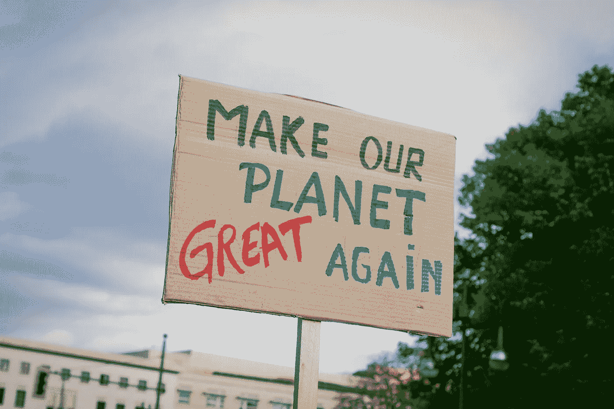
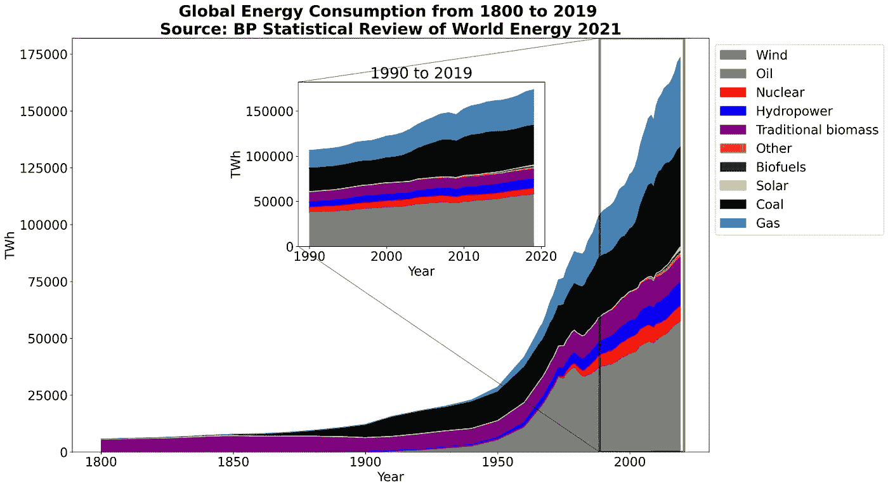
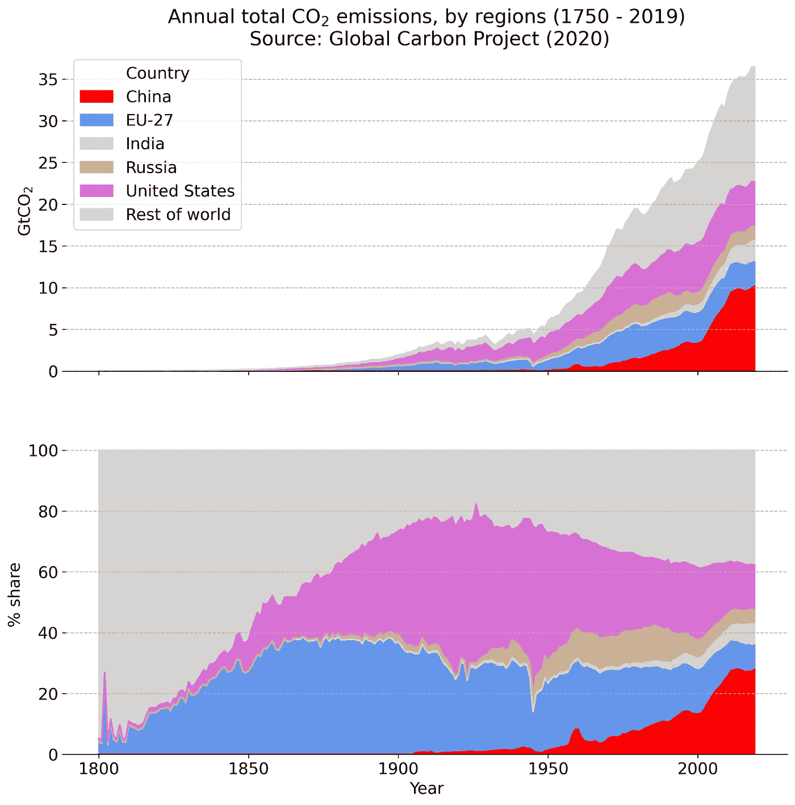
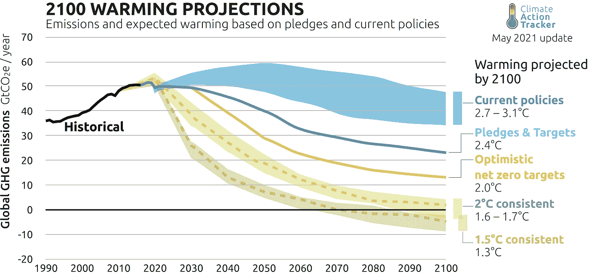
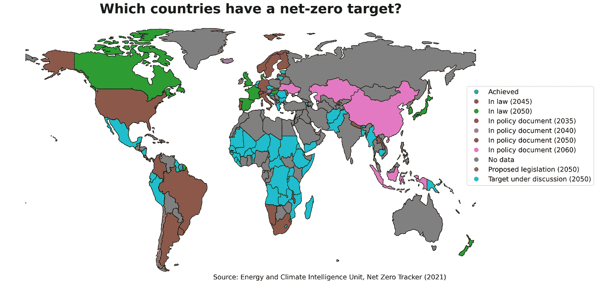

# 理解气候危机的 4 个关键数字

> 原文：<https://towardsdatascience.com/4-key-figures-to-understand-the-climate-crisis-f92b9a99abbe?source=collection_archive---------27----------------------->

## “随着世界处于不可逆转的危害的边缘，气温升高的每一点点都关系到限制气候变化的危险。”—斯蒂芬·科尼利厄斯(世界自然基金会 IPCC 负责人)

2015 年 12 月，《联合国气候变化框架公约》(UNFCCC)196 个缔约方在第 21 次缔约方大会(COP-21)期间签署了一项具有法律约束力的气候变化国际条约，称为**巴黎协定**。巴黎协议的目标是将本世纪末的全球变暖限制在 2 摄氏度以下，并努力达到 1.5 摄氏度，与工业化前的水平相比[1]。为了实现这一目标，全球温室气体(GHG)排放需要尽快达到峰值，世界需要在本世纪中叶实现气候中和。

根据政府间气候变化专门委员会(IPCC)第六次气候变化评估报告(AR6)，只有现在采取前所未有的行动，才有可能将本世纪末的全球气温上升限制在 1.5 摄氏度以内[2]。去年发表在《自然》杂志上的一项 T2 研究表明，为了达到巴黎协议的目标，到 2030 年，全球 GHG 排放量需要比 2020 年减少一半。机会之窗一年比一年窄，重要的问题是:“我们有望实现这个长期的温度目标吗？”

英国将于今年 10 月 31 日至 11 月 12 日在格拉斯哥主办第 26 届联合国气候变化大会。COP-26 是全球气候行动的一次重要峰会，因为这是对自巴黎协议以来世界各国政府在多大程度上提高了气候目标的首次考验[4]。

在这篇文章中，我将讨论四个关键数字来理解当前的气候危机。我将浏览气候危机的人为原因、主要责任国、气候情景的故事情节以及前进的方向。我还将解释数据和代码，因为我继续通过数字。这些脚本可以在这个 [GitHub 库](https://github.com/hbshrestha/Understanding_climate_crisis)中找到。

图片来自 [Unsplash](https://unsplash.com/) 作者 [Christian Lue](https://unsplash.com/@christianlue)

**全球能源消费趋势**

始于 18 世纪的工业革命，农业社会变得更加工业化和城市化，永远改变了人类社会。承蒙发明，如横贯大陆的铁路网、轧棉机、电力、内燃机车等。从 19 世纪中期开始，全球能源消耗开始激增。虽然全球能源消耗在 1800 年至 1900 年间仅增加了一倍，但在 1900 年至 2000 年间却增加了十倍。在过去的 20 年中，它已经增长了 1.5 倍，去年由于新冠肺炎相关的经济放缓，出现了一些下降。

在过去的两个世纪中，传统生物质的消费保持相当稳定，因为生物质仍然是几个发展中国家的主要烹饪燃料。煤的消费在 19 世纪 50 年代开始激增，而天然气和石油的消费在一个世纪后才开始。即使在今天，化石燃料(煤、石油和天然气)仍占全球能源消耗的四分之三以上。

全球能源消费趋势。数据基于[5]和[6]。CC-BY[我们的数据世界](https://ourworldindata.org/energy-mix)。

这个数字的数据是基于[5]和[6]，并已由[我们的世界在数据](https://ourworldindata.org/energy-production-consumption)汇编。在上面的情节中，我创建了一个新的子情节`ax_new`来放大 1990 年到 2019 年之间的值。我使用了`fig.add_axes([x1, x2, x3, x4])`并为新的子情节的矩形轮廓指定了左、下、宽和高。为了在新支线剧情`ax_new`和主支线剧情`ax`之间添加连接线，我使用了`ax.indicate_inset_zoom(ax_new)`。用于此目的的笔记本出现在[这里](https://github.com/hbshrestha/Understanding_climate_crisis/blob/main/Global%20Energy%20Consumption.ipynb)。

**最大的排放源**

众所周知，中国是世界上人口最多的国家，也是目前 GHG 排放量最大的国家。截至 2019 年，中国占全球二氧化碳排放量的近三分之一，而美国占中国的一半。过去 20 年，随着中国经济的崛起，中国的排放量呈指数级增长。2019 年，中国、美国、EU-27 国、印度和俄国共排放了全球三分之二以上的二氧化碳，超过了世界其他国家的总和[7]。

说到气候公正，历史很重要。这是因为与全球变暖有近乎线性关系的不是排放的时机，而是累积排放[2]。谈到累计数字，自前工业化时期以来，没有一个国家像美国排放的一样多(4100 亿吨二氧化碳)。其次是欧洲联盟(欧盟)的 27 个成员国(287 亿吨二氧化碳)、中国(220 亿吨二氧化碳)、俄罗斯(114 亿吨二氧化碳)和印度(52 亿吨二氧化碳)。累积排放量最高的国家必须承担责任，支持那些排放最少但更容易受到气候危机影响的国家。

按地区(顶部)和百分比份额(底部)分列的年度二氧化碳排放总量。数据基于[7]。CC-BY[我们的数据世界](https://ourworldindata.org/co2-and-other-greenhouse-gas-emissions)。

这个数字的数据基于[7]。上图包含两个支线剧情。顶部的子图描绘了各地区的实际二氧化碳排放量。下面的子图描述了一个国家/地区在年度全球二氧化碳排放量中所占的百分比份额。该图的笔记本可在[这里](https://github.com/hbshrestha/Understanding_climate_crisis/blob/main/Global%20Emissions%20by%20Countries.ipynb)获得。

**未来会怎样？**

气候行动追踪器(CAT) 是一个独立的科学联盟，根据巴黎协议的温度限制目标追踪政府的气候行动。根据 CAT 的说法，在当前的政策下，仍然没有迹象表明 GHG 的排放量会很快达到峰值。根据目前的政策，GHG 的累积排放量将导致本世纪末气温比工业化前水平升高 2.7 至 3.1 摄氏度。如果世界各国政府提出的承诺和目标得以实现，这将导致气温上升 2.4 摄氏度，可能性为 66%。在乐观的情况下，如果 131 个国家已经采纳或正在讨论的净零目标得以实现，这将进一步限制变暖水平，可能低于 2.2 摄氏度[8]。

全球变暖预测到 2100 年。气候分析和新气候研究所版权所有 2021。

上图来源于[8]。温度评估是使用称为 [MAGICC6](https://acp.copernicus.org/articles/11/1417/2011/) 的碳循环气候模型完成的，该模型也用于 IPCC 评估报告中，它代表了时变气候敏感性、碳循环反馈、气溶胶作用力和海洋热量吸收特征。

**前进的道路**

上述评估表明，在世界各国政府承诺的目标和将全球气温上升限制在 1.5 摄氏度的最终目标之间仍存在巨大差距。单个政府或行动的行动至关重要，因为对于已经处于气候紧急情况第一线的人们来说，每一度的微小变化都至关重要。

能源和气候情报单位(Energy and Climate Intelligence Unit)是一家支持英国就能源和气候变化问题进行知情辩论的非营利组织，它一直在跟踪哪些国家在其立法、政策文件或讨论中设定了净零目标。根据[追踪器](https://eciu.net/netzerotracker)，苏利南和不丹是世界上仅有的两个已经实现净零排放的国家。包括欧盟、英国和加拿大在内的 13 个国家/地区已经在其法律中规定了净零目标。爱尔兰、智利和斐济在其国家立法中提出了净零目标。有 28 个国家在其政策文件中规定了 2035 年、2040 年、2050 年或 2060 年的净零目标。非洲、亚洲和美洲的大多数发展中国家的净零目标还在讨论中[9]。

零净目标。数据基于[9]。数据中的我们的世界。

上图的数据基于[9]。我已经用 geopandas 绘制了上面的地图。在地理数据框架中，我合并了数据框架中的一列，其中包含各个国家的国家净零目标的状态。该图的笔记本显示在[这里](https://github.com/hbshrestha/Understanding_climate_crisis/blob/main/Net%20Zero%20Targets.ipynb)。

**简单地说**

近几十年来，GHG 的人为排放量持续上升。仅在过去三十年中，除了 2007 年至 2009 年的全球金融危机期间以及 2020 年由于新冠肺炎相关的经济放缓，排放量大幅上升。世界上的发达和工业化地区是目前排放水平和随后气温上升的核心。重要的是，这些国家应对其造成的气候危机承担责任，并因此以身作则，迅速向低碳经济转型，支持发展中国家跳过化石燃料，转向清洁能源。

每升高一度，弱势群体就更难摆脱气候危机造成的不平等循环。因此，可以正确地说，气温升高的每一个微小的变化都会限制气候崩溃的危险。

**参考文献**

[1]《联合国气候变化框架公约》(2015 年)。[巴黎协定](https://unfccc.int/process-and-meetings/the-paris-agreement/the-paris-agreement)。

[2]气专委(2021 年)。[气候变化 2021 物理学基础。](https://www.ipcc.ch/report/ar6/wg1/downloads/report/IPCC_AR6_WGI_Full_Report.pdf)

[3]赫内等人，(2020 年)。[排放:世界有四倍的工作或三分之一的时间。](https://www.nature.com/articles/d41586-020-00571-x)

[4]阿伯格(2021 年)。[COP 26 是什么，为什么重要？](https://www.chathamhouse.org/2021/09/what-cop26-and-why-it-important)

[5] Smil，V. (2017)。[能源转型:全球和国家视角。](http://vaclavsmil.com/2016/12/14/energy-transitions-global-and-national-perspectives-second-expanded-and-updated-edition/)

[6]英国石油公司(2020)。[2021 年世界能源统计综述。](https://www.bp.com/en/global/corporate/energy-economics/statistical-review-of-world-energy.html)

[7]全球碳项目(2020 年)。[2020 年全球碳预算。](https://essd.copernicus.org/articles/12/3269/2020/#section6)

[8]《气候行动追踪》(2021 年)。[气温:应对全球变暖。](https://climateactiontracker.org/global/temperatures/)

[9]能源和气候情报股(2021 年)。[净零追踪器。](https://eciu.net/netzerotracker)