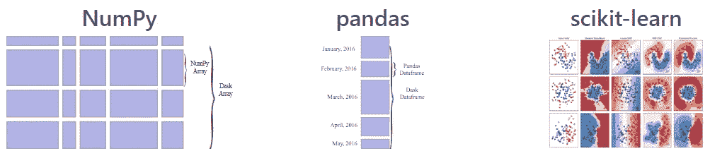
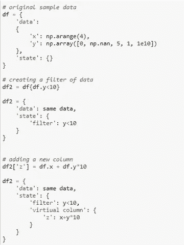
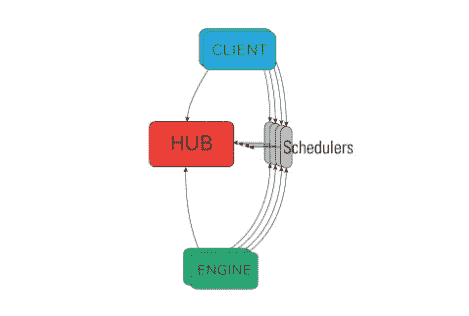

# 4 个库可以并行处理现有的 Pandas 生态系统

> 原文：<https://towardsdatascience.com/4-libraries-that-can-parallelize-the-existing-pandas-ecosystem-f46e5a257809?source=collection_archive---------16----------------------->

## 使用这些框架通过并行处理来分配 Python 工作负载

图片由 [chiplanay](https://pixabay.com/users/chiplanay-1971251/?utm_source=link-attribution&amp;utm_medium=referral&amp;utm_campaign=image&amp;utm_content=5070031) 从 [Pixabay](https://pixabay.com/?utm_source=link-attribution&amp;utm_medium=referral&amp;utm_campaign=image&amp;utm_content=5070031) 拍摄

Pandas 是一个非常受欢迎的 Python 库，因为它提供了高级可用和灵活的 API 以及高性能的实现。Pandas 提供了大量用于数据争论探索的 API，但是忽略了计算的性能和可伸缩性。Pandas 非常慢，或者有时无法在大型数据集上执行探索，因为它使用了 CPU 的单核。它没有 100%利用 CPU 内核。

在本文中，我们将讨论 4 个开源库，它们可以在 CPU 的多个内核上并行化现有的 Pandas 生态系统:

# Dask:

Dask 是一个用于并行计算的开源 Python 库。它可以用于扩展 Numpy、Pandas、Scikit-Learn 操作，还可以在可用的 CPU 内核之间并行化自定义功能。Dask 允许在笔记本电脑或大型分布式集群上并行操作。

Dask 提供的 API 与 Pandas、Numpy 和 Scikit-Learn 非常相似，因此开发人员不必担心学习新东西。Dask 提供了这些著名库的高级 API 的优势以及伸缩能力。

([来源](https://dask.org/))，Dask 有能力整合现有项目

Dask 实际上是建立在 Pandas、Numpy 和 Scikit-Learn 库之上的，因此，它提供了所有 API 的高级实现。

Dask 提供了一个高级集合，包括:

*   Dask 数组:建立在 Numpy 之上
*   Dask Dataframe:建立在熊猫之上
*   Dask Bag:专为处理非结构化数据而打造
*   Dask 延迟:并行化定制函数
*   Dask Futures:扩展 Python 的`**concurrent.futures**`接口。

([来源](https://dask.org/))，引擎盖下工作的 Dask

为在 dask 集合上执行的所有操作和操纵创建任务图，任务图由 Dask 调度器并行化。

> 要了解关于 Dask 及其实现的更多信息:
> 
> 阅读 [Dask Github 库](https://github.com/dask/dask)和 [Dask 文档](https://dask.org/)

# Vaex:

Vaex 是一个开源 Python 库，用于处理核外数据帧。Vaex 库可用于在大型数据集上执行可视化和探索。Vaex 使用**表达式系统、惰性计算、**和**内存映射**的概念来处理大于内存的数据集，并在其上执行探索。

Vaex 几乎可以通过内存映射瞬间加载 1TB 左右的内存。Vaex 不会立即执行任何计算，它会创建一个表达式系统，并且仅在需要或明确请求时执行计算。

(图片由作者提供)，什么是表达系统

Vaex 提出了有效的算法，并使用延迟计算(惰性计算)来执行计算。Vaex 大约可以处理`**10**9 rows/second**` **。Vaex 提出了一个类似熊猫的 API，它可以与 Jupyter notebook 和 Jupyter Lab 集成，以提供交互式可视化。**

> 阅读下面提到的文章，了解更多关于 Vaex 库的实现和工作的信息。

 [## 使用 Vaex 处理具有 2 亿行的数据集

### 使用 vaex 数据框对大型数据集执行操作

towardsdatascience.com](/process-dataset-with-200-million-rows-using-vaex-ad4839710d3b) 

> 跟随[这个站点](https://vaex.io/docs/index.html)，浏览 Vaex 文档和 [GitHub 库](https://github.com/vaexio/vaex)。

# 摩丁:

Modin 是一个建立在 Pandas 库之上的开源 Python 库，它能够在所有 CPU 内核上扩展 Pandas 工作流。与其他分布式库不同，Modin 可以很容易地与 Pandas 库集成。摩丁的 API 和熊猫的 API 非常相似。

Modin 充分利用了 CPU 内核，从而提升了计算的性能。开发人员不需要太担心学习新的代码片段，因为他们只需要对代码中的 import 语句做一行修改。

([来源](https://www.youtube.com/watch?v=-HjLd_3ahCw))，熊猫和摩丁的 CPU 核心利用率

> 阅读下面提到的文章，了解更多关于摩丁库的实现和工作。

 [## 通过改变一行代码来加速你的熊猫工作流程

### 使用 Modin 扩展您的数据探索和可视化

towardsdatascience.com](/speed-up-your-pandas-workflow-by-changing-a-single-line-of-code-11dfd85efcfb) 

> 跟随[这个站点](https://modin.readthedocs.io/en/latest/)，浏览摩丁文档。

# IPython 并行:

IPython Parallel 或 ipyparallel 是一个开源的 Python 库，它有一组 CLI 脚本来控制 Jupyter 的集群。IPython parallel 使您能够利用 Jupyter 笔记本电脑的多个 CPU 内核。

([来源](https://ipython.org/ipython-doc/3/parallel/parallel_intro.html))，IPython 架构

Ipyparallel 是专门为在集群上并行执行 Jupyter 笔记本而设计的。它使用一个映射，将任何函数应用于一个序列，并将工作分配给可用的 CPU 内核。对于复杂的任务，开发人员可以分配特定的功能来远程或并行运行它。

> 要了解更多关于 IPyParallel 如何工作及其实现的信息，请阅读[这篇文章](https://ipython.org/ipython-doc/3/parallel/parallel_intro.html)。在这里获得 IPyton 并行文档[。](https://ipyparallel.readthedocs.io/en/latest/)

# 结论:

在本文中，我们已经讨论了 4 个分布式 Python 库，它们可以扩展 Pandas 数据帧的计算。这些库不仅可以加速 Pandas 的工作流程，还可以加速其他流行的库，如 Scikit-Learn、Numpy 和自定义函数。

有几个其他的库可以在可用的 CPU 内核之间分配工作流，包括 **Ray** 、 **Pandarallel** 、 **Dispy** 、 **Joblib** 。

# 参考资料:

[1] Dask 文件:[https://dask.org/](https://dask.org/)

[2] Vaex 文件:[https://vaex.io/docs/index.html](https://vaex.io/docs/index.html)

[3]摩丁文献:[https://modin.readthedocs.io/en/latest/](https://modin.readthedocs.io/en/latest/)

> 感谢您的阅读