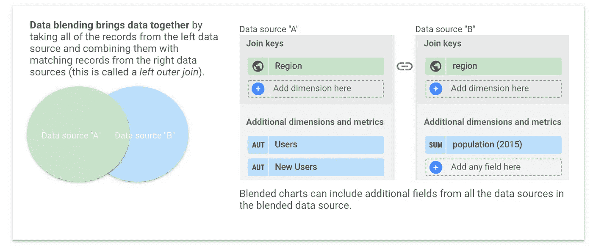
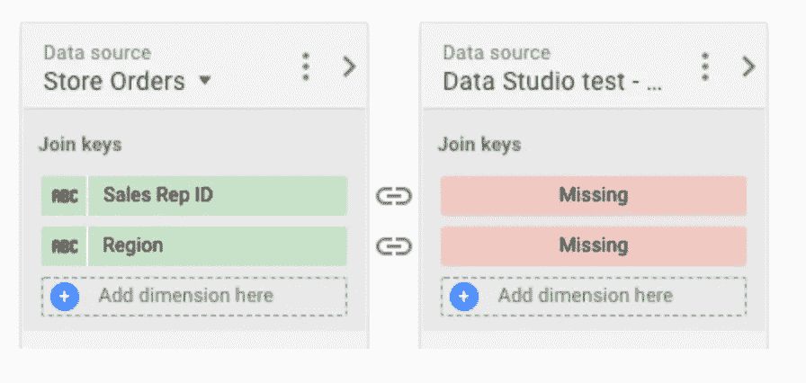

# 高级用户应该警惕的 Google Data Studio 的 4 个局限性

> 原文：<https://towardsdatascience.com/4-limitations-of-google-data-studio-that-advanced-users-should-watch-out-for-fb2a907eaf5c?source=collection_archive---------29----------------------->

## (以及如何克服它们)

格伦·卡斯滕斯-彼得斯在 [Unsplash](https://unsplash.com?utm_source=medium&utm_medium=referral) 上拍摄的照片

~**2022 年 2 月 17 日更新** — *Google Data Studio 刚刚推出了高级数据混合选项，基本上消除了本文(1)中提到的一个限制。请继续阅读本文:* [**Data Studio 引入了新的数据混合选项——数据可视化的游戏规则改变者**](https://medium.com/p/627c725d98c3) **。** *本帖中提到的其他限制还有待解决。*

Google Data Studio 是我在过去几个月中越来越常用的一个工具。随着使用率的提高，我开始注意到它相对于其他工具的优势，它的能力，但也有它的局限性。

有许多关于技术的教程和数据可视化指南，但没有多少讨论该工具的常见缺陷以及如何克服它们。

因此，这里有 4 个谷歌数据工作室的限制，高级用户在建立他们的报告之前绝对应该考虑。

## 1.数据混合使用左外连接

Google Data Studio 中的混合数据遵循左外连接的 SQL 参数。

左外部联接的工作方式是混合数据，即从左数据源获取所有记录，并将它们与右数据源的匹配记录相结合。

数据混合在谷歌数据工作室解释，来源: [GDS 演示:混合数据报告](https://datastudio.google.com/u/0/reporting/1uIvaqruCdHRGhnfn6FaLMEpeRyJxm17Y/page/chHU)

总共有 7 种类型的表连接，这是数据科学专业人员习惯使用的。对于高级用户来说，只拥有一个会感觉很无力。

这在实践中意味着什么？

您必须特别注意两个数据源是如何混合的，更具体地说，就是将它们添加到混合数据实体的顺序。

根据左外连接的定义，添加的第一个表(数据源)将用作基础，因此第二个表中的任何附加数据条目(超出第一个表的连接键字段)都不会被允许进入新的数据集。

这是一种非常有限的连接表的方法，因为尽管它在寻找模式方面足够先进，但它拒绝空值。

**有哪些替代方案？**

如果您可以使用它，Big Query 是处理更大数据集的一个很好的选择。所谓伟大，我指的是在[混合数据和连接表](https://www.google.com/imgres?imgurl=https%3A%2F%2Fmiro.medium.com%2Fmax%2F1838%2F1*jAt5tID0Kc9B-8AGbeBivw.png&imgrefurl=https%3A%2F%2Fmedium.com%2F%40achilleus%2Fhttps-medium-com-joins-in-apache-spark-part-1-dabbf3475690&tbnid=TiOI0iHXcHCWVM&vet=12ahUKEwjN68PXmcTvAhXKM-wKHWBjBxIQMygAegUIARC8AQ..i&docid=xoOsk0ftWOJ0HM&w=1600&h=1132&q=left%20outer%20join&ved=2ahUKEwjN68PXmcTvAhXKM-wKHWBjBxIQMygAegUIARC8AQ)的上下文中，就必须建立数据管道、学习 SQL 和为每个查询付费而言，并不是那么伟大。如果基础设施存在，请使用它进行数据处理。

或者，对于更小的数据集和更可控的操作，Gsheets 也应该做得很好。 [Dave Mendl 写了一个很棒的指南](https://davidmeindl.com/the-ultimate-google-sheets-formula-to-join-two-tables/)，介绍了可以用来复制 Gsheets 中七种 SQL 连接的不同函数，使用了 VLOOKUP、FILTER 和 advanced operations 等函数。

## 2.混合最多只能有五个数据源，所有数据源都应该共享一个连接键。

虽然仍然是关于连接表和混合数据源的主题，但我遇到的最令人沮丧的限制之一是，在创建一个新数据源时，您最多只能混合五个数据源。

虽然这听起来可能很多，但相信我——不是的。

看看 SEO 领域的几个例子。我使用 GDS 可视化定制提取尖叫青蛙，这是每月做一次。有了时间戳，就可以导入和可视化这些数据，显示趋势线。嗯，我的意思是，五个数据点的趋势线…

想象一下，如果有一个单独的表格显示客户站点上的任何改进的日期。将这些数据来源结合起来，理论上就可以衡量我提出的具体建议的影响。遗憾的是，考虑到这种限制，任何这样的混合都必须在更新之前进行。

那么，这会对你产生什么影响呢？

如果您和我一样，您希望在可视化功能方面突破工具的极限，并从合并的数据中为报告用户提取最大价值。最多可以使用五个共享一个维度的数据源，并且可以在这个维度上进行连接，这通常会限制您可以显示什么以及如何显示。

关于连接的另一个奇怪的事情是，Data Studio 作为一个可视化工具不处理缺失值。因此，如果连接键中有这样的值，混合将无法进行。

除了最多只能将五个数据源混合成一个之外，Google Data Studio 无法基于包含缺失值的连接键来连接数据。，[资料来源:GDS](https://support.google.com/datastudio/answer/9061421?hl=en)

**有哪些选择？**

最简单的解决方案是离线混合数据，使用谷歌工作表或 Excel。您可以将这两者与 Zapier 或其他自动化工具集成在一起，尽管这种解决方案在实现上相当不可靠。

## 3.合并许多数据源可能会导致报表中断。

如果您曾经构建过 Data Studio 报告，您应该知道“死亡之吻”——破坏图表、未知数据源、用户配置错误、数据集配置错误……错误错误错误。

可悲的是，当您的表损坏时，Data Studio 在友好或乐于助人方面并没有什么好名声，就好像他们甚至不在乎这可能会完全排斥用户再次访问您的报表。

我非常喜欢胡安·贝洛的这篇[文章，这篇文章讲述了 Data Studio 常见的错误以及如何修复它们](https://portermetrics.com/en/help/google-data-studio-common-errors/)。我不会深入讨论每个错误，但我会说有几种不同的情况您应该调查。

我所学会实现的是这两个宝石的规则:

*   简化——简化、删除和减少。
*   连接的所有权——这意味着尽一切力量管理添加的数据源及其连接方式

通过减少不需要的东西并将不同的仪表板合并成一个，您可以保持良好的用户体验，而不必牺牲报告的质量。一个好的经验法则是提供一个好的、稳定的整体概述，它链接到奇特的、不太稳定的、粒度数据视图。

## 4.连接器的可用性很大程度上取决于它们的内部数据库模式。

您可以在报表中使用数百个连接器，还可以嵌入自己的数据源。一个多世纪以前，Emmert Wolf 写道“一个人的好坏取决于他的工具”，这句话直到今天仍然适用。

那么，我们来谈谈工具。

我注意到的是，笨重、难看的电子表格是最好的数据源。例如，Google Analytics 数据源的每个属性都有一个连接，其中包括所有数据字段。相比之下，SEMrush 的连接器包括三个不同菜单之间的选择，每个菜单连接到 SEMrush 上包含的不同数据段。

**有哪些替代品？**

直接与 API 集成，而不是使用连接器。这不仅是最安全的连接，因为它可以管理数据源，避免身份验证和潜在的延迟，而且可以按照您希望的方式构建数据源。

## 外卖

虽然这可能有很多需要理解，但在提供外卖之前，我只想强调:Data Studio 绝对令人惊叹，我每天都用它来制作各种报告。

我有构建小型报告的经验，比如跟踪我的收入流的个人财务仪表板，SEO 咨询公司的强大报告，复杂到在一份报告中使用数百个不同的数据源。

我大力提倡将数据可视化和报告融入生活的方方面面，这也许是我如此热爱 Data Studio 的原因。所以，也许正如老话所说:

> 我们批评我们最爱的东西

不过，严肃地说，希望这个列表能够帮助初学者和高级用户更好地了解 Data Studio 的功能、它的局限性以及如何克服它们。

总而言之，这里列出了 Google Data Studio 的 4 个局限性，以及一些克服这些局限性的简便方法。

1.  **数据混合使用左外连接**

*替代方案:根据数据的大小和复杂性以及您的基础设施容量，在 GSheets 或 Big Query 中执行复杂的数据扩充。*

**2。混合最多只能有 5 个数据源，所有数据源都应该共享一个连接键。**

*替代方案:离线混合数据，使用自动化工具简化流程。*

**3。合并许多数据源可能会导致报告中断**

*备选方案:简化报告并维护数据源的所有权。*

**4。连接器的可用性高度依赖于它们的内部数据库模式**

*替代:使用 API，而不是连接器。*

*感觉好奇？继续阅读…*

<https://medium.com/bite-sized-marketing/4-new-data-studio-features-released-in-2021-that-you-need-to-know-about-23ef366c48bc>  </analyzing-the-seo-score-of-an-article-gpt-3-wrote-59108dd105af> 