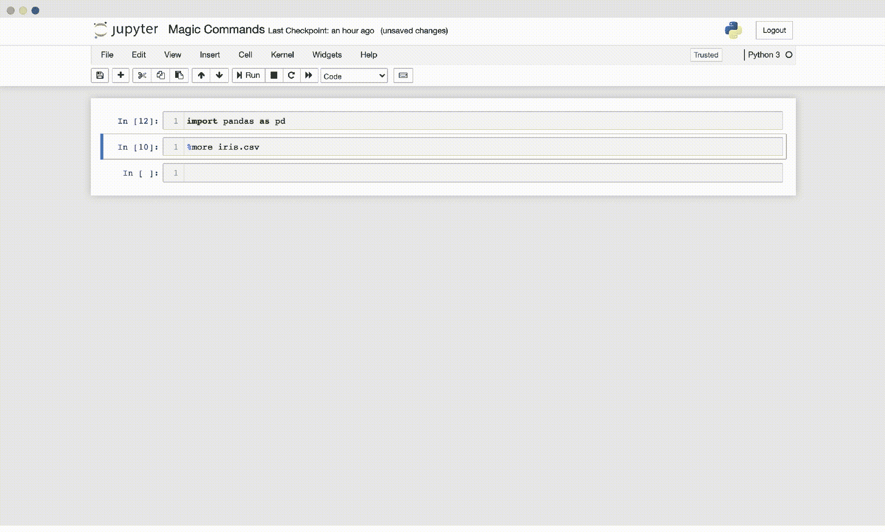
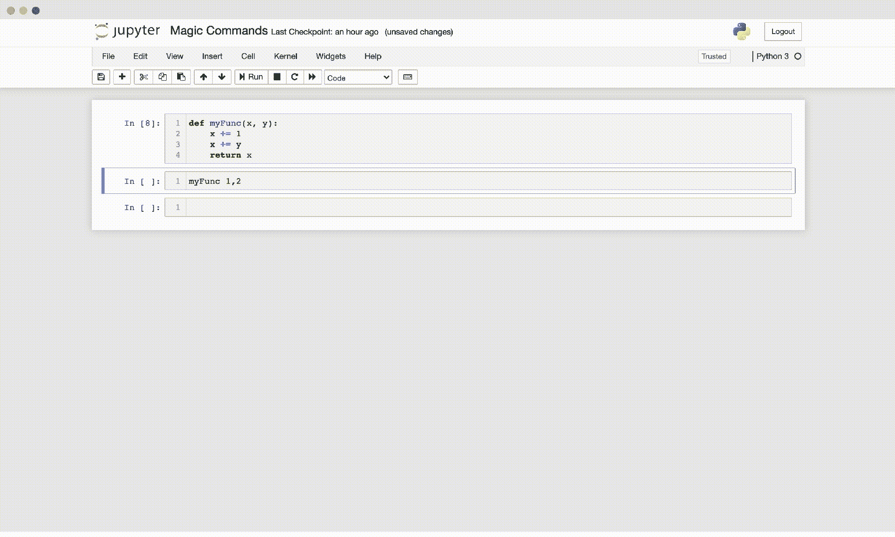

# 4 个鲜为人知的神奇命令可以提高你的工作效率

> 原文：<https://towardsdatascience.com/4-little-known-magic-commands-that-boost-your-productivity-af1ba4268c57?source=collection_archive---------32----------------------->

## 释放 iPython 笔记本电脑的全部功能

由[美元吉尔](https://unsplash.com/@dollargill?utm_source=unsplash&utm_medium=referral&utm_content=creditCopyText)在 [Unsplash](https://unsplash.com/s/photos/magic?utm_source=unsplash&utm_medium=referral&utm_content=creditCopyText) 上拍摄的照片

神奇的命令已经成为每个使用数据科学笔记本的人的主食。通过扩展每台笔记本电脑的功能，他们的目标是提高笔记本电脑的工作效率。其中一些神奇的命令，如打印 CPU 和挂钟时间的`%time`魔术，已经变得相当流行，而其他的在很大程度上一直在雷达下飞行。本文将重点介绍鲜为人知的神奇命令，而不是重新介绍最流行的神奇命令，这些命令可以为任何 iPython 环境增加巨大的价值。

## 带有%%prun 的配置文件代码

虽然更广为人知的神奇命令`%time`和`%timeit`为 Python 代码提供了一些关于 CPU 和挂钟时间的信息，但它们无法分解代码的哪一部分执行了多长时间，这使得调试具有多个函数调用的单元更加繁琐。`%prun`(行模式)和`%%prun`(单元格模式)通过 Python 的分析器运行代码，并提供每个函数调用所用时间的详细信息。

%%prun 示例；由作者创建

`%%prun`并不仅仅显示单元运行的总时间，而是详细描述了函数被调用的频率以及这些调用运行了多长时间。在上面的例子中，调用了两个函数。但是，其中一个功能的运行时间要比另一个长得多。神奇的命令`%%prun`显示`firstFunction()`运行了 0.722 秒，而`secondFunction()`只花了 0.007 秒。

## 查看%more 文件

下载文件后，使用笔记本通常会迫使用户在单独的文本编辑器中打开文件，以确定使用了哪个分隔符、日期格式或空值占位符。神奇的命令`%more`允许用户专注于他们的笔记本环境，并在编码时检查文件。

%更多示例；由作者创建

虽然`%more`没有假定文件是任何特定的类型，但是`%pycat`假定文件是 Python 文件，并且还提供语法高亮。同样值得注意的是，`%pycat`接受文件路径和 URL。

## 使用%%debug 进行交互式调试

虽然打印似乎仍然是笔记本中最常用的调试方法之一，但是 Python 已经自带了一个更加强大的调试器。神奇的命令`%%debug`使用户能够交互式地使用 Python 的 pdb 调试器，并更快地找到 bug。

% %调试示例；由作者创建

在上面的例子中，Python 的调试器允许使用`s`命令逐步运行函数`myFunc()`。遇到`TypeError`后，`a`命令列出当前函数调用中使用的所有参数，并显示`y`参数导致了异常。

## 用%autocall 实现快速函数调用

当速度是唯一重要的事情时，使用`%autocall 1`打开自动调用有助于显著加快原型制作。当 autocall 设置为*‘智能’*时，笔记本用户不再需要传递括号内的函数参数。使用上述`%%debug`示例中的函数，autocall 使用户能够使用`myFunc 1,2`而不是`myFunc(1,2)`来调用函数。

%autocall 示例；由作者创建

虽然 autocall 支持更快的原型开发，但重要的是要记住，它可能会降低生成的代码的可读性。

# 摘要

在使用数据科学笔记本电脑时，Magic commands 是提高工作效率的绝佳工具，其功能远远超出了人们的预期。虽然本文中的四个神奇命令已经可以极大地提高生产率，但哪个神奇命令最有用通常取决于用户和手边的特定用例。幸运的是，在`%quickref`中甚至有一个魔法命令来帮助用户在不离开笔记本环境的情况下试验魔法命令。此外， [iPython 文档](https://ipython.readthedocs.io/en/stable/interactive/magics.html)详细介绍了魔术命令的所有可用选项，以及如何通过构建定制魔术命令来扩展生态系统。

*来源:*

[1]“内置魔法命令。”IPython 7.26.0 文档。2021 年 8 月 8 日接入。[https://ipython . readthedocs . io/en/stable/interactive/magics . html](https://ipython.readthedocs.io/en/stable/interactive/magics.html.)

[2]“Pdb—Python 调试器。”Python 3.9.6 文档。2021 年 8 月 8 日接入。https://docs.python.org/3/library/pdb.html.