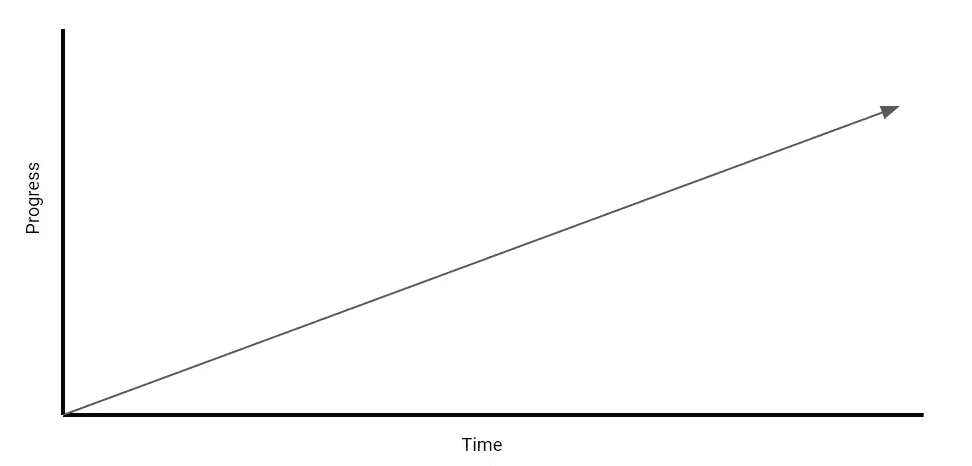
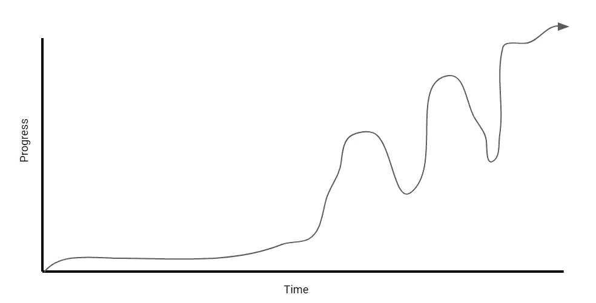
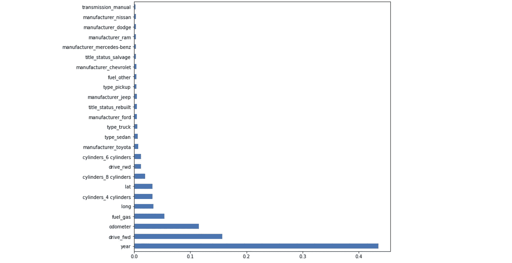

# 4 个机器学习概念我希望在构建第一个模型时就知道

> 原文：<https://towardsdatascience.com/4-machine-learning-concepts-i-wish-i-knew-when-i-built-my-first-model-3b8ca9506451?source=collection_archive---------10----------------------->

## 用这 4 个技巧构建惊人的机器学习模型

安东尼·托里在 [Unsplash](https://unsplash.com/s/photos/thinking?utm_source=unsplash&utm_medium=referral&utm_content=creditCopyText) 上的照片

# 介绍

我喜欢写作的一个原因是，它给我一个机会回顾过去，反思我的经历，思考什么是成功的，什么是失败的。

在过去的 3 个月里，我的任务是建立一个机器学习模型来预测一个产品是否应该被 [RMA'ed](https://en.wikipedia.org/wiki/Return_merchandise_authorization) 。我会说这是我开发的第一个“严肃”的机器学习模型——我说“严肃”是因为这是第一个创造实际商业价值的模型。

鉴于这是我的第一个**“严肃的”模型，我对我的模型构建之旅有一个天真的误解:**

****

**作者创建的图像**

**而事实上，我的旅程看起来更像这样:**

****

**作者创建的图像**

**总的来说，我认为这是成功的，但是在构建模型的过程中肯定有很多起伏——为什么？我花了很多时间学习我还不知道的新概念。在本文中，我想反映和记录在构建这个模型之前我希望知道的东西。**

**也就是说，这里有 4 个我希望在建立这个模型之前就知道的概念！**

# **1.使用简单 Web 用户界面的模型部署**

****

**[图片由 Gradio 拍摄(经许可)](https://www.gradio.app/hub/aliabid94/hub-titanic)**

**我最近遇到的东西是 [Gradio](https://www.gradio.app/) ，这是一个 Python 包，它允许你用少至三行代码为你的机器学习模型构建和部署一个 web 应用。它的用途与 Streamlit 或 Flask 相同，但我发现部署模型要快得多，也容易得多。**

**这为什么这么有用？有几个原因:**

1.  ****允许进一步的模型验证**。具体来说，它允许您交互式地测试模型的不同输入。这也允许你从其他涉众和领域专家那里得到反馈，尤其是从非编码人员那里。**
2.  **这是进行演示的好方法。就我个人而言，我发现向某些利益相关者展示 Jupyter 笔记本并没有给我的模型带来任何好处，尽管它表现得非常好。使用这样的图书馆可以更容易地交流你的结果，更好地推销自己。**
3.  ****很容易实现和分发**。重申一下，学习曲线很小，因为只需要 3 行代码就可以实现。此外，它非常容易分发，因为任何人都可以通过公共链接访问该 web 应用程序。**

****TLDR:利用 ML 模型 GUI 的优势，如**[**【Gradio**](https://www.gradio.app/)**进行更好的测试和通信。****

# **2.特征重要性**

**特征重要性是指一套根据输入变量预测目标变量的能力为输入变量分配分数的技术。分数越高，*越重要* 该特征在模型中就越重要。**

****

**作者创建的图像**

**例如，如果我想使用图中的特征预测一辆汽车的价格，通过进行特征重要性分析，我可以确定型号的**年份**、是否为**前轮驱动**以及汽车的**里程**(里程表)是预测汽车价格时最重要的因素。**

**很棒吧？我打赌你开始明白为什么这很有用了。**

**在选择特性时，特性重要性非常有用。通过对初步模型进行特性重要性分析，您可以很容易地确定哪些特性在模型中有发言权，哪些没有。**

**更重要的是，特征重要性使得解释你的模型和解释你的发现变得更容易，因为它直接告诉你什么特征最能代表目标变量。**

****TLDR:使用特性重要性来改进特性选择、模型可解释性和交流。****

***如果你想看一个如何实现特征重要性的例子，在这里* *查看我的第一个机器学习模型* [*的演练。*](/a-machine-learning-project-predicting-used-car-prices-efbc4d2a4998#eced)**

# **3.超参数调谐**

**机器学习的本质是找到最适合一个数据集的模型*参数* 。这是通过训练模型来完成的。**

**另一方面，**超参数**是不能从模型训练过程中直接学习的参数。这些是关于模型的更高层次的概念，通常在训练模型之前就已经确定了。**

**超参数的例子有:**

*   **学习率**
*   **树叶的数量或一棵树的最大深度**
*   **神经网络中隐藏层的数量**

**关于超参数的事情是，虽然它们不是由数据本身决定的，但设置正确的超参数可以将你的机器学习模型从 80%的准确率提高到 95%以上的准确率。这就是我的情况。**

**现在我的主要观点是，你可以使用一些技术来自动优化你的模型的超参数，这样你就不必测试一堆不同的数字。**

**两种最常见的技术是**网格搜索**和**随机搜索**，你可以在这里阅读更多关于[的内容。](https://machinelearningmastery.com/hyperparameter-optimization-with-random-search-and-grid-search/)**

****TLDR:像网格搜索&随机搜索这样的技术允许你优化你的模型的超参数，这可以显著提高你的模型的性能。****

# **4.模型评估指标**

**这可能是在线课程、训练营和在线资源中最容易被忽视的领域之一。然而，它可以说是数据科学中最重要的概念之一。**

> ****了解评估你的机器学习模型的指标最终需要你对你试图解决的业务问题有一个坚实的理解**。**

**如上图所示，我在最初几周没有取得太大进展，因为我没有清楚地理解业务问题，因此，我不知道我试图优化我的模型的指标是什么。**

**因此，我们可以将这一点分成两个子点:**

1.  ****了解问题的业务需求**。这意味着理解业务试图解决什么问题，问题的参数是什么，什么数据是可用的，谁是利益相关者，以及模型将如何集成到业务流程/产品中。**
2.  ****在**选择正确的指标来评估您的模型。在我们的例子中，我们比较了误报和漏报的后果。我们的最终决定最终取决于该模型将如何集成到业务流程中。**

**TLDR:了解商业问题。充分理解所有相关指标，并理解选择每个指标的后果。**

# **感谢阅读！**

**如果你对这些概念中的任何一个不清楚，我强烈建议你花些时间完全理解它们。总的来说，这四个概念让我能够:**

*   **将我的模型的性能从大约 85%的准确度提高到+95%的准确度。**
*   **更容易地交流我的模型和见解，尤其是对那些不精通技术的人。**
*   **从利益相关者那里获得更多反馈。**

**不确定接下来要读什么？我为你挑选了另一篇文章:**

** [## 2021 年成为数据科学家的完整 52 周课程

### 连续 52 周，每周学点东西！

towardsdatascience.com](/a-complete-52-week-curriculum-to-become-a-data-scientist-in-2021-2b5fc77bd160) 

**又一个！**

 [## 2021 年成为数据科学家最值得学习的 7 项技能

### 由世界上一些最大的数据领导者推荐

towardsdatascience.com](/7-most-recommended-data-science-skills-to-learn-in-2021-ac26933f0e8a) 

## 特伦斯·申

*   ***如果你喜欢这个，*** [***跟我上媒***](https://medium.com/@terenceshin) ***了解更多***
*   ***有兴趣合作吗？让我们连线上***[***LinkedIn***](https://www.linkedin.com/in/terenceshin/)
*   ***报名我的邮箱列表*** [***这里***](https://forms.gle/tprRyQxDC5UjhXpN6) ***！*****