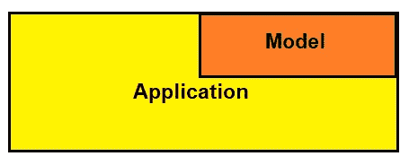
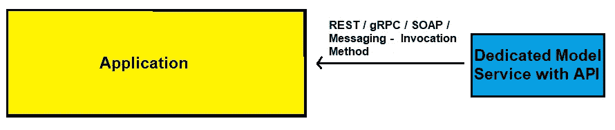
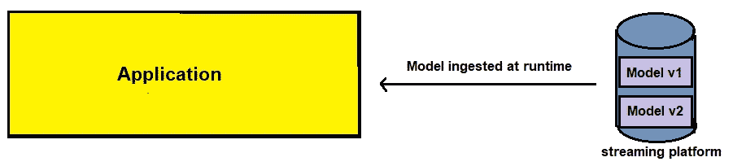

# 4 机器学习系统架构

> 原文：<https://towardsdatascience.com/4-machine-learning-system-architectures-e65e33481970?source=collection_archive---------24----------------------->

## 将机器学习投入生产


安德斯·吉尔登在 [Unsplash](https://unsplash.com?utm_source=medium&utm_medium=referral) 拍摄的照片

我大力提倡边做边学，事实证明这可能是学习机器学习的最佳方式。如果你是一名机器学习工程师(也可能是一名数据科学家)，当一个项目在[机器学习工作流程](/the-machine-learning-workflow-1d168cf93dea)的模型评估阶段结束时，你可能永远不会有成就感，就像你典型的 Kaggle 竞赛一样——不，我并不反对 Kaggle，我认为它是一个提高你建模技能的伟大平台。

下一步是将模型投入生产，这通常是大多数机器学习课程都忽略的主题。

[](/the-machine-learning-workflow-1d168cf93dea) [## 机器学习工作流程

towardsdatascience.com](/the-machine-learning-workflow-1d168cf93dea) 

> 声明:这篇文章是用机器学习模型的[部署](https://www.udemy.com/course/deployment-of-machine-learning-models/)课程(Udemy)的笔记写的

## 服务于 ML 模型的格式

一旦训练并导出了机器学习模型，下一步就是想出一种方法来持久化该模型。例如，我们可以用`pickle`序列化模型对象—参见下面的代码。

```
**import** pickle **import** pandas **as** pd **from** sklearn.metrics **import** accuracy_score 
**from** sklearn.datasets **import** load_breast_cancer
**from** sklearn.linear_model **import** LogisticRegression  
**from** sklearn.model_selection **import** train_test_split*# loading the data set*
dataset = load_breast_cancer(as_frame=**True**)
df = pd.DataFrame(data= dataset.data)
df["target"] = dataset.target*# Seperating to X and Y* 
X = df.iloc[:, :-1]
y = df.iloc[:, -1]

*# splitting training and test*
X_train, X_test, y_train, y_test = train_test_split(X, y, train_size=0.75, shuffle=**True**, random_state=24)*# training logistic regression model*
lr = LogisticRegression(C=0.01)
lr.fit(X_train, y_train)*# serializing the model* 
lr_dump = pickle.dumps(lr)*# making predictions with the model* 
clf = pickle.loads(lr_dump)
y_preds = clf.predict(X_test)
```

> **注**:当编写代码将机器学习模型投入生产时，工程师将上述代码模块化为训练和推理脚本，以遵守软件工程最佳实践。
> 
> 训练脚本的结尾由模型被转储到 pickle 文件的点来定义，而推理脚本在模型被加载以对新实例进行预测后开始。

为模型提供服务的其他方法包括:

*   **MLFlow** — MLFlow 提供了一种通用的序列化格式，可与 python 中的各种机器学习框架集成
*   与语言无关的交换格式(即 ONNX、PFA 和 PMML)

知道我们有其他选择总是好的，因为流行的`pickle`(或`joblib`)格式有一些缺点。

## 应用中嵌入的第一型号



嵌入式架构示例；作者图片

*   **预培训**:是
*   **即时预测**:是

在这种情况下，经过训练的模型作为依赖项嵌入到应用程序中。例如，我们可以通过`pip`安装将模型安装到应用程序中，或者可以在构建时将经过训练的模型从文件存储(即 AWS S3)拉入应用程序中。

这种情况的一个例子是，如果我们有一个用来预测属性值的 flask 应用程序。我们的 Flask 应用程序将提供一个 HTML 页面，我们可以使用该页面作为一个界面来收集用户想要了解其估计价值的房产信息。Flask 应用程序将这些细节作为输入，将它们转发给模型进行预测，然后将它们返回给客户端。

在上面的例子中，预测将被返回到用户的浏览器，但是，我们可以改变这种方法，将模型嵌入到移动设备中。

这种方法比其他方法简单得多，但是需要权衡简单性和灵活性。例如，要进行模型更新，整个应用程序必须重新部署(在移动设备上，需要发布新版本)。

## #2 专用模型 API



示例专用 ML 模型 API

*   **预训练**:是
*   **即时预测:**是的

在这种架构中，经过训练的机器学习模型成为独立的机器学习 API 服务的依赖项。从 Flask 应用程序扩展到预测上面的属性值示例，当表单被提交到 Flask 应用程序服务器时，该服务器可能会使用 REST、gRPC、SOAP 或消息传递(即 RabbitMQ)对专用于机器学习并专门负责返回预测的独立微服务进行另一次调用。

与嵌入式模型方法不同，这种方法在简单性和灵活性之间做出了妥协。由于我们必须维护一个独立的服务，这种架构的复杂性增加了，但是由于模型部署现在独立于主要的应用程序部署，因此有了更多的灵活性。此外，模型微服务或主服务器可以单独扩展，以处理更大的流量或潜在地服务于其他应用。

## #3 模型作为数据发布



流式部署示例；作者图片

*   **预培训:**是
*   **即时预测:**是的

在这种架构中，我们的培训流程将一个经过培训的模型发布到一个流式平台(即 Apache Kafka ),该平台将在运行时由应用程序使用，而不是在构建时使用——有资格订阅任何模型更新。

简单性和灵活性之间的权衡这个反复出现的主题又一次出现了。维护这个原型所需的基础设施需要更复杂的工程设计，但是 ML 模型可以在不需要重新部署任何应用程序的情况下进行更新——这是因为模型可以在运行时被吸收。

为了扩展我们对属性示例的预测值，应用程序将能够从指定的流服务(如 Apache Kafka)的专用主题中进行消费。

## #4 离线预测


离线架构示例；作者图片

*   **预培训:**是
*   **即时预测:**否

这种方法是我们将要探索的唯一的异步方法。预测由应用程序或作为调度作业异步触发和运行。预测将被收集和存储—这就是应用程序通过用户界面提供预测的用途。

行业中的许多人已经脱离了这种架构，但在某种意义上，预测在返回给用户之前可以被检查，这要宽容得多。因此，我们降低了 ML 系统出错的风险，因为预测不是即时的。

关于简单性和灵活性的权衡，这个系统为了更多的灵活性而牺牲了简单性。

## 包裹

有时，仅仅做一些分析，构建多个模型，并对它们进行评估会变得相当无聊。如果是这样的话，那么下一步可能是学习将机器学习模型投入生产，这是你工具箱中的一项强大技能。强调一下，对于您的模型部署来说，没有所谓的“最佳”系统架构。只有满足系统需求的最佳折衷方案。

*感谢您的阅读！*

**联系我:**
[LinkedIn](https://www.linkedin.com/in/kurtispykes/)
[Twitter](https://twitter.com/KurtisPykes)

如果你喜欢阅读这样的故事，并希望支持我的写作，可以考虑成为一名灵媒。每月支付 5 美元，你就可以无限制地阅读媒体上的故事。如果你使用[我的注册链接](https://kurtispykes.medium.com/membership)，我会收到一小笔佣金。

已经是会员了？[订阅](https://kurtispykes.medium.com/subscribe)在我发布时得到通知。

[](https://kurtispykes.medium.com/subscribe) [## 每当 Kurtis Pykes 发表文章时都收到一封电子邮件。

### 每当 Kurtis Pykes 发表文章时都收到一封电子邮件。通过注册，您将创建一个中型帐户，如果您还没有…

kurtispykes.medium.com](https://kurtispykes.medium.com/subscribe) 

## 相关文章

[](https://medium.datadriveninvestor.com/machine-learning-in-the-cloud-66bd25bc1a2b) [## 云中的机器学习

### 生产机器学习模型

medium.datadriveninvestor.com](https://medium.datadriveninvestor.com/machine-learning-in-the-cloud-66bd25bc1a2b) [](https://medium.datadriveninvestor.com/machine-learning-engineers-must-read-these-5-books-583e81922b84) [## 机器学习工程师必须阅读这 5 本书

### 打造机器学习工程师

medium.datadriveninvestor.com](https://medium.datadriveninvestor.com/machine-learning-engineers-must-read-these-5-books-583e81922b84) [](/essential-skills-for-machine-learning-engineers-720938c6e12b) [## 机器学习工程师的基本技能

towardsdatascience.com](/essential-skills-for-machine-learning-engineers-720938c6e12b)