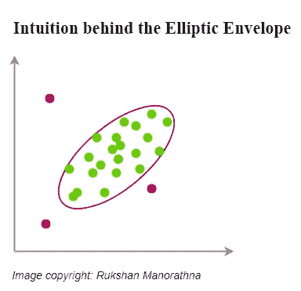
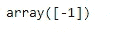

# Python 中用于离群点检测的 4 种机器学习技术

> 原文：<https://towardsdatascience.com/4-machine-learning-techniques-for-outlier-detection-in-python-21e9cfacb81d?source=collection_archive---------0----------------------->

## 基于机器学习的异常检测


保罗·卡罗尔在 [Unsplash](https://unsplash.com/?utm_source=unsplash&utm_medium=referral&utm_content=creditCopyText) 上的照片

根据读者在发表“[2021 年](/two-outlier-detection-techniques-you-should-know-in-2021-1454bef89331)你应该知道的两种离群点检测技术”后的反馈，我决定发表这篇文章，其中包括 Python 中离群点检测的四种不同的机器学习技术(算法)。在这里，我将对每种技术使用 I-I(直觉-实现)方法。这将帮助您理解每个算法在幕后如何工作，而无需深入算法数学(直觉部分)，并使用 Scikit-learn 机器学习库实现每个算法(实现部分)。我还将使用一些图形技术来描述每个算法及其输出。在这篇文章的最后，我将编写**“关键要点”**部分，其中将包括一些使用和组合这四种技术的特殊策略。所以，一定要看完。

阅读本文后，您将能够实现不同类型的机器学习技术来检测异常值，并根据数据选择最佳技术。您还将了解到技术术语的确切定义和区别，如****新奇检测*** 和 ***异常检测*** 。*

*我将按以下顺序讨论每个算法。*

1.  ***椭圆包络算法***
2.  ***隔离森林算法***
3.  ***单级 SVM 算法***
4.  ***局部离群因子(LOF)算法***

## *先决条件*

*我推荐你在读这一篇之前，先读一读“[2021 年你应该知道的两个离群点检测技术](/two-outlier-detection-techniques-you-should-know-in-2021-1454bef89331)”。了解那篇文章中讨论的主题将有助于理解今天的内容。*

## *关键定义*

*下面是贯穿本文的关键定义列表。*

*   ***异常值:**与其他数据点显著不同的异常数据点。*
*   ***离群点检测:**如果训练数据被离群点污染，则在训练数据集中找到离群点。*
*   ***新奇性检测:**发现一个新的看不见的观察值是否是异常值。这里，训练数据可能或可能没有被异常值污染，我们感兴趣的是发现一个新的看不见的观察值是否是异常值。如果那个观察值是一个异常值，我们称之为*。**
*   ****异常检测:**当我们将离群点检测和新奇点检测两者结合起来时，称为 ***异常检测*** 。**

****注:**在非技术用法中，离群点检测和新颖性检测没有区别。当我们从技术上实现它们时，它们之间有一个显著的区别。我将在椭圆包络算法下讨论这种差异。**

**让我们开始探索每种算法。**

# **1.椭圆包络算法**

**这已经在“[2021 年你应该知道的两种异常检测技术](/two-outlier-detection-techniques-you-should-know-in-2021-1454bef89331)中讨论过了。这里，将更多地强调使用该算法区分异常值检测和新颖性检测。**

**为了应用该算法，应该满足数据的正态性假设。**

## **直觉**

**下面是我在我的“[2021 年](/two-outlier-detection-techniques-you-should-know-in-2021-1454bef89331)你应该知道的两种离群点检测技术”帖子中对椭圆包络算法的直觉的看法。**

> **椭圆形信封背后的直觉非常简单。我们根据一些标准在数据点周围画一个椭圆，并将椭圆内的任何数据点分类为内点(绿色的)，将椭圆外的任何观察结果分类为外点(红色的)。**

****

**椭圆形信封背后的直觉(图片由作者提供)**

## **履行**

**椭圆包络算法的一般实现已经在我的“[2021 年](/two-outlier-detection-techniques-you-should-know-in-2021-1454bef89331)你应该知道的两种离群点检测技术”帖子中讨论过。在这里，我将从另一个角度讨论实现——使用该算法区分离群点检测和新颖性检测。**

****离群点检测****

**让我们编写 Python 代码，使用椭圆包络算法来检测异常值。**

**等到加载 Python 代码！**

****

**检测到的异常值用红色标记(图片由作者提供)**

**当我们想要使用 Scikit-learn**elliptic envelope()**函数检测 **X** (训练数据集)的异常值时，我们可以调用一次 **fit_predict(X)** 方法，或者分别调用 **fit(X)** 和 **predict(X)** 方法。两种方法给出的结果是一样的。**

****新颖性检测****

**让我们编写 Python 代码来看看一个新的看不见的观察值是否是异常值。新的看不见的数据点是(-4，8.5)。**

**等到加载 Python 代码！**

****

**新的观察结果用橙色标记(图片由作者提供)**

```
**pred**
```

****

**(图片由作者提供)**

**由于 ***pred*** 返回-1，新的未被发现的数据点(-4，8.5)是一个新奇的东西。**

**当我们想要使用 sci kit-learn**elliptic envelope()**函数来查看一个新的看不见的观察值是否是异常值时，我们应该首先调用 **fit(X)** 然后调用 **predict(new_data)** 。**

**这就是 ***离群点检测*** 和 ***新奇点检测*** 的区别。当我们把两者结合起来时，我们称之为 ***异常检测*** 。**

# **2.隔离森林算法**

****隔离森林**是一种基于树的算法，对于高维数据中的离群点和新奇点检测都非常有效。**

## **直觉**

**以下是 Scikit-learn 官方文档对隔离森林算法的直觉的描述。**

> **IsolationForest 通过随机选择一个要素，然后随机选择所选要素的最大值和最小值之间的分割值来“隔离”观察值。**

## **履行**

**由于隔离森林算法可以应用于高维数据，这里我们将其应用于一个 4 维的“iris 数据集”。出于可视化的目的，我们应用主成分分析将 4 维数据简化为可以绘制成 2D 图的 2 维数据，同时保留原始数据中 95.8%的变化！**

**下面是代码！**

**等到加载 Python 代码！**

****

**(图片由作者提供)**

**隔离森林算法中最重要的超参数是**污染**超参数——一个我们不知道的值。它表示数据集中异常值的比例。这个超参数的值的范围是从 0 到 0.5。如果我们认为数据中会有许多异常值，我们可以将**污染**设置为一个较大的值。不知道数据集中异常值的确切比例是使用这种方法的主要限制。**

# **3.一类 SVM 算法**

****单类 SVM** (单类支持向量机)是一种无监督的机器学习算法，可用于新颖性检测。它对异常值非常敏感。因此，对于离群点检测来说，它不是很好，但是当训练数据没有被离群点污染时，它是新颖性检测的最佳选择。该算法可以应用于高维数据集，并且在数据的分布中没有潜在的假设。**

## **直觉**

**一级 SVM 是基于 SVM。SVM 使用超平面来分隔两个类，而一类 SVM 使用超球面来包含所有的观察。**

## **履行**

**由于一类 SVM 不太适合离群点检测，这里我们用它来进行新颖性检测。**

**这是代码。**

**等到加载 Python 代码！**

****

**(图片由作者提供)**

```
**pred**
```

****

**(图片由作者提供)**

**由于 ***pred*** 返回-1，新的看不见的数据点(-4，8.5)是新奇的。**

# **4.局部异常因子(LOF)算法**

****局部离群因子(LOF)** 是一种无监督的机器学习算法，最初是为了离群点检测而创建的，现在也可以用于新奇点检测。它适用于高维数据集。**

## **直觉**

**以下是 Scikit-learn 官方文档对局部离群因子算法的直觉的描述。**

> **局部异常值因子(LOF)算法是一种无监督的异常值检测方法，它计算给定数据点相对于其邻居的局部密度偏差。它将密度远低于其相邻样本的样本视为异常值。**

## **履行**

**这种技术的实现在异常值检测和新颖性检测之间有很大的不同。让我们先讨论一下这两者的区别。**

****在离群点检测中****

**当应用这种技术进行异常值检测时，没有 **predict()** 方法，只有一个 **fit_predict()** 方法，该方法应该与训练数据(X)一起使用。**

****在新颖性检测中****

**如果您想使用局部异常值因子进行异常检测(即发现一个新的未观察到的观察值是否为异常值)，您应该将 ***异常值*** 超参数设置为**真**(默认为**假**)。应用这种技术进行新颖性检测时，有 **fit()** 和 **predict()** 两种方法。 **fit()** 方法应该用于训练数据(X ),而 **predict()** 方法应该用于新的未见过的数据，而不是训练数据(X)。**

**首先，我们使用 LOF 编写用于异常值检测的 Python 代码。这是代码。**

**等到加载 Python 代码！**

****

**(图片由作者提供)**

**现在，我们使用 LOF 编写用于新奇检测的 Python 代码。这是代码。**

**等到加载 Python 代码！**

****

**(图片由作者提供)**

```
**pred**
```

****

**(图片由作者提供)**

**由于 ***pred*** 返回-1，新的看不见的数据点(-4，8.5)是一个新奇点。**

# ****关键要点****

**今天，我们讨论了四种检测异常值的机器学习技术。所有技术的实现都非常相似，除了 LOF，在那里离群点检测和新颖性检测之间的差异开始起作用。**

**隔离森林和 LOF 在高维数据上工作良好。为了可视化的目的，我们可以应用主成分分析来降低高维数据的维数。**

**椭圆包络线只能用于满足正态假设的数据。**

**一类 SVM 不太适合离群点检测，但当训练数据没有被离群点污染时，它是新颖检测的最佳选择。**

**椭圆包络、隔离林和 LOF**T1 中最重要的超参数是**污染**超参数。它表示数据集中异常值的比例。在大多数情况下，我们不知道**污染**超参数的准确值。猜测值的最佳方法是首先进行基于 IQR 的检测，并统计数据集中离群值的数量(参见“[2021 年你应该知道的两种离群值检测技术](/two-outlier-detection-techniques-you-should-know-in-2021-1454bef89331)”)。由于您知道观察值的总数，因此您可以获得异常值比例的近似值。这是**污染**超参数的值！****

**今天的帖子到此结束。我的读者可以通过下面的链接注册成为会员，以获得我写的每个故事的全部信息，我将收到你的一部分会员费。**

****报名链接:**[https://rukshanpramoditha.medium.com/membership](https://rukshanpramoditha.medium.com/membership)**

**非常感谢你一直以来的支持！下一个故事再见。祝大家学习愉快！**

**特别感谢 Unsplash 上的 **Paul Carroll** ，他为我提供了这篇文章的漂亮封面图片。**

**[鲁克山·普拉莫迪塔](https://medium.com/u/f90a3bb1d400?source=post_page-----21e9cfacb81d--------------------------------)
**2021–03–27****