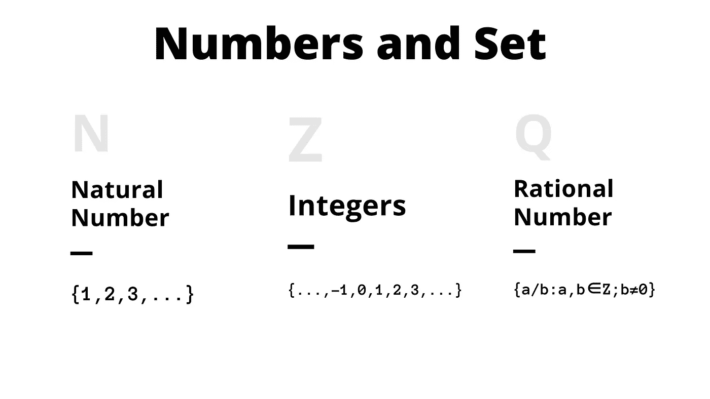
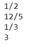

# 数据科学家的 4 个数学数字和集合概念

> 原文：<https://towardsdatascience.com/4-mathematical-numbers-and-set-concept-for-data-scientist-b3587611070f?source=collection_archive---------12----------------------->

## 理解机器学习数学的基础知识(使用 Python)



作者图片

> 如果您喜欢我的内容，并希望获得更多关于数据或数据科学家日常生活的深入知识，请考虑在此订阅我的[简讯。](https://cornellius.substack.com/welcome)

当我们第一次学习机器学习时，可能会很有挑战性，因为许多奇怪的符号和数学概念很难理解。特别是对于那些没有受过正规教育的人来说，这就像学习一门新的语言。

我觉得人们在为机器学习而学习数学时需要理解的一个基本概念是数字和集合概念。许多简单的推进方程将包括这些数字概念，不同的数字导致不同的结论。

在这篇文章中，我将解释数学中数字和集合的概念，并用编码例子来帮助你。让我们开始吧。

# **1。自然数**

自然数是一个**正整数**。它从一(1)开始到无穷大，无穷大也用于计数。自然数是一个正整数，这意味着它不包括任何分数(1/2，1/4，2/3 等。)且不包括零(0)。此外，自然数不包括任何负数。

这组自然数被表示为符号**“N”。**如果我们用数学表示法陈述，那将是:

> N =从 1 开始的所有数字的集合

或者我们也可以用另一种形式来表达:

> N = {1，2，3，4，5，6，7，8，9，…}

自然数本身具有一些它们独有的性质，例如:

1.  **实数是有顺序的**，也就是说数值之间是有顺序的。6 高于 5，5 高于 3。
2.  **实数是无限的**。你永远不会用完自然数，因为每个自然数总有一个更大的值。
3.  **实数相加或相乘时为闭包**。闭包意味着当你做一个算术运算的时候；结果总是产生来自同一集合的数字。5 是一个自然数，当你做一个加法运算 5 + 5 的时候，会得出一个自然数。
4.  **实数相加或相乘时是关联的**。关联意味着无论自然数如何分组，算术运算都是可能的。5 + (6 +7)类似于(5 + 6) + 7。
5.  **实数相加或相乘时是可交换的**。可交换意味着运算的顺序与结果无关。5 + 6 等于 6 + 5。

使用 Python，我们可以确定一个数是否是实数。我将开发一个函数，检查输入的数字是不是自然数。

```
def check_natural(x):
    if x > 0 and isinstance(x, int):
        return True
    else:
        return False
```

当我们输入一个整数和大于 0 的数字时，上面的函数将产生 True。你可以自己试试。

# **2。整数**

在前一段中，自然数是一个正整数。这意味着自然数是整数的一部分。然而，什么是整数呢？**整数可以是正数、负数或零(0)，但不是分数**。整数一词源于拉丁语“整数”，意为整体。

整数集合被表示为符号**“Z”。**如果我们用数学表示法陈述，那将是:

> Z =除分数以外的所有数字的集合

或者我们也可以用另一种形式来表达:

> Z = {…，-4，-3，-2，-1，0，1，2，3，4，…}

整数本身有一些独特的属性，例如:

1.  **整数是有顺序的。**
2.  **整数是无限的**。
3.  **整数相加或相乘时是闭包**。
4.  **整数相加或相乘时是相联的**。
5.  **整数相加或相乘时是可交换的**。

在 Python 中，整数是编程语言中默认可用的数据类型。要检查您的数据是否是整数，您只需要使用下面的代码。

```
#Replace x with number
isinstance(x, int)
```

# 3.有理数

**有理数是两个整数之间的比值，或者通常称为分数(p/q)，其中分母(q)不等于零(0)** 。有理数的例子有 1/2、3/7、2/5 等。(p 和 q 都是正整数的正有理数)或 1/-2、-4/7、-5/6 等。(负有理数，其中 p 或 q 是负整数)。有理数除法的结果是一个小数。同样，零(0)是一个有理数，而每个整数都是有理数，因为 5/1 等于 5。

有理数的集合被表示为符号**“Q”。**如果我们用数学表示法陈述，那将是:

> Q =分数的集合数(p/q)

或者我们也可以用另一种形式来表达:

> Q = {p/q: p，q ∈ Z，b ≠ 0}

有理数本身有一些独特的性质，例如:

1.  有理数在加、乘或减时是封闭的。
2.  **有理数相加或相乘时是相联的**。
3.  **有理数相加或相乘时是可交换的**。

在 Python 中， **Float** 是由有理数除法得出的数据类型。然而，如果你需要一个有理数(以 p/q 的形式)，你可以使用内置的 Python 模块，名为 **fractions** 。

```
#Use case example
from fractions import Fraction
print(Fraction(1, 2))
print(Fraction(12, 5))
print(Fraction(2, 6))
print(Fraction(9, 3))
```



Python 中的有理数(图片作者提供)

# 4.无理数

**无理数** **是不能用分数表示的数(p/q)，其中 p 和 q 是整数，q 不等于零(0)** 。这是有理数的矛盾。无理数的计算很复杂，一个 n **无理数的**小数展开既不终止也不重现**(小数继续不重复)。无理数的一个例子是√5 或π。**

有理数集被表示为符号**“R \ Q”或“P”。**如果我们用数学表示法陈述，那将是:

> P=不是有理数(Q)的实数集(R)

无理数本身没有什么独特的性质，例如:

1.  **无理数和有理数相加得出无理数。**
2.  **无理数与非零有理数相乘产生无理数。**
3.  **无理数的集合在乘法过程下是不闭的，不像有理数的集合。**

在 Python 中没有明确的方法来检查一个数是否是无理数，因为从数学上讲，没有明确的证据来检查每一个无理数。

# **结论**

作为数据科学家，我们被期望理解机器学习，如果你想自信地理解机器学习概念，你需要学习数学。最基本的数学概念是在理论中经常出现的数和集合概念。

在本文中，我向您展示了 4 个数字和集合概念，它们是:

1.  **自然数**
2.  **整数**
3.  **有理数**
4.  **无理数**

希望有帮助！

在我的[**LinkedIn**](https://www.linkedin.com/in/cornellius-yudha-wijaya/)**或 [**Twitter**](https://twitter.com/CornelliusYW) **上访问我。****

> **如果您没有订阅为中等会员，请考虑通过[我的推荐](https://cornelliusyudhawijaya.medium.com/membership)订阅。**