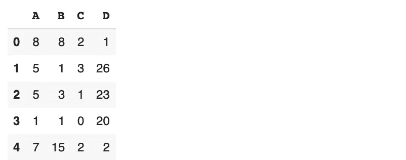
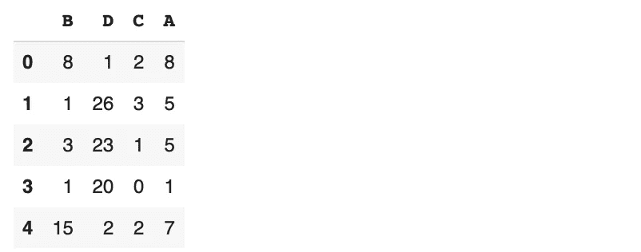
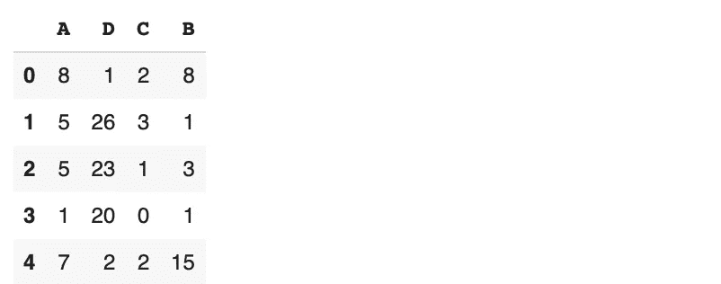
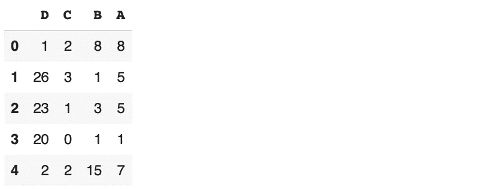

# 更改熊猫数据框列顺序的 4 种方法

> 原文：<https://towardsdatascience.com/4-methods-for-changing-the-column-order-of-a-pandas-data-frame-a16cf0b58943?source=collection_archive---------2----------------------->

## 举例说明。


Elena Mozhvilo 在 [Unsplash](https://unsplash.com/s/photos/arrange?utm_source=unsplash&utm_medium=referral&utm_content=creditCopyText) 上的照片

熊猫是数据科学生态系统中最受欢迎的工具之一。这是一个用于数据分析和操作的 Python 库。

Pandas 提供了许多函数和方法来有效地处理表格数据。您可以轻松清理、操作或处理存储在数据框中的数据。

熊猫数据框由带标签的行和列组成。在本文中，我们将介绍 4 种改变数据框中列顺序的方法。这听起来像是一个过于具体的任务。但是，在某些情况下，您需要更新列顺序。

让我们从导入库和创建样本数据框开始。

```
import numpy as np
import pandas as pddf = pd.DataFrame({
   "A": np.random.randint(10, size=5),
   "B": np.random.randint(20, size=5),
   "C": np.random.randint(5, size=5),
   "D": np.random.randint(30, size=5)
})df
```



(图片由作者提供)

我们有一个 4 列 5 行的数据框。这些值是由 Numpy 的 randint 函数生成的随机整数。

## 第一种方法

我们可以使用 iloc 方法来更改或更新列的顺序，如下所示:

```
df.iloc[:, [2,3,1,0]]
```


(图片由作者提供)

iloc 方法适用于索引。逗号前的冒号表示我们需要所有的行。逗号后面的列表包含列索引。只要索引存在于数据帧中，我们可以按任何顺序排列索引。

## 第二种方法

loc 方法类似于 iloc 方法，但它使用标签而不是索引。因此，我们可以通过创建一个带有列标签的列表来对列进行重新排序。

```
df.loc[:, ["B","D","C","A"]]
```



(图片由作者提供)

我们不必选择所有的行和列。loc 和 iloc 方法都允许选择行和列的子集。

例如，我们可以选择前 3 行以及 A 列和 C 列，如下所示:

```
df.loc[:3, ["C","A"]]
```

请务必注意，数据框的行标签和索引是相同的。Pandas 默认为行分配整数标签。除非我们更改行标签，否则我们使用 loc 和 iloc 方法选择行的方式是相同的。

## 第三种方法

Pandas 还允许通过传递如下列表来选择列的子集:

```
df[["A","D","C","B"]]
```



(图片由作者提供)

它类似于 loc 和 iloc 方法，但是我们无法控制要选择哪些行。所有的列都被选中，我们只能指定列名和顺序。

## 第四种方法

这种方法可以认为是第三种方法的特例。它包含了基本 Python 的一些特性，比如反转列表。

考虑这样一种情况，我们有一个包含大量行的数据框，我们需要颠倒列的顺序。

我们可以创建一个列列表并反转它。这个反向列表可以像第三种方法一样用于选择列。

```
cols = list(df.columns)
cols.reverse()df[cols]
```



(图片由作者提供)

Python 的反向方法工作正常。因此，它不返回任何内容，而是反转列表。

我们也可以通过使用索引来反转列表。这是执行相同操作的不同方式。

```
cols = list(df.columns)df[cols[::-1]]
```

表达式“[::-1]”选择步长为-1 的列表中的所有项目。因此，它通过向后进行选择。结果，名单颠倒了。

## 结论

我们在本文中介绍的内容演示了如何更改数据框中列的顺序。这些方法也可用于选择数据帧的子集。

更改列顺序的一个典型用例是当我们需要组合多个数据框时。如果数据框是沿着行轴组合或连接的(即一个在另一个之上)，则列的顺序必须相同。

感谢您的阅读。如果您有任何反馈，请告诉我。