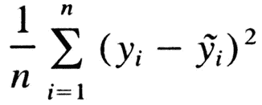
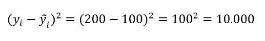
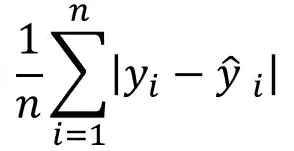
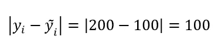
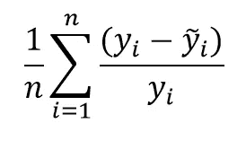
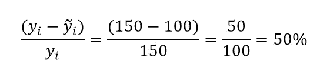
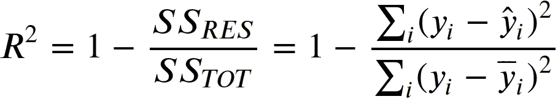
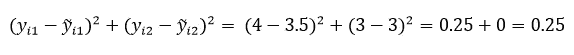
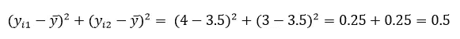
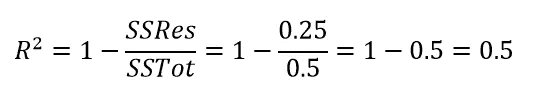

# 评估您的回归模型的 4 个指标

> 原文：<https://towardsdatascience.com/4-metrics-to-evaluate-your-regression-models-885e9caeee57?source=collection_archive---------6----------------------->

## 了解可用于评估回归模型的最常用指标——在本文中，我们将探讨 4 个指标，包括它们的含义和假设

engin AK yurt@ unsplash.com 摄影

回归问题是数据科学和机器学习最常解决的问题之一。当您想要预测一个具有(理论上的)无限个值的目标时，您正在处理一个回归问题，例如:

*   根据某人的教育水平、经验等来预测他们的收入。；
*   根据房子的特点预测房子的价值；
*   根据股票组合的成分预测其回报；

在你开发了一个回归模型之后，有很多度量标准你可以选择来评估你的模型- **，每一个都有它自己的一套特征**。

如果每个度量不同，我们可以说它们是模型误差的不同表示，并且它们可以(主要)用于两个目的:

*   用作项目成功的最终定义——哪个指标是传达给涉众的。
*   作为优化算法中的成本函数(您希望最小化的函数)。

**衡量标准对于理解你的模型的表现至关重要。让我们更深入地了解其中的一些吧！**

# 均方误差

回归算法最常用的指标之一是均方误差(MSE)，MSE 被线性回归或神经网络等多种算法广泛用作成本函数。

基本上，均方误差由以下公式组成:

均方误差公式

想象你有一个 200 的真实值，你预测，例如，150 的值。这个单个例子对算法的总误差的贡献将是:

我们的例子将为我们的误差贡献大约 10.000 个单位！一旦你计算出你的样本的每个例子的所有误差，你只需平均它们，你就获得了 ***均方误差(MSE)。***

**关于 MSE 的一些细节:**

*   由于公式中平方的应用，MSE 惩罚大的误差。
*   不利的一面是，它在目标的规模上是不可解释的——特别是如果你想传达你的错误。

MSE 被用作评估算法的一种方式，并且默认情况下，在许多解决回归问题的实现中通常被用作成本函数。

与 MSE 类似的概念是 RMSE(均方根误差)，唯一的区别是对 MSE 应用平方根。这使你有一个更符合目标大小的误差。

或者，有另一个度量向我们显示目标星等的误差——让我们知道它！

您可以使用以下资源了解有关 MSE 的更多信息:

*   [R 为数据科学 ***Udemy 课程***](https://www.udemy.com/course/r-for-data-science-first-step-data-scientist/?referralCode=6D1757B5E619B89FA064) ***—度量板块***
*   [MSE 维基百科页面](https://en.wikipedia.org/wiki/Mean_squared_error)
*   [Sklearn MSE 实现](https://scikit-learn.org/stable/modules/generated/sklearn.metrics.mean_squared_error.html)

# 平均绝对误差

平均绝对误差是一个误差指标，它使用与目标相同的尺度来显示我们预测的误差:

平均绝对误差公式

**MSE 和平均绝对误差(MAE)之间的主要差异在于我们对目标的预测值和实际值之间的差异进行的转换。**在 MSE 中，我们应用平方函数，而在 MAE 中，我们应用绝对值。

实际的含义是，我们现在在目标的尺度上评估我们的误差。例如，如果我们有一个以美元衡量的目标，我们可以说“平均而言，我们缺少目标的金额是 *x* (MAE 值)美元。”。我们不能对 MSE 这样做。

对于我们在 MSE 中使用的示例，如果我们预测目标值为 100，而实际值为 200，则该示例对总体误差的贡献为 100，如下式所示:

**然后，我们对所有示例的值进行简单平均，得到完整的 MAE。**

关于 MAE 的一些重要细节:

*   不惩罚大的错误。
*   当您不希望异常值在您的优化中扮演重要角色时，您可以将它用作成本函数。请注意，使用 MAE 有时会导致收敛问题(特别是在复杂的模型中)。
*   它会产生一个目标量级的误差项，这有利于解释。

MAE 对于向风险承担者传达预期的错误非常有价值。虽然 MSE 通常被用作成本函数，但 MAE 在可解释性和与“真实世界”的关系方面具有优势。这一特性使得评估您的算法对于您试图解决的业务问题是否产生了可接受的误差变得更加容易。

您可以使用以下资源了解有关 MAE 的更多信息:

*   [R 为数据科学 ***Udemy 课程***](https://www.udemy.com/course/r-for-data-science-first-step-data-scientist/?referralCode=6D1757B5E619B89FA064) ***—度量部分***
*   [MAE 维基百科页面](https://en.wikipedia.org/wiki/Mean_absolute_error)
*   [Sklearn MAE 实现](https://scikit-learn.org/stable/modules/generated/sklearn.metrics.mean_absolute_error.html)

# 平均绝对百分比误差(MAPE)

虽然 MAE 给了你价值，你可以和涉众讨论它是否可以接受——但是这个度量从来没有给你多少“错误”是可以接受的暗示。

例如，如果你有 10 美元的平均绝对误差，这是不是太多了？或者这是可以接受的？真的要看你目标的尺度！

虽然对误差的接受程度是一个与项目范围相关的度量标准，**但是了解误差偏离目标的百分比是有好处的。**

平均绝对百分比误差(MAPE)以百分比的形式给出了误差项，这使您可以很好地了解“平均”偏差形式的误差项。

**MAPE 因其性质在时间序列问题中很常见。实际上，这是沟通这些问题的一个很好的指标，因为你可以清楚地说明“平均”你的预测会偏离 x%。**

你也可以使用 MAPE 作为评估其他连续变量模型的方法，尽管这取决于你的目标的期望值——MAPE 不太擅长处理接近零的值。

MAPE 的公式很简单:

平均绝对百分比误差公式

如果我们的预测值为 100，而实际值为 150，则绝对百分比误差为:

这个值为我们提供了一个很好的度量标准来理解我们的误差和目标的比例之间的关系。

一些特征:

*   当实际值为 0 时，它可能会在处理错误时遇到一些麻烦。当您的示例中有这样的例子时，建议使用其他指标，如 [MASE](https://en.wikipedia.org/wiki/Mean_absolute_scaled_error) 。
*   MAPE 在处理接近于零的值时有些困难。如果这些值是您的目标所期望的，那么您应该选择另一个指标。

您可以通过以下资源了解更多关于 MAPE 的信息:

*   [MAPE 维基百科页面](https://en.wikipedia.org/wiki/Mean_absolute_percentage_error)
*   [Sklearn MAPE 实施](https://scikit-learn.org/stable/modules/generated/sklearn.metrics.mean_absolute_percentage_error.html)

# r 平方

通俗地说，R 平方是你的模型所解释的方差的比例。

这看起来很复杂，但实际上很容易理解。让我们先来看看 R 平方公式:

r 平方公式

分数的上半部分看起来真的很熟悉！这是因为它由误差平方和( *SSRes，来自残差平方和*)组成——你的算法越差，这个值就越高。

假设我们有两个例子，预测由数组[3.5，3]组成，而真实目标由值[4，3]组成，这两个例子之间的 *SSRes* 将是:

公式的分母呢？我们计算残差的总和——在实践中，我们比较如果我们只是预测目标的平均值，我们的误差会是多少，**我们能想到的最天真的分类器。**

对于上面的例子，我们的“幼稚”分类器，将我们所有的例子分类为 3.5，4 和 3 之间的平均值，目标的真实值。我们可以使用以下基本原理计算平方和( *SSTot* ):

既然我们已经有了 *SSRes* 和 *SSTot，*我们可以将它们代入 R 平方公式:

我们的 R 平方包含一个介于 0 和 1 之间的值(尽管有些异常，您可能会有负值)，其中 1 是一个非常好的模型，0 是一个随机的模型。

请注意， *SSRes(残差平方和)越低，*R 平方值越高。这意味着，与仅预测平均值的模型相比，预测的误差越低，您的模型就越好。

您可以使用以下资源了解有关 R 平方的更多信息:

*   [R For Data Science***Udemy course***](https://www.udemy.com/course/r-for-data-science-first-step-data-scientist/?referralCode=6D1757B5E619B89FA064)***—Metrics Section***
*   [R 平方维基百科页面](https://en.wikipedia.org/wiki/Coefficient_of_determination)
*   [可汗学院 R 平方文章](https://www.khanacademy.org/math/ap-statistics/bivariate-data-ap/assessing-fit-least-squares-regression/a/r-squared-intuition)

就是这样！这些指标是评估数据科学和机器学习回归模型的一些最常见的指标。在开发过程中，您可能只检查其中的一些，但是理解使用不同度量评估模型背后的含义不会有什么坏处！

你还有其他常用的度量标准来评估你的回归模型吗？写在下面的评论里，我很想听听你的看法！

***我在*** [***Udemy 课程***](https://www.udemy.com/course/r-for-data-science-first-step-data-scientist/?referralCode=6D1757B5E619B89FA064) ***里开设了一门学习数据科学的课程——这门课程适合初学者，我希望你能在身边。***

<https://ivopbernardo.medium.com/membership> 