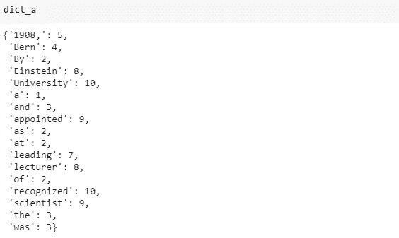

# Python 字典的 4 个必备特性

> 原文：<https://towardsdatascience.com/4-must-know-features-of-python-dictionaries-d62af8c22fd2?source=collection_archive---------3----------------------->

## 通过更有效地使用字典来提升你的脚本


由 [Unsplash](https://unsplash.com/s/photos/dictionary?utm_source=unsplash&utm_medium=referral&utm_content=creditCopyText) 上的 [Element5 数码](https://unsplash.com/@element5digital?utm_source=unsplash&utm_medium=referral&utm_content=creditCopyText)拍摄

数据结构是程序的关键组成部分。它们以特定的方式保存或包含数据，以使程序更有效地工作。如何访问存储在数据结构中的数据也至关重要。

字典是 Python 中的核心数据结构之一。字典包含键值对。一个值可以很容易地通过它的键来访问。这里有一个简单的例子:

```
members = {1001: "John", 1002: "Jane", 1003: "Emily"}print(members[1001])
John
```

在本文中，我们将讨论 Python 字典的 4 个必须知道的特性。它们对于有效和恰当地使用词典是必不可少的。

## 1.字典是无序的

字典包含键-值对，但不拥有这些对的顺序。因此，更精确的定义是，字典是一个无序的键值对集合。

因此，我们无法执行与项目顺序相关的典型操作。例如，不可能得到字典中的第一个或最后一个条目。

数字索引的另一个常见操作是切片。它可以在 Python 列表上执行:

```
mylist = ["John", "Jane", "Emily"]print(mylist[0])
Johnprint(mylist[1:])
['Jane', 'Emily']
```

与列表不同，词典是按关键字索引的。因此，由于没有顺序，不可能在字典上进行这些操作。我们可以通过传递方括号中的键或 get 方法来访问一个值。

```
members = {1001: "John", 1002: "Jane", 1003: "Emily"}members[1001]
'John'members.get(1001)
'John'
```

需要注意的是，缺少顺序并不是 Python 字典的缺陷。其实可以认为是一种实力。它们允许快速访问和检索与特定键相关联的信息。

## 2.密钥是唯一的

字典关键字必须唯一。这是有意义的，因为我们用它们来访问值。拥有重复的键违背了使用字典存储信息的目的。

虽然字典不允许创建重复的键，但是如果多次使用同一个键，它也不会发出警告。因此，您需要格外小心，不要导致任何意外的行为。

让我们看几个例子，让它更清楚。

```
members = {1001: "John", 1002: "Jane", 1003: "Emily", 1001: "Max"}print(members)
{1001: 'Max', 1002: 'Jane', 1003: 'Emily'}
```

我们使用同一个密钥(1001)两次，但是没有得到任何错误。相反，Python 会用新值覆盖以前的值。

更新字典时会观察到相同的行为。我们可以向字典中添加一个新条目，如下所示:

```
members[1004] = "Ashley"print(members)
{1001: 'Max', 1002: 'Jane', 1003: 'Emily', 1004: 'Ashley'}
```

键 1004 不在成员字典中，所以用给定值添加。如果我们使用相同的方法并传递一个已经在字典中的键，它的值将被更新。

```
members[1001] = "AAAAA"print(members)
{1001: 'AAAAA', 1002: 'Jane', 1003: 'Emily', 1004: 'Ashley'}
```

因此，它更像是更新一个键值，而不是创建一个新的键值对。

## 3.键必须是不可变的

字典键必须是不可变的类型。字符串和数字是作为字典键最常用的两种数据类型。我们也可以使用元组作为键，但它们必须只包含字符串、整数或其他元组。

我们已经创建了一个带有整数键的字典。让我们用字符串和元组键再创建几个。

```
# string keys
dict_a = {"Param1": "value1", "Param2": "value2"}
print(dict_a)
{'Param1': 'value1', 'Param2': 'value2'} # tuple keys
dict_b = {(1, 10): "value1", (1,20): "value2"}
print(dict_b)
{(1, 10): 'value1', (1, 20): 'value2'}
```

如果我们试图创建一个可变(即不可变)类型的键，就会出现类型错误。

```
dict_c = {[1, 2] : "value1", [1,4]: "value2"}
TypeError: unhashable type: 'list'dict_d = {(1, [1,2]): "value1"}
TypeError: unhashable type: 'list'
```

## 4.词典理解

用 Python 创建字典有几种方法。一种方法是用花括号写键值对，就像我们到目前为止所做的那样。

另一个选项是`dict`构造函数，它从一系列键值对中创建一个字典。

```
sequence = [[1, "John"], [2, "Jane"]]dict(sequence)
{1: 'John', 2: 'Jane'}
```

词典理解类似于列表理解的概念。这是创建包含一组结构化值的字典的更实用的方法。

考虑我们有下面的文本。

```
text = "By 1908, Einstein was recognized as a leading scientist and was appointed lecturer at the University of Bern"
```

我们想大致了解一下这篇课文中单词的长度。我们可以创建一个包含单词及其长度的字典。字典理解完成这项任务简单如下:

```
dict_a = {x: len(x) for x in text.split(" ")}
```

我们在空格字符处分割文本，并将每个单词作为一个键。这些值是通过对单词调用内置的`len`函数来计算的。



(图片由作者提供)

值得强调的是，我们没有得到任何关于单词在文本中出现次数的信息。这本词典由独特的词组成。

## 结论

字典是 Python 中非常重要的数据结构。在其他编程语言中，它们有时被称为“关联数组”。它们允许快速检索关于条目的信息。让我们打个比方来演示字典的用法。

考虑一个没有任何组织结构的地址簿。当一个新项目被添加时，它被写在最后。为了在这本书里查找地址，你要从头开始读。在《你不幸运》中，你可能不得不一直读到最后才能找到你要找的东西。

如果这个地址簿中的每个字母都有一个单独的部分，并且地址是根据它们的首字母存储的，那么查找地址就容易多了。字典提供了这样一个简单的查找方法。我们给他们密钥，他们返回相关的值。

感谢您的阅读。如果您有任何反馈，请告诉我。