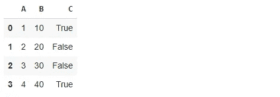

# 4 个必须知道的 Python 数据结构

> 原文：<https://towardsdatascience.com/4-must-know-python-data-structures-95bfc0844a06?source=collection_archive---------21----------------------->

## 实例实用指南


照片由[gatan Werp](https://unsplash.com/@gaetanwerp?utm_source=unsplash&utm_medium=referral&utm_content=creditCopyText)在 [Unsplash](https://unsplash.com/s/photos/tidy?utm_source=unsplash&utm_medium=referral&utm_content=creditCopyText) 上拍摄

数据结构是任何编程语言的重要组成部分。如何存储和管理数据是创建高效程序的关键因素之一。

Python 有 4 种内置数据结构:

*   目录
*   一组
*   元组
*   词典

它们在存储和访问数据方面都有不同的特性。这些差异很重要，因为什么最适合特定的任务取决于它们。如何与这些数据结构交互或操作它们也是不同的。

# 目录

列表是对象的集合，用方括号表示。

```
mylist = [1, 2, "a", True]
```

*   列表可用于存储任何数据类型或混合数据类型的对象。
*   列表是可变的。我们可以在列表中添加新项目或删除现有项目。

```
mylist.append(5)
mylist
[1, 2, 'a', True, 5]mylist += ["b"]
mylist
[1, 2, 'a', True, 5, 'b']mylist.insert(0, "first")
mylist
['first', 1, 2, 'a', True, 5, 'b']mylist.remove(2)
mylist
['first', 1, 'a', True, 5, 'b']
```

insert 方法在指定的索引处添加新项。

*   列表是有序的。因此，我们可以通过它们的位置来访问项目。

```
mylist[0]
'first'mylist[-1]
'b'mylist[:3]
['first', 1, 'a']
```

*   我们可以使用 extend 方法或“+=”操作来组合多个列表。

```
first = [1, 2, 3]
second = [4, 5, 6]
first += second
print(first)
[1, 2, 3, 4, 5, 6] first.extend(second)
print(first)
[1, 2, 3, 4, 5, 6, 4, 5, 6]
```

如果对此操作使用 append 方法，新列表将作为新项目添加。

```
first = [1, 2, 3]
second = [4, 5, 6]
first.append(second)
print(first)
[1, 2, 3, [4, 5, 6]]
```

# 一组

Set 是对象的集合，用花括号表示。

*   集合包含唯一的项目。即使您尝试在一个集合中存储重复的项目，每个不同的对象也只有一个。

```
myset = {1, 2, 3, 3, 4}print(myset)
{1, 2, 3, 4}
```

*   集合中的项目必须是可散列的。在某种意义上，hashable 意味着不可变。Python [文档](https://docs.python.org/3.1/glossary.html)中对 hashable 的定义如下:

*如果一个对象有一个在它的生命周期内从不改变的哈希值(它需要一个*[*_ _ hash _ _()*](https://docs.python.org/3.1/reference/datamodel.html#object.__hash__)*方法)，那么这个对象就是可散列的，并且可以与其他对象进行比较(它需要一个*[*_ _ eq _ _()*](https://docs.python.org/3.1/reference/datamodel.html#object.__eq__)*方法)。比较相等的可散列对象必须具有相同的散列值。*

例如，我们不能在集合中使用列表，因为列表是可变的。

*   需要强调的是，集合包含不可变的项，但是集合本身是可变的。因此，我们可以向集合中添加新的项目，也可以删除现有的项目。

```
myset = {1, 2, 3, 4, 5}
myset.add(6)
print(myset)
{1, 2, 3, 4, 5, 6}myset.remove(2)
{1, 3, 4, 5, 6}
```

*   由于集合是无序的，它们是不可订阅的，这意味着它们不支持索引和切片操作。
*   update 方法可用于用新集合更新集合。从某种意义上说，它意味着将一个集合添加到另一个集合。由于集合中不能有重复的项目，因此只会添加新的项目。

```
myset = {1, 2, 3}
newset = {3, 4, 5}
myset.update(newset)print(myset)
{1, 2, 3, 4, 5}
```

# 元组

元组是对象的集合，用括号表示。

```
mytuple = (1, 2, 2, 3)print(mytuple)
(1, 2, 2, 3)
```

*   与列表和集合不同，元组是不可变的。因此，我们不能向元组中添加项目或删除现有的项目。元组也不支持项赋值。
*   我们不能编辑一个元组，但是我们可以将多个元组组合(或连接)在一起。

```
a = (1, 2, 3)
b = (1, "a", "b")a + b
(1, 2, 3, 1, 'a', 'b')
```

*   元组是有序的，因此我们可以对元组进行索引和切片操作。

```
mytuple = (1, 2, "a", 4, [1,8])mytuple[0]
1mytuple[2:4]
('a', 4)
```

*   元组也可以通过写逗号分隔的值来创建。

```
mytuple = 2, 6, 5print(mytuple)
(2, 6, 5)
```

# 词典

Dictionary 是一个无序的键值对集合。

```
mydict = {
   "A": 1,
   "B": [1, 2, 3],
   "C": ("foo","bar")
}print(mydict)
{'A': 1, 'B': [1, 2, 3], 'C': ('foo', 'bar')}
```

*   字典键可以被认为是值的地址。它们必须是唯一的和不可改变的。这些值可以是任何类型。
*   我们可以添加一个新的键值对，如下所示:

```
mydict["D"] = [10, 20, 30]print(mydict)
{'A': 1, 'B': [1, 2, 3], 'C': ('foo', 'bar'), 'D': [10, 20, 30]}
```

*   我们可以使用 pop 方法或 del 关键字从字典中删除一个键值对。

```
mydict.pop("A")
1print(mydict)
{'B': [1, 2, 3], 'C': ('foo', 'bar'), 'D': [10, 20, 30]}del mydict["B"]print(mydict)
{'C': ('foo', 'bar'), 'D': [10, 20, 30]}
```

*   键和值方法可用于分别提取所有的键或值。

```
mydict.keys()
dict_keys(['C', 'D'])mydict.values()
dict_values([('foo', 'bar'), [10, 20, 30]])
```

*   我们可以把字典转换成表格格式。但是，值的长度必须相同。

```
mydict = {
   "A": [1, 2, 3, 4],
   "B": [10, 20, 30, 40],
   "C": (True, False, False, True)
}import pandas as pddf = pd.DataFrame(mydict)
df
```



(图片由作者提供)

# 结论

我们已经对 Python 的内置数据结构做了简单介绍。它们在程序的效率中起着关键的作用。Python 还支持用户自定义的数据结构，如数组、栈、队列等。

感谢您的阅读。如果您有任何反馈，请告诉我。