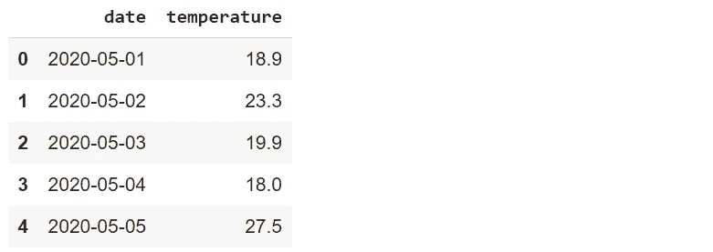
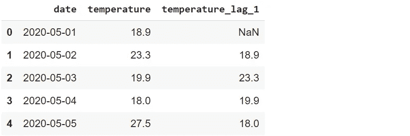
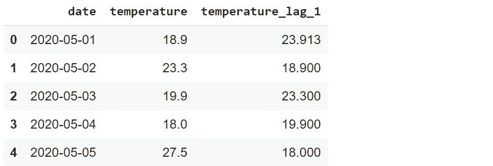
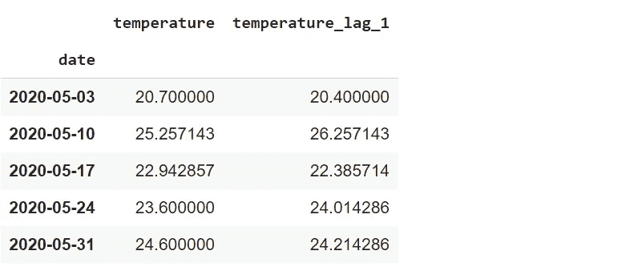
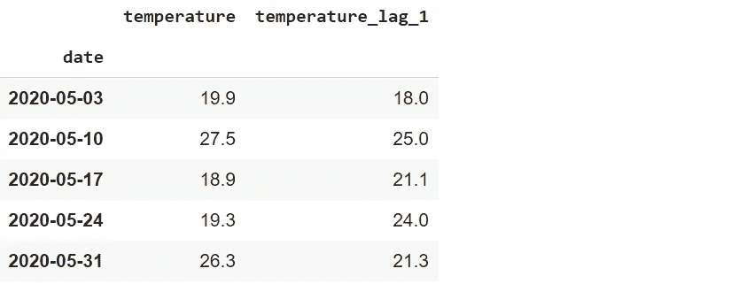
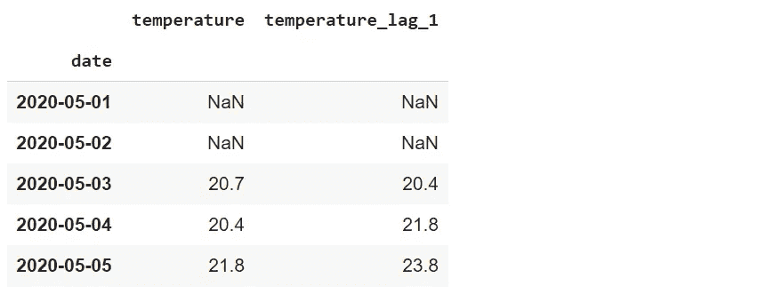
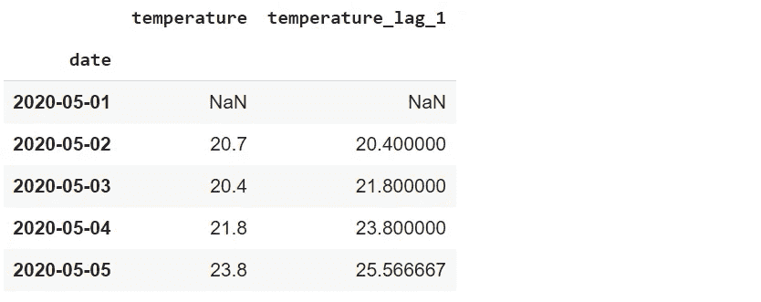

# 用于时间序列分析的 4 个必知 Python Pandas 函数

> 原文：<https://towardsdatascience.com/4-must-know-python-pandas-functions-for-time-series-analysis-6610dad521e?source=collection_archive---------5----------------------->

## 举例说明


照片由[卢克·切瑟](https://unsplash.com/@lukechesser?utm_source=unsplash&utm_medium=referral&utm_content=creditCopyText)在 [Unsplash](https://unsplash.com/s/photos/financial?utm_source=unsplash&utm_medium=referral&utm_content=creditCopyText) 拍摄

时间序列数据由附加到连续时间戳的数据点组成。日销售额、每小时温度值和化学过程中的秒级测量值都是时间序列数据的一些例子。

时间序列数据具有不同于普通表格数据的特征。因此，时间序列分析有其自身的动态，可以被认为是一个独立的领域。有超过 500 页的书深入涵盖时间序列分析的概念和技术。

Pandas 是由 Wes Mckinney 创建的，旨在提供一个高效灵活的工具来处理金融数据，这是一种时间序列。在本文中，我们将介绍 4 个可用于时间序列分析的熊猫函数。

我们需要例子的数据。让我们从创建我们自己的时间序列数据开始。

```
import numpy as np
import pandas as pddf = pd.DataFrame({
   "date": pd.date_range(start="2020-05-01", periods=100, freq="D"),
   "temperature": np.random.randint(18, 30, size=100) +  
                  np.random.random(100).round(1)
})df.head()
```



(图片由作者提供)

我们创建了一个包含 100 天内温度测量值的数据框。Pandas 的`date_range`功能可用于生成自定义频率的日期范围。使用 Numpy 函数随机生成温度值。

我们现在可以开始函数了。

## 1.变化

对时序数据进行移位是一种常见的操作。我们可能需要对滞后或超前特征进行比较。在我们的数据框中，我们可以创建一个包含前一天温度的新要素。

```
df["temperature_lag_1"] = df["temperature"].shift(1)df.head()
```



(图片由作者提供)

传递给 shift 函数的标量值表示要移动的周期数。新列的第一行用 NaN 填充，因为第一行没有以前的值。

`fill_value`参数可用于用标量填充缺失值。让我们用温度列的平均值代替 NaN。

```
df["temperature_lag_1"] = df["temperature"]\
.shift(1, fill_value = df.temperature.mean())df.head()
```



(图片由作者提供)

如果您对未来值感兴趣，可以通过向 shift 函数传递负值来向后移动。例如，“-1”表示第二天的温度。

## 2.重新取样

对时间序列数据执行的另一个常见操作是重采样。它包括改变周期的频率。例如，我们可能对每周的温度数据感兴趣，而不是每天的测量值。

`resample`功能创建指定内部的组(或箱)。然后，我们可以对这些组应用聚合函数，根据重新采样的频率来计算值。

让我们来计算一下每周的平均气温。第一步是将数据重新采样到周级别。然后，我们将应用均值函数来计算平均值。

```
df_weekly = df.resample("W", on="date").mean()df_weekly.head()
```



(图片由作者提供)

第一个参数指定重采样的频率。令人惊讶的是," W "代表星期。如果数据帧没有日期时间索引，则包含日期或时间相关信息的列需要传递给`on`参数。

## 3.Asfreq

`asfreq`函数提供了一种不同的重采样技术。它返回指定间隔结束时的值。例如，`asfreq(“W”)` 返回每周最后一天的值。

为了使用`asfreq`功能，我们应该将日期列设置为数据框的索引。

```
df.set_index("date").asfreq("W").head()
```



(图片由作者提供)

因为我们在特定的一天获取一个值，所以没有必要应用聚合函数。

## 4.旋转

`rolling`函数可用于计算移动平均值，这是时间序列数据非常常见的操作。它创建一个特定大小的窗口。然后，我们可以使用此窗口在数据点滚动时进行计算。

下图解释了滚动的概念。


(图片由作者提供)

让我们创建一个滚动窗口 3，并使用它来计算移动平均。

```
df.set_index("date").rolling(3).mean().head()
```



(图片由作者提供)

对于任何一天，这些值显示当天和前两天的平均值。前 3 天的值为 18.9、23.8 和 19.9。因此，第三天的移动平均值是这些值的平均值，即 20.7。

前两个值是 NaN，因为它们没有前两个值。我们还可以使用这个滚动窗口来覆盖任何给定日期的前一天和后一天。这可以通过将`center`参数设置为真来实现。

```
df.set_index("date").rolling(3, center=True).mean().head()
```



(图片由作者提供)

前 3 天的值为 18.9、23.8 和 19.9。因此，第二天的移动平均值是这 3 个值的平均值。在这个设置中，只有第一个值是 NaN，因为我们只需要 1 个先前的值。

## 结论

我们已经介绍了在时间序列分析中常用的 4 个熊猫函数。预测分析是数据科学的重要组成部分。时间序列分析是预测分析旨在解决的许多问题的核心。因此，如果你打算从事预测分析，你肯定应该学习如何处理时间序列数据。

最后但同样重要的是，如果你还不是[中级会员](https://sonery.medium.com/membership)并计划成为其中一员，我恳请你使用以下链接。我将从你的会员费中收取一部分，不增加你的额外费用。

[](https://sonery.medium.com/membership) [## 通过我的推荐链接加入 Medium-Soner yl DRM

### 作为一个媒体会员，你的会员费的一部分会给你阅读的作家，你可以完全接触到每一个故事…

sonery.medium.com](https://sonery.medium.com/membership) 

感谢您的阅读。如果您有任何反馈，请告诉我。