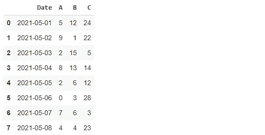
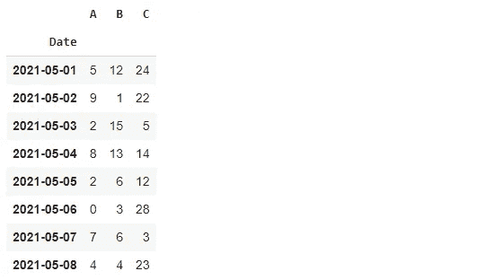
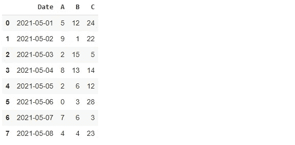
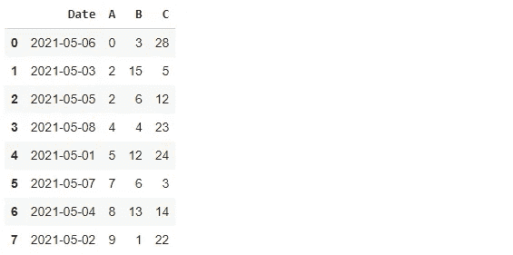
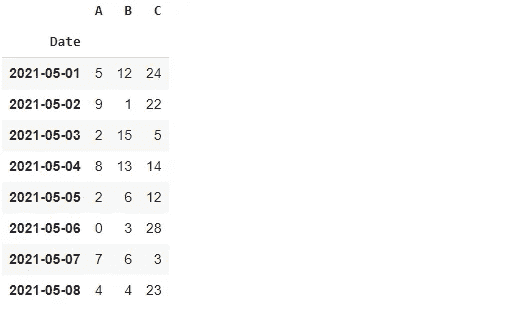
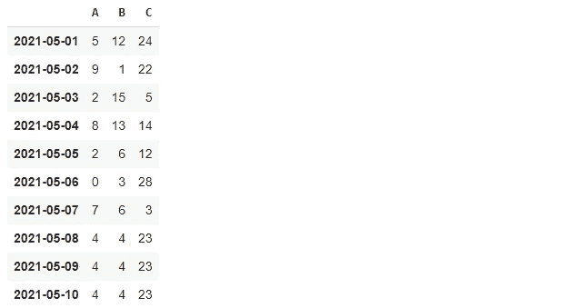

# 4 Pandas 用于索引操作的函数

> 原文：<https://towardsdatascience.com/4-pandas-functions-for-index-manipulation-5b8c7bd6ab12?source=collection_archive---------22----------------------->

## 实用熊猫教程。


安德烈·泰森在 [Unsplash](https://unsplash.com/s/photos/order?utm_source=unsplash&utm_medium=referral&utm_content=creditCopyText) 上拍摄的照片

Pandas 为高效的数据分析和操作提供了大量的功能。在本文中，我们将重点关注关于特定数据操作的 Pandas 函数。

Pandas 的核心数据结构是由带标签的行和列组成的数据帧。行或列的索引可以被认为是它的地址。

我们可以使用索引来访问数据框中的行。尽管大多数情况下通过列名来访问列，但是也可以使用列索引。列索引和行索引都从 0 开始。

我们将讨论 4 个 Pandas 函数，它们允许你更新或操作数据框中的索引。让我们从导入库开始，并创建一个样本数据框。

```
import numpy as np
import pandas as pddf = pd.DataFrame({
   "Date": pd.date_range(start="2021-05-01", end="2021-05-8", 
                         freq="D"),
   "A": np.random.randint(10, size=8),
   "B": np.random.randint(20, size=8),
   "C": np.random.randint(30, size=8)
})df
```



(图片由作者提供)

我们有一个 8 行 4 列的数据框。

## 集合 _ 索引

第一个是 set_index 函数，它可以用来将特定的列指定为行索引。

处理时间序列时，您可能需要将日期用作行索引。我们可以使用下面的 set_index 函数来执行这个任务。

```
df.set_index("Date", inplace=True)df
```



(图片由作者提供)

需要将 inplace 参数设置为 true 以保存更改。

## 重置 _ 索引

reset_index 函数的作用是不言自明的。它用整数索引重置当前行索引。

您需要注意 drop 参数。如果不需要当前索引，请将 drop 参数设置为 true。否则，当前索引将作为数据框中的新列保存。

```
df.reset_index(drop=True)
```


(图片由作者提供)

我想保留日期列，所以不使用 drop 参数。

```
df.reset_index(inplace=True)df
```



(图片由作者提供)

## 排序值

sort_values 与索引操作没有直接关系。然而，当我们根据列中的值对数据点(即行)进行排序时，数据框的索引也会发生变化。

我们来做一个例子来演示这个案例。

```
df.sort_values("A")
```


(图片由作者提供)

这些行根据 a 列中的值按升序排序。索引值也相应地更改。为了防止索引被更新，我们可以使用 ignore_index 参数。

```
df.sort_values("A", ignore_index=True)
```



(图片由作者提供)

## 重新索引

reindex 函数可用于为数据框分配新的列或行索引。我们可以使用 reindex 函数改变列的顺序，如下所示。

```
df.reindex(columns=["C","A","B","Date"])
```


(图片由作者提供)

如果当前数据框中不存在新索引中的项目，则默认情况下会用 NA 值填充该项目。我们也可以选择一个值来代替 NA 值。

```
df.reindex(columns=["C","A","New","Date"], fill_value=0)
```


(图片由作者提供)

reindex 函数也可以与行索引一起使用。让我们首先将日期列指定为行索引。

```
df.set_index("Date", inplace=True)df
```



(图片由作者提供)

我们将创建一个新的日期索引，比原来的索引多包含 2 天。

```
newindex = pd.date_range(start="2021-05-01", freq="D", periods=10)newindexDatetimeIndex(['2021-05-01', '2021-05-02', '2021-05-03', 
'2021-05-04', '2021-05-05', '2021-05-06', '2021-05-07', 
'2021-05-08', '2021-05-09', '2021-05-10'],               dtype='datetime64[ns]', freq='D')
```

如果将这个新索引分配给我们的数据框，最后两行将填充 NA 值。可以选择一个常数值来填充它们。然而，Pandas 提供了一个更实用的方法。

方法参数可用于选择更智能的方式来处理缺失值。例如，我们可以用前一天的值填充它们。“ffill”选项执行此操作。

```
df = df.reindex(newindex, method="ffill")df
```



(图片由作者提供)

## 结论

我们已经讨论了 4 个函数，它们提供了许多选项来处理数据帧的行或列索引。当然，这不是你仅有的选择。我坚信这 4 个足以处理你可能遇到的典型案例。

感谢您的阅读。如果您有任何反馈，请告诉我。