# 你应该知道的 4 种熊猫组队技巧

> 原文：<https://towardsdatascience.com/4-pandas-groupby-tricks-you-should-know-9e5b9870693e?source=collection_archive---------4----------------------->


照片由 [Pixabay](https://pixabay.com/photos/juggler-trick-magician-juggle-1216853/) 上的 [moise_theodor](https://pixabay.com/users/moise_theodor-2099584/) 拍摄

## 更加灵活和创造性地使用熊猫群

作为 Python 中最流行的库之一，Pandas 已经被广泛使用，尤其是在数据 EDA(探索性数据分析)工作中。通常，它可以用于过滤和转换数据集，就像我们通常使用 SQL 查询所做的那样。它们有很多相似的概念，比如连接表。然而，它们中的一些特征具有相同的名称但是不同的概念。“分组依据”就是其中之一。

在这篇文章中，我将按功能为熊猫小组介绍一些技巧，它们可以提高我们在 EDA 工作中的生产率。希望至少有一个是你从来不熟悉的，这样它可以帮助你。

我相信你知道如何在 Python 中导入熊猫，但是，让我把它放在这里。本文中所有剩余的代码都假设 Pandas 已经按如下方式导入。

```
import pandas as pd
```

# 用于演示的样本数据


由[摄影爱好者](https://pixabay.com/users/fotomanie-19282/)在 [Pixabay](https://pixabay.com/photos/flower-iris-meadow-wildflower-76336/) 上拍摄的照片

让我们不要在获取样本数据集上浪费太多时间。iris 数据集在数据科学中非常常用，称为“hello world”数据集。我们可以很容易地从 Sci-kit 学习图书馆得到它。让我们导入它并加载 iris 数据集。

```
from sklearn.datasets import load_irisiris = load_iris()
```

虹膜数据集在加载后是一个字典。关键字“data”的值是一个包含 3 种虹膜的所有特征的二维数组。“feature_names”按顺序包含列名。“目标”包含虹膜的编码类别，如 0、1 或 2。最后，“targe_names”包含三种虹膜的实际名称，分别对应编码号 0、1、2。

打印出来就明白是什么样子了。以下代码用于将 iris 数据集加载到我们预期的 Pandas 数据框中。

```
df = pd.DataFrame(data=iris['data'], columns=iris['feature_names'])
df['class'] = iris['target']
df['class'] = df['class'].apply(lambda i: iris['target_names'][i])
```

代码的第一行使用列名从二维数组创建数据框。第二行添加了编码的 iris 类，第三行将数字翻译成 iris 类名。

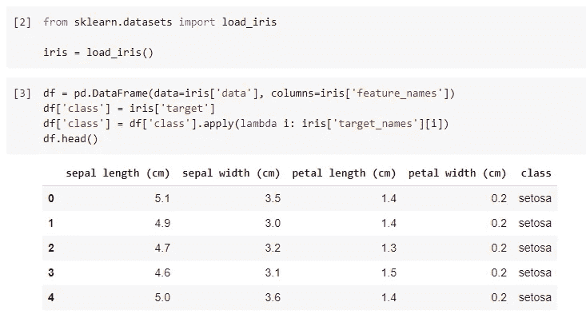

现在，我们在同一页上。让我们在本文的其余部分使用这个样本数据框。

# 基础知识


照片由[在](https://pixabay.com/users/no-longer-here-19203/) [Pixabay](https://pixabay.com/photos/stones-pile-rock-nature-stack-937659/) 上拍摄

Pandas group by 函数的基本思想不是为了将分类值分组在一起，而是为了在之后计算一些聚合值。因此，对每个组执行聚合。

例如，我们可以基于虹膜分类对数据帧进行分组，并计算每个特征(列)的平均值。

```
df.groupby('class').mean()
```

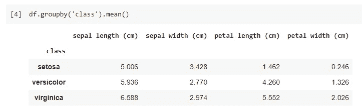

除了`mean()`还有很多聚合函数，比如`min()`、`max()`和`count()`。

好的，这部分只是为了复习。现在我们应该开始了。

# 招数 1。按大小或计数聚合

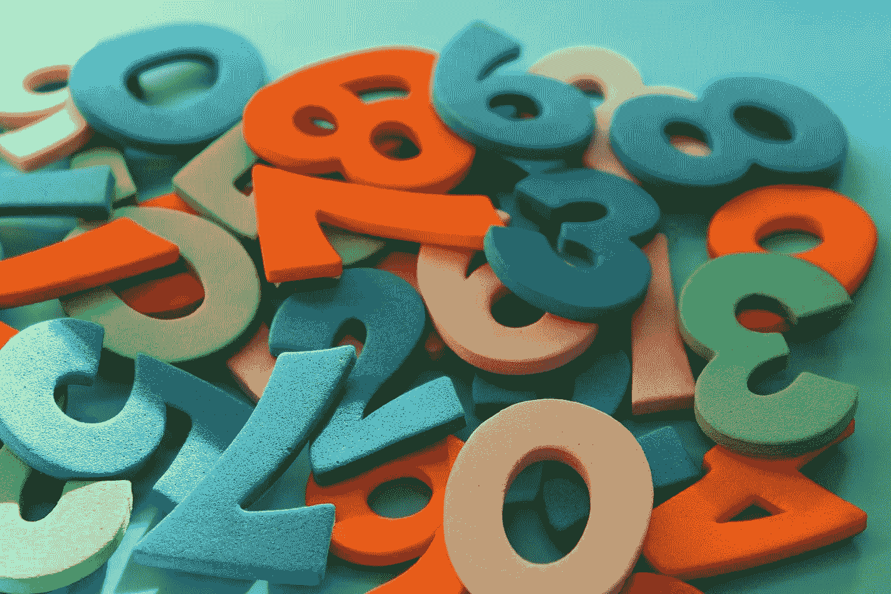

[_Alicja_](https://pixabay.com/users/_alicja_-5975425/) 在 [Pixabay](https://pixabay.com/photos/digits-counting-mathematics-4014181/) 上拍摄的照片

使用`count()`函数来聚合组以获得每个组的行数是很常见的。然而，这有时并不是你想要的。也就是说，当数据帧中有空值或 NaN 值时，它们将**而不是**被`count()`函数计数。

让我们手动为数据框分配一个 NaN 值。

```
df.iloc[0,0] = None
```

上面的代码将为萼片长度列的第一行创建一个 NaN 值。

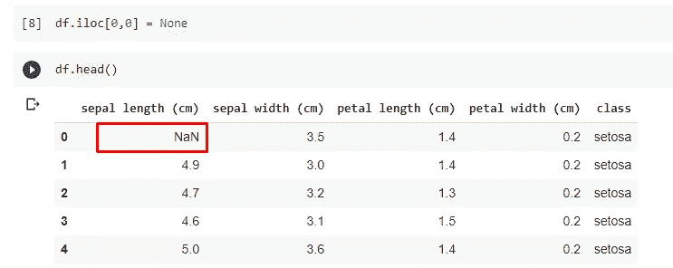

然后，让我们对它使用`count()`函数。

```
df.groupby('class')['sepal length (cm)'].count()
```

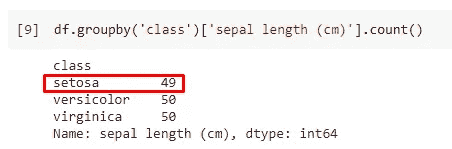

setosa 虹膜被计数为 49，但实际上有 50 行。这是因为`count()`函数实际上并不计算 NaN 值。

还有一个很少使用的聚合函数— `size()`。这个函数将选取所有的值，即使它是 NaN。

```
df.groupby('class')['sepal length (cm)'].size()
```

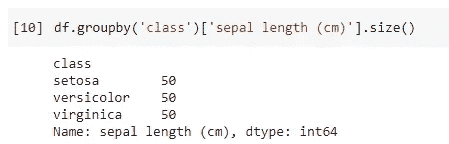

# 招数二。自定义聚合列名称


照片由 [Goumbik](https://pixabay.com/users/goumbik-3752482/) 在 [Pixabay](https://pixabay.com/photos/chart-graph-finance-financial-data-2779139/) 上拍摄

有时，我们可能希望重命名聚合列，而不是仅使用“max”或“mean”作为名称，这并不表示它是从哪个列聚合的。

我们实际上可以在`agg()`函数中将名称指定为参数。

```
df.groupby('class')['sepal length (cm)'].agg(
    sepal_average_length='mean',
    sepal_standard_deviation='std'
)
```

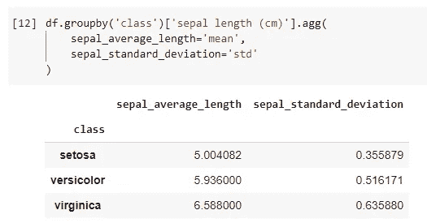

# 招数三。定制聚合函数


照片由 [Myriams-Fotos](https://pixabay.com/users/myriams-fotos-1627417/) 在 [Pixabay](https://pixabay.com/photos/jeans-tape-measure-fabric-scissors-2406521/) 上拍摄

Pandas 提供了`mean()`、`count()`等多种聚合功能。但是，如果只能使用这些功能，还是相当有限的。

事实上，我们可以定义自己的聚合函数，并将其传递给`agg()`函数。例如，如果我们想得到每一列的平均值，并将它们转换成毫米，我们可以如下定义自定义函数。

```
def transformed_mean(value):
    value *= 100
    value_mean = value.mean()
    return round(value_mean, 2)
```

然后，简单地将这个函数名作为参数传递给`agg()`函数。

```
df_mm = df.groupby('class').agg(transformed_mean)df_mm.columns = ['sepal length (mm)', 'sepal width (mm)', 'petal length (mm)', 'petal width (mm)']
```

不要忘记通过改变单位来重命名列名，以确保它们是一致的:)

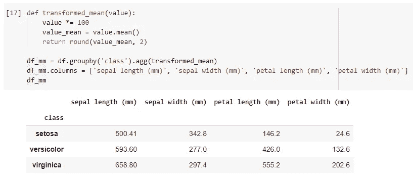

当然，对于诸如相对简单的函数，我们也可以用 lambda 定义一个匿名函数如下。

```
df_mm = df.groupby('class').agg(lambda x: round((x * 100).mean(), 2))
```

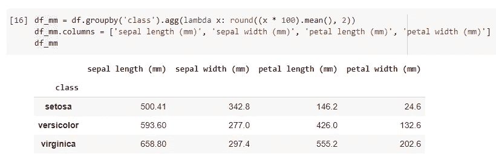

所以，我们不需要定义一个独立的函数。然而，如果逻辑相对复杂，为了更好的可读性，建议定义一个合适的函数。

# 招数四。按箱分组

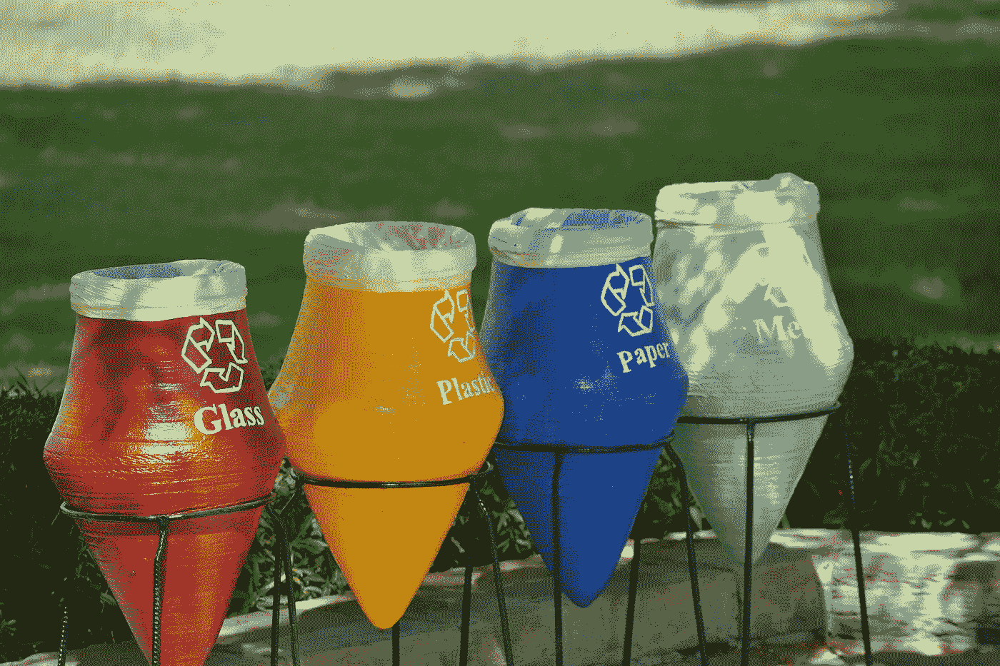

照片由 [imordaf](https://pixabay.com/users/imordaf-117056/) 在 [Pixabay](https://pixabay.com/photos/recycle-egypt-237874/) 上拍摄

我们必须对分类变量使用 Group By 吗？答案是否定的。

如果一个变量是连续的，我们需要做的只是创建箱，以确保它们被转换为分类值。在 Pandas 中，我们可以使用`pd.cut()`函数轻松创建具有相同范围的容器。

```
sepal_len_groups = pd.cut(df['sepal length (cm)'], bins=3)
```

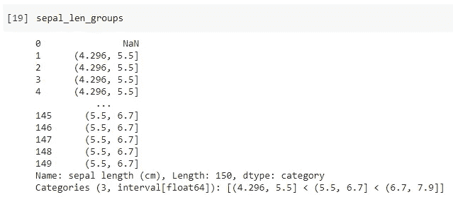

上面的代码创建了 3 个跨度相等的容器。相等意味着 3 个箱之间的距离完全相同。

然后，我们可以直接使用 group by 中的这三个 bin。

```
df.groupby(sepal_len_groups)['sepal length (cm)'].agg(count='count')
```

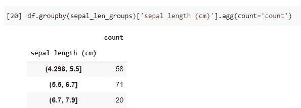

# 摘要


由 [mirkostoedter](https://pixabay.com/users/mirkostoedter-20529864/) 在 [Pixabay](https://pixabay.com/photos/matcha-powder-tea-matcha-whisk-6079526/) 上拍摄的照片

在本文中，我介绍了在 Pandas 中使用 group by 函数和聚合函数时的一些技巧。使用正确的方法有时可以在很大程度上提高我们的生产力。

[](https://medium.com/@qiuyujx/membership) [## 通过我的推荐链接加入 Medium 克里斯托弗·陶

### 作为一个媒体会员，你的会员费的一部分会给你阅读的作家，你可以完全接触到每一个故事…

medium.com](https://medium.com/@qiuyujx/membership) 

如果你觉得我的文章有帮助，请考虑加入 Medium 会员来支持我和成千上万的其他作者！(点击上面的链接)