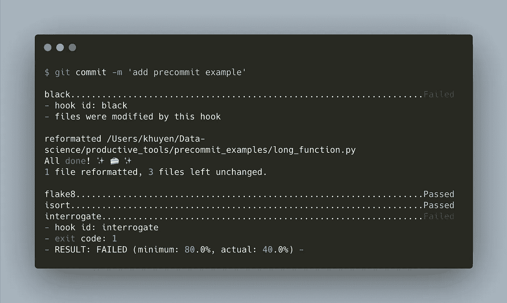
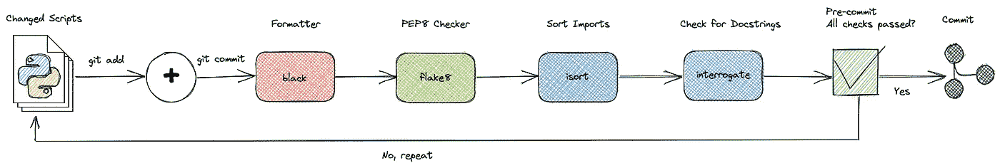
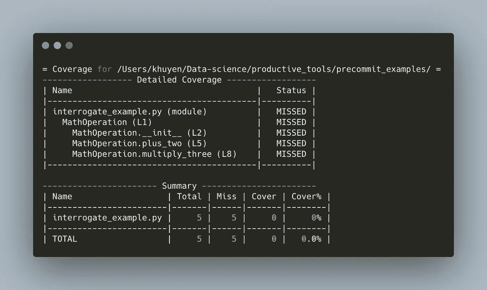
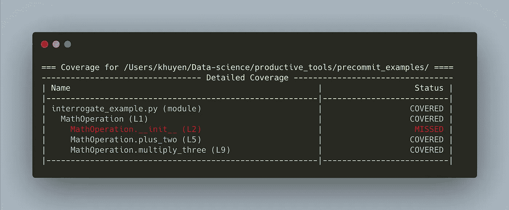
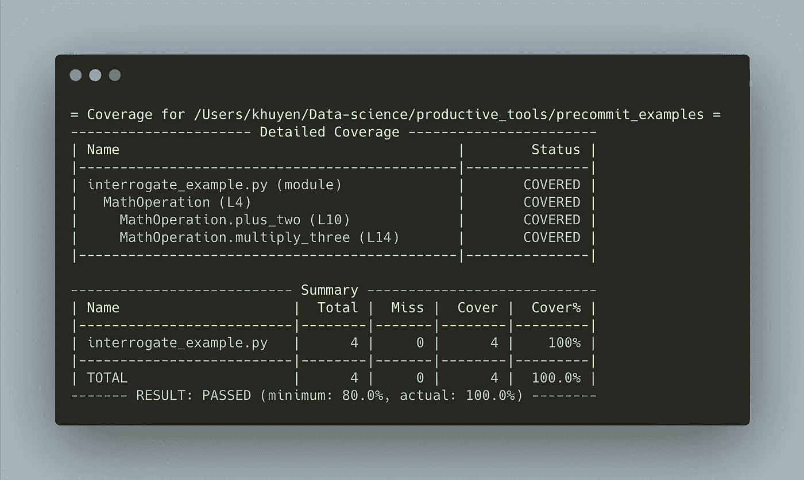

# 4 个预提交插件，用于在 Python 中自动检查和格式化代码

> 原文：<https://towardsdatascience.com/4-pre-commit-plugins-to-automate-code-reviewing-and-formatting-in-python-c80c6d2e9f5?source=collection_archive---------1----------------------->

## 使用 black、flake8、isort 和 interrogate 编写高质量的代码

# 动机

将 Python 代码提交给 Git 时，您需要确保您的代码:

*   看起来不错
*   是有组织的
*   符合 PEP 8 风格指南
*   包括文档字符串

然而，在提交代码之前检查所有这些标准可能会让人不知所措。如果你能像下面这样在每次提交新代码时自动**检查并格式化你的代码，那不是很好吗？**

****

**作者图片**

**这就是预提交派上用场的时候。在本文中，您将了解什么是预提交，以及可以将哪些插件添加到预提交管道中。**

# **什么是预提交？**

**预提交是一个框架，允许您在提交代码之前识别代码中的简单问题。**

**您可以在预提交管道中添加不同的插件。一旦你的文件被提交，它们将被这些插件检查。除非所有检查都通过，否则不会提交任何代码。**

****

**作者图片**

**要安装预提交，请键入:**

```
pip install pre-commit
```

**酷！现在让我们给预提交管道添加一些有用的插件。**

# **黑色**

**[black](https://black.readthedocs.io/en/stable/) 是 Python 中的代码格式化程序。**

**要安装 black，请键入:**

```
pip install black
```

**现在为了看看 black 能做什么，我们将编写一个很长的函数，如下所示。由于第一行代码超过 79 个字符，这违反了 PEP 8。**

**让我们尝试使用黑色来格式化代码:**

```
$ black long_function.py
```

**并且代码自动格式化如下！**

**要将 black 添加到预提交管道，请创建一个名为`.pre-commit-config.yaml`的文件，并将以下代码插入到该文件中:**

# **薄片 8**

**flake8 是一个 python 工具，可以检查你的 Python 代码的风格和质量。它会检查 black 未涵盖的各种问题。**

**要安装 flake8，请键入:**

```
pip install flake8
```

**为了看看 flake8 做了什么，让我们编写违反 PEP 8 中一些准则的代码。**

**接下来，使用 flake8 检查代码:**

```
$ flake8 flake_example.py
```

**啊哈！flake8 检测到 3 个 PEP 8 格式错误。我们可以将这些错误作为修复代码的指南。**

**代码现在看起来好多了！**

**要将 flake8 添加到预提交管道，请将以下代码插入到`.pre-commit-config.yaml`文件中:**

# **伊索特**

**[isort](https://github.com/PyCQA/isort) 是一个 Python 库，它自动按字母顺序对导入的库进行排序，并将它们分成节和类型。**

**要安装 isort，请键入:**

```
pip install isort
```

**让我们试着使用 isort 来对混乱的导入进行排序，如下所示:**

```
$ isort isort_example.py
```

**输出:**

**酷！进口现在更有条理了。**

**要将 isort 添加到预提交管道中，请将以下代码添加到`.pre-commit-config.yaml`文件中:**

# **审问**

**[询问](https://interrogate.readthedocs.io/en/latest/index.html?highlight=pre-commit)检查您的代码库是否缺少文档字符串。**

**要安装询问，请键入:**

```
pip install interrogate
```

**有时，我们可能会忘记为类和函数编写文档字符串，如下所示:**

**我们可以运行 interrogate，而不是手动查看我们所有的函数和类来查找丢失的文档字符串:**

```
$ interrogate -vv interrogate_example.py
```

**输出:**

****

**作者图片**

**酷！从终端输出中，我们知道哪些文件、类和函数没有 docstrings。因为我们知道丢失的文档字符串的位置，所以添加它们很容易。**

```
$ interrogate -vv interrogate_example.py
```

****

**作者图片**

**`__init__`方法的 docstring 丢失，但这不是必需的。我们可以通过在参数中添加`-i`来告诉 interrogate 忽略`__init__`方法:**

```
$ interrogate -vv -i interrogate_example.py
```

****

**作者图片**

**酷！要将询问添加到预提交管道，请将以下代码插入到`.pre-commit-config.yaml`文件中:**

# **最后一步——向 Git 挂钩添加预提交**

**您的`.pre-commit-config.yaml`文件中的最终代码应该如下所示:**

**要向 git 挂钩添加预提交，请键入:**

```
$ pre-commit install
```

**输出:**

```
pre-commit installed at .git/hooks/pre-commit
```

## **犯罪**

**现在我们已经准备好提交新代码了！**

```
$ git commit -m 'add pre-commit examples'
```

**您应该会看到如下所示的内容:**

****

**作者图片**

## **跳过验证**

**为了防止预提交检查某个提交，将`--no-verify`添加到`git commit`:**

```
$ git commit -m 'add pre-commit examples' --no-verify
```

# **用户化**

## **黑色**

**要选择在运行 black 时包括和排除哪些文件，请创建一个名为`pyproject.toml`的文件，并将以下代码添加到`pyproject.toml`文件中:**

## **薄片 8**

**要选择忽略哪些错误或编辑其他配置，创建一个名为`.flake8`的文件，并将以下代码添加到`.flake8`文件中:**

## **审问**

**要编辑 interrogate 的默认配置，将以下代码插入到`pyproject.toml`文件中:**

# **结论**

**恭喜你！您刚刚学习了如何在提交代码之前使用预提交来自动检查和编辑代码。我希望这篇文章能让你轻松地检查和格式化你的代码。**

**当您的代码遵循通用标准时，您的同事也会很高兴。**

**随意发挥，并在这里叉这篇文章的源代码:**

**[](https://github.com/khuyentran1401/Data-science/tree/master/productive_tools/precommit_examples) [## 数据科学/生产工具/预提交-master khuyentran 1401/数据科学示例

### 有用的数据科学主题以及代码和文章的集合…

github.com](https://github.com/khuyentran1401/Data-science/tree/master/productive_tools/precommit_examples)** 

**我喜欢写一些基本的数据科学概念，并尝试不同的算法和数据科学工具。你可以在 LinkedIn 和 T2 Twitter 上与我联系。**

**星[这个回购](https://github.com/khuyentran1401/Data-science)如果你想检查我写的所有文章的代码。在 Medium 上关注我，了解我的最新数据科学文章，例如:**

**[](/introduction-to-datapane-a-python-library-to-build-interactive-reports-4593fd3cb9c8) [## Datapane 简介:构建交互式报表的 Python 库

### 创建精美报告并与您的团队分享分析结果的简单框架

towardsdatascience.com](/introduction-to-datapane-a-python-library-to-build-interactive-reports-4593fd3cb9c8) [](/3-tools-to-track-and-visualize-the-execution-of-your-python-code-666a153e435e) [## 3 个跟踪和可视化 Python 代码执行的工具

towardsdatascience.com](/3-tools-to-track-and-visualize-the-execution-of-your-python-code-666a153e435e) [](/pydash-a-bucket-of-missing-python-utilities-5d10365be4fc) [## Pydash:缺少 Python 实用程序的厨房水槽

### 以函数的方式使用 Python

towardsdatascience.com](/pydash-a-bucket-of-missing-python-utilities-5d10365be4fc) [](/introduction-to-schema-a-python-libary-to-validate-your-data-c6d99e06d56a) [## 模式介绍:验证数据的 Python 库

### 验证您的数据变得更加复杂！

towardsdatascience.com](/introduction-to-schema-a-python-libary-to-validate-your-data-c6d99e06d56a) 

# 参考

Lj 米兰达。(2018 年 6 月 20 日)。*使用预提交自动化 Python 工作流:black 和 flake8* 。Lj 米兰达。[https://ljvmiranda 921 . github . io/notebook/2018/06/21/pre commits-using-black-and-flake 8/。](https://ljvmiranda921.github.io/notebook/2018/06/21/precommits-using-black-and-flake8/.)**