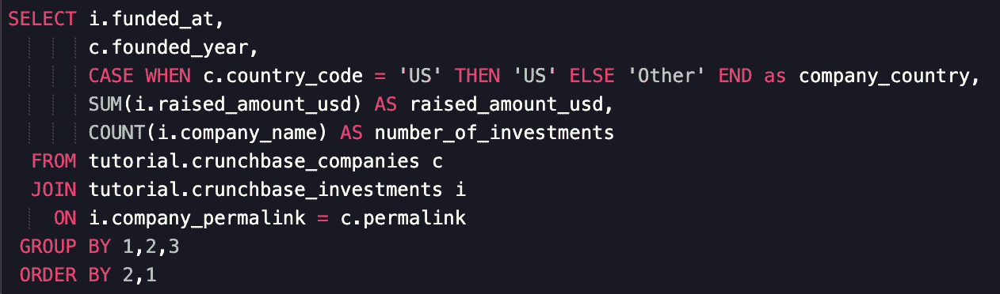
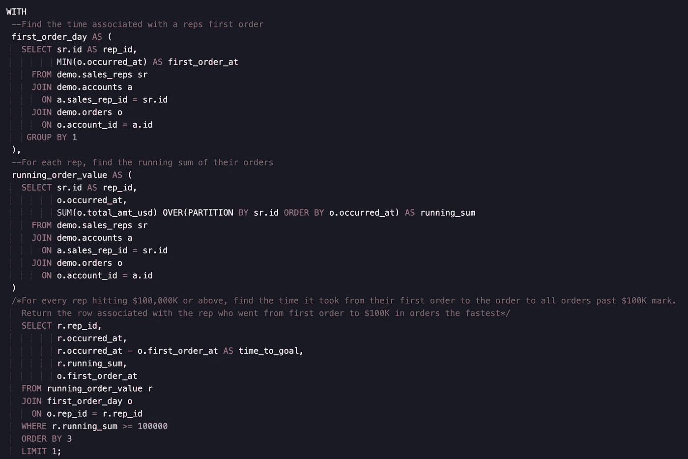
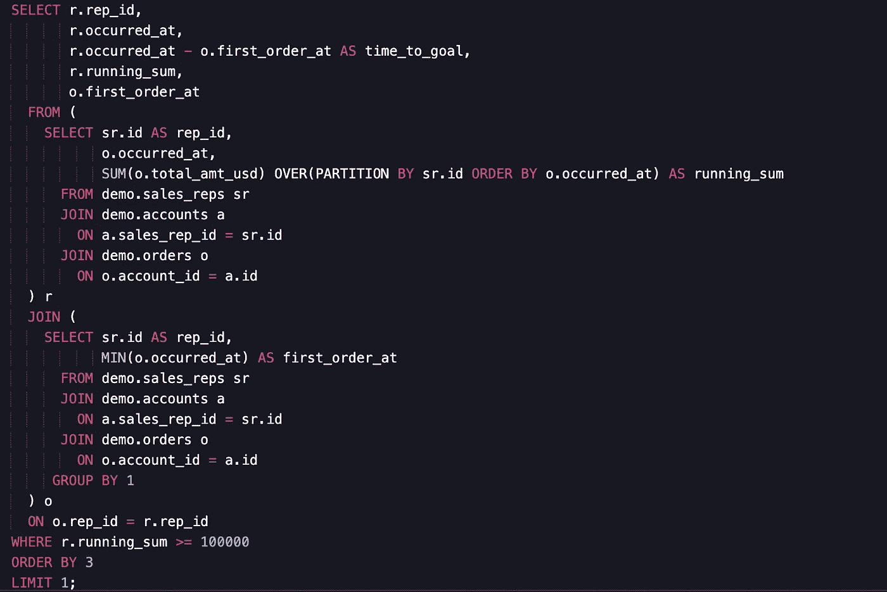

# 学习数据科学 SQL 的 4 个原则

> 原文：<https://towardsdatascience.com/4-principles-to-learn-sql-for-data-science-781520c0e983?source=collection_archive---------21----------------------->

## 提高数据科学技能的技巧

迈尔在 [Unsplash](https://towardsdatascience.com/s/photos/motivation?utm_source=unsplash&utm_medium=referral&utm_content=creditCopyText) 上拍摄的

不言而喻，编写 SQL 代码的能力是在任何数据科学岗位上获得成功的必要条件。没有任何证据表明这种情况会很快改变，SQL 会一直存在，所以掌握这项技能是一项绝对值得的投资。无论你是在寻找你在数据科学领域的第一份工作，还是在为下一轮就业市场复习你的 SQL 技能，或者希望提升你的职业生涯，我有四条原则可以帮助你在所有与 SQL 相关的工作中取得成功。

让我们开始吧。

# **1。在你写任何代码之前，确定正确的粒度**

我说的“谷物”是什么意思

> SQL 查询的粒度是您希望输出数据集达到的聚合级别。

例如，如果您正在寻找一个聚集日常用户操作的数据集，那么您的“粒度”可以描述为“用户日级别”(*即*每行代表每个用户每天采取的操作。)

提前考虑这些谷物是个好主意，主要有两个原因。

## 首先，它帮助您规划查询的结构

当你进入数据科学就业市场时，这一点尤其重要，因为在这个过程中，求职者经常被要求现场编写 SQL 代码。在开始编码之前，为你的问题建立一个心理框架将有助于以一种清晰、有效的方式得到答案，给面试官留下深刻印象。

## 其次，它可以帮助您识别代码中的明显错误

通常，您会有一些关于您编写的查询预期返回的行数的上下文。例如，假设我的计划谷物处于“用户”级别，我知道我们有~ 1000 个用户。当我的查询返回一个有 100，000 行的数据集时，我立即知道我的查询中的一个或多个连接有问题。

# **2。格式问题**

SQL 是一种语言，我们的查询讲述了一个故事。让我们把它变成一个我们未来的自己和同事们都能轻松阅读的故事。一些快速检查的查询不需要原始的格式，但是任何有可能被其他人或未来自己读取的查询都应该遵循一致的模式。下面是一个简单但格式良好的查询示例。

我将注意到我在这里特意选择的一些风格。

*   所有关键字都是大写的
*   新行上的关键字右对齐。它们的后续表达式是左对齐的
*   每个表都有一个简单但有意义的别名
*   列号用于 GROUP BY 和 ORDER BY 子句中。我知道有些人认为这是“懒惰”的方式，但是速度的好处和按别名列干净地分组比不尽可能显式的代价更重要。例如，如果我想在 GROUP BY 子句中使用列名，我必须执行以下操作(大多数情况下是这样的，一些数据库允许在 GROUP BY 中使用别名)

关于 SQL 格式化有很多[观点，我不认为其中有一个明显的赢家。选一个就好，要始终如一。](https://stackoverflow.com/questions/519876/sql-formatting-standards)

# **3。使用 cte，而不是子查询**

cte 或[公共表表达式](https://mode.com/blog/use-common-table-expressions-to-keep-your-sql-clean/)，是临时数据集，可以在给定查询的后续 SQL 语句中引用。cte 最好用一个例子来解释。下面的查询标识了从他们的第一个订单到 100，000 美元订单最快的销售代表。

让我们来分解这个查询的组件

*   首先，您会注意到带有。所有使用 CTE 的查询都必须在第一个 CTE 之前包含此语句。
*   第一个订单日是我们的第一个 CTE。它定义了一个数据集，查找销售代表完成订单的第一天。first_order_day 可以在后续表达式中引用，就像引用数据库中的任何其他表一样。
*   接下来，我们定义另一个 CTE，运行订单值。这将计算每个销售代表的销售总额。
*   最后，我们引用两个 cte 来返回对应于最短 time_to_goal 值的行。

使用[子查询](https://mode.com/sql-tutorial/sql-sub-queries/)编写的查询可以使用 cte 重写，我建议这样做——cte 更干净，对您的同事和未来的自己来说更容易理解。使用子查询，我们可以看到上面的查询是什么样子的。势不可挡，对吧？

> 通过使用 cte，我们可以获得相同的结果，并改善可读性和逻辑流程。

# 4.用代码注释讲述一个故事

最终，SQL 现在被视为软件工程中使用的编程语言，那么为什么不像其他语言一样遵循相同的注释约定呢(*例如* [python](https://www.python.org/dev/peps/pep-0008/#comments) )。我相信这很大程度上是因为人们学习 SQL 的方式。虽然软件工程中使用的大多数编程语言都是在牢记这些约定的情况下教授的，但 SQL 通常是在事后才教授的。它通常被视为达到目的的手段(*即*数据集→分析)。

> 然而，我们在分析中做出的一些最关键的决定发生在 SQL 查询中，我们应该向我们自己、利益相关者以及那些通过描述性注释来解释我们的意图的人解释这些决定。

特别是，在更复杂的查询中，注释对于全面的分析非常有益。

## 他们帮助未来的你和你的代码审查者理解你的意图

这为我们自己和我们的同事节省了时间，也避免了重读或审查代码时的麻烦。当我们生成用于分析的数据集时，数据科学家这样做是有最终目标的(*例如*)我们希望看到过去 6 个月中登录用户对帮助网站的所有访问。)记录我们打算对我们的查询做什么，有助于指导我们编写我们的查询，并帮助审阅者检查我们工作的准确性。

## 它记录了对数据的假设

[Garbage in Garbage Out](https://en.wikipedia.org/wiki/Garbage_in,_garbage_out)(GIGO)是执行分析时应该首先考虑的一个表达式。简而言之，如果你输入一个分析或建模的无意义数据，你将得到无意义的结果。

这一点很重要，因为原始数据在用于分析之前需要建模和聚合。这种情况在某种程度上发生在 SQL 中(随着像 [dbt](https://www.getdbt.com/) 这样的工具的出现，情况更是如此)。因此，当你对你的数据做出假设，或者选择一种类型的聚合(*例如*使用中位数对平均值*)，*在你的代码注释中解释*为什么*你这样做。没有什么比无法向同事或利益相关者解释为什么在查询中包含一个表达式更糟糕的了。

# 这完全是信任的问题

最终，这四条原则都植根于一个理念，即信任是数据科学家拥有的最重要的资产。在学习和编写 SQL 时遵循这四个原则将有助于你赢得从面试官到同事和利益相关者的信任。

**专业提示:**如果你是 SQL 新手，或者想提高你的技能，我认为来自 Mode Analytics 的 [SQL 学校](https://mode.com/sql-tutorial/)是最好的免费资源。看看吧！