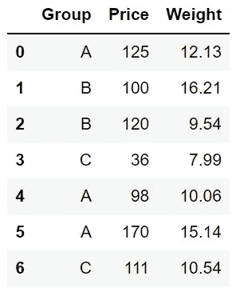
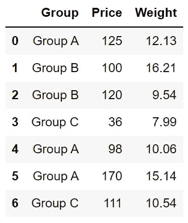
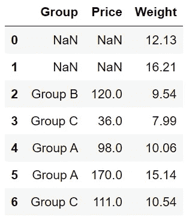
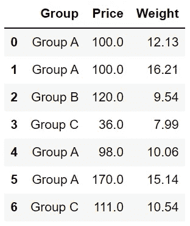
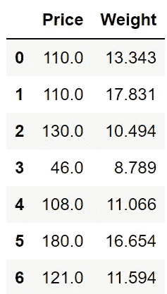

# 4 Python Pandas 函数更好地服务于字典

> 原文：<https://towardsdatascience.com/4-python-pandas-functions-that-serve-better-with-dictionaries-bbfcc6c39fa5?source=collection_archive---------6----------------------->

## 多利用熊猫。


照片由 [Lefteris kallergis](https://unsplash.com/@lefterisk?utm_source=unsplash&utm_medium=referral&utm_content=creditCopyText) 在 [Unsplash](https://unsplash.com/s/photos/serve?utm_source=unsplash&utm_medium=referral&utm_content=creditCopyText) 拍摄

Pandas 可以说是数据科学生态系统中最受欢迎的数据分析和操作库。首先也是最重要的，它很容易学习，并且提供了直观的语法。

话虽如此，我们还是要关注熊猫的另一大特点:灵活性。

Pandas 功能的能力可以通过使用参数来扩展。例如,“read_csv”函数有一个“usecols”参数，它允许我们读取 csv 文件中列的子集。

此外，一些函数有接受 Python 字典作为参数的参数。它进一步增加了灵活性，并加快了几个操作。

在这篇文章中，我们将讨论 4 个熊猫的功能，它们可以在字典的帮助下更好地发挥作用。

让我们从创建一个样本数据框开始。

```
import numpy as np
import pandas as pddf = pd.DataFrame({
   "Group": ["A","B","B","C","A","A","C"],
   "Price": ["125","100","120","36","98","170","111"],
   "Weight": ["12.13","16.21","9.54","7.99","10.06","15.14","10.54"]
})
```



df(作者图片)

# 1.Astype

“astype”函数可用于更改列的数据类型。我以所有列都具有 object 数据类型的方式创建了数据框。

然而，似乎 price 和 weight 列的数据类型应该分别改为 integer 和 float。

一种选择是逐个更改数据类型。

```
df["Price"] = df["Price"].astype("int")df["Weight"] = df["Weight"].astype("float")
```

更实用的方法是将字典传递给“astype”函数，并在一个步骤中更改两种数据类型。

```
df = df.astype({"Price":"int", "Weight":"float"})
```

让我们检查一下新的数据类型:

```
df.dtypesGroup      object
Price       int32
Weight    float64
dtype: object
```

# 2.替换

顾名思义，替换函数用于更改数据框中的值。

它有两个参数:一个是要替换的值，另一个是新值。

replace 函数也接受一个字典，这样我们可以一次替换多个值。

让我们更新组列中的值。

```
df["Group"] = df["Group"].replace(
    {"A": "Group A", "B": "Group B", "C": "Group C"}
)
```



df(作者图片)

# 3.菲尔娜

在数据清理过程中，我们经常需要处理缺失值。“fillna”函数可用于通过适当的替换来更新缺失值。

假设我们在多列中有缺失值，并希望使用单独的值来填充每列中缺失的值。

正如你可能猜到的，解决方法是使用字典。

让我们首先向数据框中添加一些缺失值。

```
df.iloc[:2, :2] = np.nan
```



df(作者图片)

我想将“组 A”用于“组”列，将 100 用于“价格”列，作为缺失值的替换。

```
df = df.fillna({"Group": "Group A", "Price": 100})
```



df(作者图片)

# 4.应用

应用函数用于将函数应用于沿轴(即行或列)的数据框中的值。

轴可以用轴参数改变。默认值为 0，表示该函数与索引一起应用(例如，应用于每一列)。

通过使用字典，我们可以对不同的列应用不同的函数。

例如，下面的代码将“价格”列中的值加 10，并将“重量”列中的值增加 10%。

```
df.apply({"Price": lambda x: x + 10, "Weight": lambda x: x * 1.1})
```



(图片由作者提供)

我们已经讨论了 4 个 Pandas 函数，它们通过使用 Python 字典提供了更多的功能。

这些不是唯一可以和字典一起使用的熊猫函数。例如，“read_csv”、“agg”和“round”函数也接受 Python 字典作为参数。

你可以成为[媒介会员](https://sonery.medium.com/membership)来解锁我的作品的全部权限，以及媒介的其余部分。如果您使用以下链接，我将收取您的一部分会员费，无需您支付额外费用。

<https://sonery.medium.com/membership>  

感谢您的阅读。如果您有任何反馈，请告诉我。