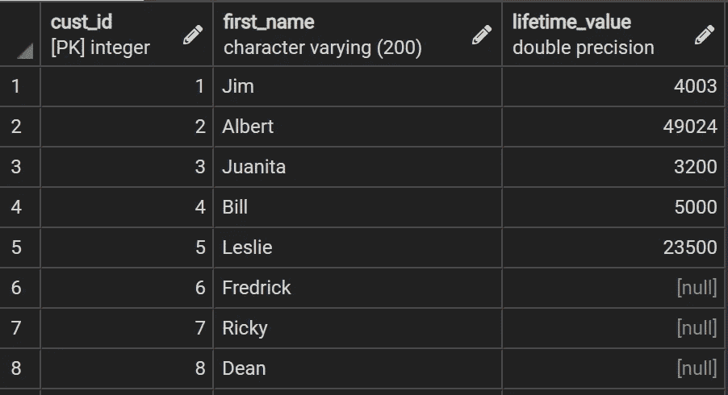
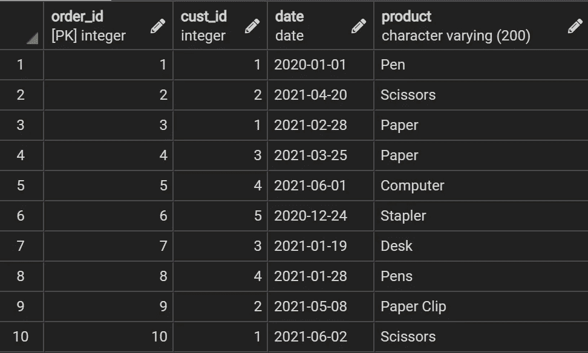
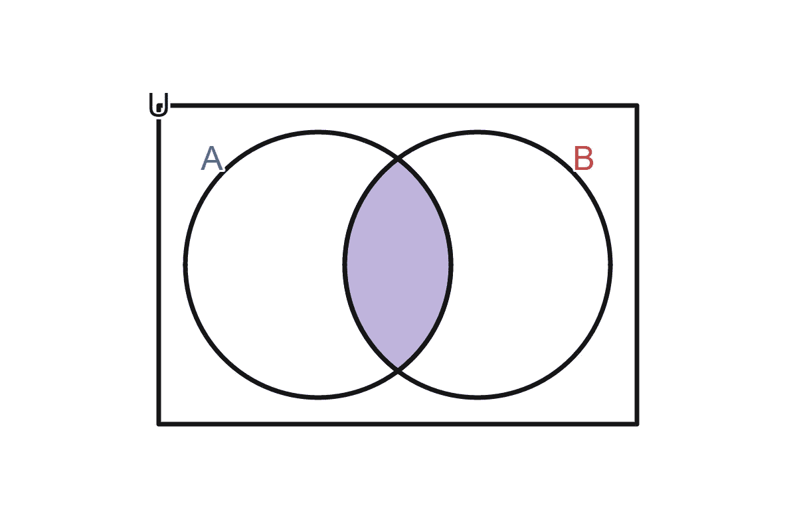
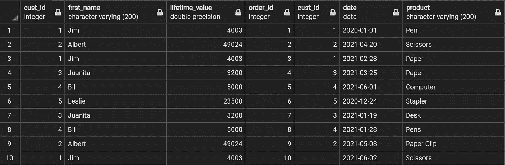
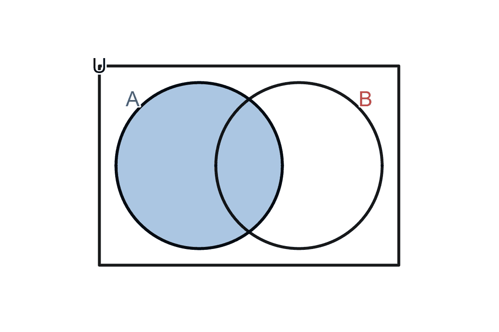
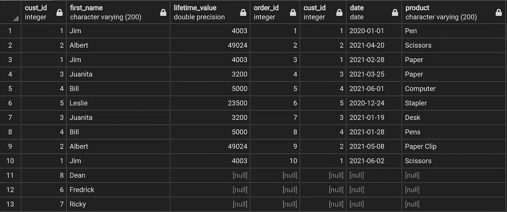
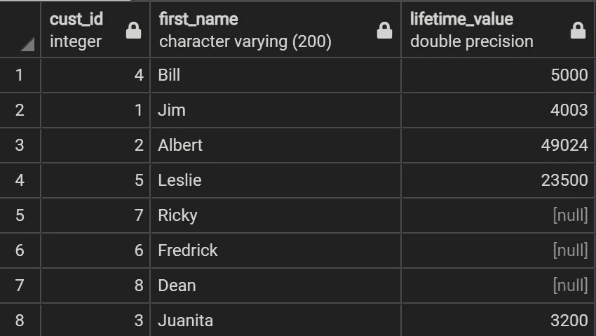
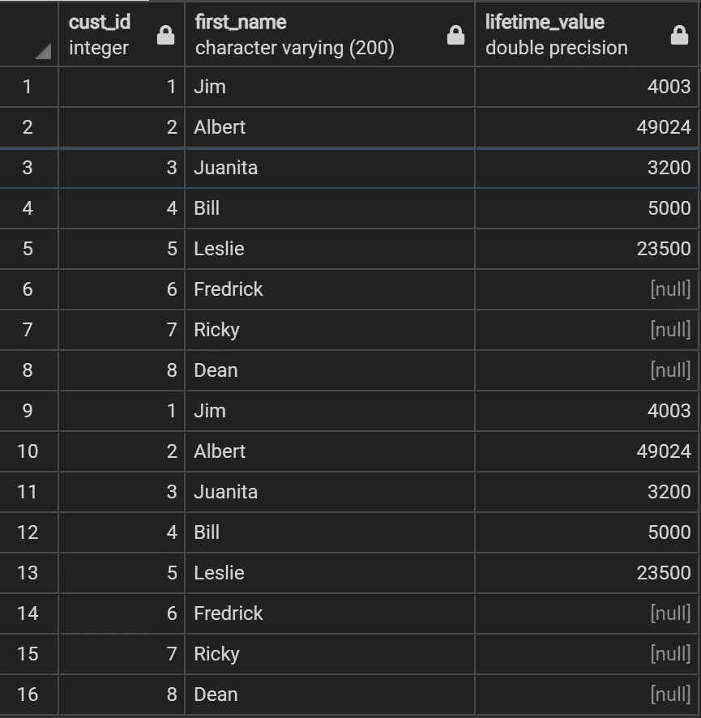

# 在 SQL 中组合数据的 4 种非常重要的方法

> 原文：<https://towardsdatascience.com/4-really-important-ways-to-combine-data-in-sql-b7a5bc1a3b5b?source=collection_archive---------42----------------------->


[蒂姆·约翰逊](https://unsplash.com/@mangofantasy?utm_source=unsplash&utm_medium=referral&utm_content=creditCopyText)在 [Unsplash](https://unsplash.com/@mangofantasy?utm_source=unsplash&utm_medium=referral&utm_content=creditCopyText) 上拍照

## 因为不是所有的数据都存储在同一个位置。

对我来说，SQL 中的连接是很难理解的事情之一，但是理解起来非常重要。经过一些实践和这篇文章，希望混乱会平息。

正如标题所说，在 SQL 中至少有 6 种连接数据的方法。以前我写过关于要学习的基本 SQL 技能。你可以在这里阅读文章。

[SQL 基础知识。足够危险。斯科特·费恩|抄本| Medium](https://medium.com/codex/foundational-sql-know-how-4260fb4ec546)

你还可以找到我的 [GitHub](https://github.com/sfiene/Medium_Article_Code/tree/main/4%20Really%20Important%20Ways%20to%20Combine%20Data%20in%C2%A0SQL) 上使用的所有代码。

让我们看一下将要使用的表格，快速复习一下。以下代码将创建临时表，我们将使用这些表来讨论连接。

```
DROP TABLE IF EXISTS customers CASCADE;
DROP TABLE IF EXISTS orders CASCADE;CREATE TEMP TABLE customers (
 cust_id INT PRIMARY KEY NOT NULL,
 first_name VARCHAR(200) NOT NULL,
 lifetime_value FLOAT NULL
);CREATE TEMP TABLE orders (
  order_id INT PRIMARY KEY NOT NULL,
  cust_id INT NOT NULL,
  date  DATE NULL,
  product VARCHAR(200) NOT NULL,
  CONSTRAINT fk_customer
   FOREIGN KEY(cust_id)
    REFERENCES customers(cust_ID)
    ON DELETE CASCADE
);INSERT INTO customers VALUES (1, 'Jim', 4003)
       , (2, 'Albert', 49024)
       , (3, 'Juanita', 3200)
       , (4, 'Bill', 5000)
       , (5, 'Leslie', 23500)
       , (6, 'Fredrick', NULL)
       , (7, 'Ricky', NULL)
       , (8, 'Dean', NULL);INSERT INTO orders VALUES (1, 1, '01/01/2020', 'Pen')
      , (2, 2, '04/20/2021', 'Scissors')
      , (3, 1, '02/28/2021', 'Paper')
      , (4, 3, '03/25/2021', 'Paper')
      , (5, 4, '06/01/2021', 'Computer')
      , (6, 5, '12/24/2020', 'Stapler')
      , (7, 3, '01/19/2021', 'Desk')
      , (8, 4, '01/28/2021', 'Pens')
      , (9, 2, '05/08/2021', 'Paper Clip')
      , (10, 1, '06/02/2021', 'Scissors');
```

一旦创建了表，让我们看看它们是什么样子的。

```
SELECT *
FROM customers;
```



客户表

```
SELECT *
FROM orders;
```



订单表

好了，现在我们知道了表包含的内容，让我们继续讨论连接。

# 连接

SQL 中有许多联接，但在我看来，最有用的是以下几种:

*   内部连接
*   左连接

这绝不是一个详尽加入名单，而是一些磨你的哨子。让我们从集合论开始。现在你可能还记得高中时的事，也可能不记得。集合论在连接中起着重要的作用，因为它处理两个或多个对象的集合。

## 内部连接

在集合论和内部连接中写的是 A⋂B，也就是所谓的交集 b。它只是 a 和 b 重叠的地方。



内部连接

这可能是 SQL 中最常见的连接类型。它只返回两个表中指定列匹配的行，因此返回两个表的交集⋂。

要在 SQL 中执行内部连接，您需要指定两件事。

*   什么类型的联接，在本例中是内部联接
*   要联接的列，cust_id。这是使用关键字 ON 完成的

```
SELECT *
FROM customers c
 JOIN orders o ON c.cust_id = o.cust_id;SELECT *
FROM customers c
 INNER JOIN orders o ON c.cust_id = o.cust_id;
```

请注意，有两种不同的方法可以产生相同的结果。这是因为除非指定，否则内部联接是默认的联接类型。这两种方式你都可以写，但是我更喜欢第二种方式，因为它可读性更好，并且对将来阅读你的代码的人有帮助。

以上两个查询的输出将只输出每个表中有相同 cust_id 的行。



内部联接输出

## 左连接

既然我们已经讨论了内部连接，那么让我们来讨论一下左连接是做什么的。当讨论集合论中的左连接时，它们被写成 A，或简单的全表 A。



左连接

这是 SQL 中第二常见的连接类型，它返回表 A 中的所有行，并且只返回表 B 中与 A 中的指定列相匹配的行。

要在 SQL 中执行左连接，您需要指定两件事。

*   什么类型的连接，在这种情况下是左连接
*   要联接的列，cust_id。这是使用关键字 ON 完成的

```
SELECT *
FROM customers c
 LEFT JOIN orders o ON c.cust_id = o.cust_id;

SELECT *
FROM customers c
 LEFT OUTER JOIN orders o ON c.cust_id = o.cust_id;
```

就像内部连接一样，有两种不同的方式来编写左连接，这两种方式产生相同的结果。再说一遍，我更喜欢第二种方式，因为它可读性更强，并且对将来阅读你的代码的人有所帮助。

以上两个查询的输出将输出左表中的所有行和右表中的匹配行。现在，在这种情况下，左边的表被认为是 FROM 子句中指定的表，右边的表是 JOIN 子句中指定的表。



左连接输出

这些可能是最有用的连接，现在你知道如何使用它们了。接下来，我们来谈谈工会。

# 联合

对于联合，我们将使用与连接部分相同的两个表，因为我们熟悉这些数据。

请记住，联接用于向查询输出添加更多的列，而联合用于向查询输出添加更多的行。也就是说，有很多方法可以做到这一点，团结和团结。

## 联盟

第一种联合方法就是 union。这种特殊的方法将向输出中添加行，但有一些细微差别。首先，两个查询的结构需要完全相同，其次，该方法将自动删除重复项。

让我们来分解一下。

```
SELECT *
FROM customersUNIONSELECT *
FROM customers;
```

您可以运行 single select 并查看结果，但它们将与 union 相同。这是因为 UNION 删除了重复项，所以它们本质上是一回事。



工会产出

## 联合所有

我们将运行完全相同的查询，但是这次我们将指定 UNION ALL 而不是 UNION

```
SELECT *
FROM customersUNION ALLSELECT *
FROM customers;
```

使用 UNION ALL 时，不会删除重复项。因此，运行上面的查询将产生下面的结果，这实际上是堆叠在自身上的 customers 表。



关于工会和工会，我在工作中学到的是:

> 你最好有一个真正好的理由来解释你为什么使用 **UNION** ，否则就使用 **UNION ALL** 。

我希望这能帮助您理解如何更好地组合您的数据。感谢您的阅读。