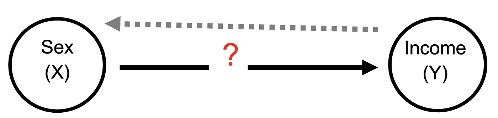

# 相关性并不意味着因果关系的 4 个原因

> 原文：<https://towardsdatascience.com/4-reasons-why-correlation-does-not-imply-causation-f202f69fe979?source=collection_archive---------7----------------------->

## 性生活越多，收入越高？如何区分相关性和因果性？

[Lea L](https://unsplash.com/@leladesign?utm_source=medium&utm_medium=referral) 在 [Unsplash](https://unsplash.com?utm_source=medium&utm_medium=referral) 上拍摄的照片

*“相关性并不意味着因果关系”*这句话已经成为各种各样的陈词滥调。当热情的读者阅读声称两个变量之间存在难以置信的联系的文章时，这似乎是他们在评论区输入的短语。

“相关并不意味着因果关系”是什么意思？我们什么时候应该使用这个短语？我们如何区分相关性和因果关系？相关性不等于因果性的原因是什么？这些是我们在这篇文章中要解决的问题。

# 相关性与因果关系

当 X 和 Y 趋向于一起变化和移动时，我们说它们是*相关的，无论是正向还是负向。在下图中，X 和 Y 有正相关(左)，负相关(中)，无相关(右)。*

**

*作者插图*

*当 X 的变化导致 Y 的变化时，我们说 X ***导致了*** Y。另一种说法是，如果没有前面 X 的变化，Y 的变化就不会发生。*

**

*作者插图*

*格言“相关性并不意味着因果关系”是如何思考两个变量 X 和 Y 之间关系的一个有用的提醒。如果 X 和 Y 似乎有联系，有可能但不确定是 X 导致了 Y。也有可能是 Y 导致了 X，或者是某个第三变量(Z)导致了 X 和 Y。*

*然而，当一个人听到两个变量之间可疑的因果联系时，这个短语有时可能是下意识的反应。通常，这句话是以一种轻蔑的语气说出来的，似乎暗示着“相关性”不如“因果性”联系。这是不幸的，因为相关性可能是有趣的，即使它们不呈现因果关系。相关性可以告诉我们有趣的事情，可以帮助我们理解可能的因果联系。但我们在理解和解释这种相关性时需要小心谨慎。*

# *性生活越多，收入越高？*

*为了说明我们如何区分相关性和因果关系，让我们看看一篇声称更多的性行为导致更高收入的文章。2013 年夏天，[Gawker.com](https://gawker.com/more-bang-for-your-buck-people-who-have-more-sex-make-1159315115)上发表了一篇文章，标题为*“更多的钱用于你的性爱:性生活越多的人赚钱越多”*。作者马克斯·里夫林-纳德勒写道:*“科学家……发现，每周性生活超过四次的人比每周仅性生活一次的人收入高出 3.2%。上帝禁止你根本不做爱。”**

*Gawker 的这篇文章基于安格利亚·罗斯金大学经济学教授 Nick Drydakis 的一项名为“性活动对工资的影响”的研究。在他的研究中，Drydakis 调查了 7500 个希腊家庭(不是 Gawker 文章所说的德国家庭)的性交频率和收入之间的关系。*

*需要澄清的是，Dryadkis 并没有声称他的研究表明更多的性生活会导致更高的收入。他写道，像现有的研究一样，从因果关系中理清相关性是很困难的:*“目前还不清楚这种相关性是否代表因果关系……因为目前的研究结果严格地只适用于时间、地点、样本的个人特征，我们应该强调的是，报道的结果只是性活动和工资之间关系的一个指标，但绝不是最终的结论。”**

*这项研究和 Gawker 文章中对其结果的相应(错误)解释是“相关性并不意味着因果关系”准则发挥作用的好例子。首先，这项研究主要关注相关性，但这种关系被媒体解释为因果关系。其次，这导致了一些读者的反弹，他们警告 Gawker 文章的作者要小心混淆相关性和因果关系。第三，尽管其非因果性质，研究结果仍然可以说是有趣的。这当然在当时引起了互联网的关注！*

*有鉴于此，让我们看看为什么相关性并不意味着因果关系的原因。*

# *相关性≠因果关系的 4 个原因*

## *(1)我们遗漏了一个重要因素(省略变量)*

*相关性可能不等于因果性的第一个原因是，有一些第三变量(Z)同时影响 X 和 Y，使 X 和 Y 一起移动。这种缺失(通常未观察到)变量 Z 的技术术语是“省略变量”。在关于性别与收入关系的研究中，什么第三个因素(Z)能使人们拥有更多的性(X)和更多的钱(Y)？*

*Drydakis 认为，身体健康是第三个重要的变量:*“在这项研究中，我们假设，因为医学和心理学文献表明，性活动与健康、耐力、心理健康、智力和饮食习惯有关，所以它可以被视为一个健康指标，这可能会影响劳动力市场活动的回报……这项研究中发现的模式加强了这一推理。”*换句话说，身心健康很可能会影响性活动水平和收入。在其他条件相同的情况下，更健康的人更有可能有更多的性生活和更高的收入，即使前者不会导致后者。*

**

*作者插图*

*可能还有许多其他被忽略的变量影响着人们的性生活频率和收入水平。例如，Drydakis 还发现，某些性格特征(Z)会影响性活动和工资。特别是，外向性被发现影响这两种结果。这似乎是合理的:外向的人可能更容易与他们感兴趣的人搭讪，并以可能获得更高工资的方式展示自己(例如，自信地讨价还价/谈判工资)。*

*你还能想到哪些省略的变量？*

# *(2)我们得到的东西正好相反(反向因果关系)*

*X 和 Y 一起移动并不意味着 X 导致 Y 的第二个原因是 Y 可能导致 X。这方面的专业术语是“反向因果关系”。*

**

*作者插图*

*在 Gawker 文章的评论部分，许多读者认为这是怀疑性活动对工资的因果影响的主要原因。一位评论者写道，*“性生活最频繁的人赚钱最多？还是说赚钱最多的人性生活最多？”*。另一位写道:*“更正:赚最多钱的男人得到最多的性爱。”还有一个人写道:*“我认为你弄错了。当你破产的时候，有没有试过做爱？”***

*你明白要点了。*

# *(3)我们正在寻找不寻常的人(样本选择)*

*相关性并不意味着因果关系的第三个原因是，我们看到的样本并不代表感兴趣的总体。用专业术语来说，我们有“样本选择”。*

**

*作者插图*

*样本选择的经典例子是基于诺贝尔奖得主[詹姆斯·赫克曼](https://en.wikipedia.org/wiki/Heckman_correction)的工作。假设你想知道为什么有人会得到他们应得的工资。你出去收集一些关于一些结果 Y(例如工资)和一些你认为可能影响你获得多少报酬的利益变量 X(教育程度、职业)的数据。赫克曼指出，在这样的调查中，你只能收集实际工作人员的工资信息。你无法获得不工作的人的结果信息。此外，工作的人是以某种非随机的方式从人群中挑选出来的(例如，你不太可能在这个群体中找到新妈妈)。因此，估计这个选定群体的工资决定因素可能会导致我们得出不准确的结论。*

*这和性别收入关系的研究有什么关系？可能的情况是，大量的失业人员(因此收入为 0)有很多性生活，但他们从未出现在数据中，因为他们的工资为零，如果这些人出现在数据中，那么这种关系可能看起来非常不同！*

# *(4)很难测量事物(测量误差)*

*相关性并不意味着因果关系的第四个原因是，我们感兴趣的结果很难测量，因此只能不完全观察到。这用专业术语来说就是“测量误差”。*

*当你要求人们报告有争议或敏感的话题时，比如，呃，他们做爱的频率，这是一个特别的问题。当你问人们他们[打算投谁的票](https://www.wsj.com/articles/pollsters-say-they-undercounted-republicans-trump-supporters-in-2020-11618353142)或者他们[对各种有争议的问题的态度](https://measuringu.com/survey-biases/)时，也有类似的问题。*

*当具有某些特征的某些类型的人更有可能误报我们感兴趣的变量时，这可能会导致我们推断出不正确的关系。正如一位读者评论的那样:*“也可能是这样，在收入问题上撒谎的人，往往也会在性生活次数上撒谎。”**

*考虑一个类似的场景，某些类型的男人觉得有必要多报性接触的次数，他们也是追求高薪工作的男人，因为他们相信这两者都能给他们带来声望。在这种情况下，看起来好像有更多*报告*性经历的人也有更高的工资，而事实上这种关系是因为他们误报了他们的性活动。*

# *外卖食品*

*事实上，相关性并不意味着因果关系。每当我们看到两个变量之间的关系时，明智的做法是保守地假设这种关系是相关的而不是因果的。*

*然而，这并不意味着相关性是无用的。我们不应该完全忽视相关性，我们需要小心我们如何解释这些相关性。意识到“相关性并不意味着因果关系”是一个起点，但是在没有准确考虑为什么相关性不等于因果关系的情况下抛出这一短语对讨论没有什么帮助。*

*在本文中，我们讨论了相关性不等于因果关系的 4 个常见原因。每当我们看到两个变量一起移动，并倾向于在两者之间建立因果关系时，我们应该停下来问自己以下问题:*

***(1)** 我们是否忘记了影响 X 和 Y 的任何变量 Z？(省略变量)*

***(2)** 是 Y 导致了 X 而不是 X 导致了 Y？(反向因果关系)*

***(3)** 谁失踪了？(样本选择)*

***(4)** 测量 X 和 Y 有多容易？(测量误差)*

*对这些问题的回答要有创造性，这是避免将相关性和因果性混为一谈的一种方法。希望它甚至可以引导我们考虑其他我们以前没有考虑过的关系。毕竟，研究相关性可能是发现更有趣的东西的起点。*