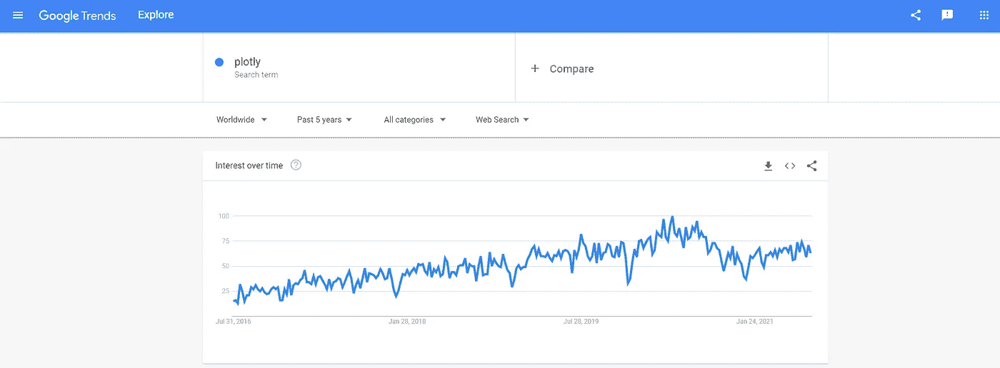
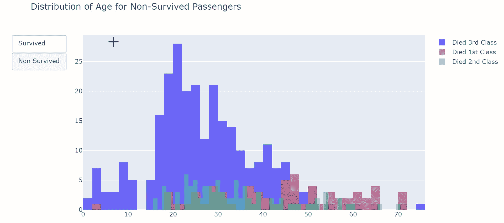
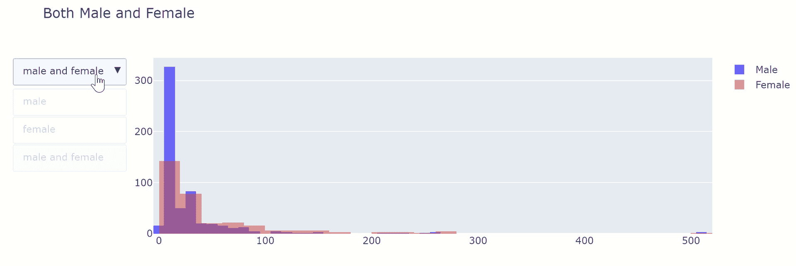
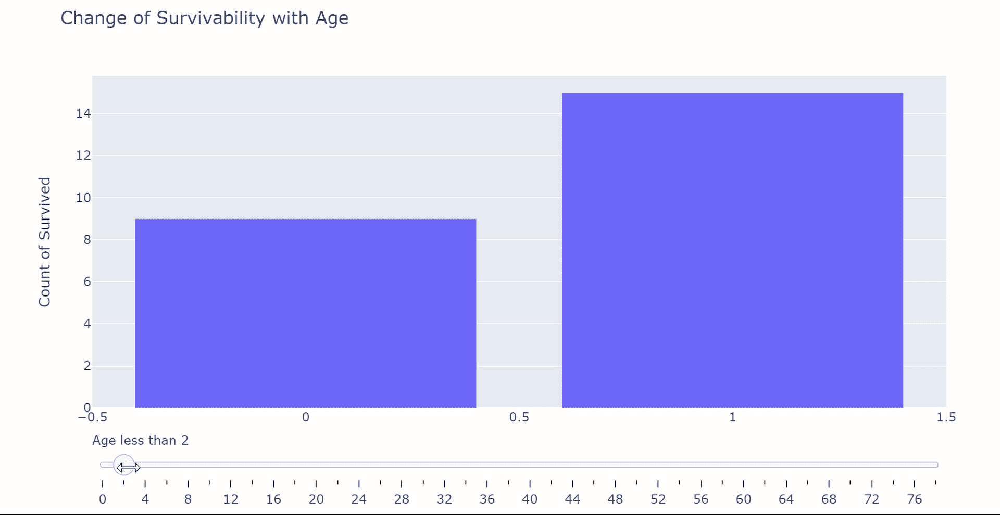
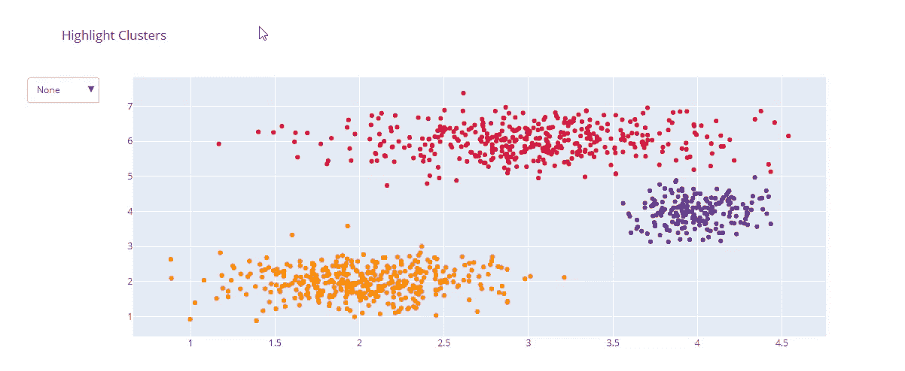
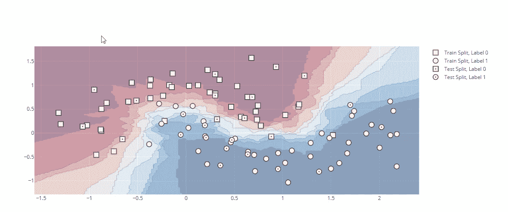
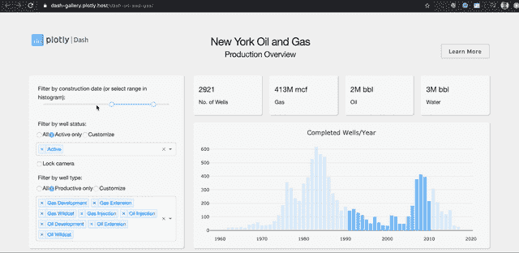

# 为什么 Plotly 是最好的可视化库的 4 个理由

> 原文：<https://towardsdatascience.com/4-reasons-why-plotly-is-the-best-visualization-library-18c27de05b95?source=collection_archive---------9----------------------->

## 一旦你去密谋，你就不能回去


杰森·布里斯科在 [Unsplash](https://unsplash.com?utm_source=medium&utm_medium=referral) 上的照片

数据可视化是数据科学家的语言。
如果你从事数据行业，你可能需要向某人展示数据。没有一些可视化的魔法，你是做不到的。

随着科技行业的成熟，对更好的可视化的需求也在增加。每种类型的可视化都有其特点，就像折线图比条形图更好地描述趋势一样。

选择可视化的类型已经够让人头疼的了。让我们不要搞乱将会把它们都标绘出来的库。



作者截图

听说过 [**剧情**](https://plotly.com/python/) 吗？
您可能听说过 Matplotib 和 Seaborn，因为它们经常在数据科学课程中被提及。但是您知道这些库是为基本绘图而设计的吗？

甚至 **Matplotlib** 的官方功能也声明:

> Matplotlib 主要用于基本绘图*。— Matplotlib*

[](/python-for-data-science-a-guide-to-data-visualization-with-plotly-969a59997d0c) [## 面向数据科学的 python——Plotly 数据可视化指南

### 现在是 2020 年，是时候停止使用 Matplotlib 和 Seaborn 了

towardsdatascience.com](/python-for-data-science-a-guide-to-data-visualization-with-plotly-969a59997d0c) [](/python-for-data-science-advance-guide-to-data-visualization-with-plotly-8dbeaedb9724) [## 用于数据科学的 Python 使用 Plotly 进行数据可视化的高级指南

### 如何在 Plotly 中添加和自定义滑块、下拉菜单和按钮

towardsdatascience.com](/python-for-data-science-advance-guide-to-data-visualization-with-plotly-8dbeaedb9724) 

以非凡的方式显示您的数据。用 Plotly。
Plotly 是**用于**交互式**数据可视化的** Python 库。Plotly 在解释和探索数据方面非常强大。继续读下去，你就会明白为什么了。

# 交互性


约翰·施诺布里奇在 [Unsplash](https://unsplash.com?utm_source=medium&utm_medium=referral) 上拍摄的照片

Plotly 提供了一个其他可视化库没有的特性——**交互性。**

这使得用户可以与显示的图形进行交互，从而获得更好的讲故事体验。放大和缩小，点值显示，平移图形，你能想到的，他们都有。



作者录音

能够流畅地浏览您的可视化在数据交流中发挥着巨大的作用。观察使用 Plotly 提供的交互式工具解释复杂数据是多么容易。

与静态图相比，这是领先**英里**。
现在，让我们更进一步。



作者录音

Plotly 允许用户通过使用可定制的交互工具来进一步改善可视化体验。当我们用 Plotly 可视化数据时，我们可以添加交互式功能，如**按钮、滑块和下拉菜单**，以显示图形的不同视角**。**

这些互动功能**完全可定制**显示您想要的内容和您想要的方式。从图表标题到 Y 轴刻度，您可以随时控制显示的内容。在向企业主展示数据时，这一点非常重要，因为它可以更清晰地传达你的观点。

# 定制和灵活性



由[精心下拉](https://plotly.com/python/dropdowns/)

Plotly 就像一张纸，你可以在上面画任何你想画的东西。
与 Tableau 等传统可视化工具相比，Plotly 允许**完全控制正在绘制的内容。**

由于 Plotly 是基于 **Pandas** 绘制的，您可以在绘制之前轻松地对数据执行复杂的转换。一个例子是在可视化数据列之前对其进行算术运算，如单位转换。你的创造力是极限。

全面定制包括但不限于—

*   任何时候要显示多少图表
*   下拉菜单等交互式工具的数量
*   每个下拉菜单上的标题、轴、数据源规格

Plotly 通过在绘图过程中定义 3 个主要对象来实现这一点—
**数据、布局和图形**对象。

*   数据-通常是熊猫数据框。完全可定制的数据点
*   布局—定义绘图标题、x 轴和 y 轴标题、显示图例、激活过滤器/滑块，以及对图表的更多自定义。
*   图-定义如何根据布局绘制数据

通过正确定义每个对象，您可以以任何想要的方式轻松地构建和重建图形。

# 系列和美学


来自[精彩](https://medium.com/plotly/introducing-plotly-express-808df010143d)公告的精彩示例

除了能够绘制**所有的 Matplotlib 和 Seaborn 图表**，Plotly 还提供了大量的图形和图表，如

*   **统计图**包括但不限于平行类别和概率树图
*   你从未想到的科学图表，从网络图到雷达图
*   财务图表对时间序列分析很有用，例如蜡烛图、漏斗图和子弹图
*   **地质图**和允许你与之互动的三维绘图

最重要的是，Plotly 可能是最好看的(有待商榷？)图表库就在那里。Plotly 还为工程师提供了更加清晰易懂的代码库。



KNN 分类器由[精心策划](https://plotly.com/python/knn-classification/)

当 Plotly 不用于仪表板和数据探索时，它用于**机器学习**。Plotly 提供了广泛的 [AI 和 ML 图表](https://plotly.com/python/ai-ml/)，可以提升你的机器学习游戏。

当 Plotly 用于仪表板时，它由**仪表板**支撑。



纽约石油天然气由 [Dash App 图库](https://dash-gallery.plotly.host/dash-oil-and-gas/)

Dash 是一个 Python 框架，允许你创建由 **Flask、Plotly.js 和 React.js** 支持的惊人的 web 应用。Dash 在构建数据可视化应用方面效率极高，你不需要了解任何 **HTML、CSS 或 Javascript。**

你只需要知道 Plotly。

Dash 消除了所有需要了解 web 开发的担忧，包括部署应用程序的头痛问题。它很容易维护，跨平台，并且**移动就绪**。

我在这里谈论更多—

[](/python-for-data-science-a-guide-to-plotly-dash-interactive-visualizations-66a5a6ecd93e) [## 面向数据科学的 python——Plotly Dash 交互式可视化指南

### 构建您的第一个 web 应用程序！

towardsdatascience.com](/python-for-data-science-a-guide-to-plotly-dash-interactive-visualizations-66a5a6ecd93e) 

# 支持


由 [Lagos Techie](https://unsplash.com/@heylagostechie?utm_source=medium&utm_medium=referral) 在 [Unsplash](https://unsplash.com?utm_source=medium&utm_medium=referral) 拍摄的照片

Plotly，这个库，是由名为 **Plotly** 的公司做后盾，该公司还负责开发 **Dash** 。该公司总部设在蒙特利尔，在波士顿设有办事处。

该公司已经开源了几个可视化产品。它通过为可视化应用程序(主要是 Dash)提供增强的功能、私人托管和持续集成来获得收入。

也就是说，普洛特利近期不会去任何地方。他们官方网站上的文档和指南既复杂又精确。它几乎涵盖了你需要了解的所有事情。

正在为 Plotly 提供持续的支持和开发。
**特性**不断被添加，一个例子是[间隔特性](https://dash.plot.ly/live-updates)，它在没有任何外部触发的情况下自动激活实时更新。

## 社区论坛

Plotly 还有一个活跃的[论坛](https://community.plotly.com/)，你可以在这里与其他 Plotly 用户互动。这里的成员一般都很友好，乐于助人。如果你有一个问题，很可能已经在论坛上被问过了。快速搜索一下，你就会找到解决办法。

# 结论


照片由[杰森·斯特鲁尔](https://unsplash.com/@jasonstrull?utm_source=medium&utm_medium=referral)在 [Unsplash](https://unsplash.com?utm_source=medium&utm_medium=referral) 上拍摄

如果你们中的任何人对尝试 Plotly 持观望态度，我希望我已经消除了你们的一些疑虑。这可能需要一些时间来学习，但我向你保证这是值得的。

如果我想让你从这篇文章中学到什么，那就是—

```
pip install plotly
pip install cufflinks
```

在这篇文章中，我们讨论了为什么 Plotly 是一个伟大的可视化库，因为—

*   交互性
*   定制和灵活性
*   系列和美学
*   支持

像往常一样，我引用一句话作为结束。

> *数据是新的科学。大数据掌握着答案*。”—* 作者帕特·基尔辛格*

# *订阅我的时事通讯，保持联系。*

*也可以通过 [**我的链接**](https://nickefy.medium.com/membership) 注册一个中等会员来支持我。你将能够从我和其他不可思议的作家那里读到无限量的故事！*

*我正在撰写更多关于数据行业的故事、文章和指南。你绝对可以期待更多这样的帖子。与此同时，可以随时查看我的其他 [**文章**](https://medium.com/@nickmydata) 来暂时填补你对数据的饥渴。*

****感谢*** *的阅读！如果你想和我取得联系，请随时通过 nickmydata@gmail.com 联系我或者我的* [*LinkedIn 个人资料*](https://www.linkedin.com/in/nickefy/) *。也可以在我的*[*Github*](https://github.com/nickefy)*中查看之前写的代码。**