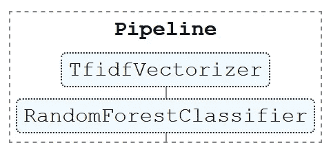
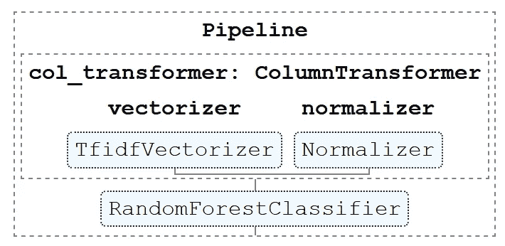
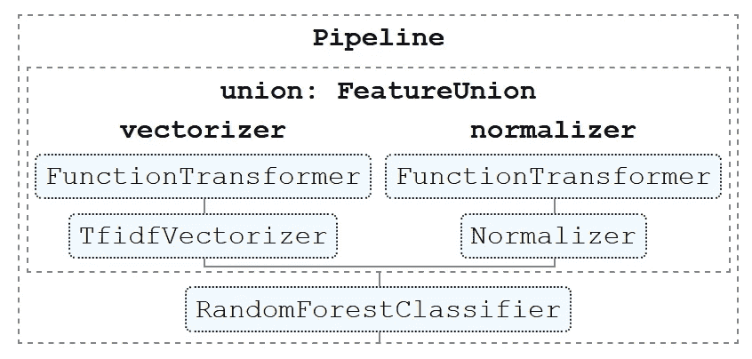

# 4 sci kit——每个数据科学家都应该使用的学习工具

> 原文：<https://towardsdatascience.com/4-scikit-learn-tools-every-data-scientist-should-use-4ee942958d9e?source=collection_archive---------19----------------------->

## 复合估算器和变压器

*作者:* [*阿玛尔哈斯尼*](https://medium.com/u/d38873cbc5aa?source=post_page-----4ee942958d9e--------------------------------) *&* [*迪亚赫米拉*](https://medium.com/u/7f47bdb8b8c0?source=post_page-----4ee942958d9e--------------------------------)

照片由[桑迪·米勒](https://unsplash.com/@sandym10?utm_source=unsplash&utm_medium=referral&utm_content=creditCopyText)在 [Unsplash](https://unsplash.com/s/photos/chain?utm_source=unsplash&utm_medium=referral&utm_content=creditCopyText) 上拍摄

数据科学项目往往包括预处理、功能工程、功能选择、培训、测试之间的多个来回通道…在尝试多个选项时，甚至在生产环境中，处理所有这些步骤会很快变得混乱。幸运的是，Scikit-Learn 提供的选项允许我们将多个估计器链接成一个。换句话说，像 fit 或 predict 这样的特定操作只需要在整个估计序列上应用一次。在本文中，我们将通过一个具体项目的用例实例与您分享其中的四个工具。

## 目录

[1 -管道](#25ad)
[2 -函数转换器](#746c)
[3 -列转换器](#6b20)
[4 -特征联合](#9547)
[替代语法:make _【composite _ estimator】](#7d90)
[奖励:可视化您的管道](#5f87)

# 热身

在我们开始探索 scikit-learn 的工具之前，让我们先来获取一个可以使用的数据集。

我们应该提到，这只是为了举例。所以不一定需要下载(除非你想自己试代码)。

实际上，我们偶然发现了一个名为 `datasets`的漂亮 python 包，它允许您轻松下载 500 多个数据集:

我们将使用[亚马逊美国评论](https://huggingface.co/datasets/viewer/?dataset=amazon_us_reviews&config=Video_Games_v1_00)。它包含数字和文本特征(例如，评论和它得到的有用投票的数量)，目标特征是归属的星的数量。

# 1 -管道

## 什么是管道？

为了方便起见，流水线是将估计序列封装成一个序列的工具。

## 是什么让它有用？

管道之所以方便，有多种原因:

*   紧凑性:您可以避免编写多行代码，也不用担心估计器的顺序。
*   清晰:易于阅读和可视化。
*   易于操作:在整个估计序列上应用拟合或预测方法只需要一个单一的动作。
*   联合参数选择:使用管道可以通过网格搜索一次优化所有估计器的参数。

## 如何在实践中运用？

实际上，流水线是一束转换器，后面跟着一个估计器。

如果你不知道什么是 transformer，它基本上是实现了 `fit`和 `transform`方法的任何对象。

在我们的例子中，我们将使用 `TfidfVectorizer`将评论从文本数据转换成数字数据，然后尝试使用 `RandomForestClassifier`进行预测:

作者图片

# 双功能变压器

## 什么是函数转换器？

正如我们在前面提到的，一个 `Transformer`需要包含 `fit`和 `transform`方法。

`FunctionTransformer`是一个无状态的转换器，由您创建的 `callable`(又名函数)构建而成。

## 是什么让它有用？

在某些情况下，您需要执行不进行任何参数拟合的变换。在这种情况下，创建一个 `fit`方法是没有用的。在这些情况下，`FunctionTransformer`将是最有用的。

## 如何在实践中运用？

我们的数据集包含一个日期格式的要素。我们可以对日期进行转换的一个例子是提取年份。

这是如何使用 FunctionTransformer 实现的:

注意:如果 lambda 函数与`FunctionTransformer`一起使用，那么产生的变压器将不可拾取。值得一提的是，您可以通过使用 [cloudpickle](https://pypi.org/project/cloudpickle/) 包来解决这个问题。

# 三柱变压器

## 什么是列变压器？

根据您的数据集，您可能需要对数组或 pandas 数据帧的不同列应用不同的转换。

列转换器允许在连接生成的要素之前应用单独的转换。

## 是什么让它有用？

这个估计器对于异类数据特别有用。在这种情况下，您需要为列或列子集的数据类型自定义特征提取机制或转换。

## 如何在实践中运用？

在我们的例子中，我们有文本和数字数据。下面是我们如何使用 Column Transformer 根据数据类型应用单独的转换:

正如所料，ColumnTransformer 的输出数据有 102 列:100 列来自 TF-IDF 转换器，2 列来自规格化器。

作者图片

# 四特征并集

## 什么是特征联合？

类似于 `ColumnTransformer`，一个 `FeatureUnion`串联多个变压器的结果。只是略有不同，因为每个转换器获取整个数据集作为输入，而不是像 ColumnTransformer 中那样获取列的子集。

就您可以用它们做什么而言，这两者是相当等同的，但是根据具体情况，其中一个可能更适合使用，并且需要的代码更少。

## 是什么让它有用？

`FeatureUnion`允许您将不同的特征提取转换器组合成一个`Transformer`。

## 如何在实践中运用？

与前一种情况等效，我们可以通过使用由 ColumnSelector 和给定的 Transformer 组成的管道来构造 FeatureUnion。

我们将构建一个 FeatureUnion，执行与之前实现的 `ColumnTransformer`相同的转换。

为此，我们将把两个管道封装成一个 FeatureUnion。每条管线链接一个 `ColumnSelector`和一个给定的变压器。

scikit-learn 中没有预实现的 `ColumnSelector`，所以我们将使用 `FunctionTransformer`来构建我们自己的:

作者图片

# 替代语法:make_[composite_estimator]

前面提到的方法(除了函数转换器)还有一些替代方法，它们的语法略有不同。

这些方法是:

*   [制造 _ 管道](https://scikit-learn.org/stable/modules/generated/sklearn.pipeline.make_pipeline.html#sklearn.pipeline.make_pipeline)
*   [make _ column _ transformer](https://scikit-learn.org/stable/modules/generated/sklearn.compose.make_column_selector.html#sklearn.compose.make_column_selector)
*   [make_union](https://scikit-learn.org/stable/modules/generated/sklearn.pipeline.make_union.html#sklearn.pipeline.make_union)

这些是以前的构造函数的缩写。主要的区别在于，它们不要求也不允许命名估计量。相反，组件名称将自动设置为其类型的小写。

在大多数情况下，使用简写版本更简单、更清晰、更易读。但是，例如，如果您需要执行网格搜索，您可能需要定制您的估计器的名称。在这种情况下，为清晰和简洁起见，指定简短的可识别名称会很有用。

如果您不熟悉使用网格搜索进行参数优化，我们将很快就此写一篇文章。

您可以看到应用于以下管道情况的两个版本之间的差异:

*   **管道**语法:

*   对比 **make_pipeline** :

# 好处:可视化您的管道

Scikit-Learn 提供了一种简洁的方式来可视化您使用以下代码行创建的复合估计量:

这将有效地创建一个交互式 HTML 文件，以清晰的方式表示您的管道。

如果您使用笔记本电脑，另一种方法是使用以下代码:

# 最后的想法

管道和复合估算器是数据科学项目的强大工具，尤其是那些要放在生产环境中的项目。它们的附加值不仅在于清晰和方便，还在于安全和防止数据泄露。

如果您想了解我们如何在实际项目中使用本文中提到的不同工具，请不要犹豫，看看我们以前的文章:

 [## 我如何为源代码语言建立分类模型

### 大约 97%的准确率

towardsdatascience.com](/classification-model-for-source-code-programming-languages-40d1ab7243c2) 

最后，如果您想了解如何利用这些复合估计器来优化整个管道中的超参数，或者比较不同算法的性能，请继续关注我们未来关于网格搜索的文章。

谢谢你坚持到现在。我们希望您喜欢这些内容。注意安全，我们将在未来的文章中再见😊