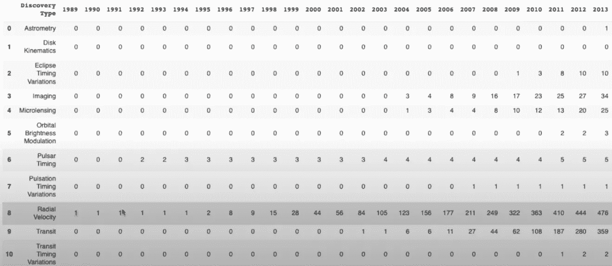
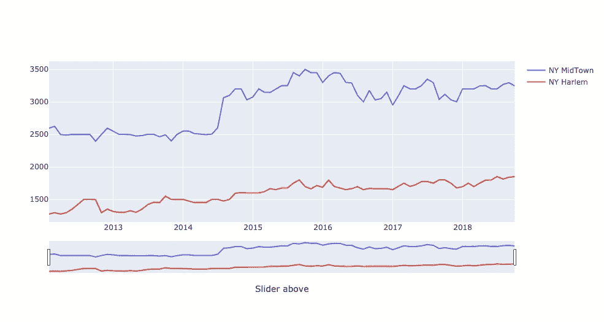

# 为数据科学项目获得一流数据集并给老板留下深刻印象的 4 个秘密方法

> 原文：<https://towardsdatascience.com/4-secret-ways-to-get-superb-datasets-for-data-science-projects-impress-your-boss-7cef1633b26d?source=collection_archive---------35----------------------->

## 面向初学者的数据科学和 Python。

## 从 NASA 到 Youtube，让我们把数据科学和机器学习带到另一个高度


杰森·霍根在 [Unsplash](https://unsplash.com?utm_source=medium&utm_medium=referral) 上的照片

如果你曾经从事过个人数据科学项目，你可能会花很多时间浏览互联网，寻找有趣的数据集进行分析。

即使筛选数十个数据集以找到完美的数据集很有趣，但下载并导入几个 CSV 文件后发现这些数据根本不有趣也会令人沮丧。

最重要的是，让你的数据科学之旅更有趣对你的进步至关重要，并保持你的动力。

我坚信，如果你喜欢你正在做的事情，你会更有效率。根据经验，这是我今年获得晋升的六大建议中的第五条:

[](/python-6-coding-hygiene-tips-that-helped-me-got-promoted-c70b4380f1c7) [## Python:帮助我获得晋升的 6 个编码卫生技巧。

### 在这篇文章中，我列出了 6 个显而易见但并不总是适用的编码技巧，我希望有人能强迫我遵循 3 年…

towardsdatascience.com](/python-6-coding-hygiene-tips-that-helped-me-got-promoted-c70b4380f1c7) 

这就是为什么，作为一个父亲和数据科学家，找到正确的数据集，让你的机器学习模型变得独特和令人愉快是至关重要的。

在本文中，您将获得一个由 4 个独特的原始数据集组成的候选列表，您可以免费获得这些数据集，并使用一行简单的 Python 代码获得**。**

开始吧！

# 1.美国国家航空航天局🚀

我想向你们展示的第一个独特的原始数据集提供者是美国国家航空航天局，也叫国家航空航天局。

对于生活在另一个星球上的人(如果你欣赏这个笑话，请告诉我:)，NASA 是美国政府机构，负责与航空和航天相关的科学技术。

但是对于那些不知道的人来说，NASA 作为一个公共资助的政府组织，**将其数据免费提供给公众(在那里你可以运行你的深度学习和机器学习算法)**。该组织提供的数据集分为两类:

*   [地球科学](https://earthdata.nasa.gov/)
*   [空格](https://pds.nasa.gov/datasearch/data-search/)

您可以通过直接从上面链接的官方网站下载 CSV 或执行下面的命令并使用 NASA Python API 请求数据来开始探索这些数据。该 API 由麻省理工学院提供，用于研究目的。您可以使用下面的代码行安装该库。

```
pip install python-nasa-api
```

然后，您需要插入与正确数据集相对应的滚动条，您将准备好探索银河系的不同恒星。

这是我用 Python NASA API 请求的一个数据集的例子。它代表了国家机构发布的关于星系中随时间变化的发现类型的数据:



NASA 提供的输入数据集示例-图片由作者提供

第二个原始数据集提供者是 Quandl。

# 2.面向银行和官方机构的 Quandl。🇺🇸

我推荐给你的第二个 API 更加官方，但仍然非常有趣。使用 Quandl API 可以让你直接从一个很有影响力的机构获取数据，比如加拿大银行、美国美联储、印度政府等。…用**一行 Python 代码**。

*我已经写了一份关于这个 API 的完整指南，如果你有兴趣的话，我可以让你看看:*

[](/python-i-have-tested-quandl-api-and-how-to-get-real-estates-economics-data-in-one-line-of-code-a13806ca9bb) [## Python:我已经测试了 Quandl API，以及如何在一行代码中获取房地产和经济数据。

### 在这篇文章中，我测试了著名的 Quandl API 来下载房地产、经济、社会和金融数据…

towardsdatascience.com](/python-i-have-tested-quandl-api-and-how-to-get-real-estates-economics-data-in-one-line-of-code-a13806ca9bb) 

Quandl 提供的数据范围超越了金融和经济数据；你可以探索你所在区的房地产价格，雇佣市场活动等等。

我会让你发现上面关于如何获得这些数据的完整指南，但我相信，如果你需要大量数据来执行**机器学习**或**深度学习**模型，以及为什么不写一篇关于它的文章，这是一笔很好的资产。

下面是我通过分析纽约哈莱姆区和曼哈顿区的房地产数据得出的一个比较结果:



以下是曼哈顿中城和哈莱姆区(纽约市)一居室公寓月租金(美元)的对比。—作者 Gif。

有趣的是，曼哈顿的月租金价格在 2014 年 7 月出现了大幅上涨。你可以在这篇[文章](/python-i-have-tested-quandl-api-and-how-to-get-real-estates-economics-data-in-one-line-of-code-a13806ca9bb)中找到完整的代码。

现在让我们继续另一种获取数据集的方式，这是你永远不会想到的:Youtube。

# 3.油管（国外视频网站）📺

你梦想过创建自己的 Youtube 算法吗？你现在可以用 Python 来制作。

第三个数据提供者是 **Youtube** 。自 2015 年以来，Youtube 已经免费使用其实时数据，他们有自己的 API，你甚至可以建立自己的 Youtube 算法。

否则，你可以使用这些数据来运行你自己的算法，并了解你的 Youtube 频道内发生了什么。或许能发现有趣的隐藏模式。

如果你想现在就开始，你只需要遵循一个三步流程。

## 过程

要设置您的 API，路径很简单，需要三个步骤:

*   安装 Youtube Python API 库
*   设置您的 Google 凭据
*   请求数据

下面是一个完整的例子，你可以阅读这篇精彩的文章，作者是一位致力于数据科学的作者( [Chris Lovejoy](https://medium.com/u/c155ffc8de0e?source=post_page-----7cef1633b26d--------------------------------) ):

[](/i-created-my-own-youtube-algorithm-to-stop-me-wasting-time-afd170f4ca3a) [## 我创建了自己的 YouTube 算法(为了不让我浪费时间)

### 使用 YouTube API 和 AWS Lambda

towardsdatascience.com](/i-created-my-own-youtube-algorithm-to-stop-me-wasting-time-afd170f4ca3a) 

现在我想结束这篇文章，为更具体的数据科学技能集开发提供一些额外的选择。

# 4.其他选择🤟

在结束这篇文章之前，我想给你一些额外的选择来改善你的数据科学在特定领域的模型，比如地理数据，或者通过情感分析变得更好。

这些来源也可以用于其他类别。

## 地理空间数据:

如果你正在寻找建立一个关于任何主题的地理互动图，我推荐使用 **OpenDataSoft** 。几周前，当我打算用地理空间结果驱动的地图向客户交付地图时，我发现了这个 API。

在所提供的数据集中，您将有可能获得 JSON 文件中的所有地理空间信息。那会节省你几个小时的工作时间。

## 市场数据:

如果你正在学习金融，并在寻找获得市场相关数据的方法，我强烈推荐**雅虎金融 API** 。

我做了一个实时测试来检查 API 的健壮性，我对 API 的有效性感到非常惊讶。

你可以在这篇[文章](/python-how-to-get-live-market-data-less-than-0-1-second-lag-c85ee280ed93)中找到全部信息。

## 📰NLP(自然语言处理)模型的数据:

如果你想更好地分析文本，并发展你在自然语言处理(NLP)方面的技能，我强烈推荐你使用 **Twitter API。**

我已经测试了关于这个主题的多个在线课程，以获得更好的效果，我发现了一种独特而令人兴奋的方法来建立 NLP 模型，通过使用 **Twitter** 数据。

我相信 Twitter 可以非常有趣地发展你的数据科学技能，因为你正在用**真人数据**测试你的人工智能模型，而且所有这些都是免费的**。**

**我从来没有这么开心过，我妻子现在把我当成了超级英雄(不完全是:)，这让我更加专注于提高自己的技能。**

**我强烈推荐以下课程:**

**[](https://www.udemy.com/course/trading-with-ml-in-python/?couponCode=TDSCIENCE) [## 2021 年:Python 中机器学习的算法交易

### 大家好，我们是詹姆斯·布里格斯和赛义德·莱萨尼。我们都是数据科学家，在这里的多家银行工作…

www.udemy.com](https://www.udemy.com/course/trading-with-ml-in-python/?couponCode=TDSCIENCE) 

## 结论:

我希望你喜欢这篇文章，显然，这个列表可以扩展(网飞，亚马逊，谷歌，Kaggle …).这只是一些我觉得最有趣的数据集的样本。

作为一名父亲和数据科学家，我正试图让我的儿子参与其中，我发现的最好方法是给他**激励**和**雄心勃勃的**项目去工作。他喜欢这样。** 

**感谢您的关注，**

**编码愉快，赛义德。**