# 用 Python 绘制多个图形的 4 个简单技巧

> 原文：<https://towardsdatascience.com/4-simple-tips-for-plotting-multiple-graphs-in-python-38df2112965c?source=collection_archive---------7----------------------->


由 [Peter Olexa](https://unsplash.com/@deeezyfree?utm_source=medium&utm_medium=referral) 在 [Unsplash](https://unsplash.com?utm_source=medium&utm_medium=referral) 上拍摄

## 数据可视化

## 学习可视化多个支线剧情的有用的简短代码片段

当可视化数据时，通常需要在一个图形中绘制多个图形。例如，如果你想从不同的角度观察同一个变量，多图表是很有用的(例如，一个数值变量的并排直方图和箱线图)。在这篇文章中，我分享了 4 个简单但实用的绘制多个图表的技巧。


Pawel Czerwinski 在 [Unsplash](https://unsplash.com?utm_source=medium&utm_medium=referral) 上拍摄的照片

# 资料组📦

让我们导入包并更新图表的默认设置，为图表添加一点个人风格。我们将在 tips 上使用 Seaborn 的内置数据集:

```
import seaborn as sns # v0.11.2
import matplotlib.pyplot as plt # v3.4.2
sns.set(style='darkgrid', context='talk', palette='rainbow')df = sns.load_dataset('tips')
df.head()
```

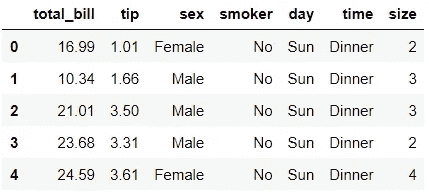

# 📍技巧 1: plt.subplots()

绘制多个支线剧情的一个简单方法是使用`plt.subplots()`。以下是绘制 2 个并排支线剧情的语法示例:

```
fig, ax = plt.subplots(nrows=1, ncols=2, figsize=(10,4))
sns.histplot(data=df, x='tip', ax=ax[0])
sns.boxplot(data=df, x='tip', ax=ax[1]);
```

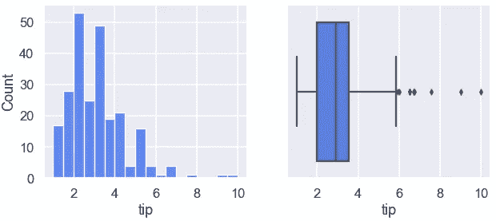

这里，我们在一个图形中绘制了两个支线剧情。我们可以进一步定制每个支线剧情。例如，我们可以像这样给每个支线剧情添加标题:

```
fig, ax = plt.subplots(1, 2, figsize=(10,4))
sns.histplot(data=df, x='tip', ax=ax[0])
ax[0].set_title("Histogram")
sns.boxplot(data=df, x='tip', ax=ax[1])
ax[1].set_title("Boxplot");
```

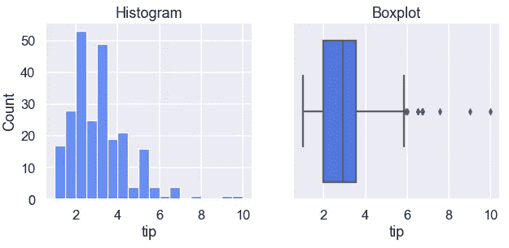

我们可以将循环中所有数值变量的同一组图形可视化:

```
numerical = df.select_dtypes('number').columnsfor col in numerical:
    fig, ax = plt.subplots(1, 2, figsize=(10,4))
    sns.histplot(data=df, x=col, ax=ax[0])
    sns.boxplot(data=df, x=col, ax=ax[1]);
```

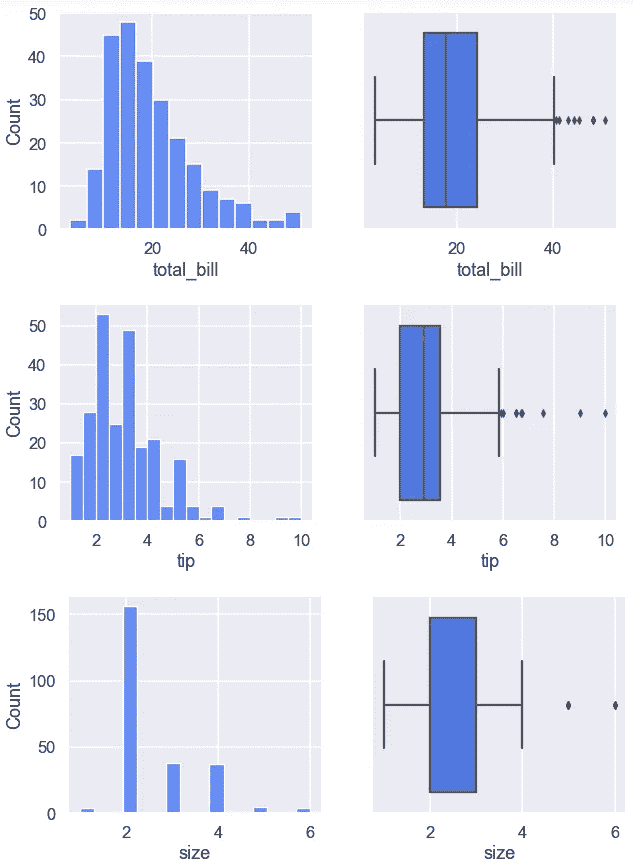

# 📍技巧 2: plt.subplot()

另一种可视化多个图形的方法是使用`plt.subplot()`而不在末尾使用`s`。语法与之前略有不同:

```
plt.figure(figsize=(10,4))
ax1 = plt.subplot(1,2,1)
sns.histplot(data=df, x='tip', ax=ax1)
ax2 = plt.subplot(1,2,2)
sns.boxplot(data=df, x='tip', ax=ax2);
```

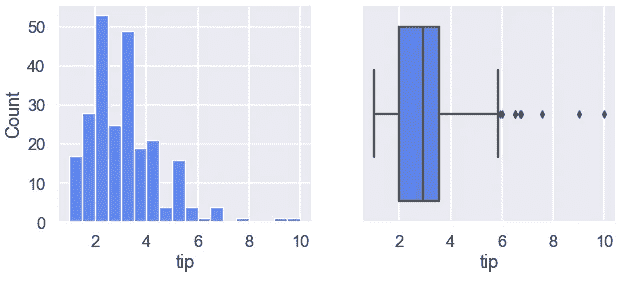

如果您想要为多个图绘制相同类型的图形，并在一个图中查看所有内容，这种方法特别有用:

```
plt.figure(figsize=(14,4))
for i, col in enumerate(numerical):
    ax = plt.subplot(1, len(numerical), i+1)
    sns.boxplot(data=df, x=col, ax=ax)
```

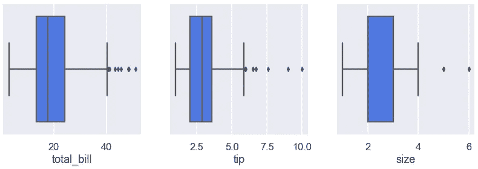

我们可以像以前一样进一步定制每个支线剧情。例如，让我们为每个情节添加一个标题:

```
plt.figure(figsize=(14,4))
for i, col in enumerate(numerical):
    ax = plt.subplot(1, len(numerical), i+1)
    sns.boxplot(data=df, x=col, ax=ax) 
    ax.set_title(f"Boxplot of {col}")
```

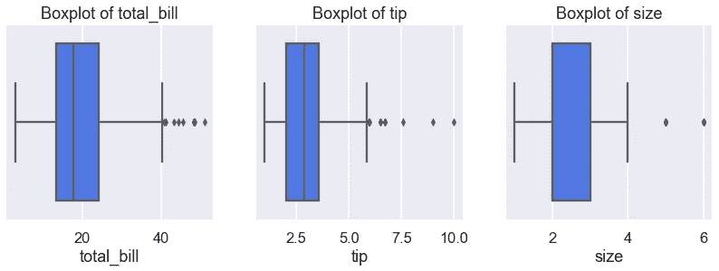

学过`plt.subplots()`和`plt.subplot()`之后，下面的对比有助于理解两者的异同:

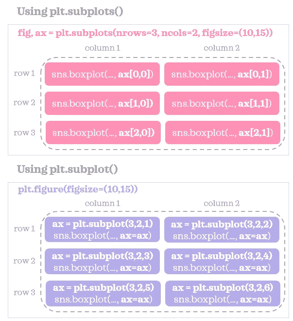

熟悉这两种方法是很有用的，因为它们在不同的情况下会派上用场。

# 📍技巧 3: plt.tight_layout()

绘制多个图形时，通常会看到一些支线剧情的标签重叠在相邻支线剧情上，如下所示:

```
categorical = df.select_dtypes('category').columnsplt.figure(figsize=(8, 8))
for i, col in enumerate(categorical):
    ax = plt.subplot(2, 2, i+1)
    sns.countplot(data=df, x=col, ax=ax)
```

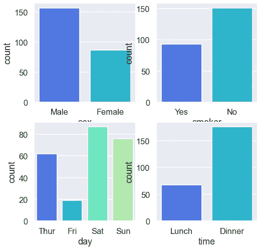

顶部两个图表的 x 轴上的变量名被切掉，并且右边的图的 y 轴标签与左边的子图重叠。使用`plt.tight_layout()`很容易解决这个问题:

```
plt.figure(figsize=(8, 8))
for i, col in enumerate(categorical):
    ax = plt.subplot(2, 2, i+1)
    sns.countplot(data=df, x=col, ax=ax) 
plt.tight_layout()
```

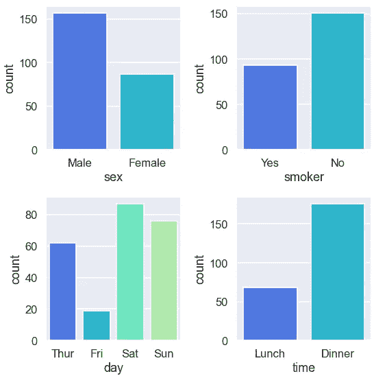

瞧啊。现在看起来好多了。在绘制多个图形时，我几乎总是使用`plt.tight_layout()`来防止重叠。

# 📍技巧 4: plt.suptitle()

最后，如果您想给整个图加标题，这个技巧很有用:

```
plt.figure(figsize=(8, 8))
for i, col in enumerate(categorical):
    ax = plt.subplot(2, 2, i+1)
    sns.countplot(data=df, x=col, ax=ax) 
plt.suptitle('Category counts for all categorical variables')
plt.tight_layout()
```

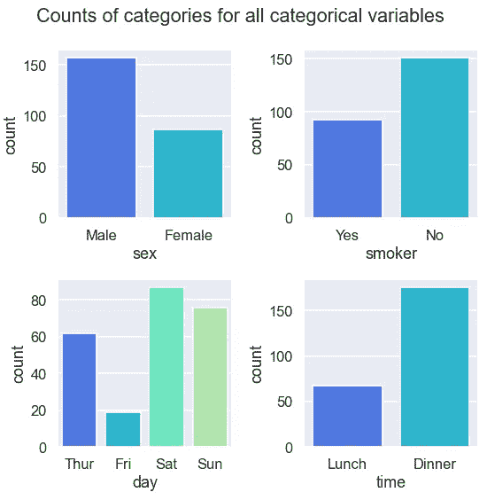

此外，你可以自定义你喜欢的单独的情节。例如，你仍然可以为每个支线剧情添加标题。


[engin akyurt](https://unsplash.com/@enginakyurt?utm_source=medium&utm_medium=referral) 在 [Unsplash](https://unsplash.com?utm_source=medium&utm_medium=referral) 拍摄的照片

*您想访问更多这样的内容吗？媒体会员可以无限制地访问媒体上的任何文章。如果你使用* [*我的推荐链接*](https://zluvsand.medium.com/membership)*成为会员，你的一部分会费会直接去支持我。*

感谢您阅读这篇文章。希望你下次在 Python 中绘制多个支线剧情时能够应用这些有用的技巧。如果你是一个求知欲很强的学习者，想要了解更多关于这个主题的知识，[这个](https://jakevdp.github.io/PythonDataScienceHandbook/04.08-multiple-subplots.html)资源会很有帮助。如果你热衷于学习更多的数据可视化技巧，这里有一些我关于数据可视化的帖子:

◼️ [美化熊猫数据帧](/prettifying-pandas-dataframes-75c1a1a6877d)
◼ [用 Python 实现简单的数据可视化，你会发现很有用](/simple-data-visualisations-in-python-that-you-will-find-useful-5e42c92df51e) ️
◼️ [在 Seaborn (Python)中实现更漂亮和定制情节的 6 个简单技巧](/6-simple-tips-for-prettier-and-customised-plots-in-seaborn-python-22f02ecc2393)

再见🏃 💨