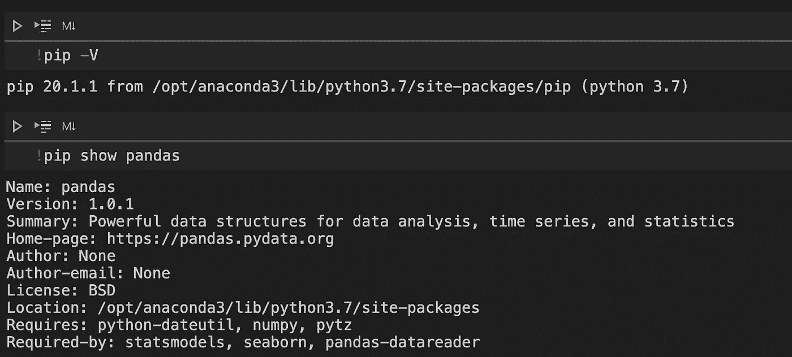

# 你应该知道的 4 个简单而有用的 Jupyter 特性

> 原文：<https://towardsdatascience.com/4-simple-yet-useful-jupyter-features-you-should-know-14e5a43cf2e6?source=collection_archive---------18----------------------->

## 提高笔记本电脑的工作效率


照片由[丹·迪莫克](https://unsplash.com/@dandimmock?utm_source=medium&utm_medium=referral)在 [Unsplash](https://unsplash.com?utm_source=medium&utm_medium=referral) 拍摄

Jupyter 笔记本对于数据科学家来说是一个非常方便的编码工具。它允许我们在处理和分析数据集的同时，以文本和图像的形式可视化数据。在学习了笔记本的基本操作之后，我们可能想要尝试一些更有用的东西，这些东西可以帮助改善我们的笔记本体验和工作效率。在本文中，我想分享一些功能，以满足我们在数据科学工作中的一些特殊需求。

## 1.运行命令

要在单元格中运行命令，我们只需在命令前加上一个感叹号。



在笔记本中运行的命令

与运行命令相关的一个常见问题是，在某些执行过程中，我们如何与提示交互，例如安装确认(是或否)。诀窍是在命令后面附加 yes 标志(-y)，如下所示。

```
!pip uninstall seaborn -y
```

## 2.检查活动变量

当我们处理大量数据时，我们可能已经在工作空间中创建了许多中间变量。为了了解这些变量的当前池，我们可以使用神奇的方法`%who`或`%whos`，如下所示，后者显示了变量的更多细节。


检查变量

为了让这个命令更有趣，我们可以指定变量的数据类型来创建一个更短的列表。例如，下面的命令只显示了字符串类型的变量。


检查特定类型的变量

## 3.API 查找

我们并不总是记得我们想要使用的功能或属性。但是，我们确实对它们有一些印象，毕竟我们以前可能时不时会用到它们。在这种情况下，我们可以列出所有可能提醒我们的相关方法。


API 查找

上面的截图向你展示了我们想要得到的在 seaborn 包中可用的支持图的列表。诀窍就是在字符串中使用通配符，前缀为问号。一旦知道要使用什么方法来检查调用签名，就可以使用带有特定函数名的问号，如下所示。


具体功能详情

输出类似于使用`help`函数得到的结果，如下所示。

```
help(seaborn.rugplot)
```

## 4.更改默认输出模式

默认情况下，每个单元格在执行完整个单元格后只打印最后一个表达式，如下所示。


显示最后一个表达式

然而，我们可能想要显示更多的条目，比如单元格中的所有表达式。在这种情况下，我们可以更改允许输出多个项目的默认设置。


输出多个项目

通过评估交互模式的源代码，我们可以有其他选择。例如，下面的更新输出最后一个表达式或最后一个赋值。如你所知，赋值通常不输出任何东西。


输出表达式或赋值的值

如果您有兴趣尝试其他选项，这里有包含可能选项的源代码。注意，默认值是“last_expr”，用它可以将笔记本设置为原始状态。

互动选项

## 结论

在本文中，我们回顾了四个简单而有用的笔记本特性，您可以在自己的数据科学工作中尝试一下。还有许多值得注意的特性，比如笔记本扩展、小部件和许多其他神奇的命令。我们可以在以后的文章中探索它们。