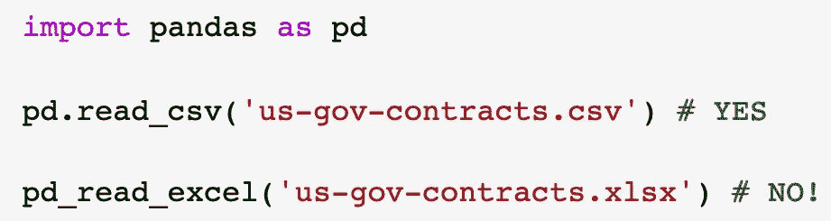
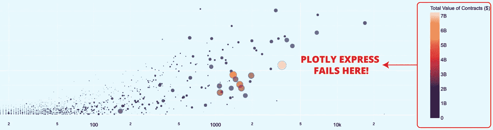
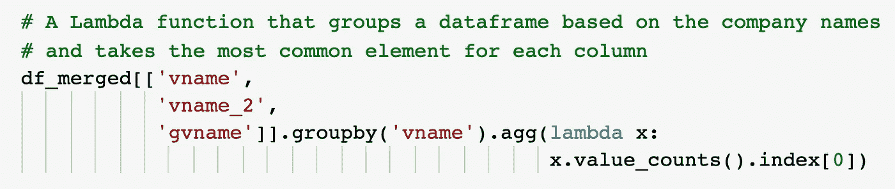

# 4 技术咄！我从最近的数据科学项目中学到的经验

> 原文：<https://towardsdatascience.com/4-technical-duh-lessons-i-learned-from-my-latest-data-science-project-b685266bce62?source=collection_archive---------19----------------------->

## 数据科学的真实故事

## 带着一点软技能的启示…

卡尔·海尔达尔在 [Unsplash](https://unsplash.com?utm_source=medium&utm_medium=referral) 上拍摄的照片

我是所有关于写技术文章✍️与充分工作的代码。看到人们从我设计的教程中受益是非常令人满足的。除此之外，我最近开始考虑写一些仍然技术性但更基于经验的故事。

上周，我花了大约 30 个小时用**熊猫**和**神奇地**形象化美国政府合同。嗯，我已经和这些库一起工作了很多年，我想我已经了解了它们的一切。但是，在这 30 个小时结束的时候，我学到了四个简单却非常有力的教训。

# 1 —如果您正在处理大数据，千万不要使用 XLSX 将数据读入 Pandas

照片由[米卡·鲍梅斯特](https://unsplash.com/@mbaumi?utm_source=medium&utm_medium=referral)在 [Unsplash](https://unsplash.com?utm_source=medium&utm_medium=referral) 上拍摄

最初的数据集是以谷歌表单的形式提供的。这份文件包括 58 份单独的表格和超过 15 万份美国政府合同。有 26 列，所有的表在不同的业务领域存储相同的信息。我以前处理过数百万个数据点，我想:

> 我将下载一个 XLSX 文件，列出所有的工作表名称，运行一个 for 循环为每个工作表创建一个数据框，最后 **pd.concat()** 它们。

伙计，我错了吗？

读取 150k 行花了 58 分钟，快速搜索后，我意识到熊猫在 XLSX 格式下表现很糟糕。我以前从未在大数据(ish)项目中使用过 XLSX 格式，对此毫无概念！

请注意，我实际上考虑过将文件下载为 CSV 文件，但是没有简单的自动方法将每张工作表保存为单独的 CSV 文件。此外，CSV 格式只能有一个工作表。

看到熊猫用 XLSX 格式表演得有多恐怖，我伸手向客户要 CSV 原件。从 108 个文件中读取 470，000 个观察值不到 1 分钟！

完成项目后，我找到了这个解决方案:

 [## 加速 Python 的熊猫慢读 _excel()

### 熊猫从 excel (pandas.read_excel())读取真的真的很慢，甚至有些数据集很小(< 50000 行)，它…

www.erickhchan.com](https://www.erickhchan.com/data/2019/03/30/python-batch-xlsxtocsv.html) 

# 2-如果您想要完全自定义，请使用 Plotly Graph 对象，而不是 Plotly Express

作为一个赶时间的人，我总是试图找到最快的方法来达到预期的结果。我们期望的结果是表示每个公司的合计合同信息。我很好地清理和处理了数据，并想创建一个交互式气泡图。如果你使用 Python，你最好的选择是 Plotly。现在，Plotly 是一个非常先进但也非常混乱的图书馆。它基本上提供了几个模块，使用 JavaScript D3.js 库将数据转换成 HTML 图像。这个想法是革命性的，但是文档却是一团糟。为什么？让我解释一下。

Plotly 有一个模块叫做 ***图形对象*** 。这是主要的 Plotly 模块，开发者可以创建漂亮的交互式图表。你可以完全独立地设计你的图表。我说的是放置图像、改变颜色、处理图例等等。但是，Plotly 提供了另一个模块叫做 ***Plotly Express*** 。它也很棒，你也可以创造出很棒的视觉效果，几乎一模一样。但是几乎…

嗯，因为我想在预算内快速交货，所以我选择了 Plotly Express。一切都很完美，直到我意识到我不能真正改变传奇风格。当你访问文档时，有复杂的方法来实现它；无论我做什么，它都返回一个警告⚠️，但没有成功。

由于选项的双重性，开发人员总是对实现文档中所写的内容感到困惑。而问题的根源甚至不仅仅是这种二元性。Plotly 的工作方案包括 Python，JavaScript，CSS，HTML。任何与这些技术相关的设计技术都可能起作用，但没有任何保证。

所以，尽管我很喜欢 Plotly，但它的文档却是一团糟(*不复杂，但*)。并且看到 Plotly Express 缺乏一些基本的设计能力，我了解到如果我在一个真实的项目中工作，我将总是使用 Graph Objects 模块，即使这意味着我将花费额外的时间，甚至我的 Google 搜索也会带我去所有这些有吸引力的 Plotly Express 实现。

有关 Graph Objects 和 Plotly Express 之间的广泛比较，请查看本文:

 [## 好的、坏的和丑陋的

### 它可能更新，但它更好吗？

towardsdatascience.com](/plotly-express-the-good-the-bad-and-the-ugly-dc941649687c) 

# 3-你不能用一行简单的 Lambda 函数解决所有的数据转换

我记得我第一次使用 lambda 函数。这很不寻常。您最初学习了常规函数语法(*例如，def xyz(a，b)* )，并且发现您实际上可以使用单行 lambda 函数轻松地执行一些复杂的运算。在某些时候，它变成了第二天性；尤其是如果你正在用熊猫做大量的数据清理和处理。

***df【列名】。应用(λx:x+1)***

它如此简单，却又非常优雅。当你试验 lambda 时，你开始挑战它的极限。可以设计 if-else 语句；你甚至可以写单行循环。但是 lambda 函数有其局限性。你不能用 lambda 实现所有类型的转换。嵌套的 if-else 语句、复杂循环和聚合操作需要单独定义的自定义函数，并在 lambda 函数中应用。

# 如果你想要一个搜索栏，选择 Dash，而不是 vanilla Plotly

露西娅·马塞多在 [Unsplash](https://unsplash.com?utm_source=medium&utm_medium=referral) 上拍摄的照片

另一个*咄！*我学到的经验是，每当你想以更复杂的方式与数据集交互时，**切换到破折号**。我们知道我们使用的技术的局限性，但是我们的客户可以逐步达到一个您的前端数据可视化库可能无法达到的水平。在这个项目中，我们最初从基于散点图的气泡图开始。我觉得这个任务可以很容易地完成。但是客户心中有一个目标:创造价值。他对技术限制和数据探索游戏不感兴趣。相反，他想为他的用户/顾客提供尽可能高的价值。我学到的经验是，每当我开始一个数据可视化项目时，我需要发现客户是否需要一个后端解决方案来为他的用户提供最高的价值。在我们的情况下，达什。

注意，这里的搜索栏是对一般后端操作的简化。

> “实际上，Dash 是由 Plotly 的创建者制作的，作为一种轻松实现 web 界面和用 Plotly 创建仪表板的方式，而不必学习 javascript、HTML 和其他 web 技术。使用 Dash，您不需要进行可视化，而是构建一个界面来显示 Plotly 的可视化。它在引擎盖下使用 Flask，因此它特别兼容其他 Flask 应用程序。”比森特·利扎纳·埃斯蒂维尔

# 最终注释

当在实际项目中工作时，你可能不得不考虑那些你在孤立的学习环境中不会过多考虑的事情。数据清理需要更长时间；你被要求做一些你从未想过的非常具体的操作，你的输出必须高效且易于理解。这些你慢慢学。另一方面，你也在每个项目中学到了具体的经验。四大技术*咄！*在我最近的项目中，给我的教训是:

*   如果是处理大数据，千万不要用 XLSX 把数据读入熊猫；
*   如果你想要完全定制，使用 Plotly Graph 对象，而不是 Plotly Express
*   你不能用一行简单的 Lambda 函数解决所有的数据转换；和
*   如果你想要一个搜索栏，请选择 Dash，而不是 vanilla Plotly。

# 订阅邮件列表获取我的最新内容

我希望这些课程也能对你的项目有所帮助。如果你喜欢我迄今为止分享的内容，可以考虑订阅[**简讯**](http://eepurl.com/hd6Xfv) **！✉️**

> [*现在就订阅*](http://eepurl.com/hd6Xfv)

我还与我的订户分享我的私人 Google Colab 笔记本，其中包含我发表的每篇文章的完整代码。

如果你正在阅读这篇文章，我确信我们有着相似的兴趣，并且正在/将要从事相似的行业。那么我们就通过[*Linkedin*](https://linkedin.com/in/orhangaziyalcin/)*来连线吧！请不要犹豫发送联系请求！*[*Orhan g . yaln—Linkedin*](https://linkedin.com/in/orhangaziyalcin/)