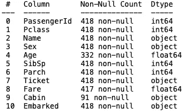
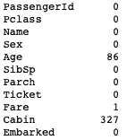
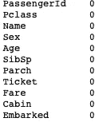
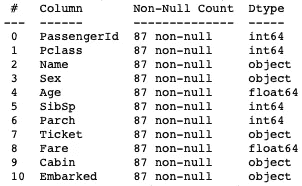
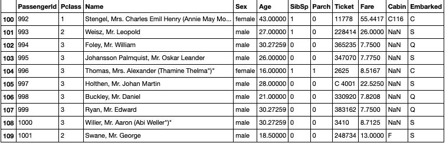
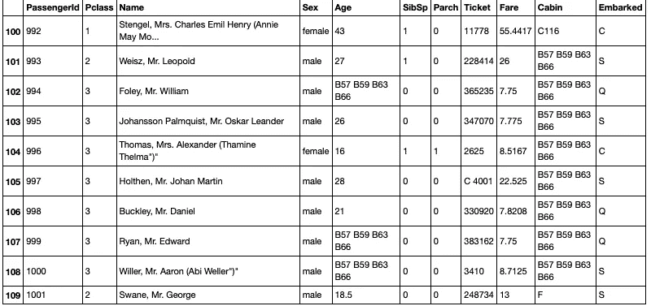
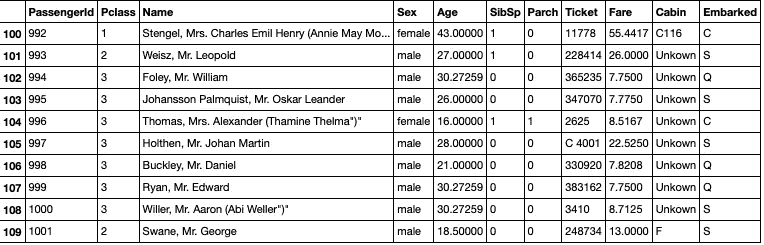

# 处理数据集中缺失数据的 4 种技术

> 原文：<https://towardsdatascience.com/4-techniques-to-deal-with-missing-data-in-datasets-841f8a303395?source=collection_archive---------4----------------------->

## 可以消除缺失值影响的简单方法


兰迪·法特在 [Unsplash](https://unsplash.com?utm_source=medium&utm_medium=referral) 上的照片

对于每个数据科学家来说，缺失数据都是一个问题，因为我们可能无法执行我们想要的分析，或者无法运行某个模型。在本文中，我将讨论处理缺失值的简单方法。然而，首先，没有处理空数据的“官方”最佳方法。通常，处理这种情况的最佳方式是理解数据来自哪里以及它意味着什么。这被称为领域知识。不管怎样，让我们开始吧。

在这篇文章中，我们将使用著名的和惊人的[泰坦尼克号数据集](https://www.kaggle.com/c/titanic) (CC0 许可证)。我相信你们都听说过。数据集如下所示:

```
**import** **pandas** **as** **pd** data = pd.read_csv('test.csv')
data.info()
```



图片作者。

```
data.isnull().sum()
```



图片作者。

正如我们所看到的，丢失的数据只在“年龄”和“船舱”栏中。它们分别是浮点和分类数据类型，所以我们必须不同地处理这两列。

# 1.删除数据

最简单的方法是删除一列或几列包含空条目的整个训练示例。

```
data = data.dropna()
data.isnull().sum()
```



图片作者。

现在没有空条目了！然而，天下没有免费的午餐。看看还剩下多少训练样本:



图片作者。

只剩下 87 个例子了！最初有 418 个，因此我们将数据集减少了大约 80%。这远非理想，但对于其他数据集，这种方法可能非常合理。我认为最多减少 5%就可以了，否则您可能会丢失有价值的数据，从而影响模型的训练。

# 2.估算平均值

下一个方法是给空条目分配一些平均值(均值、中值或众数)。让我们来看看数据中的以下片段:

```
data[100:110]
```


图片来自作者。

对于“年龄”列，平均值可计算如下:

```
data.fillna(data.mean(), inplace=**True**)
```



图片来自作者。

30 岁的平均年龄现在已经被添加到空条目中。注意，对于“Cabin”列，条目仍然是 NaN，因为您不能计算对象数据类型的平均值，因为它是分类的。这可以通过计算其模式来解决:

```
data = data.fillna(data['Cabin'].value_counts().index[0])
```



图片作者。

# 3.分配新类别

关于“Cabin”特征，它只有 91 个条目，约占总示例的 25%。所以我们之前算出来的模值不是很靠谱。更好的方法是给这些 NaN 值分配它们自己的类别:

```
data['Cabin'] = data['Cabin'].fillna('Unkown')
```



图片作者。

由于我们不再有任何 NaN 值，机器学习算法现在可以使用这个数据集。然而，它将在“船舱”一栏中使用“未知”的独特值作为自己的类别，尽管它在泰坦尼克号上从未存在过。

# 4.某些算法

最后一个技巧是什么都不做。大多数机器学习算法不处理缺失数据。另一方面，K 近邻、朴素贝叶斯和 XGBoost 等算法都可以处理缺失数据。网上有很多关于这些算法及其实现的文献。

# 结论

有许多方法可以处理缺失数据。某些方法比其他方法更好，这取决于数据的类型和丢失的数量。还有更复杂的输入缺失数据的方法，我没有在这里介绍，但是这些选项是帮助您开始的很好的选择。

完整代码请见我的 GitHub:

[](https://github.com/egorhowell/Medium-Articles/blob/main/Data%20Science%20Basics/Dealing%20With%20Missing%20Data.ipynb) [## 中型文章/处理缺失数据。ipynb at main egorhowell/中型文章

### 我在我的媒体博客/文章中使用的代码。通过创建一个关于…的帐户，为 egorhowell/Medium-Articles 的开发做出贡献

github.com](https://github.com/egorhowell/Medium-Articles/blob/main/Data%20Science%20Basics/Dealing%20With%20Missing%20Data.ipynb) 

# 和我联系！

*   要在媒体上阅读无限的故事，请务必在此注册！T3*💜*
*   [*当我在这里发布注册邮件通知时，可以获得更新！*](/subscribe/@egorhowell) 😀
*   [*领英*](https://www.linkedin.com/in/egor-howell-092a721b3/) 👔
*   [*推特*](https://twitter.com/EgorHowell) 🖊
*   [*github*](https://github.com/egorhowell)*🖥*
*   *[](https://www.kaggle.com/egorphysics)**🏅***

> ***(所有表情符号由 [OpenMoji](https://openmoji.org/) 设计——开源表情符号和图标项目。许可证: [CC BY-SA 4.0](https://creativecommons.org/licenses/by-sa/4.0/#)***