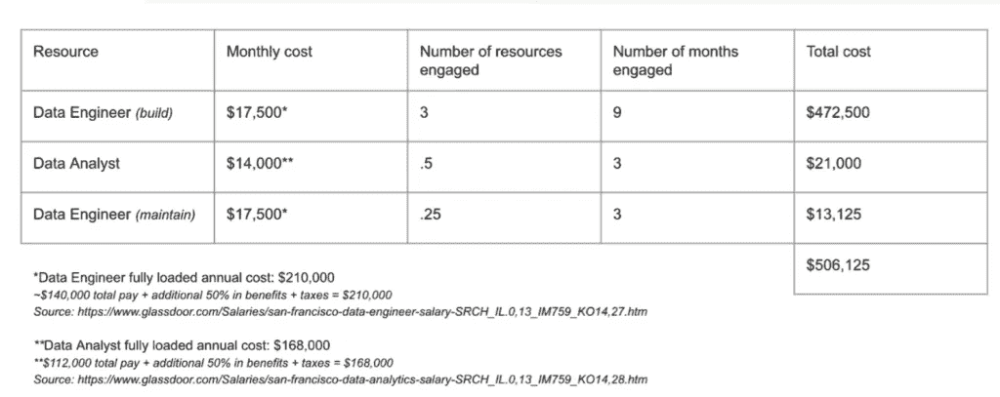
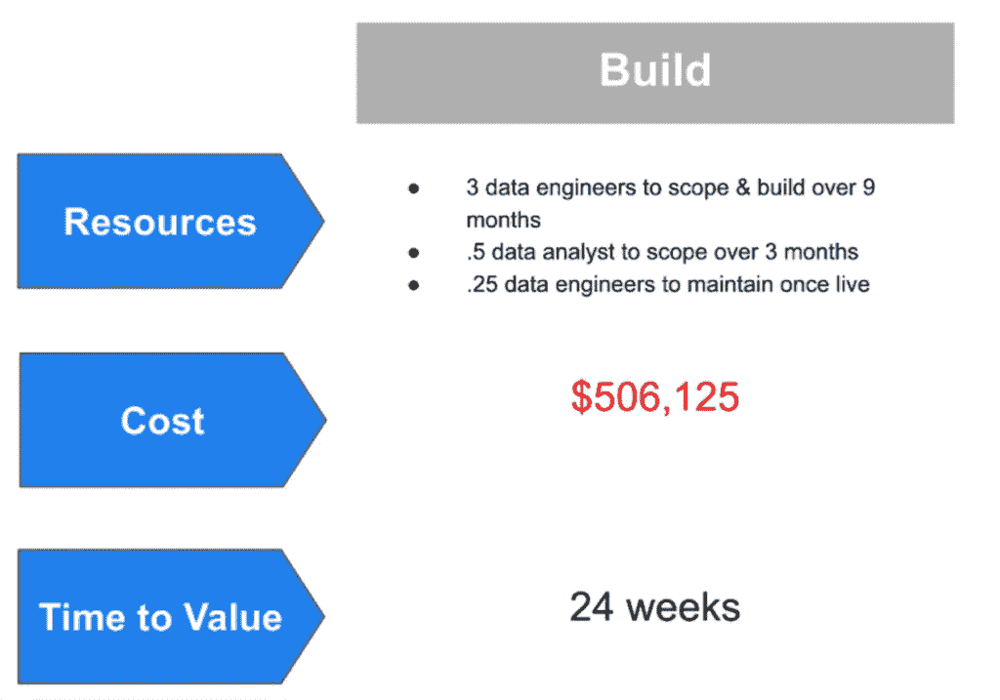
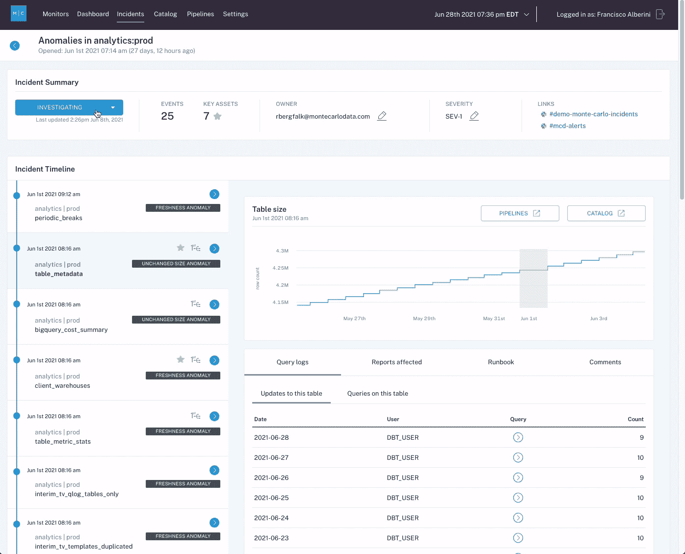
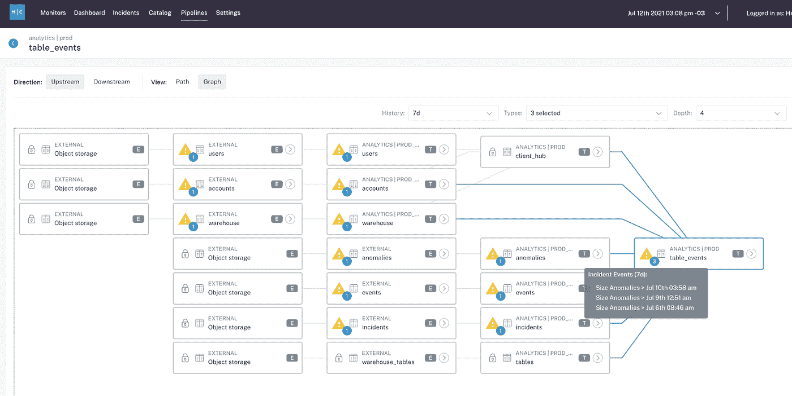

# 解决数据质量问题时需要知道的 4 件事

> 原文：<https://towardsdatascience.com/4-things-you-need-to-know-when-solving-for-data-quality-4abf6d31b2c9?source=collection_archive---------23----------------------->

## 如何确定数据质量解决方案是否适合您

图片由 [Unsplash](http://www.unsplash.com) 上的 [Artem Sapegin](https://unsplash.com/@sapegin) 提供。

***随着数据管道变得越来越复杂，投资于数据质量解决方案正成为现代数据团队越来越重要的优先事项。但是你应该建造它，还是购买它呢？***

***在这篇客座博文中，*** [***斯蒂芬·盖尔盖伊***](https://www.linkedin.com/in/stephenguerguy/) ***和*** [***斯科特·奥利里***](https://www.linkedin.com/in/scott-o-leary-78000a43/) ***，蒙特卡洛的解决方案工程师，讨论了这两种方案的 4 个关键挑战、机遇和权衡。***

随着公司接收越来越多的数据，数据生态系统变得越来越复杂——从将非结构化数据存储在 [**数据湖**](https://www.montecarlodata.com/how-to-build-your-data-platform-choosing-a-cloud-data-warehouse/) 中，到让更多内部消费者能够民主化地访问数据——数据质量<https://www.montecarlodata.com/the-new-rules-of-data-quality/>**的责任从未如此之大。**

**毕竟，如果不能依赖数据，那么你的数据平台有多先进，或者你生产了多少仪表板，都没有用。**

**确保数据的新鲜、准确和可靠至关重要，但这并不容易。数据工程师和分析师花费超过 40%或更多的时间处理数据质量问题，分散了他们在项目上的注意力，而这些项目实际上会推动业务的发展。**

**数据团队在内部构建自己的数据质量解决方案并不罕见，对生产管道进行分层稳健测试和监控，并 [**设置 SLA 以跟踪可靠性**](https://www.montecarlodata.com/how-to-make-your-data-pipelines-more-reliable-with-slas/) 并管理利益相关方的期望。对于那些刚刚起步的人呢？灵感就在那里，主要是由[优步](https://eng.uber.com/monitoring-data-quality-at-scale/)、 [Airbnb](https://medium.com/airbnb-engineering/data-quality-at-airbnb-e582465f3ef7) 、 [Spotify](https://engineering.atspotify.com/2017/10/17/tc4d-data-quality-by-engineers-for-engineers-2/) 、[网飞](https://databricks.com/session_na20/an-approach-to-data-quality-for-netflix-personalization-systems)和其他科技巨头撰写的关于他们自己的数据质量之旅的文章。**

**与任何新兴技术一样，一个哲学(和财务)问题很快就出现了: ***您应该构建还是购买一个数据质量解决方案*** ？**

**在去年与数百家公司交谈后，我们了解到大多数组织的数据堆栈结合了定制、SaaS 和开源解决方案。在这些对话中，数据主管、首席数据官和产品经理与我分享了他们在选择构建还是购买其堆栈的核心元素时所犯的错误。**

**根据专家的意见，在选择构建还是购买数据质量解决方案时，以下是您必须做的 4 件事:**

# **1.了解您的解决方案的预期价值实现时间**

**像任何内部解决方案一样，设计、构建、扩展和维护内部数据质量解决方案需要时间、金钱和人力。对于你的 Ubers，Airbnbs，和 Netflixes 的世界来说，这没问题。如果您有一个庞大的数据工程和数据科学团队，他们有大量的额外时间，那么构建可能是有意义的-但在大多数公司，数据团队缺乏工作很少是一个问题。**

**如果像大多数公司一样，在可预见的未来，您没有 5 名以上的数据工程师和 1 名产品经理不知疲倦地解决这个问题，那么您可以考虑寻找内部解决方案来满足您的数据质量需求。**

****

**在决定是构建还是购买解决方案时，了解您的团队为构建所述解决方案的新员工预算会有所帮助。*图片由蒙特卡洛*提供。**

**当一家领先的 insurtech 提供商的数据团队研究构建一个 [**数据可观测性**](https://www.montecarlodata.com/what-is-data-observability/) 解决方案时，他们意识到构建一个全面的异常检测算法需要他们数据工程团队 30%的人员，而构建和维护的解决方案每年将花费**45 万美元以上。他们选择购买。****

**同样，我们采访的一家医疗保健初创公司的数据工程副总裁指出，如果他 20 多岁，[他会想要建立](https://www.montecarlodata.com/how-to-build-your-data-platform-like-a-product/)。但是现在，在他快 30 岁的时候，他几乎只买。**

> **“我有热情，”他说，“但是如果我有时间、精力和资源从头开始建立一个数据平台，那我就完了。我现在长大了，也更聪明了——我知道不该不相信专家。”**

****

**它还有助于了解构建或购买(以及集成)解决方案将花费您的组织多少时间。图片由作者提供。**

**底线是，不要低估从零开始构建解决方案的时间价值。在大多数情况下，数据工程时间太宝贵了，不能花在构建一个可能需要一年多时间才能启动和运行的解决方案上。说到数据质量和可靠性，大多数组织没有时间、资源或声誉来牺牲。**

# **2.机会成本因素**

**当您的数据工程师花费时间手动构建数据测试来考虑任何和所有可能的边缘情况时，这些时间本可以用于解决客户问题、改进您的产品或推动创新。**

**当您考虑到[即使是世界上最强大的测试](https://www.montecarlodata.com/the-new-rules-of-data-quality/)也无法解决大约 80%的数据问题时，考虑构建和维护这些测试的机会成本是值得的，而不是从事实际上会推动您的业务的项目。**

**除了直接的机会成本之外，当问题出现时，使用半吊子数据质量解决方案的数据工程师也可能会花费更多的时间来解决问题，从而进一步耗尽他们在这些关键工作上的精力。事实上，我们发现数据工程师花费大约 40%的时间手动解决数据问题；如果时间就是金钱，那可不是小钱。**

**说到您可能会花费时间和金钱的地方，购买由专门团队支持的可靠解决方案来帮助您的数据工程师解决任何出现的停机问题通常是有意义的。**

**例如，在直接面向消费者的床垫品牌[居民](https://www.montecarlodata.com/how-resident-reduced-data-issues-by-90-with-monte-carlo/)通过数据可观察性实施数据质量后，**他们看到数据问题减少了 90%**，**缩短了剩余 10%** 的检测时间。**

**正如他们的数据工程主管 Daniel Rimon 告诉我们的那样，“在数据可观察性出现之前，我一直在观察，担心自己会遗漏什么。我现在无法想象没有它的工作…我认为每个数据工程师都必须有这种级别的监控，才能以高效和良好的方式完成这项工作。”**

# **采取主动(而不是被动)的方法来解决这个问题**

**数据必然会在某一点或另一点中断，这导致团队采取被动的方法来修复错误，而不是更加勤奋和主动地处理它们。随着数据管道变得越来越复杂，解决数据质量问题的被动方法是不够的。**

**测试(一种重要的主动方法)可以帮助验证您对数据的假设。您可以设置手动阈值，测试空值和其他常见的数据问题指标，甚至使用测试来确定数据是否超出预期范围。**

**然而，尽管 [**测试可以检测和防止许多问题**](https://www.montecarlodata.com/what-is-data-testing/) ，数据工程师不太可能预测开发期间的所有可能性，即使他们可以，也需要大量的时间和精力。依赖于测试的数据团队可能会捕捉到您可以轻松预测的问题，但会错过“ [**未知的未知**](https://www.montecarlodata.com/the-new-rules-of-data-quality/)”—如分布异常、模式更改、不完整或陈旧数据等问题。**

**这就是为什么为了真正采取[主动方法](https://www.montecarlodata.com/closing-the-data-downtime-gap/)来解决数据质量问题，最好的数据团队正在利用双重方法，将数据测试与整个管道的持续监控和可观察性相结合。**

****

***帮助数据团队快速识别、预警和补救数据质量问题的集中式仪表板提供了一种主动方法，以确保管道所有阶段的高数据可靠性和理解。图片由作者提供。***

**当物流公司 [Optoro](https://www.montecarlodata.com/making-retail-more-reliable-how-optoro-builds-data-trust-and-ownership-with-monte-carlo/) 需要解决客户第一个注意到并标记数据问题的问题时，他们考虑构建一个自主开发的解决方案，在客户和不良数据之间进行沟通。虽然他们的选择包括开发一个定制的 SQL 完整性检查器或建立源和目的地检查，但他们的数据团队最终确定这太耗时*和*对于 Optoro 的许多管道来说，覆盖面太有限。**

**最终，Optoro 选择投资于现成的数据可观察性解决方案，数据团队发现，端到端的自动化谱系不需要手动映射，是其数据平台的重要补充，并提高了数据质量。**

# **从你今天和未来的需求两个方面来恰当地确定问题的范围**

**在构建或购买任何数据解决方案之前，您应该确切了解您希望实现的目标，不仅是明天，而是未来 6 个月、12 个月甚至 18 个月。**

**与我们交谈的许多公司都在其数据基础架构的特定方面考虑数据质量，而不是端到端。为了解决管道中特定部分(例如，转换或建模层)的数据质量问题，数据工程师编写一些测试来解决他们的团队当前面临的直接且充分理解的痛点。**

> **虽然这种方法可能在短期内有效，但是当编写、部署和维护测试成为数据工程师的一项全职工作时，它会让组织失败。这就引出了一个问题，这真的是对数据工程师时间的最佳利用吗？**

****

***一种更全面、端到端的方法来解决数据质量问题，该方法结合了映射上游和下游依赖关系的沿袭，并突出显示哪些数据资产受到了数据事件的直接影响。图片由蒙特卡洛提供。***

**在决定是在内部构建工具还是选择托管供应商之前，您应该能够回答以下关键问题:**

## **谁将是该工具的主要用户？**

**这个工具会被数据工程师使用吗？还是数据科学家？数据分析师呢？在您回答这些问题之前，了解在您的组织中谁拥有数据质量<https://www.montecarlodata.com/which-of-the-six-major-data-personas-are-you/>**是有帮助的，我们的意思是:当管道破裂或仪表板失效时，谁将负责解决和报告数据问题？如果 15 名以上对您的数据的特定需求和行为有所了解的数据工程师是主要用户，那么内部构建可能最有意义。如果您正在处理大量的数据角色，或者支持一个由工程师和/或分析师组成的精简团队，那么选择一个具有用户友好的协作界面的解决方案可能是一个不错的选择。****

****使用 SasS 解决方案的另一个好处是，它充当了数据健康的单一事实来源。在我接触过的许多组织中，数据工程师、分析师和科学家都有自己的数据质量流程，导致针对数据事件的多种警报，而没有一个单一的用户界面将一切联系在一起。****

## ****您希望您的工具解决哪些数据问题？****

******当内部版本成为入场券的时候******

****这些数据问题是您的企业特有的吗？这种类型的 [**数据停机**](https://www.montecarlodata.com/the-rise-of-data-downtime/) 是第三方供应商可能不会优先考虑的事情吗？如果是这种情况，那么最好在开源解决方案的基础上构建。****

****然而，如果你选择这条路，我建议你的数据工程和数据分析团队紧密合作。当涉及到内部建设时，沟通是确保组织的不同部分不会出现重复的关键。一次又一次，我看到数据工程团队为他们的 ETL 管道构建了一个监控工具，而分析团队(只在几个小隔间工作或不停地打电话)构建了一个数据质量仪表板。每个解决方案都需要数百个小时和大量团队成员来构建，但只能解决特定的短期问题，而不能从数据堆栈的分析和工程两方面更具战略性地解决数据质量问题。****

******当第三方供应商可能是最佳选择时******

****这个问题在你的行业中普遍存在吗？在这种情况下，一流的 SaaS 解决方案将是您的最佳选择，因为他们的工具将作为您数据的单一真实来源，并且可以支持未来的使用案例，而无需您的团队进行任何额外投资，前提是您的合作伙伴供应商继续投资于以客户为中心的<https://www.montecarlodata.com/how-to-convert-100-of-your-proofs-of-concept-into-happy-customers/>**产品路线图。******

## ******您的数据治理需求是什么？******

******诸如 [CCPA](https://oag.ca.gov/privacy/ccpa) 和 [GDPR](https://gdpr-info.eu/) 等数据法规已经改变了企业处理个人身份信息的方式(PII)。一些公司建立自己的[数据目录](https://www.montecarlodata.com/what-we-got-wrong-about-data-governance/)以确保符合州、国家甚至经济联盟的法规。无论您选择构建还是购买您的数据质量解决方案，治理都将是一个关键的考虑因素，您应该确保您的解决方案能够满足您的业务需求，尤其是当 IPO 或任何其他重要的公司里程碑即将到来时。******

*********注意:如果你选择走第三方厂商的路线，一定要确保你投资的期权是*** [***SOC 2 认证***](https://www.montecarlodata.com/monte-carlo-is-soc-2-certified/) ***。你以后会感谢我们的。*********

# ****选择权在你****

****虽然没有一个神奇的公式告诉你是构建还是购买数据质量解决方案，但是评估谁在使用你的产品、你的数据组织的成熟度以及你的数据目标可以揭示一些明显的迹象。****

****在此之前，祝您没有数据宕机！****

*******有兴趣了解更多关于 Fox、Intuit 和 PagerDuty 的数据团队如何通过*** [***蒙特卡洛***](http://www.montecarlodata.com) ***？伸出手去*** [***斯蒂芬·盖尔盖伊***](mailto:sguerguy@montecarlodata.com)*[***斯科特·奥利里***](https://www.linkedin.com/in/scott-o-leary-78000a43/) ***，还有*** [***团队的其他人***](https://www.montecarlodata.com/request-a-demo/) ***。********

**********